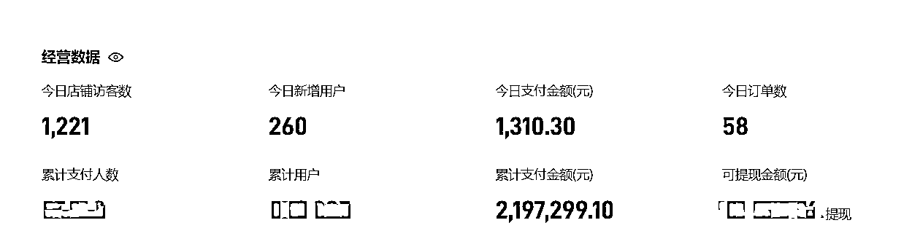
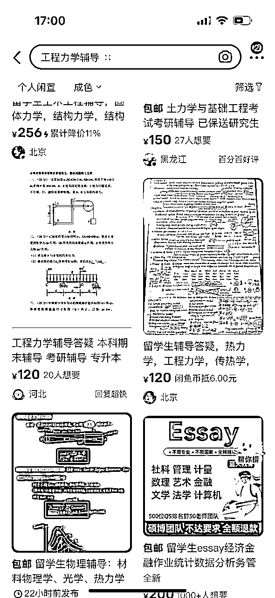
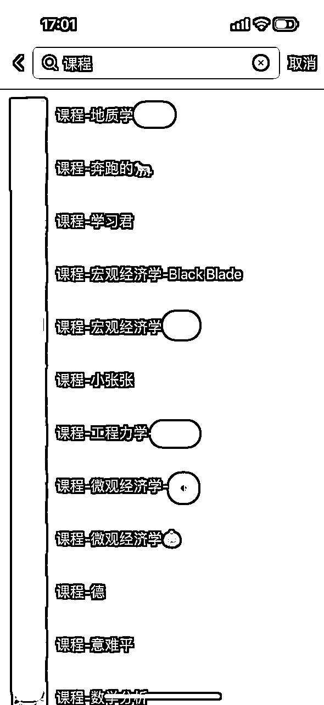
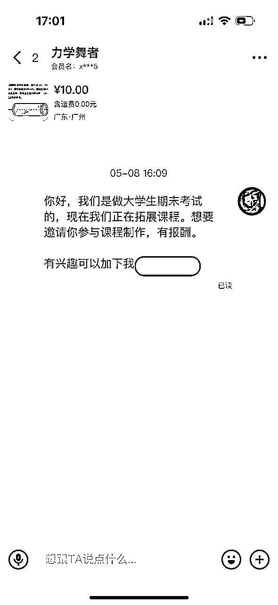
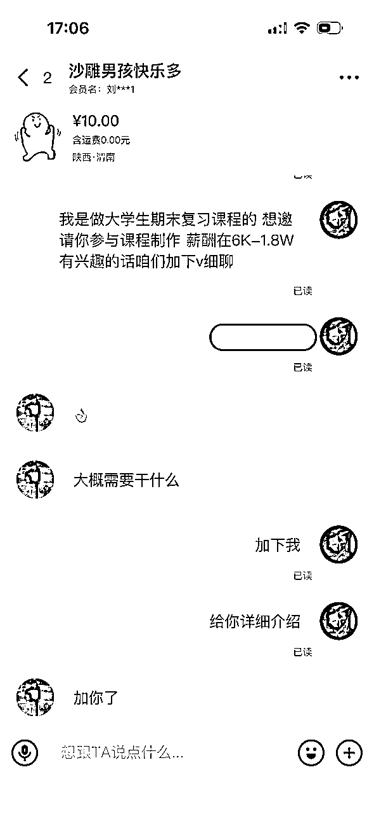
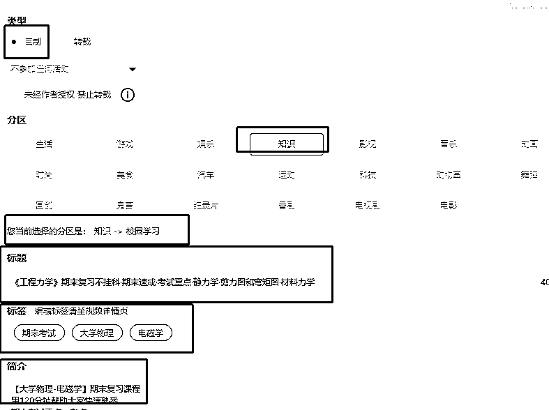

# 不懂专业课知识的学渣，三个月制作30门大学课程，GMV100W+

> 来源：[https://oktyo2a7ds.feishu.cn/docx/UCdRdQzckoAOQ5xZsLwcEVsDnse](https://oktyo2a7ds.feishu.cn/docx/UCdRdQzckoAOQ5xZsLwcEVsDnse)

## 一、项目背景

现在许多大学生在学校时常旷课，对课程不够认真。这导致了他们很难通过期末考试，根据这一需求点就有了专为大学生制作的不挂科系列课程。

不挂科课程通过短时的录播课程，精准解读专业课期末考试重点。学生只需花2-3小时学习，就能轻松掌握考试核心知识点。核心卖点就是学生只要认真看了视频就能期末考试不挂科！

通过抓住考试不想挂科的刚需+低客单价，不挂科系列课程的转化率一直很高。

标题也有讲到我不懂专业知识，但是却能制作课程。我总结了一套完成课程产品制作和获取精准流量的方式，大家可以移步飞书瞅瞅：

上一张后台数据截图

这个业务已经跑了大概两年时间，除了口罩阶段的风口期，搭建好了自动化成交的系统后，现在每天都会有管道收入。

## 二、项目流程

### 制作课程

寻找制课老师在整个项目中占据到了95%的重点，当时通过豆瓣、大学老师、同学介绍、B站找了很多人沟通，都没有一个比较好的合作率，可能聊50个人只能有一个合作。后来突发奇想在闲鱼搜索工程力学辅导，居然达到很好的合作率，沟通了大概100人，确定合作了25人，而且老师的质量都很高，好几个都是当时的专业课前十的研究生。

和老师沟通过程中有两个点比较重要

#### 1.打招呼文案

这是最开始的破冰文案，回复率很低，导致差点放弃闲鱼

后来总结下来，发现【有报酬】这点不是很明确，我们就优化到具体数字，这样打招呼的回复率就明显很高了

#### 2.合作内容讲解

项目在闲鱼的所有动作都是为了将制课老师引导加咱们微信，进一步的项目讲解。

所以在微信端我们要准备一套标准的话术，提升沟通效率

*   介绍合作内容

你好，同学，我这边是做大学生期末专业课复习课程的，看到你在闲鱼发布辅导信息，相信你对这个专业课程很熟悉，所以想要邀请你参与课程制作。

*   合作方式

同学，咱们这次合作是有丰厚报酬的，你只要录制好课程会有5000的录制费用（单价由课程的受众面和制作难度来决定）

*   课程制作流程和内容

总结课程的考试重点制作PPT，并录播讲解PPT

#### 3.试课

所有课程都得有一个试课的过程，让老师录制5-10分钟的样片，需要从样片中判断几个点。

*   老师的制作的PPT是否是我们想要

*   他讲课的风格是否能让学生听得下去

*   他的设备是不是有什么问题

*   提出一些优化建议

上面的内容都没问题之后就可以和制课老师签订合同制作课程了。合同主要有两个作用p

1.在老师那建立信任感。2.帮助我们约束老师按时交片。

#### 4.交片

*   课程制作完成后，审核人员必须全部过一遍，很多老师会有语气词，需要剪辑掉。

*   课程正式售卖之前，可以先给一部分学生免费使用进行测试，针对反馈出课程问题的给到现金奖励。因为我们没有学习过专业课程，不能判断出课程中是否有知识点错误，通过激励学生找出错误的方式能提高我们课程的准确性。（这一部分特别重要，我们制作的30门课程，每一门课程都有错误，之前直接上线售卖收到了很多差评，退了很多钱）

到这一步，完善好详情页和封面就可以正常上线了

### 获取流量

这类产品主要有两个关键词，大学生+课程。那最合适的平台就是B站，我们也在其他平台尝试过获取流量，但是都没有太好的效果，只有B站的用户最精准。大致路径就是在B站发布课程的前3-5节课时作为引流内容，然后留下钩子，让想要后续课程的用户关注到公众号，在微信端进行变现。虽然B站能够直接卖课，但是引导到私域就意味着咱们有更多变现方式。

##### 1、账号搭建

因为我们作为一个卖课的账号，名称要稍微专业一些，不能太跳脱。例如 期末帮、猴博士、大学答案君、蜂考等，都比较好记。B站名字和公众号名字最好是一样的，起名还有一个重要的点，尽量规避太复杂的名字，因为很有可能会被截流，造成流量损失。

##### 2、发布内容

上面截图是B站投稿工具的操作界面，从上至下依次框出的五点就是B站传输内容中最重要的五点

1.  勾选自制，可以防止自己的视频被他们盗发

1.  确定分区之后，B站会将你的内容精准推送给对应人群

1.  标题就涉及到搜索排名，尽可能多的铺长尾词，万一用户通过一个比较小众的词搜索到咱们的课程，就有可能多一份转化

1.  标签和分区有相似的作用，能够让B站清晰判断我们的视频会给哪一类用户看到，帮助我们精准推送

1.  简介可以留下我们的引流钩子，以及拉互动的话术。

1.  因为B站有很多同质化的内容，通过上述的操作讲我们的课程推送到了用户的推荐页面，做一个能够吸引他们点击的封面也很重要

### 售卖课程

在获取到流量后，我们在公众号里面嵌入小鹅通就可以完成一整个项目的闭环。小鹅通的设置非常简单，不着重介绍。公众号有几个点需要强调一下

1.  认证号：认证后的账号可以直接跳转第三方链接，比不认证的账号少一步流程，路径越短，转化几率越高

1.  自动回复设置：自动回复一般使用一个结构①欢迎语②介绍账号③课程跳转连接

1.  菜单栏：可以再放一个课程入口，再加上自己的二维码，会有很多意想不到的商务合作。

## 三、个人想法

每年都会有很多新的知识付费内容冒出来，只要你有好的内容，肯定会有自己的一席之地。上述的内容也不局限于大学生课程，其他类目可套用。

关于和老师合作尽量选择一次性结款的合作模式，按照分成的模式，不太利于后续课程放大之后做分销合作。

以上