# 小红书聚光里的流量洼地，N个百万级别的捡钱机会

> 来源：[https://kkehvdiodf.feishu.cn/docx/UU7cdTZcBoTq4JxJkZAc5Ez8n2M](https://kkehvdiodf.feishu.cn/docx/UU7cdTZcBoTq4JxJkZAc5Ez8n2M)

# 前言

这篇内容初始于11.11的航海家郑州局的主题，我作为组局官和分享官，准备的分享内容。

当时应亦仁邀请，第一次组织航海家聚会，生怕没有重磅分享内容压场航海家聚会，特地把还未分享的内容先拿来压场。

不过不得不说，航海家群里真的是卧虎藏龙，航海家群里其实是有很多不擅长写作，但是乐于分享，且有相当赚钱经历/经验的圈友的。

分享的内容起源于我最近在做小红书聚光投流的一些经验，以及对其他行业赛道的调研，当时还只是一些思考，内容也只是一篇草稿，一个临时的PPT，最近正好有空，整理成一个完整的思路。

整个调研是基于小红书聚光现阶段的红利机会， 很多的赛道都已经落地到了实操拿了结果，这其中有我们自己的赛道，我们调研的赛道，合作伙伴的赛道，以及朋友的赛道。

文中具体的细节数据无法详细展示，不过欢迎各个赛道的甲方爸爸来交流，沟通，了解，合作。

我们也有对外合作流量的业务。

11.11郑州航海家局分享的时候，还没有读过@沐泽 @苏铁圈友编撰的 ，而写这边篇文章时已经把8万字的红宝书读过一遍，强烈推荐！

只能说太多的优质内容再生财了，如果要做针对性调研，先把生财作为第一站，绝对是简单方便又好用。

在我做调研的过程中发现，聚光投流的一些百万级赛道，在很多其他平台，当下的时间点下，几乎不可能有的红利，但是在小红书却有很多，且相对很蓝。

所以这篇文章我强调的是，百万级别，捡钱。

并且这个百万是起步，而不是天花板。

这种窗口期，不可能长期存在，但是每个赛道都是需要不小的精力才能完成的，我把看法，逻辑和我使用的方法写出来，大家可以尝试着去做下调研。

我个人做了调研以后，有一种看到了未来，却抓不完的感觉。

既然这样，就在生财里分享出来，至少让靠近一些的人有机会抓住红利，也算是肥水不流外人田的另一种表现形式吧。

当然，我相信，生财本身是有不少已经在赛道内的大佬的，我们可以聊聊小红书的付费流量。

# 正文

# （上篇，逻辑讲解篇）

## 一、平台的演变过程，和小红书平台的红利趋势。

在讲平台以前我先加入一个小话题，是我对挑选项目的一些思考，也有助于大家了解我要表达的事情。

### 选择大于努力，如何通过趋势演变找项目。

近两年，大家都在聊小红书，每期的生财航海，小红书各个赛道占比也是极高。

关于趋势，红利期，等等这些肯定毋庸置疑。

但是大家有没有发现？这个红利其实在消退。

消退不是收没有了，是要求更专业了，同样的玩法，现在再去拿结果，门槛就变高了，更难了。

因为，是红利就会消退。。。。。。。

给大家举一个例子：

下图来源于我之前的蓝海课程，核心内容来源于数年前在得道听的一节课，具体是那一节课我实在是记不清楚了，但是里面内容我记忆犹新，不单单是挑选项目时间会应用，也会针对这个过程做一些延续思考。

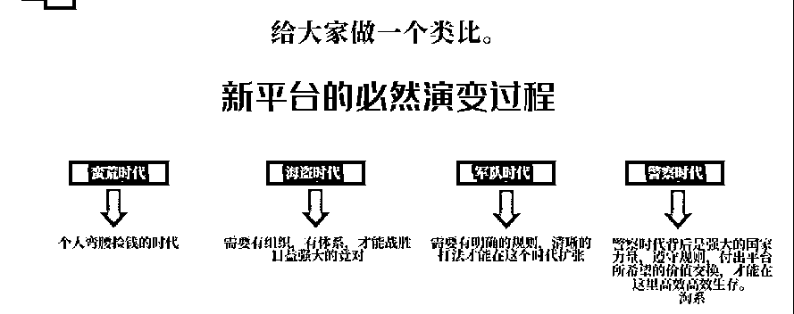

我们简单理解下这个逻辑。

蛮荒时代：无序时代，地广人稀。各种竞争、规则，还没有明确。很多情况下很简单就能赚钱，甚至跟捡钱一样。

每个时代的年轻人，多少都经历过他们时代的相应平台的扩张红利。

比如，淘宝店群，天猫店群，抖音各种玩法，滴滴司机，大规模的地推获客，拼多多店群等等，这些项目的特点，就是简单，堆量，性价比极高，回头去看，约等于捡钱。

而这类情况必然吸引大量的人涌入，也就必然产生竞争，以及白热化的竞争。

海盗时代：在蛮荒时代产生的竞争，必然会促使一部分人开始有组织，有体系的发展，去掠夺市场上的资源。

而作为依附于平台的个体，必然要进化自己的能力，平台也更希望这种更具备战斗力的“海盗”来协助自己高速扩张，而蛮荒时代没有进化或依附的个体，会被掠夺殆尽。

军队时代：竞争的白热化开始，会迫使大家进入存量竞争的周期。

在存量竞争周期，精细化，团队化，标准化，流程化，规模化，自动化，是扩张的一些必然条件，我们也可以叫做“卷”。

否则，只会慢慢衰败，退出舞台，或者被吸纳，依附生存。

警察时代：平台角度的维稳期，一切尽量以平台稳定发展为需求，规则清晰。

不再有以往的简单暴利。

需要用前周期已经搭建了起来的资源体系，获取价值回报（是的，这是一个资源大于一切的时期）。

这时的平台，需要大量已进化过，并拥有的强大能力的和合作者，与平台一起获取，汲取市场价值，并分出一部分价值。

这种情况下，只有较强的能力才有生存空间。

比如淘宝拼多多卖家，通过以往的积累，打造了供应链体系资源。

比如投放玩家搭建了超级私域转化体系资源，全市场1：0.9（甚至更低）的ROI扫流量。

市场案例很多，你可以去找找看。

当然，平台还是需要大量的个体来支撑的，但是这个阶段的个体只能按照平台规则，获得相对低性价比的收益了。

很多人会问怎么选择项目？通过以上分析，你就知道了：

原始积累就要选择前周期的项目或平台。

搭建资本（资源）壁垒后，就要在后期成熟市场，与平台共生，合作，汲取，分配养分。

大到一个平台，小到一个赛道，甚至是一个小项目，都是这样发展的，我们身处其中，如果可以看清楚自己和平台的位置，就会清晰的知道现在要做什么。

评估我们自己的实力和能力，对应思考，什么时间进入，时间发展和投入，什么时间撤退和退出。

这样我们就可以总结出一些小规律。

1.  首先，我们的商业生存，必然会依附一个更大我们一级或以上的平台，没有例外。

1.  绝大多数平台或者项目，事务，都会以蛮荒→海盗→军队→警察，这样的周期去发展，从无序扩张到有序管理，除非主体在发展过程中，不存在了。

1.  多数情况下，对于小的个体，寻求投产比的个体，超级红利只会出现于更靠前的周期。越早，竞争越少，越早，资源比越多。

1.  这种红利必然会随着大部分人进入市场而进入下一个周期，对于小个体，体则代表着红利衰退。

1.  那么固定时间内的，固定红利，则是固定的，不以个人的能力为增减，而我们获得这个红利的多寡，则取决于我们发现和介入这红利的，时间，强度，以及准确性。

比如我们可以在96年，拼多多店群超火的时间，预测在未来的数年内，会越来越卷，做无可做，要么没利润，要么升级平台所推崇玩法方向。（供应链低价）

再比如，我们可以在现在预测，在优质内容足够多以后，抖音矩阵内容的价值会持续衰败，后续就是矩阵技术和内容衰败的此消彼长而已。

我们介入项目，在合适的时间，合理投入，准确玩法，就可以赚到这块空间的钱，反而与我们的能力关系没那么大，因为谁在这个时间，做这个事情，用大致这样的方法，都能赚到钱。

这就是我们一直说的，选择，大于努力。

我们同样也可以思考，如果这些衰败是必然的，那么导致衰败的原因是什么？我们可以不可以提前完成进化？

如果升级思考，提前判断行业下一个周期的节点和表现形式，战略上站在下一个（后面）周期维度，去打这个周期的市场，或者说对手，将会非常高效。

当然，那种跨多个周期，或直接思考终局周期去布局的高人，不在我们这次讨论的层次范围，毕竟我们是凡人。

比如高盛20多年前，就在开始在全世界范围内收购碳排放权，然后等着，甚至是推动碳排放交易的发展，形成真正的低买高卖。

而作为非资本的小个体，我们应该尽可能找到蛮荒时代的项目，低成本高效率的捡资源。这时如果有能力，则可以用赚到的资源，搭建自己在下一个周期的壁垒，尽量让自己用下个周期的战斗力，掠夺这个周期的资源。

OK，我们把话题拉回来，聊小红书。

## 二、小红书生态下的周期

在小红书生态下，小红书做内容，已经进入了海盗期。

强力个人，或者有体系的小势力以上，才有能力掠夺资源的时期。

而小红书聚光投放（以下简称聚光）我个人认为，现在还在蛮荒期。

大概在蛮荒后期，介于蛮荒和海盗期之间。

而这个“介于”是以赛道来分的。

有些赛道很卷了，但是也存在着相当多蛮荒期的蓝海赛道，或者说红利赛道。

这些赛道，放在抖音，百度，这些平台甚至都已经打破头去玩了，在小红书，很多大玩家或许到现在还没看到，但是红利确实存在，就像我们前面说的，在这个时间周期里，谁先介入了（合适的时间和投入），谁先跑通了（准确的玩法），谁拿走红利！

### 小红书的客户消费力惊人，为什么？

就拿我们自己做的负债优化赛道来说，我们对周期和客户价值有着深刻的理解。

今年6月份前，准确加微我可以做到40-60一个，单粉均转化300-400，同时期快手直播投放，大约50-70一个，单粉均转化只能做到120-150。这就是小红书的单粉价值，或者说消费能力。

（而现在的小红书，准确加微起码150以上了，这就是我们上篇讲的红利周期）

关于这个问题，我们内部总结了一下原因。

1.  小红书天然较少最底层用户。

像抖音快手，是泛平台，人群像金字塔一样，底层消费人群基数最大。

而小红书的种草属性，这种优越感，天然的排他了这批人。(上图)

很多人的认知里，和种草的产品（她们认可的高价值产品）相比，拼多多的产品根本就是垃圾。

（这也是很多拼多多一键代发产品退货率高的原因）

1.  女性的感性消费。

无论是种草，还是推荐，女性用户天然比男性用户感性。

（大家有没有刷到过，叫我亲爱的公主大人，我就下单的梗？）

1.  小红书客户对平台具有天然的信任

很多平台对IP的信任，要从零培养。

但是在小红书的信任，最少有25%是来自小红书本身的，也就是说你在小红书做内容，你先天有25%的信任。

因为你随意在小红书上发一篇内容，就是姐妹。

## 三、我做了一些市场调研

### 调研结果

之前应一个圈友邀请，我做了一些他们赛道的调研，什么技巧优化都没做，就是搞个认证号，然后模仿几篇素材，开几个通投的广告，40一个加微成本。

同样的情况下，其他平台的成本起步也要加50%以上，而且这个成本，我是绝对可以再优化的。

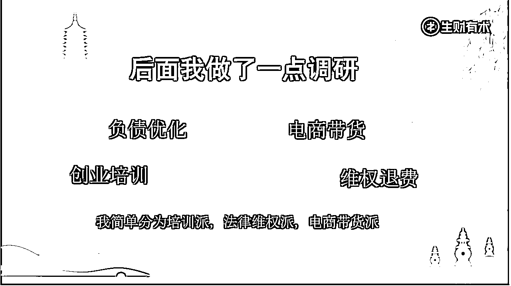

郑州分享局结束以后，又有航海家联系我，一起调研其他赛道，所以除了我们自己赛道以外，我粗略的调研了十几个赛道。

我给这次调研分了三大类，因为没有太多时间，只做了相对简单的调研。

实际情况肯定不止这些，也欢迎各路私域大佬链接我一起做你们赛道的调研。

文末会有我联系方式。

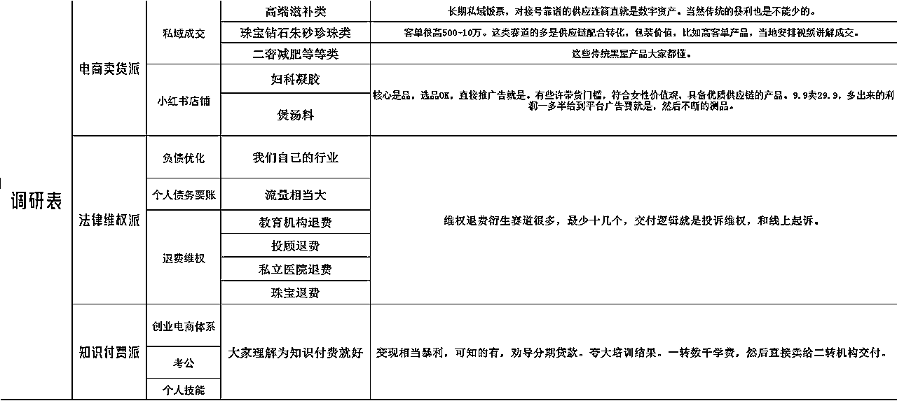

可以说，这些赛道个个都是风向标，再落地一下的话，每个赛道都有机会拿到龙珠。

我这里没有时间全部都调研细节，有些了解比较深，有些就直接略过了，下面我分享下我的调研方法。

### 如何调研，可以搭建起高价值赛道模型？

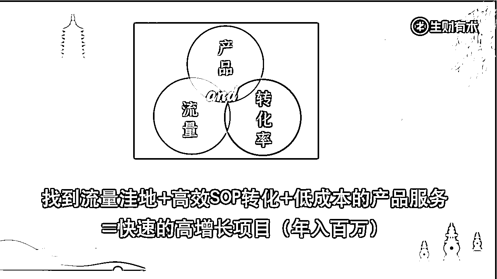

一个商业赛道，一定是以商业铁三角组成的。

以此我们可以推断出，一个好的赛道一定是流量超便宜，我们具备超级转化率的条件，同时后端产品成本边际超级低。

当然，门槛越低，越舒服，但是周期肯定也就越短。

新项目，在实际操作过程中，我们肯定不可能完美达成这些优势，详细调研每个环节以后，我们只需要根据自身资源，选择性取长补短就好。

其具体流程我分为：

立项→到调研→到拆解→到计划→到搭建→到最小化盈利模型→到复制→到自动化。

有空我们单独讲这个，先说调研，我习惯单独站在三个角度去独立调研，拆解每个角度的细分情况，拿到所有情报以后，再组合成全部流程，来判断，项目周期，项目价值，项目优势等。

流量调研：通过行业关键词搜索量，关键词价格，市场笔记数量，市场笔记热度，可以大致判断流量的价格，竞争大致程度，然后简单做几个计划，做价格测试，就能大致知道市场拿量的大致区间，初步测试够用了。

(当然如果有同行代运营公司，直接问他们更好。)

转化调研：有条件的，同行公司面试可以直接了解非常多。没有条件通过同行购买，用多个账号确定多个购买人设全方位套话术就好。

比如，高端价位人设，低端价位人设，小白人设，记者白嫖人设，刻意刁难人设，一定要全方位的问问题，刁难，你才能拿到别人解决问题的方案，看看别人怎么套路。

过程中深入了解行业转化卡点，客户顾虑，卖方优势，以及卖方为了解决问题所搭建的体系。

比如高客单的朱砂都是讲的绝版，改运，并且视频选货，且选货的镜头可以堆高价的货。

产品调研：私域带货的特点是长期，复购，超级客单，任选一或全部具备。尤其大部分追求的就是超级客单，超级客单的产品必然伴随着，高价值输出，低交付成本。

过程中调研为什么这么低成本的产品，或者看起来很有价值的产品，可以低价出售。

举几个我调研的例子：

给珠宝类产品赋予文化价值，独款/文化/命里等文化价值。再加上业内的货不对板。（任何珠宝文玩，自古以来都有货不对板存在，懂行的不懂行的买到的价格绝对不一样）

用私域针对性直播来促成知识付费课程的成交。（你想讲啥讲啥，甚至还有客户的信息资料让你针对讲）

以上只是部分例子，实际调研中，案例太多了。

小红书蓝海项目探索，重点是调研，调研价值，调研利润，调研可行性。

从立项→到调研→到拆解→到计划→到搭建→到最小化盈利模型→到复制→到自动化。

这里到正式搭建前，我们付出的都是人力工作，没有太多金钱成本。

所以前期我们的工作越完善，后期我们的风险就会越小，成功率就会越高。

但是要注意，这里一定要有极其靠谱的针对性调研，要落地到结果。

如果调研结果是不行，要讲清楚为什么不行，是否尝试过解决，解决的结果是什么？

如果调研结果是可行。要讲清楚为什么可行，判断的依据是什么？

不然就变成了形式主义，会大大的错失机会，或者增加冒进的风险。

只在各项盈利标准都符合我们的要求的情况下，最后才是有成本的流量测试和交付搭建，然后是小规模试跑，这样成本和风险是最低的。

### 例举一些调研的方法。

###### 辨别最好的赛道的标签：

高客单收益/长期复购/低成本流量/自动化成交/自动化交付/外包交付/低成本交付/低边际成本交付

调研过程中留意流量成本，转化成本，产品成本，实际收益。

以收益-成本=利润逻辑，上面的标签，满足的越多，越好。

###### 如何判断赛道是否比较卷？

1.  市场打仗，互相举报，稍微违规一点的内容和引流形式都活不下来。

1.  观察违规操作的力度，比如引流，比如内容。

小红书封号分为绝对违规，和相对违规封号。

相对违规的情况下，不被举报是不会封号的，哪怕违规，但是有给保护费（认证投放号），笔记甚至会长期保留下来。

但是经不起举报。

比如除广告入口外，任何地方，以任何形式留微信，被钓鱼举报，都会导致处罚。

1.  笔记越是简单引流，越是竞争较小。

随意发下内容就有量，甚至大家都在互相抄素材，这种赛道再流量上，就优质能多。

有些赛道的内容一个比一个卷，你发文字，我发图片文字，我再发视频，卷起来我开直播，这种跳进去卷之前，先考虑下其他优势。

1.  刷到大量账号，且不重复。

专业号越多，肯定越卷，不管这些号是一家的，还是多家的。

1.  市场反馈出价很高。

你给个相对高的出价都跑不出量，这样的话，成本肯定不会低。

OK，（上篇，逻辑篇）的内容，我们讲到这里。

关于整个项目搭建的流程：

立项→到调研→到拆解→到计划→到搭建→到最小化盈利模型→到复制→到自动化。

虽然我们自己在做，但是不同的赛道，会有不同的差异，我自己也在慢慢的思考和摸索，如有了更深度思考，我会找机会分享。

后面我们还是拉回到聚光的主题来。

# （中篇，投放讲解篇）

pS:这篇文章主要是分享，而不是课程，我们以一些浅显的内容为主，更细节的内容大家可以去看 。

## 四、在平台投放的本质是什么？

可能大家会有很多说法来回答这个问题，比如放大效果，比如拿钱买时间，快速收割市场。

最近一年，我接触的投放的工作比较多，也经常会思考这个问题。

过程中，我感受出一个很奇特的角度。

我的角度是：

平台出流量，我们出产品服务，吸引精准客户来买单。

事成之后，三七开账，平台占七。

这句话是不是很熟？是的，子弹飞的台词。姜文导演的台词，句句抄底啊。

平台有相关精准流量，平台现在周期的流量卖不到相应的价格，需要我们来以各种形式换成钱，我们觉得有空间，有差价，有的赚，就来以各种方式把流量换成钱，并与平台开账。

看懂的朋友可以找我来聊聊这个话题。

站在这个角度再去看很多投放中的问题，有时会有豁然开朗的感觉。

## 五、新手怎么快速了解聚光？

我来说说我的方法论：

首先，任何行业我要开始前，先把生财扒拉一遍，找找大腿和前辈。

但是这里有个问题。

生财的内容很多情况下，不能实时同频，小白劝退。

因为除非你付费，不然没人可以盯着你教。

经常是一看就会，一做就废，毕竟细节的东西一篇文章哪里写得完？

他们可能没有最前沿的信息和技术，但是基础的东西还是挺好的。

我们可以在这里累积初步知识然后再去对接生财的高端信息。

一来，是同频，至少别人讲的你听得懂能吸收。

二来，线下对接，或主题局时，你最少有了抛砖引玉的砖。

代运营现在业内大多没有额外的服务费，最贵也是1：1的充值免费运营。

相当于零成本给自己找了一个入门老师，比交个998强太多了。

过程中需要留意，在不了解行业前，一切高开低走的广告策略一概不答应，别浪费了你的广告费，后面我会详细讲。

1.  让他简单介绍自己的业务，并让他深入讲讲，他理解的行业市场环境，从价格到素材，再到一些小技巧等。

1.  明确讲我是运营出身，我不单单是找代运营，也是要深入了解下聚光这个平台，我在其他平台有广告经验，我希望参与运营，平时也可以协助一些基础工作。

一般情况运营都是会答应的，尤其是过程中你又从生财宝库挖到优质信息，反而给他们提出了一些建设性建议后。

1.  运营过程中，把他当做百科全书，复制他的经验。

你需要着重了解，同行业市场跑量模式，市场优质素材，市场平均出价，市场平均开口或点击价格。

## 六、聚光后台的基础理解

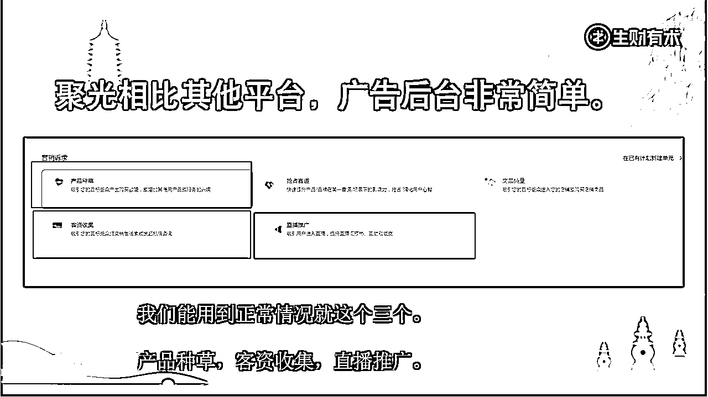

刚开始我们多数用到的是客资收集，因为多是做私域，这样简单直接。

投放的方式居多是选信息流，或搜索。

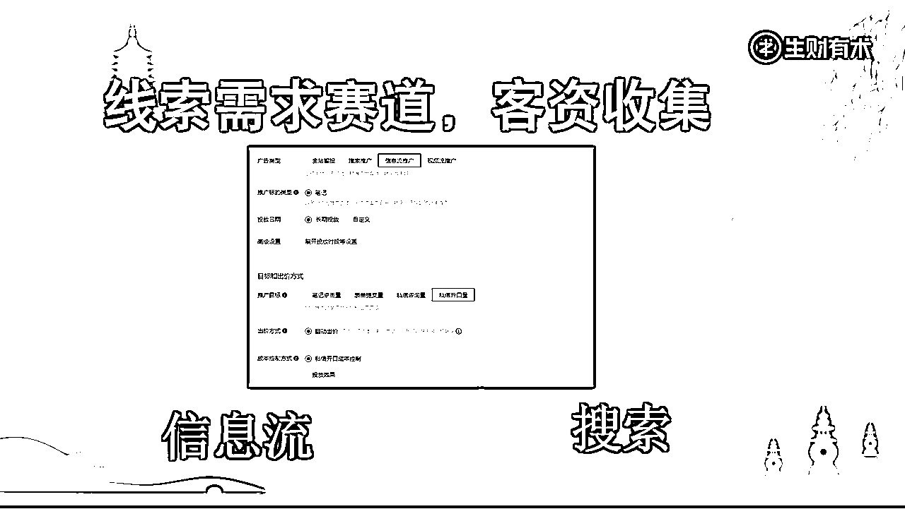

#### 信息流：

根据不同行业的不同需求，可以用两种方式来开广告。

如果你的素材比较模糊，人群定位清晰，但是不精准，可以使用：

如果你的素材非常准确，人群定位精准，则反过来使用：

PS：这个逻辑是XX红宝书的逻辑，我个人受益非浅。

#### 关键词：

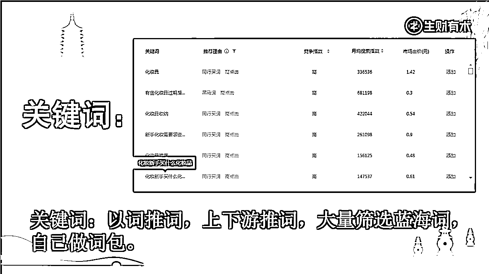

以前我们做shopee蓝海词，大批量关键词都要去第三方去找，官方给的效率太低，为此甚至我还自己写了软件。

小红书这里相对来说比较方便，以词推词，上下游推词，都还好，找到那些既精准，搜索量还大，并且价格也便宜的词，做成自己的词包。

甚至有些关键词量比较大，还准确，你可以针对关键词做素材，效果更好。

比如上图的，化妆新手买什么化妆品VS化妆品，两个关键词的质量不是一个级别，你针对性做一个素材跑这个词都很香。

#### 关于出价

这里调研新行业的出价我一般简单直接两个方案。

1.  直接让代运营推荐，让他们去了解行业大盘，然后拿大盘价格*0.7左右就好。

1.  如果市场没有相关信息，我做好素材直接给个底价，也就是最低价，先跑起来再说，后面根据反馈慢慢加价调整。

因为我们的目的就是找到流量洼地的赛道，如果价格过高，其实我们就放弃调研了。

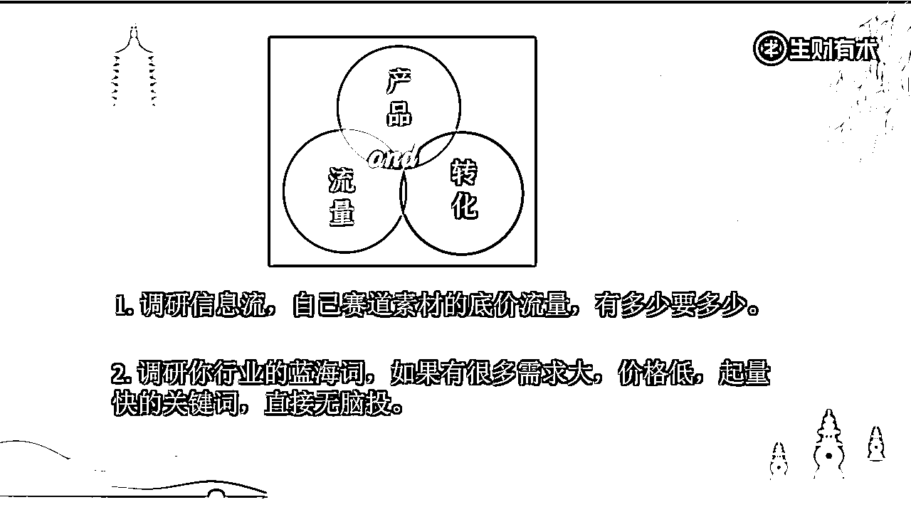

#### 重点总结

聚光现在是一个较新的投放平台，同时用户属性消费能力较强，里面更有相当多的赛道还是蓝海。

所以，不管是信息流还是关键词，会有很多接近平台底价的广告流量，如果我们调研N个赛道，找到N个赛道流量洼地，那么在小红书，我们商业铁三角的第一个角，流量洼地就完成了。

（这个价值不是我们去了才有的，是本身就存在，且已经有人在收益的，谁去做并不改变价值本身，只会改变价值的归属）

## 七、分享一个我们对广告的两个通用的基础理解

#### 刚才讲到目的，那我们先讲第一个理解：带着目的开广告。

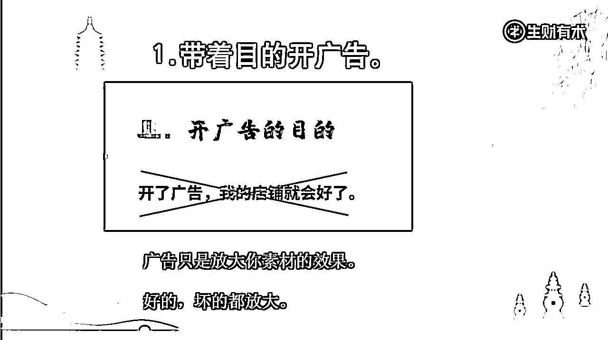

很多新开广告的人都会抱着一个想法，开了广告我的销量/获客/流量，就会好了。

这是一个很大的误区，带着这个思维，是很难开出高ROI的，没有想清楚现阶段为什么开广告，想要什么结果的话，你会发现很多广告费都是浪费的。

这个思考方式，也是为了我们后续做数据分析的基础，因为，没有目的，何来分析？

举个简单的例子：

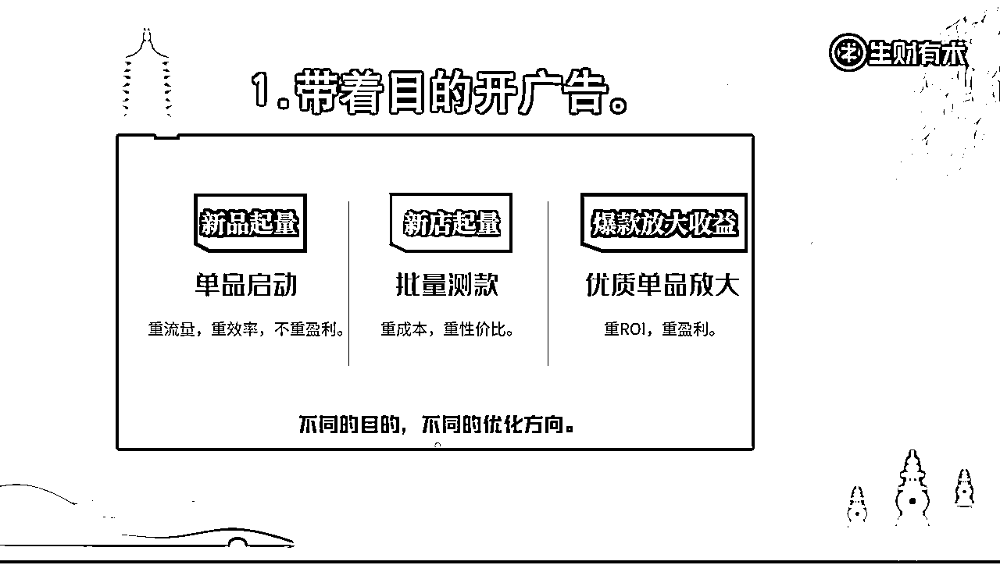

你新品起量，你当下的目的肯定不能是高ROI，高利润。

而是要先有量，因为有了量才能分析出素材的点击率，成交率等等。。。。。。。然后优化，才能拿到高ROI，高利润。

所以，这时我们的执行，是不是就可以适当的给高价，先不考虑利润比，尽早拿到流量反馈，快速迭代，测试优化，花钱买时间？

而如果你是新号/店起量，很多素材和产品，需要赛马机制，找到最低价格，却能跑出很好效果的素材/产品，这个时间你还按照上一个方法吗？

当然不能，会亏掉裤子的。

那就要根据目的改变策略，批量给低价，低于市场的价格，要求性价比，看看哪一个素材，可以低价给你带来流量/成交，重点跟进哪一个。

再如果，这个时间你出了小爆款，还按照以前的思路开吗？不能。因为这个时间的目的是单品放大，这时间就是要重ROI，重整体盈利。

或可以通过加价来拉起流量，通过销量来拉高利润。

再或者通过调整试探，感受平台给量价格点，微调以获得更好的ROI。

当然具体情况下的话会更为复杂，需要更全面的位思考。

比如销量上去以后供应链端成本降低，可以加价。

比如预判行业未来流量价格会涨，并已经搭建好了自己的长期私域复购，直接1：0.8一转亏钱吸量。

#### 第二个理解：高开低走，低开高走。

清晰的目的以后，我们就清晰了我们现阶段的定位。

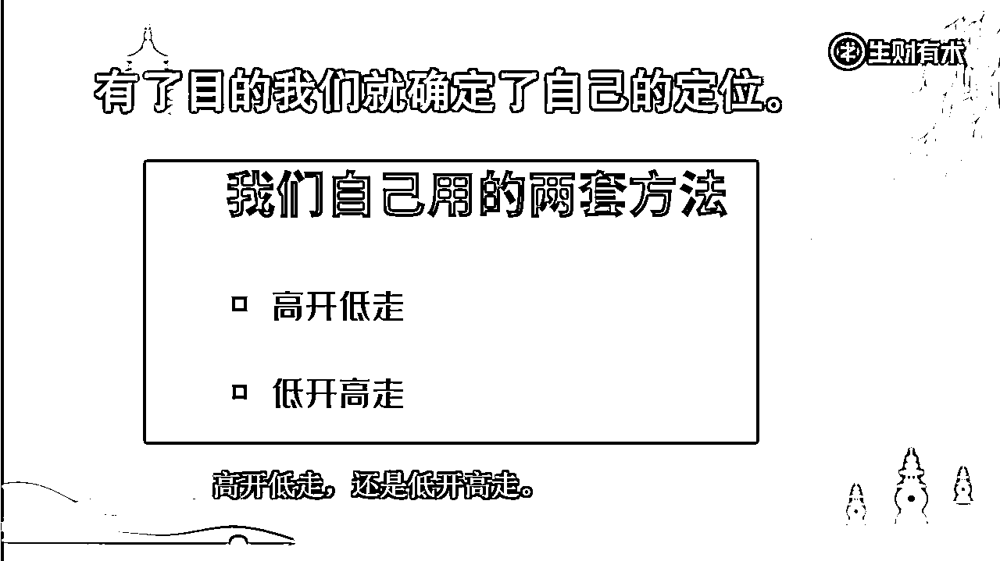

所谓高开低走：

高价起量，起量以后，通过流量稳定账号模型，拉高流量层级，然后通过递减的方法，找到ROI和平台给量的平衡值，达成既有起量，又不不高价的目的。

所谓低开高走：

底价起量，通过一点一点的加价，去探平台的给量价格区间，在有量以后，找到ROI和平台给量的平衡值。

同时也是测款，尤其是测多个素材时，底价能拿到流量的素材更好。

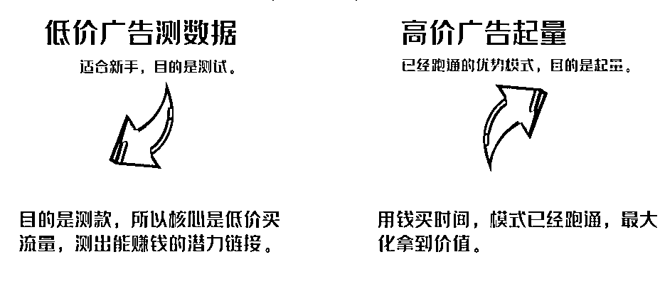

这里要注意下，新人在不清晰广告目的的情况下，一定是低开高走，不要盲目听从代运营说的先起量，在运营。

这个时间，流量市场的了解，转化团队的效率，后端交付的流程，如果都不完善的话，给你爆流量反而亏的更多。

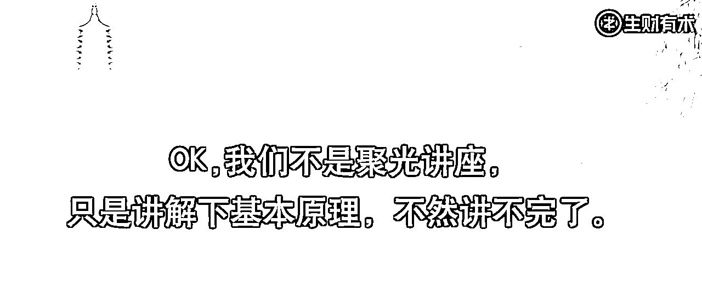

红宝书里的内容非常细，这里再次推荐下。

找到流量洼地+高效SOP转化+低成本的产品服务=快速的高增长项目

这是一个可以很宽的讨论。

但是当下时间节点，聚光的流量洼地属性，是已知的。

如果直接配合低成本的产品服务和高效的SOP转化，是最直接的变现手段。

而如果没有，我们或可以通过“找”产品，“搭”流程的方式，来形成商业铁三角。

只是会更加的费时费力。（我们自己有做，三个月起步）

但是对比收益，其性价比还是蛮高的。

如果这篇文章发布以后，我会尝试深度链接各路大佬，探讨和请教。

如果得到了大家的认同，我会尝试沟通亦仁，请教下，是否有组织超级大航海的可能性。

我把一些非落地的东西放在（下篇，未来思考篇）

一些不成熟，非落地的东西，如有不切实际的地方，大家权当科幻故事看。

# 如何链接我:

我是天堂地狱，生财编号677的老兵，微信：wxx712159 欢迎各路大佬的链接。

我和朋友现在在跨境电商，减肥，个债，负债，退费维权等赛道上都可以持续有高性价比流量。

有些赛道可以日产千粉，新的赛道也可以去开发，随时欢迎供应链端的甲方爸爸的链接，合作。

如果是从零起步的朋友，建议先去做下调研，看看自己具备已获取价值者的哪些条件，如果都不具备，我还是建议劝退，因为这样成本太高了。

当然，如果只是咨询，时间精力允许的情况下，也是欢迎的。

# （下篇，未来思考篇）

PS：下篇的内容不比中篇和上篇的已落地，暂时还存在我的思考中，后续如果这篇文章能引起更多的共鸣，我会尝试去落地这些思考。

前面我讲了聚光的红利，讲了我个人的一些调研，和调研的方法论，以及一些我对广告的理解，和开广告的思考。

我讲的内容于市场的事实情况，或只是十之其一。

我调研过现在已知的，确定的行业，如珠宝，减肥二侈（所有女性相关黑屋），知识付费，维权等等赛道，可以说，小红书现阶段具有全平台单粉转最高性价比的粉丝价格。

而没有调研过的，或许更多。

那么，这么多的赛道，怎么样才能结合起来？成为更大，更多的价值呢？

### 我做了几个方向的思考，我们还是从这里开始讲：

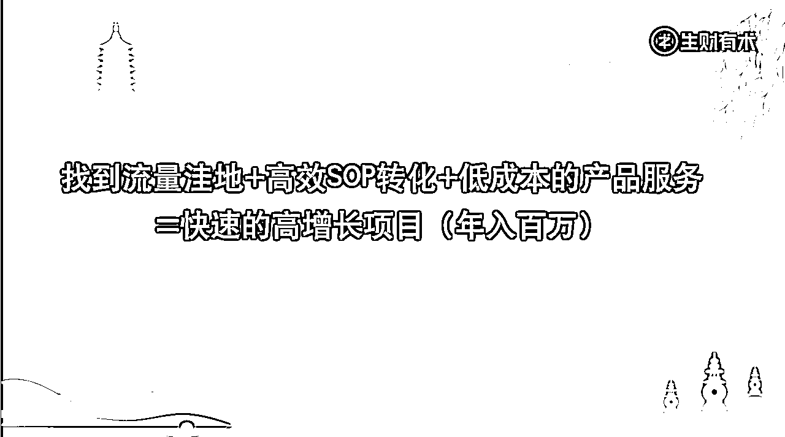

首先，我文章里举例的每个赛道，都可能是一个月入数万级别起步的项目，也可能是一颗或多颗龙珠，但是要完成这些需要相当大的，时间，精力，金钱。

不是个人或小团体力所能及的。

其次：从立项→到调研→到拆解→到计划→到搭建→到最小化盈利模型→到复制→到自动化。是较长的一个过程，至少要三个月以上。

我们自己项目，都是跑了6个月才到了完成了从零启动，到了最小化盈利模型→开始复制环节。

但是这些项目，利润相对丰厚，大部分调研到可以做计划的赛道前几乎没有过万的投入，而利润，肯定是年50W打底的，且小团队可以完成，所以说，相比之下，成本相当低了。

如果要完成这些，我思考了两个可能性。

##### 超级大航海和业务平台化。

### 超级大航海的思考。

之前强调过，这些想法都不成熟，但是作为可行性的探索，我可以先搭起框架，提出问题。

首先我要想清楚，超级大航海，做什么？如何做？要拿什么结果？

###### 做什么？

做生财的超级大航海，以航海家为基础起入门槛，发起以聚光红利为掠夺目标，以私域销售为主要形式的超级大航海。

因为同类业务需要高成本，整体打通前端，中端和后端，包括流量的测试，大规模的整理话术，以及产品方面的实地考察。

并且有亏钱的风险，普通的大航海理论是无法满足的，所以需要超级大航海来筛选有能力的船员。

起入最低标准：本身是航海家，并且带领3人以上的全职实干派团队，形成小船队。2万以上的基础启动资金，后续最少有5万以上的备用资金。

（这段时间我陆续链接了几位圈友，其中两位执行了我上述的流程，一位是已经经营了相关行业的后端，需求流量，一位是希望从调研到自动化，搞起一个新项目，现在一个到了最小化盈利模型期，一个到了搭建期，也算是提前启航的探索号了。）

###### 怎么做？

组织生财里有相当聚光经验和资源的圈友，组建超级大航海教练团，作为领航号。

领航号职能：

1.  汇集所有教练的探索经验，整理输出为市场实时经验，探讨与沟通。

1.  打通项目上层的一应资源需求，包括不限于，平台对接，供应链整合，资质获取等。

1.  整理航海的各个经验，拆分归类，尽可能成为流程化，标准化的课程或者经验，方便后面船队系统化学习，提高落地竞争时的最大化输出能力。

比如先拆分成：如何开广告，如何调研和整理出自己的各行业SOP转化流程，如何高效的搭建/洽谈后端资源，资质。

1.  后期针对有价值的船队，一对一孵化指导，协助项目利润最大化，并完成可复制放大，和自动化上岸。

领航号应有相当的价值体现，比如享有项目的收益权，和部分信息权，具体怎么实现，待思考。

领航号的价值如何体现？（作为教练团，时间精力是很有价值的）

为了降低航海的难度，一个赛道可以拆解成，流量前段船，转化探索船，后端交付船。三个船合并成一个赛道的完整船队。（当然也可以由一个主题完成全部）

###### 拿什么结果？

目标：孵化数个百万级别的航海家船队。 在聚光生态的私域电商环境下，打出自己赛道的心法，和壁垒。

OK，还是那句话，以上仅限于思考。

理想很丰满，现实多骨感，完成以上所想，是需要解决很多问题的。

有些问题可以提出来但是没有答案，甚至有些问题都还没有提出来，但是不妨碍咱们想想，是吧？

首先作为教练团领航号的动力是什么？

肯定不是爱，至少不纯粹是。咱们是成年人的生财有术，不是B站。

领航号肯定是要付出更多的价值的。要考虑好教练团的收益，加满油，才有力量。

· 教练团是否可以短期内拿到所有赛道的一线一手信息

无论是做投资，还是自己搭建团队，都绝对性的降低了成本？

· 教练团是否有可以针对优秀船队投资，分红权利？如何切实体现和保障这个权利？

· 是否可以搭建起聚光的服务体系？

在广告充值，信息交易，后端供应链等环节搭建起服务体系，让后续船队更便捷的航行，同时获得一些额外收益的价值，补贴给教练团。

· 同时，不同于普通的航海，项目是有一定的绝对风险的，如何平衡这个风险，以尽可能只给生财带来正面影响，为目标的思考和讨论，会是一个相对重点。

· 流量，成交，后端产品，这个三个点，如果单船队独立搭建，则耗时耗力，拆分后多船队组合搭建，则有一盘散沙的可能，甚至还有一方中断，全队停滞的风险，所以也是不得不详细探讨的要点。

一句话，利益怎么驱动，风险如何管理。

以上思考很不完善，大家可以给出更好的建议和意见。

以上问题如不完善，则只能处于思考阶段。

但是，动起来才能解决问题。

结合最近几个月我一直在跟进的一个想法：业务平台化，也是一个不错的方向。

### 业务平台化：

先做个总结：

上层打通资源做壁垒，下层招募实干拿业绩。 业务平台化。

如果盗坤老板来做横批的话应该是，负成本创业。

这里祝贺一下盗坤老板的狂潮科技，蒸蒸日上，孵化出更多优秀团队。

我们自己的业务也在往这个方向走，之前也写过相关文章 ，这都是挨过疫情的打，从招聘，管理，成本模式，公司发展等多方面痛定思痛的思考。

上层打通资源做壁垒：

通过打通上游的一切资源，建立普通人壁垒，包括但不限于资源，体量，平台对接，课程玩法，供应链，人才孵化等等。让有能力，有意愿的个体或者小团队可以站在这些资源壁垒上，从而发挥更大的价值，和战斗力。

下层招募实干拿业绩。

然后把业务平台化，招募筛选有能力，能打仗的合伙人，在这个平台的基础上，共享使用上层搭建的资源，信息，技术，交流，供应链等体系，无后顾之忧的同时还拥有高于市场一级的资源，做自己的业务。

同时，平台还可以通过管理，把业务拆分成流量，转化，和交付三个节点。

协调专业做流量的人，对接专业做转化的人，交给专业做交付的人。 让专业的人最大化发挥自己的价值。

业务平台化。

平台作为服务方，服务于各赛道，或各环节的孵化培育。

以体量为价值点，获取或开发市场上具有壁垒价值的，成本优惠，软件，玩法方案，供应商供应链，等相应资源。

最终平台化以后，可以充分降低管理成本，降低生产成本，规避业务集体化的相关风险，提高单个节点的效率战斗力。

大家可以理解为，很像MCN+阿米巴的结合体。

之所以有这样的理解，因为现阶段我对接的业务，有几个都具备了这些业务平台化的特点。

同时我自己的业务也在推行实践这个模式。

现阶段各地就业压力都很大，节点中的一些人力密集型工作，还可以通过平台合作人员，去孵化人力密集型的合伙人兼职岗位。

同理，如果转化和交付日渐成熟，导致人力密集型的工作增加，则可以加入各种非付费获取流量的业务范畴，发挥人力密集的优势，扩大业务平台化的影响力。

整个模式，本质上还是公司运作的模式。

就是说你公司该做什么还做什么（搭建业务资源，招募培训员工生产）。

员工该做什么还做什么（执行，落地干活，拿业绩）。

但是现在，大家是和合作关系了。

OK，到这里已经过万字了，相信这篇可以让业务走到困境的老板朋友有一些灵光一闪的启发。

关于业务平台化，我会持续深耕和思考。

过程中，每个行业，每个赛道也都会有不同的细节体现，和问题点，欢迎各路老板和大佬一起来探讨。

以后，如果有机会，我会尝试做一场线下分享。

# 特别鸣谢

本篇文章重点鸣谢：

盗坤老板，他的负成本创业逻辑，对我有很多启发，虽然平时沟通的不多，但是通过文章的精神交流，我获益匪浅。

kane和fly，持续的讨论可以碰撞出很多灵感的火花。

红宝书的作者沐泽和苏铁，我作为后入聚光的“后辈“，大家在前面走的还是很远的，我有很多要学的。

最后，感谢生财有术和亦仁，这些年在生财的锻炼和成长的，对于我来说，是不可替换的，希望我的文章也可以给予生财些许回馈。

祝大家，一起生财有术！~