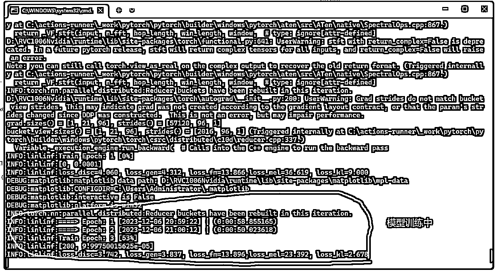

# 借数字人的东风，小众需求一周变现一万

> 来源：[https://li2o21t8ko6.feishu.cn/docx/UXBidROK8ox6F4x1v8QcQzV6nKe](https://li2o21t8ko6.feishu.cn/docx/UXBidROK8ox6F4x1v8QcQzV6nKe)

大家好，我是beartao，作为一个连续创业者，从今年5月开始深耕【AI声音克隆】和【AI美女图片】，最近两个月借着数字人的东风，从10月开始声音克隆单项目收益实现了过万，上次发贴以后，有圈友会质疑项目的生命力，恰恰相反，现在看来，这种小众声音克隆需求有了成倍的增长，今天给大家带来了实时声音克隆（RVC）模型训练教程。

## 一、声音克隆需求的增长

万事俱备，只欠东风，随着数字人的爆火，对声音的需求也是水涨船高，市面上存在的那些声音都被人用烂了，所以一个优秀的数字人必须配备一个有辨识度的声音。

### 1、数字人代理公司，现在的商家都比较重视抖音和线上，这个老哥代理了五十个数字人，给他们每个人都安排了，每个人的声音都不一样，就需要进行声音复刻，当然，这个是属于那种比较偏低端一点的客户。

### 2、高端客户，这个公司的客户都是年收入上千万的老板，做个数字人都是大几千的预算，老板级别的要求也高，售后这块就要做好，当然回报也是很丰富的哈，价格就可以往上走2-3倍，都是OK的，看服务的哈

### 3、散户玩家，自己做自媒体数字人，同时还有那种自己懒得去弄，买现成模型的玩家，需求量也是很大的，风口上，猪都能升天，价格适中就行。

还有其他的一些需求，比如明星生日祝福，人物台词克隆等等，但是总体量不是很大，像深入了解需求的看我以前的贴子，里面描述的更加的详细！

## 二、声音克隆项目前景分析

1、视频图片越来越卷，动不动就判重，自媒体从业者们已经开始追求有辨识度的声音，特别是虚拟的数字人爆火以后，给你自己的数字人匹配一个独特的声音就成了最大的需求，从10月份开始，声音克隆这块咨询的人数肉眼可见的变多，需求在哪里，机会就在哪里，传统行业的老板，商家都是我们的客户。

2、项目看上去难，其实熟练以后实际操作起来很简单，没有实际的成本，买个二手显卡就可以开干，特别适合作为个人的副业，如果能像我一样，能够对接几个大客户，就可以做比较灵活的工作室。

3、现阶段真正入局的人也不是很多，再加上技术的不断更新，也就从另一方面隐性提高了门槛，需要我们不断花时间取学习研究，当然可以考虑找一个长期深耕的老师，定期更新技术就行了。

4、私域积累的重要性。老客户复购和转介绍给我带来了不小的业绩，由于项目的特殊性，技术的不断更新也会促使需求的进一步释放，客户总是想尝尝新鲜的东西，好像人都是这样的哈。

## 三、RVC实时声音克隆

实时声音克隆，顾名思义，就是输入音频，输出的时候是模型训练的声音，以前主要用在游戏变声。

### 1、RVC变现需求

最近有个工作室找到我，他们做的直播和短视频，为了去重和避免审核，视频这块扒的别人直播间的主播录屏，然后用huanlian软件把主播的脸换掉，关于声音这块全部是扒的别人直播间的音频，然后用自己人音色替换，这边就需要我们这边来帮训练模型，替换扒下来的音频，在我这里已经做了近十个模型，通过这个需求，我这边也向其他的老客户推荐这种玩法，想不到复购率还是蛮高的。

### 2、RVC优势

1、最新出来的声音克隆算法rmvpe，相对于sovits的现有算法来讲，rmvpe算法具有仿真度高，哑音少的特点，特别对于一些女声的翻唱需求，可以更好的满足，比方说把偶像的声音进行克隆，然后用他的声音进行翻唱，或者用偶像的声音进行变声娱乐等。

2、训练模型速度快，对电脑的要求偏低，一般只要1-2个小时就可以训练好，对电脑的配置要求不高，6G显存也可以训练，同时训练的步骤非常简单，熟练操作后可以控制到5分钟以内。

3、同时支持AMD显卡和N卡，是某些A卡用户的福音，局限性小。

说了优点，缺点就是只支持音频转音频，不支持文字转音频，如果需要文字转音频，需要先用其他软件生成音频之后，在用音频推理音频，相对比较麻烦。

### 3、RVC实操

您需要准备至少30G的硬盘空间，N卡或者A卡显存6-8G，内存至少16G，window10系统

#### 1、解压软件包（软件会在文章最后链接里分享）RVC1006Nvidia.7z，注意路径不要有中文。

#### 2、找到根目录.\RVC1006Nvidia\go-web.bat，双击打开,出现以下的窗口内容，就表明运行成功

#### 3、浏览器推荐安装谷歌浏览器，点击标签页训练，打开的页面如下图所示

#### 4、训练的准备工作，准备30分钟左右干净的音频文件XX.wav，后缀一定要是wav,不然可能报错，干净的意思就是只有一个人的声音+没有背景音色+没有杂音，推荐处理软件Audition，Ultimate Vocal Remover，没用过的小伙伴自行百度一下哦，我这边分享的内容都是绝对免费的软件，没有的可以找我拿（这里啰嗦一句，对于开源软件，我们的路径和命名都建议取英文，千万不要取中文名字。）

#### 5、准备工作做好以后，就可以开始进行参数设置

①、模型名称设置，英文

②、采样率默认：40K

③、模型是否带音高指导(唱歌一定要, 语音可以不要)，唱歌就选择true，语音就选择false

④、版本选择更新的V2

⑤、提取音高和处理数据使用的CPU进程数：默认8-11

⑥、输入训练文件夹路径：X:\XXX\XXX\，这个是文件夹目录，不是文件

⑦、保存频率：10-20之间，总训练轮数200-500之间，每张显卡的batch_size：6-8G显存可以设置为6

⑧、后面三个参数默认，是否在每次保存时间点将最终小模型保存至weights文件夹，建议选择是

请仔细对照上面的选项和参数进行设置，一定要根据自己的电脑的性能匹配，不然可能出现显存溢出，报错，下面的图对应序号和上面的参数是一致的，方便大家检查，设置好以后，点击一键训练

模型预处理中

#### 6、训练完成以后，点击训练索引文件

#### 7、训练完成后，会生成模型文件和索引文件

模型文件保存在.\RVC1006Nvidia\assets\weights\ 文件夹里面，XXX.pth，索引文件保存在.\RVC1006Nvidia\logs\XXX（你的命名）\ 文件夹里面的addedXXXXXXXX .index 中,（注意索引文件是那个added开头的文件，而不是trained开头的那个，别弄错了）

#### 8、模型使用

当你看到这两个文件的时候，恭喜你，RVC的模型已经训练成功了！！那我应该怎样使用我们训练的模型呢

①点击切换到【模型推理】标签页

②点击 【刷新音色列表和索引路径】按钮

③选择你训练的XX.pth模型

④选择你训练的XX.index索引文件

⑤输入你要处理音频路径x:\XX\XX.wav

⑥点击【转换】按钮

请一一对应下图进行操作，不要跳过任何一个步骤

上面演示的是单个音频的转换，那我们要批量转换的话要怎么办呢？如下图所示，操作即可

### 4、交付给客户

把模型文件、索引文件和软件上传到百度网盘，发链接即可！

## 四、总结一下

由于项目使用的都是开源软件，就不可避免的会出现大大小小的报错，其实是很正常的，免费的东西我们就不能多要求什么，重要的是我们掌握软件的使用方法，了解各个软件的优点和缺点，物尽其用，把我们项目做好，让客户满意就行了，不用过于纠结，本人一直深耕声音克隆这个领域，有问题的圈友可以咨询我，我会尽力帮大家答疑解惑。

## 五、文中RVC 克隆软件链接

链接：https://pan.baidu.com/s/1rG_rLIXB4KUJfTIK6sXsjQ?pwd=pawb

提取码：pawb