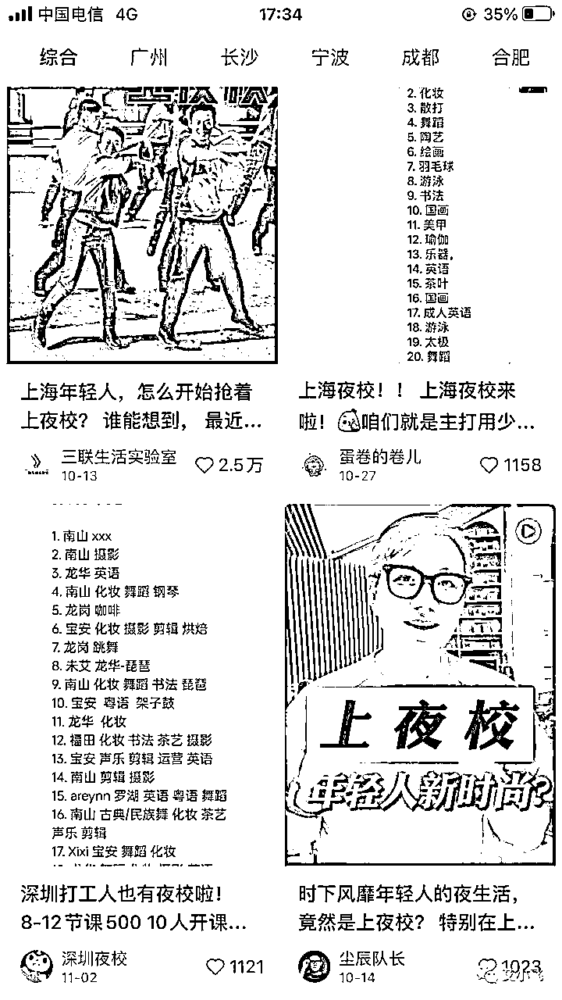
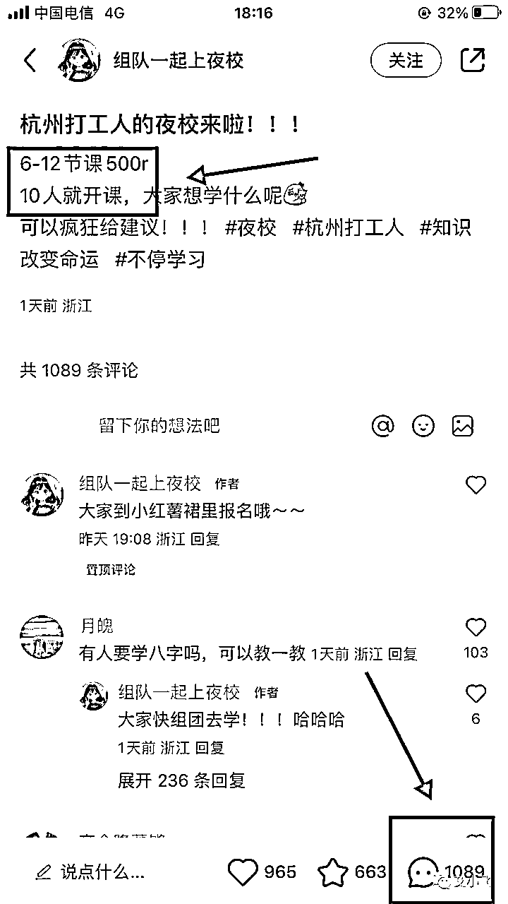
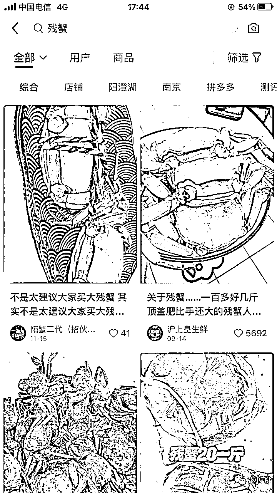
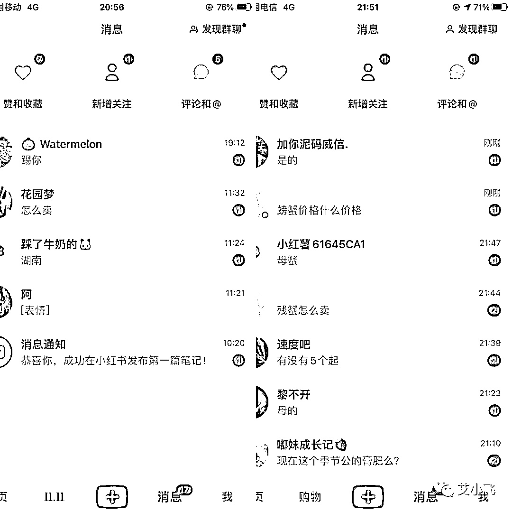

# 如何找到商机并快速赚到钱

> 来源：[https://nivut760ftk.feishu.cn/docx/VUkiddmHso93WHx1CuPcO5o0n1b](https://nivut760ftk.feishu.cn/docx/VUkiddmHso93WHx1CuPcO5o0n1b)

大家好，我叫艾小飞，专做小红书流量

最近有几个圈友来找我咨询，他们问最多的问题，就是如何去找到有商机的项目

这个问题问得好

跟他们电话聊天过程中，发现他们对于商机的思考角度很片面，有时候机会就摆到他们面前，却不懂要如何去抓住并变现

正好前段时间，我也是通过一个看似不起眼的小信息，挖掘到了需求并马上跑通赚到钱的项目

我觉得可以把这个经验写出来，让更多人通过我的思考和案例，深刻的去理解什么是商机？如何去发现商机？并如何赚到钱的？

为了方便你们阅读，这是我接下来要讲到的内容章节

一、商机的本质是什么

二、我是如何发现需求的

三、我是如何调研市场的

四、我是如何产品定价的

五、我是如何测试项目的

六、最后我想对你说的是

* * *

# 一、商机的本质是什么

我认为就是：用户有需求，没人去满足，你就能赚到钱

就拿最近很火的“夜校”这个项目，来给你们举个例子吧

为什么夜校一推出，就火了？

我认为现在的市场竞争太大，各行业的人都越来越卷

如果他们不进步也不努力的跟上节奏，随时会被市场给淘汰掉

所以他们都有想学习技能的需求，来提升自己的核心竞争力

但有需求还不够，也要看产品的价格是否符合用户人群的消费能力

为什么呢？

因为现在市面上的课程都很贵，随便学个技能的录播课都要大几百，一对一的课那就更贵，收费都是大几千的

有需求，但成本高，他们都望而却步了

于是，有人发现这个需求点后，就推出了“夜校”模式

这个夜校一推出，就马上引来了很多年轻人的围观和报名

他们发现这夜校的价格，居然还能这么的便宜！这不就是自己想要的吗

而且又是线下组织的，有学习氛围还能交同兴趣爱好的朋友，这不就是难得的机会吗

你看看，所以“夜校”爆火的背后，是满足了用户一直埋藏在深处的需求

这就是生活中的商机案例

# 二、我是如何发现需求的

这个说起来也挺巧的啊，因为我是做小红书引流的嘛，平时有空，都会习惯性的到小红书上刷刷推荐页

刷着刷着，当时看到有一条关于断脚蟹的笔记

我发现了一个奇怪的点，就是在评论区的用户，他们都在问同一类型问题：“多少钱”，“怎么买”，“求链接”

但奇怪的是，博主居然都没有去回应他们！！

我冷静的思考下，既然用户有需求，为什么商家不去回应他们？

难道是他没有产品？还是随便发来玩玩的？还是不懂如何去开店？

我是觉得挺奇怪的，心想用户把钱都送上门了，他都不去弯腰捡，有点意思啊

于是我去搜索了关键词：“断脚蟹”，发现这类型的笔记评论区里，篇篇都有用户求购买的评论，但很少有商家有意的去引导他们下单

越想越不对劲，我觉得这事肯定不简单

我在想：要不，我去测试看？

当时我的思路是，打算去新建一个小红书新号，抓取他们爆款有哪些核心点，然后去模仿他们，用来测试用户的需求是否真实有效

# 三、我是如何调研市场的

有了这个思路后，下一步我就去搜索整个全网，看有多少人在做这件事？做的规模怎么样？利润有多少？能否去复制？我自己有没有能力去操作？

想好了问题的核心点后，我首先搜索了知识星球，看看有谁做得比较厉害的，能不能借鉴参考

看了一圈，发现有几个大闸蟹大佬分享的文章，做得还是很不错的，但他们只是做大闸蟹，对于残蟹做得不够深也不够细

于是我去公众号知乎搜了一遍，基本上都没人发表这类的文章

OK，我又去搜索付费社群，翻看聊天记录，都没人提残蟹怎么做这种事

行，基本的情况我也大概了解了，有人做，但做得不够细，不够深，做大闸蟹的人，也不会单独专门的去做残蟹这种小类目

当时我在思考一个问题，如果以我现在的能力去做，能不能成？多久能成？不成怎么办？风险和成本是什么？如果跑通后要怎么做？

因为当时我也不太确定，我做这个项目是否能成，所以就给自己5天的时间，去测试这个产品的需求

如果能跑通，那就批量起号去做矩阵，如果时间到了还跑不通，那就停！不要做！

好，确定了时间和目标后，就开始去调研同行并看看利润如何了

# 四、我是如何产品定价的

当时的第一步，就是去找同行，假扮客户加他们的微信，看看他们是怎么卖的，有什么售后，每单多少钱

我发现他们当时卖得最多的，是3.0两的母蟹，平均10只的价格都要280元左右

套出了价格后，我就去拼多多上搜同款，看价格

发现这两边的差额，竟然有180元的空间

也就是说，一单卖出去，就能赚180元！！

哇塞，当时是很兴奋啊，这么高的利润，确实很诱人的

但我又想了想，毕竟他们做得比我久，比我专业，如果我还是同价跟他们卖的话，肯定是没什么优势的

怎么办呢？

于是我想到了，不如我打价格战吧，每单我不赚那么多行不行，只赚80元就好了

他们卖280，我就卖180，用价格去吸引一波人来找我下单，看看情况怎么样，再做接下来的计划打算

OK，确定好了这个方法后，我就准备去做项目测试了

# 五、我是如何测试项目的

因为要测试，那肯定少不了去找出同行爆款的核心点

怎么找？

我去搜索产品的关键词“残蟹”，“断脚蟹”

点击“最热”那栏，看看最热门的爆款封面，都有哪些共同点

翻了十多篇笔记后，我发现封面只要是残蟹显得比手掌还大的，热度就越高

反之，残蟹比手掌还要小的封面，热度就越低

好，这是他们爆款封面之间的共同点

有了这个核心点，到时候我去做封面的时候，就知道该如何切入进去了

看完了封面，再看看他们的标题都有哪些共同点

我发现一个很有意思的现象，就是他们标题当中，只要是提到了“省钱”，“便宜”这种联想的关键词，热度就越高

反之不去强调这种，热度就越低，基本没人看

好，到时候我起标题的时候，也去模仿他们这套核心点

然后再看看他们的正文文案都是怎么写的

他们的文案就比较简单了，基本上都是在解释，什么是残蟹，残蟹为什么会很便宜，该怎么去买等等

OK，封面标题文案的全部核心点都解决了，接下来就是素材的问题了

关于素材，我是不可能自己去买大闸蟹回来，掰断腿后自己去拍的，那样的时间和成本太高，没必要

于是我就去搜“大闸蟹吐槽”的关键词，把他们在评论区反馈的图片，按照爆款封面的核心点，全部都搜集过来进行二创来作为我的封面素材

这样就可以省掉很多的时间和成本，效率会更高

收集好素材后，就开始注册新账号去整理文案发布笔记了

掌握了他们爆款的核心点，文案对我来说都不算什么很难的事

发布笔记前关掉WiFi和定位后，一发出去，就有人来评论：“怎么买”，“多少钱”

我心里大概的有个数，是踩中他们的需求点了，要不然不会有那么多人过来问的

因为当时大部分商家都是半公开价格的，而且残蟹的价格非常的乱

在笔记文案衬托很便宜的潜意识下，于是我就利用价格表来作为钩子品，在评论区把他们都吸引主动的私信找我

这样的好处是，让后面来的人看到后，就很自觉的来私信找你要了，不用我贴着脸去问人家

当时来咨询的人很多，然后我就自编了一套话术，再小红书私信上去转化一波下单客户

因为当天咨询量还不错，第二天就马上成交了第一单

有点惊喜，但也在意料之中

客户加我微信给我转了钱后，我就跑到拼多多那下单，给他发货

就这样从发现用户有需求到出单的过程，就跑通了

虽然这其中我省掉了很多的细节点，但通过这个案例也证明了，用户有需求，你去满足它，就能赚到钱！

# 六、最后我想对你说的是

可能现在很多人都有这种感觉，就是现在的商机，很难再找到了

但其实只要你稍微的留意某些细节，然后去调研市场看看，就能发现有很多可以赚到钱的机会

比如刚刚我说的这个案例，我就是无意的刷刷小红书，想看看他这个残蟹是怎么引流，怎么赚钱的

于是就发现用户都在评论区“求价格”，博主居然都不回复他们的，我就感觉到这事的“异常值”

而靠着这个“异常值”，我去搜索了全网资料，居然都没几个专门去做这块的

我评估了自身的能力、风险和成本后，就开始马上动手去执行了，没想到，第二天就这样成了！

你说，这个商机，是从天上掉下来的吗？

其实不是的，而是我带着目的去刷小红书的

每当看到一条商业笔记时，我潜意识里都在快速思考，他这个是怎么赚钱的？怎么引流的？

为什么他的笔记能爆？用户留言的背后都有哪些隐性需求？我能不能去复制？执行需要承担哪些成本风险？

这就是我能快速发现商机并马上跑通赚到钱的思考路径

但大多数人看到商业笔记后，都是怎么思考的呢

比如看到一条推广的商业笔记后，他第一反应是：“哇这个好好看啊”，“我也想要”，“这个怎么买”，“多少钱”.....

这么一对比起来，是不是感觉都不一样了对吧

所以很多人都想去找商机，但不练习自己发现商机的思维能力，是没用的

怎么练习，我简单教你一个小技巧

下次你去刷小红书的时候，刻意的去思考

他为什么要发这条笔记？

为什么这条笔记能吸引到我？

他是怎么赚到钱的？

你先按照我这三个思考路径去试试看，连续练习一个礼拜，你会发现身边到处都是小商机，你稍微的去执行验证，就能赚到钱了

思考是件很累的事，如果你能练成了，那就是件很牛逼的事

文章的最后，也打算公开几个最近我发现的商机吧，我还没来得及去测试，但你们可以去试试

如果成了，不说能月赚上万吧，至少能赚个小几千还是没问题的

产品：

1.小红书卖送男生的生日礼物

2.小红书卖女人脾胃差的养生茶

3.小红书卖实体店倒闭的二手家具

4.小红书卖中高端过年送礼礼品

5.小红书卖赣南脐橙

6.小红书卖磁性对联

7.小红书卖助眠养生茶

引流平台：

小红书

进货平台：

拼多多

模式玩法：

小红书引流→微信成交→拼多多进货

看你自己喜欢哪个产品，选一个去做，只要细节把控好，都能赚到小钱的

我把产品和项目模式都放在你手上了，想不想赚，就靠你了

或者你不想搞那么麻烦，你也可以利用自身的技能或经验，帮用户解决痛点问题，从中也能赚到钱

举个例子，我之前有个徒弟，他发现很多新人都不会做小红书的账号定位

有这个需求，但没几个人看得上这业务

于是他去做了，7天跑通全程，三个月赚了8万的咨询费和培训费

这也行？

对，这真的行！！

现在缺的不是赚钱的项目，而是发现可赚钱的眼睛

今年市场都消费降级了，你去小红书上搜“省钱”，“低价”，“降价”，“平替”这种关键词，就能发现，里面还藏有很多没被发掘的商机

好了，今天的分享就到这里了

我叫艾小飞，擅长小红书引流，我们下期再见

原创：艾小飞

转载可私信

禁止搬运和抄袭

微信：aifei9977（记得备注来意）