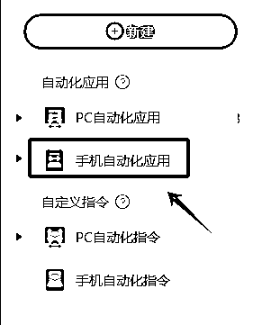
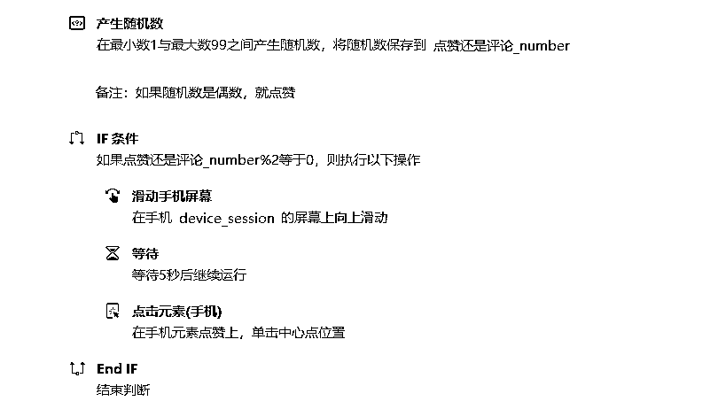
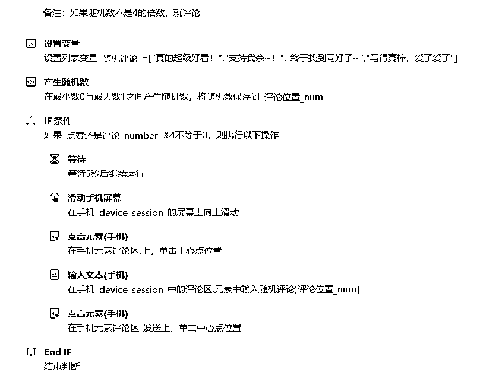
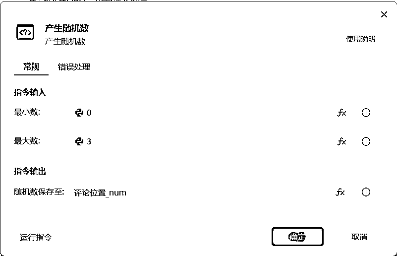
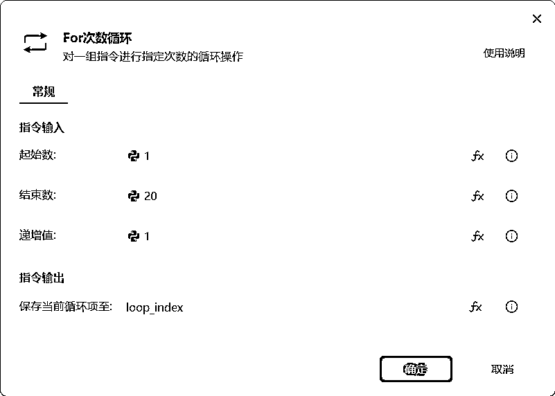
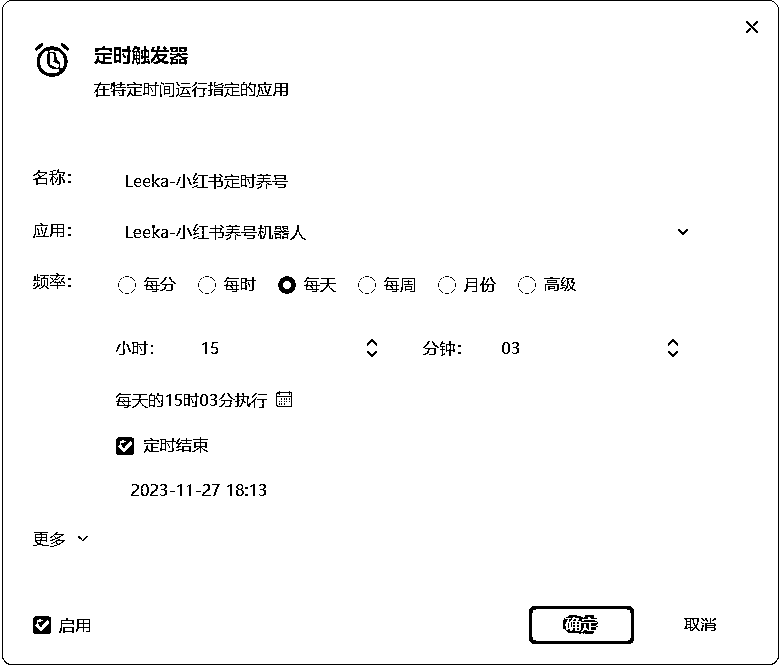
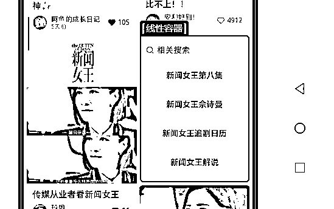
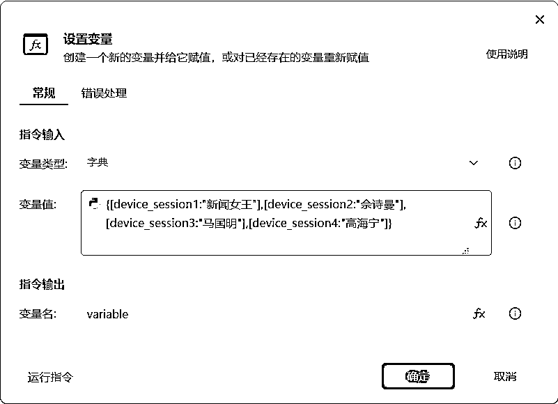
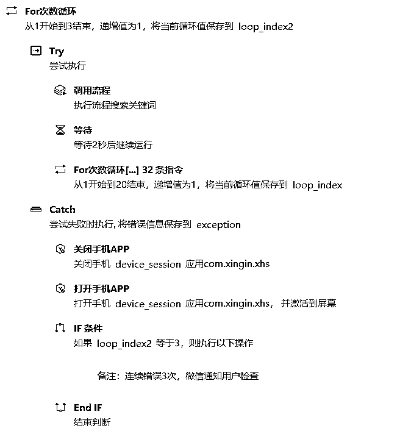

# 【喂饭教程】我用影刀RPA做了个小红书养号机器人@Leeka

> 来源：[https://ktuszl372b.feishu.cn/docx/W6KtdjDzko5o9Kx3wnAcFooxnbg](https://ktuszl372b.feishu.cn/docx/W6KtdjDzko5o9Kx3wnAcFooxnbg)

11 月的航海开辟了新航线，我就报了小红书旅游。因为都需要矩阵化，新账号前期需要养号一段时间，以增加账号权重，让系统确认为是活跃账号，这样后续我们发笔记，才可能有更好的推流。我发现航海的圈友大多都是手工在养号，如果账号不多，倒也不是问题，但如果账号多了，那么养号这件“小事”，就很可能成为阻碍我们做好项目的绊脚石了。为了解决这个问题，就有了这篇帖子的诞生了！

Hello 啊，我是 Leeka ，影刀官方认证的中级工程师，Uibot 认证的初级工程师，我想我们做项目不应该被这点小事难倒，于是这次带着我的机器人一起来给大家降本增效了！话不多说，全程干货，打开影刀，我们一起做一个小红书养号机器人。

虽然说这次是依托小红书平台做的养号机器人，但实际上，其他平台的养号逻辑的一致的，动手能力强的小伙伴可以直接迁移到其他平台，让效率至少提升 10 倍。

先看看这个小红书养号机器人的成果

# 一、机器人需求落地

## 1.1 通过关键词找到笔记

首先，我们要新建一个【手机自动化应用】，毕竟咱们养号是在手机上养的，不是在电脑端。



然后，我们需要连接手机，连接手机时的注意事项比较多且不同手机有不同要求，附上官方连接手机的文档。这边就不再赘述了。

通过【打开手机 app 】指令打开小红书，注意，我们需要在手机上先打开小红书，然后点击【获取】就能获取到包名。

*   包名可以简单理解为，软件在手机里的 ID ，只要有了包名，无论软件放在哪里，影刀都能找到并点击。暂不支持应用多开（因为包名都一样），应用多开的手机只能用【点击元素】了。

当然，我们也可以通过【点击元素】的方式打开小红书，但考虑到我们这个机器人可能同时操作几台甚至十来台手机，并不是每台手机的 app 所在位置都一样。所以，为了节省每台手机重新配置的时间，用【打开手机 app】显然更合适些。

进入界面后，输入我们预设好的关键词，进行搜索。需要注意的是，对话框的内容有很多，我们只需要获取用户输入的内容 textbox 即可。


## 1.2 点进笔记去看一段时间

养号第一步：日常刷笔记、看笔记。而为了模拟真人，我们是“随机”点开几篇笔记看，毕竟我们不可能也不需要将所有笔记都一一点开。

因此，我们可以通过设置随机数，来随机生成一个横坐标和纵坐标，再通过点击这个随机坐标，就可以实现点进随机笔记的需求了~具体操作如下：

① 首先，手机自动化应用与电脑自动化应用不同，不能通过【鼠标点击】来获取到对应的坐标，但没关系，我们换个思路：通过点击同一屏幕上，2 个笔记的2个角落，来获取到对应的 x 坐标和 y 坐标取值范围。

左上角的笔记取左上角的位置，是 x 轴的最小值， y 轴的最小值；

右下角的笔记取右下角的位置，是 x 轴的最大值， y 轴的最大值。


② 步骤 1 中获取到的 x 坐标和 y 坐标，就是我们随机数的范围

*   需要注意的是：x 坐标的范围只用在产生 x 坐标的随机数上，不可能混淆

*   还有一个要注意的点，不同手机的屏幕分辨率不同，所以 x 坐标和 y 坐标的数据也会有差异，需要单独调试

③ 我们可以设置在同一屏幕点击多少个笔记，这边演示的是单屏点击 1 个笔记

*   如果想要点击多个的话，通过再次产生随机数，再点击即可，两次点击完，再往下滚动屏幕。

*   需要注意的是：产生的随机数，可能点击到同一篇笔记上，当然不额外设置，问题也不大。如果想要机器人更加聪明，我们可以再额外设置，让机器人两次点击的是不同的笔记，具体办法请参考2.3。

## 1.3 给笔记点赞或是留言

我们日常刷笔记的过程中，如果看到自己喜欢的内容，肯定会点赞、收藏或评论。所以在这里，我们的 RPA 机器人也需要实现给笔记点赞、留言的功能

和上面说的一样，因为是模拟真人，所以在配置点赞评论逻辑时要注意：

① 不能每个笔记都点赞

② 不能每个笔记都评论

③ 部分笔记可以点赞+评论

那么，要如何确定这个笔记是该点赞、评论，还是要点赞+评论呢？

这里我们需要明白一个点：

毕竟我们现在是养号，目的是为了提高账号的权重，我们选择点赞评论的内容，可以跟自己要做的赛道内容不同，因为自己擅长做什么跟喜欢什么，本来就可以不一样啊。

所以也不需要整那么复杂，不需要复杂的数据判断，那我们就直接简单点，摇骰子（随机数）决定是否需要点赞、是否需要评论。

还是沿用上述的逻辑，通过产生随机数（范围是 1 到 99 ），以这个随机数的具体情况来决定。

如果想要点赞评论更加频繁一些，逻辑可以再调整，这边演示的逻辑，评论相对会多一些些。

我这边的逻辑是这样的：

① 如果是偶数，那么就给这个笔记点赞；

② 如果这个不是 4 的倍数，那么我就给这个笔记评论；

③ 注意以上两个判断是并列的，也就是这个随机数可以同时满足以上两个判断条件。

按照这个逻辑，就会产生这样的结果：

1、如果随机数是 2 和 4 的倍数，那么这个笔记就会得到点赞；

2、如果随机数只是 2 的倍数不是 4 的倍数，那么这个笔记就会得到点赞+评论；

3、如果随机数不是 2 的倍数且不能被 4 整除，那么这个笔记就会得到评论；

4、其他情况，这个笔记啥也得不到。

具体代码如下：





我第一次设置评论的时候，评论内容是固定的，但是时间久了，发现这可能不太合适，后续修改了一下，还是沿用随机的概念，产生随机评论，具体操作是这样的：

1.  写设置一个列表的变量【随机评论】，写入我们预先设置好的评论 a、b、c、d、e 等等，注意评论是字符串，需要加上英文的双引号

1.  再设置一个随机位置

*   （注意：列表的位置是从 0 开始计数的（计算机的算数规则），如果列表里有 5 个评论，那么这个随机数的范围就应该是 [0,4]，我的评论是设置了 4 个评论，所以随机数产生的范围就是 [0,3]）



1.  最后，我们只需要在评论区输入【列表[随机位置]】就可以实现随机评论的需求了。

## 1.4 整个过程持续一段时间

整个过程是循环的，我使用的是【 For 次数循环】，为了加速演示，循环次数只设置了 20 次。这个次数可以根据需求调整，或者也可以设置【定时触发】：





需要注意的是：小红书页面上偶尔会有【相关搜索】的字样，因为我们坐标是随机的，如果产生的随机坐标刚好点击了相关搜索，那么整个逻辑又变不一样了。


因为点击了【相关搜索】后，又跳转到新的笔记页面，那么就需要加判断，是不是有好几个图片（设置图片元素，判断是不是 ＞ 1 ），如果是，那么就再产生随机数点击。

如果一定要在有【相关搜索】页面点击笔记，那么就需要避开【相关搜索】这片区域的坐标范围，就需要获得【相关搜索】所在的线性容器的坐标范围，产生随机数时，需要避开这个范围设置。



看完上面的分析，是不是更加懵圈了。所以咱不整复杂的，这次我设置得简单点，如果发现手机页面里存在【相关搜索】的字样，那么就直接继续滑动。

这里有一个点：影刀在确认元素是否存在的时候，是需要花费一些时间的，大概是 5 ~ 10 秒，也就是整个页面会停滞 5 ~ 10 秒。

不过，在我们真人操作的时候，其实也是会在笔记页面做短暂停留的，所以影刀的这个等待时间并不会造成什么问题，反而是加分项。

# 二、让机器人变得更聪明

## 2.1 多设备不同关键词设置

上述演示的只是一台手机、一个关键词的操作，但是对于实际多台手机的操作（一台电脑可以控制 15 ~ 20 台手机），又该如何处理呢？

多台手机连接电脑时，我们可以不用通过 USB 连接手机，可以试着通过无线方式链接，具体办法请参考官方文档，点击蓝字跳转。（需要注意的是，无线链接的稳定性不如有线，且不建议多个账号共用一个 WiFi ，具体选择有线还是无线操作，请自行斟酌。）

这边我们可以设置一个“字典”，将手机和对应的话题一一匹配，例如：

{[device_session 1 :"新闻女王"],[device_session 2 :"佘诗曼"],[device_session 3 :"马国明"],[device_session 4 :"高海宁"]}

*   注释：什么是字典？

字典（Dictionary）是 Python 提供的一种常用的数据结构，由键（key）和值（value）成对组成，键和值中间以冒号：隔开，项之间用逗号隔开，整个字典由大括号 {} 括起来。

格式如下：

```
dic = {key1 : value1, key2 : value2 }
```

我设置的字典的意思就是设备 1 搜索【新闻女王】，设备 2 搜索【佘诗曼】，设备 3 搜索【马国明】，设备4搜索【高海宁】。

后续直接通过获取对应手机设备的 value 值，就可以直接搜索相关关键词了。



## 2.2 设置容错机制

因为涉及到多台设备，每台设备的情况可能有所不同，在没有找到对应页面时，机器人就会报错，那么我们直接在可能出问题的步骤上加容错机制即可。

在可能出错的部分加上 Try Catch ，“ Try ” 的意思就是尝试去做这个事，如果遇到问题了，就跳到“ Catch ”，操作 Catch 内设置好的操作，我是先杀应用，再重新打开。

我设置了 For 次数循环，如果机器人连续 3 次都报错，那机器人肯定有问题，就可以设置通过微信通知自己，来查看机器人到底出了啥问题。



## 2.3 设置单屏点击2个不同的笔记

上述的机器人是单屏点击 1 个笔记，操作完后往上滑动。如果想要单屏点击 2 个不同的笔记，那又该怎么做呢？

首先，对于我们要点击哪个笔记，用的是坐标，2 个不同笔记，也就意味着他们的坐标范围是不同的，那么具体应用到影刀，要怎么操作呢？


首先，我们把整个屏幕划分为4个区域，A、B、C、D。

A 和 B 的 y 轴范围是一致的，同理，C 和 D 的 y 轴范围也是一致的

A 和 C 的 x 轴范围是一致的，同理，B 和 D 的 x 轴范围也是一致的

那么我们就可以判断，第一次点击的笔记的x轴是否落在 A / C 的 x 轴范围内，如果是，那么第二次点击的笔记的 x 轴范围就应该落在 B / D 的 x 轴范围内；

同理， y 轴也是一样的处理。

## 2.4 设置多余的随机动作

有朋友可能担心，养号机器人整套动作都这么整齐划一，会不会被平台识别到，然后封禁呀？

那么我们就可以设置一些花活儿，让机器人的动作显得不那么“整齐划一”就行了。

譬如①：在看笔记的时候，原流程是设置等待 5 秒，此处我们可以设置一个随机数，让等待时间不固定；

譬如②：我们还能在每次看笔记的时候，左右滑动一下，滑动图片啥的（如果有多图）；

譬如③：在操作完某个动作后，我们还可以设置一些无关紧要的点击，例如刷新、例如点击空白处，都可以。

有了以上的操作，整个机器人看起来是不是就更像是一个真人操作了呢？

# 三、结语

做项目最重要的就是持续去做，我喜欢的作家 James Clear 是这么说的：“Over long time frames, simply staying in the game is impressive.” 意思是，只要持续不下牌桌，你就已经能超越 99% 的人了。

我想，每个项目中总有一些繁琐重复的事情，让我们觉得很累，以致于让我们会降低对项目的热情，既然意识到问题所在，何不直接把这些烦人的重复操作交给真正的机器人，让自己腾出双手，腾出时间来思考更高层次的东西呢？让自己持续保持对项目的热情呢？

也许，有了RPA机器人以后能让我们能再坚持久一点点，那我们就更可能接近成功了，不是吗？

如果帖子对你有启发，请记得给我一键三连呀~这是我持续更新的最大动力！

我是 Leeka，持续在研究 RPA ，如果你也对 RPA 和项目降本增效感兴趣，欢迎来跟我唠唠。

V：Leeka56 （备注生财圈友，会更快通过！）

最后附上本次机器人的链接：Leeka-小红书养号RPA机器人 （密码是：Leeka56）

## 3.1 RPA 机器人还能这么玩？

《如何通过影刀RPA提升抖音图文10倍跟款的效率》@Leeka

《在学习影刀RPA之前，你得知道这些坑！》@Leeka

《如何利用RPA提升小红书店铺10倍以上的效率？》@Leeka