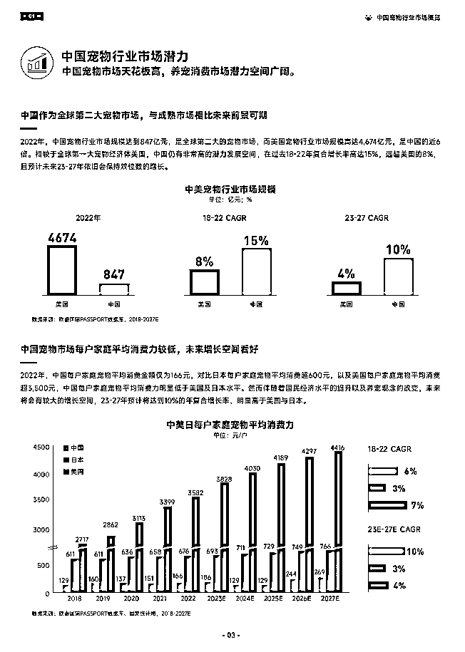

# 我是怎么通过做好个人IP 在小红书宠物赛道站稳脚跟的

> 来源：[https://zk4z8m1b5w.feishu.cn/docx/WD48dMmEEofQmQxb2lccCJ2znsf](https://zk4z8m1b5w.feishu.cn/docx/WD48dMmEEofQmQxb2lccCJ2znsf)

# 一、自我介绍

哈喽生财圈友们，我是虾饼，小红书宠物科普博主。2021年底裸辞开始做账号，至今合作品牌200+，包括雀巢、皇家、百利等国际品牌，单平台单账号变现100万RMB。

上一次在生财分享了我是怎么从0到1做出这个账号的（指路：https://t.zsxq.com/14SCGaKqW），当时的策略是主攻宠物科普图文，利用爆款模板快速引流涨粉，这个策略仍适用于现在新入场的朋友们，但要在起号后与其他账号做出差异化，维持个人优势，长久地恰自媒体这碗饭，需要提高内容壁垒，这也是我现在正在做的。

# 二、赛道发展情况

我先介绍下小红书宠物科普赛道-图文笔记的发展情况：

*   2021年及之前

蓝海赛道，热门笔记类型是这样的，只要内容不太差都能火：

*   2022年

官方扶持宠物科普赛道，参加活动就有流量，总体上流量都很不错，热门笔记增加了备忘录、手绘类型：

*   2023年

没有官方扶持，受直播、带货笔记、品牌投流影响，流量大幅缩减，同时还有机构和专注捞流量的个人入场，竞争更为激烈，热门笔记类型是这些：

可以发现在该赛道中，图文笔记相对缺少人设，可复制性和可代替性都太强了，洗稿现象严重：你专注做原创，创作出来爆款模板，会被同行疯狂洗稿，用户却不知道原创是谁，也并不一定记得你这个账号。

这种情况，对于只是想引流的账号无所谓，特别是有团队的，大不了继续批量起号，但对于个人，变现渠道相对窄，起号成本也较高，如果想要继续做下去，是非常有必要提高门槛，尽量避开同质化，还要让用户记住你。

# 三、提高账号门槛的方式

这些方式是我通过调研和结合个人经验总结出来的，每一项我都付诸实践了，但是短期内很难给大家看到一个什么样的成绩，只能说在竞争越来越激烈的情况下我的账号还能保持每月五位数的收入，而和我同批入场的有很多号已经差不多停更了。当然如果去观察做得不错的几个宠物科普IP，会发现他们的做法跟以下几点都对得上。

## 1、账号IP感

### （1）个人简介

突出个人特征或近况，加强形象背书和真实感，如：

*   添加学历背景：利兹大学营养学硕士

*   进修情况：临床医学在读

*   近况：兽医博士备考中、上海老破小租房改造中

*   观点：生骨肉喂养支持者、环保主义者

### （2）内容中的记忆点

*   Slogan

*   开头：哈喽大家好我是反养猫焦虑的XX

*   中间：固定的表情or一句话，如：

*   结尾：今天的视频就到这里了，喜欢我的朋友记得关注，我是你们的XX，拜拜，拜拜

*   形象：衣着打扮、气质、动作、语气、口音

*   其他：特效、bgm

## 2、内容形式——视频

与图文相对的就是视频形式了，视频更能全方面展示你的个人魅力，同时提高内容门槛。

### （1）不露脸视频

适合刚开始做视频的朋友，保持一些神秘感。

### （2）露脸视频

把个人形象更立体地展示给用户，让别人一看到你的脸就能和你的账号对上。今年在亚宠展感触很深，露脸的博主很容易被认出来，潜在合作机会更多。

这里顺带分享一下我是怎么学习做口播视频的：

*   口播技巧：我亲身实践下来就是，可以不用报班，甚至不用看什么口播技巧，多练多拍，品味拍出来的视频后再调整再拍，在这个过程中找到适合自己的姿势、语气。以我为例：

*   画面：一开始我用的手机前置，拍出来感觉是挺亲切的，但太糊了而且看着很随便。用手机后置拍好了些，但是美颜后仍然比较糊，而且需要在光线很好的情况下拍出来才干净明亮。后面就直接用相机了，不会用相机的话用后置就可以了。

*   姿势：我体态不太好，每次就拍一两句，停下来回放检查，提醒自己后脑勺要尽量靠后，下巴收起来（避免头前倾），稍微沉肩，领口调整到中间。前几次拍会很别扭，容易用力过猛，之后就越来越自然了。

*   语气：我本人跟朋友分享事情时语气通常比较活泼雀跃，但拍下来显得动作很多，东倒西歪的，不太专业。换了几个状态，对比下来是相对冷静淡定的语气会更适合我。

*   台词：讲解有个偷懒的方法，就是看着脚本念一句拍一句，保持情绪就可以，后期再把多余的话剪掉，这样既不用背稿子，也不用担心边念边想着下一句是什么，影响镜头情绪。

*   视频剪辑：找到有魔性的固定剪辑风格，“魔性”可以体现在变声、bgm、特效等等上面。剪辑软件推荐使用剪映，傻瓜式操作，电脑版比手机版用起来还方便。

## 3、内容深度

不做水号类视频，注重内容原创性、实用性、严谨性，注重画面质感但要以内容取胜，而不以花里胡哨的人物表演、后期喧宾夺主。

### （1）不做“水号”（也就是注重账号真实感）

水号类视频的逻辑和爆款模板图文有点像，使用爆款选题（e.g.这五种人类食物千万不能给猫吃！），堆砌很多网络素材，用大量的后期来吸引用户注意力，换个演员照样能拍。这类账号商业价值不是特别高，有的品牌会强调不要这类账号。

### （2）注重内容原创性

不要只会做爆款选题、洗稿，要在内容里突显个人思想、阅历、魅力，提出一个选题后自己去查资料，结合个人经历讲出自己的看法，这样人设也更真实有深度。

例子一：针对猫该不该吃谷物进行讨论，在视频中表达自己的观点，讲述自己是通过参观某某工厂、听了某某讲座获得这样的观点，这样的观点放在什么情况下适用。

例子二：分享发现玉米须对猫咪有好处，可以代替猫草的过程，告诉用户自己在学习什么课程或读哪本书时看到这样的知识点，进行实践后发现猫咪爱吃、有效果。

### （3）注重内容实用性

多在搜索栏、评论区、粉丝群搜集用户真实需要解决的问题，再以此为选题做内容，帮助用户解决问题，既能提升用户好感度，增加粘性，用户也愿意为你提出的解决方案买单，还能带来搜索流量。

### （4）注重内容严谨性

创作时要注意对比自己以前说过的观点和现在的观点，注意观点的考证，体现专业度，和IP形象互相呼应，不能乱说一通消费用户的信任。

在有了好内容的基础上，再慢慢去提升画面质感，能提升账号调性和报价，更能获得用户、平台、品牌的青睐。

### （5）内容规划

很多图文号的内容是从引流类+科普类内容的搭配，或者仅有引流内容，要结合本赛道内容分类和提升内容门槛的方向，升级为个人经历分享、学习进度分享、用户实际问题解决、热点内容等

## 4、行业知识储备

做个人IP需要对本行业有足够的了解，并且是越来越深刻的，这样创作灵感才会源源不断，个人形象也越来越专业。具体途径：

*   读个学位：针对兽医我之前了解过国内几个农业学校开设有兽医的成人教育，毕业后可以参加职业兽医资格考试。也可以申请国外营养学、动物学之类的进修。

*   考证：国内有不少宠物营养学、行为学的培训机构，有证书但不受国家承认，可以为了title去报名学一个，此处不做具体机构推荐，注意甄别。

*   上网课：不以考证为目的报课进修，目前观察下来行为学课程居多，自行上小红书搜索关键词，不做推荐。

*   阅读书籍、文献、网站资料：谷歌学术、petmd、默克兽医、豆瓣几个猫组、知乎。

*   参加行业展会论坛：它博会、亚宠展、深宠展等等。

# 四、其他

除了从多方面去提高账号门槛外，还有几个比较零碎的点想分享给大家。

## 1、行业和心态

做自媒体还是建议各位选自己热爱的行业，并为之坚持。现代人被各种信息裹挟前进，容易焦虑和三心二意，然而事实上如果想要在某个行业中站住脚，就得坚定目标，不被同行和行业形势影响，持之以恒做下去。

做自媒体两年，我最主要的变现方式还是接推广，很多朋友都劝我去做团购、开直播，我是尝试过的，但做下来我发现我还是更愿意把精力放在做内容上面，做了舍弃。2023年下半年宠物赛道的推广量比上半年少了很多，很多品牌砍营销预算、把预算分到了直播上，我也没慌，总有新手铲屎官进来，总有品牌需要找科普博主做背书。

至于宠物行业，根据《2023巨量引擎宠物行业白皮书》，对比美国和日本，中国宠物市场还有很大的增长潜力，现在入场还不迟，值得深耕。

## 2、对个人能力的宣传

做自媒体要抓住各种表达自己的机会，我会在取得某些成绩后发朋友圈，内容可以是：

*   笔记数据、带货情况

*   专业内容学习过程

*   PR对我专业能力的认可的聊天截图

*   粉丝对内容、产品的反馈，种草和回购产品的聊天截图

充分向PR展示自己检索和获取最新行业知识的能力、严谨做内容的能力、内容对用户的影响力。

## 3、要不要挂靠机构

挂靠机构的优点主要是增加商单量，也就是机构会把你录入到他们的博主库里，和品牌谈推广时把你也打包发过去选号，对于缺少品牌资源的博主是个不错的途径。不过宠物品牌也就那么些，跟其他行业没法比，混上个一年半载基本也都脸熟了，实际上是不太需要挂靠机构帮你对接的。

挂靠机构还有个优点就是，小红书对于入驻蒲公英平台的机构有手续费优惠，个人需要扣10%，机构只需扣6%，但是得等机构结算后才会把钱打给你。

挂靠后商单分成一般是到手后博主再拿60%，机构拿40%。

挂靠有2个大坑需要避开：

账号个人简介中，不要挂机构的联系方式，否则品牌资源都到机构那去了，也就没你的事了。联系方式还是挂自己的，自己接的单子和机构没关系，不用分成。机构给的单子再额外去算分成。

不是头部博主，内容还是要靠自己，不要想着挂机构自己能轻松点不用做内容，因为即使机构承诺会帮你做内容，也是一个编导/剪辑同时管好多个博主，甚至是由实习生来做，质量都不会好到哪里去。所以有机构找博主挂靠合作时，说自家的号数据多牛要带你飞，请三思，你可能只是别人的人头指标。