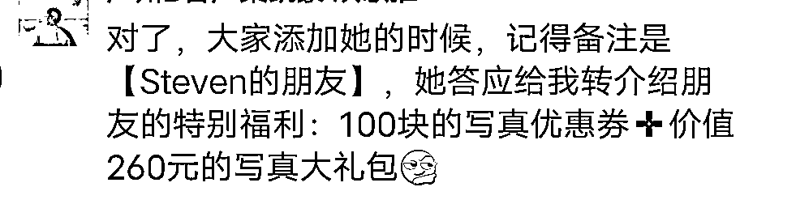
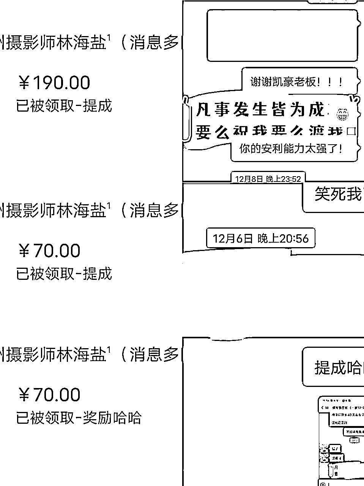
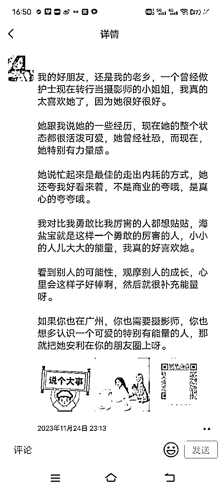
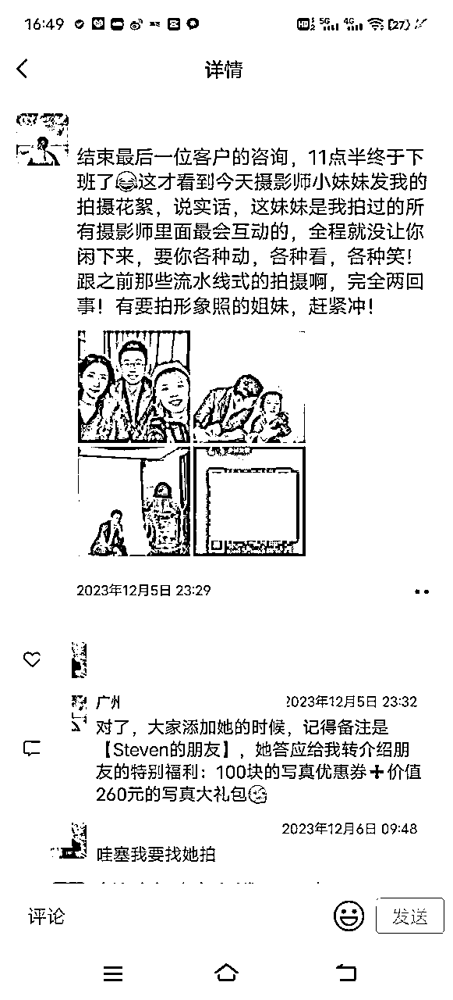
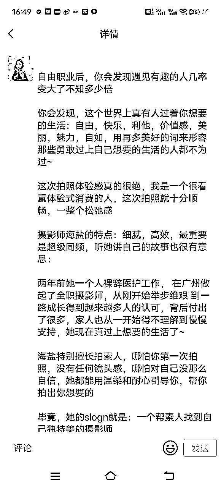
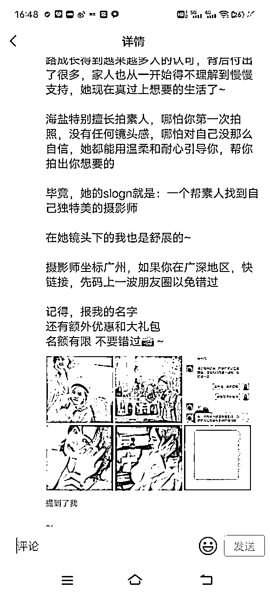
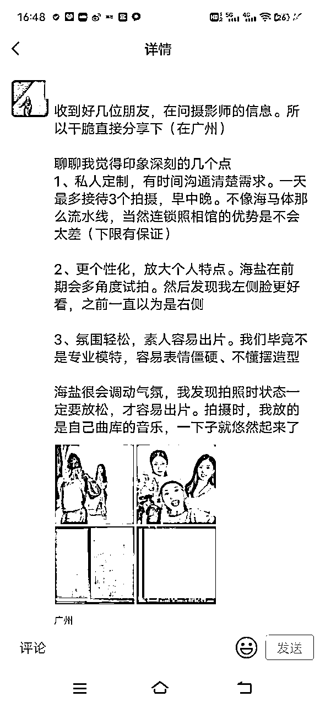

# 客户消费后，如何引导客户发圈2条，成交近1万？

> 来源：[https://dqez6wornz.feishu.cn/docx/WJPddShXfoXqaNxjSurcXEMvnMf](https://dqez6wornz.feishu.cn/docx/WJPddShXfoXqaNxjSurcXEMvnMf)

见帖欢喜，我是广州摄影师海盐，线上聊千遍，不如线下见一面，线下的魅力太强大了

通过不断的线下面积以及链接，也有很多各种社群的合伙人以及圈友来找我拍照，所以最近也有不断的在裂变成交

今天想和大家分享一下，我是怎么引导客户发圈2条，营收近1万？

今天我分享一下我做对了什么，分3点介绍。

# 1-付费就是最好的筛选。

比如我加入很多的付费社群，付费社群本来已经是高质量高付费用户的人群了，基于这个条件，如果自己又有产品的情况下，并且自己的产品能够满足很多人的需求的情况下是可以有成交的机会的。

所以说当我们有了自己的产品的时候，一定要学习付费，一定要付费加入更多优质的圈子

因为里面的人有可能会成为你的学员，有可能成为你的客户，有可能成为你的未来合作伙伴，总之会有无限的可能，还有一个很好的好处就是不需要解决信任问题，因为有了圈子的背书，所以基本只要解决产品问题就ok了，就是你的产品是否合适对方以及对方是否有明确的需求？这个很重要。

# 2-线上聊千遍，不如线下见一面

能面基尽量线下面基

都说线上聊千遍不如线下见一面

加入玩赚合伙人，我大概参加了三次的线下面基，每一次的面基都会给我带来成交，每次成交金额大概在700~5000左右，所以基于以上我也能够越来越感受到线下的魅力。除了交流的更加深度，而且感情也会更加深刻，并且也会给未来带来很多的合作机会，同时也埋下了很多的种子用户。

# 3-学会用小成本，撬动大资源

老客户带老客户真的很重要，也节省了很多的营销成本。

因为我自己是摄影师，所以我对自己的小成本就是但凡来找我拍照的每一个客户，我都会做这么一个转化裂变动作， 就是利用送精修去引导客户发圈，比如说我的那么多好评，其实都是用精修去裂变的，我的一张精修价值100块钱，对方发一条朋友圈，对方就可以得到一张精修

比如帮我发小红和书朋友圈好评又可以得到两张价值180的预告，这些就是自己的小成本，非常小的成本就可以撬动很大的资源。

所以不管你是什么行业，可以思考一下对方需要什么东西 ，同时对你来说又没有很大负担和成本，这种就可以作为一个撬动资源福利品。

对了，引导对方发朋友圈有一个注意事项就是一定要给到对方cps，同时要给他的朋友福利，这样子别人才愿意加你

比如我的是给这个

成交的话会有10%的提成，成交一般我就会马上给对方，也也算是给对方的及时反馈。

（下面是cps部分截图）

下面这些是他们帮我裂变的部分案列

以上就是今天的分享啦，每次学会一样东西，我就要把它分享出来，因为越分享越得到。