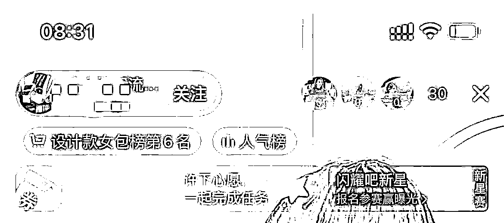
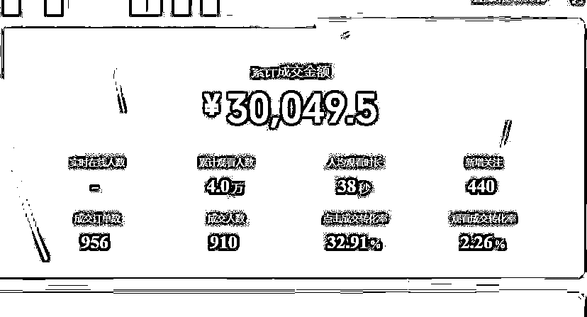
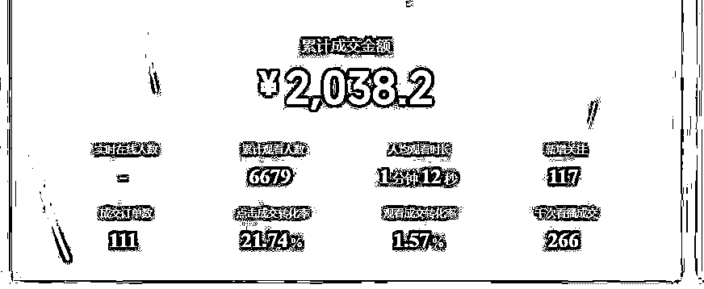
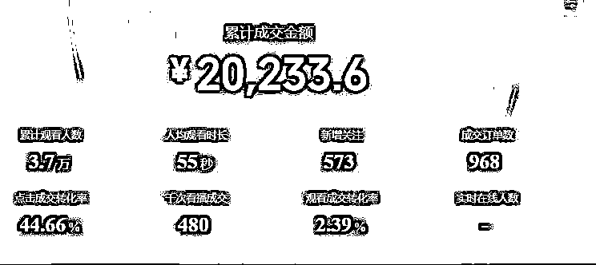
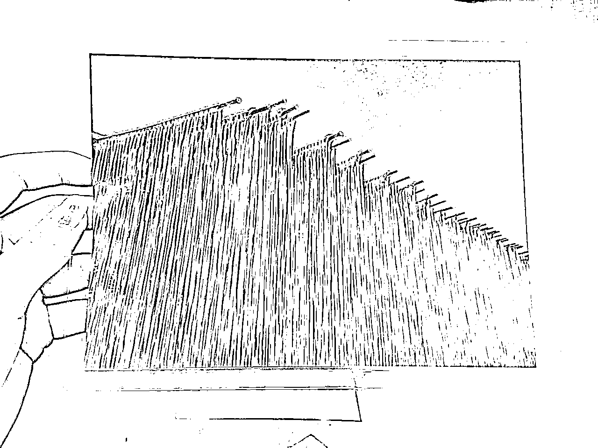
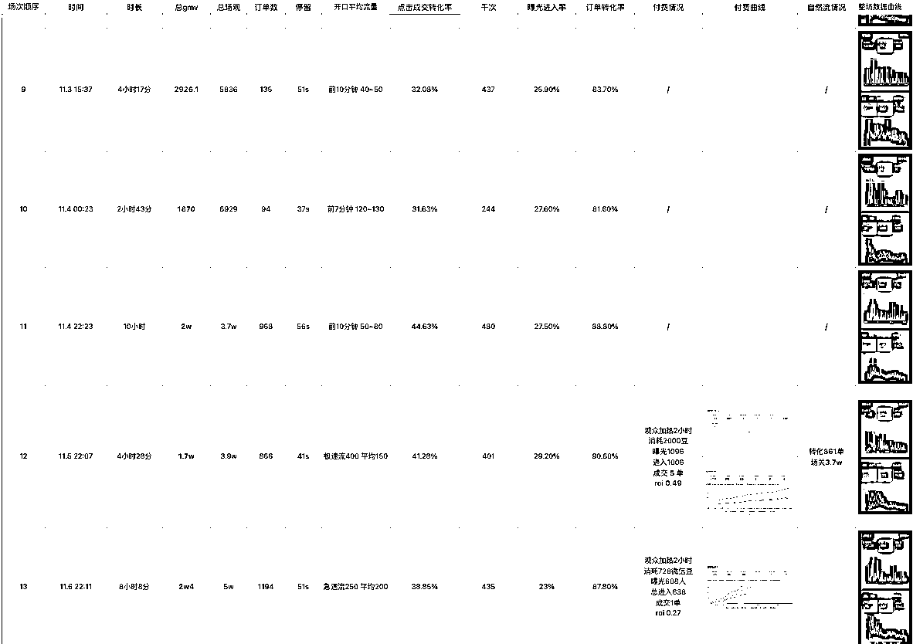
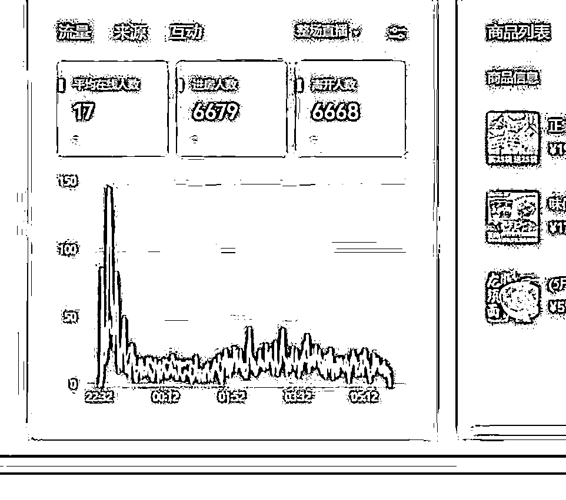
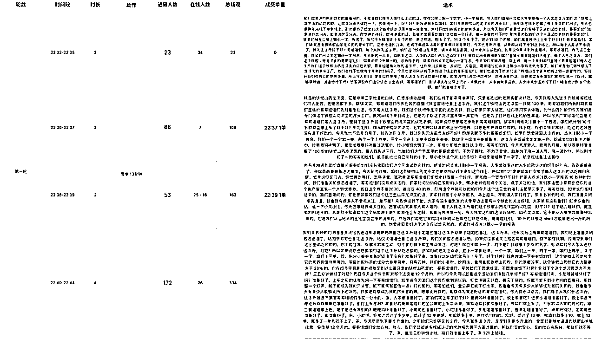

# 新手主播视频号0基础入局，20天自然流GMV25w

> 来源：[https://v18div0oa7.feishu.cn/docx/X9i3dlcDioCQuRxe6I7c5H6NnPe](https://v18div0oa7.feishu.cn/docx/X9i3dlcDioCQuRxe6I7c5H6NnPe)

大家好，我是董小姐，今年2月份加入生财的新圈友，特别感谢 @苏夏 的介绍，帮我认识生财，打开了新世界的大门。

加入生财伊始，参加过两次航海实战，但是面对生财里海量的信息，我有点懵，不知道自己能做什么，或者哪个项目更适合自己，所以一直没有坚定地选择某个项目深耕，更多的处于观望的姿态。

直到10月份参加了选品航海，继而链接到更多的高手，后来机缘巧合参加了 @Erik教练和@肖肖 教练的视频号进阶训练营，才让我这个新人主播拿到了正反馈。再次感谢生财这个开眼的大本营，也感谢@Erik教练和我师傅@肖肖。

在写这篇文章时，其实坦白讲，我是底气不足的。因为生财里动不动就是百万千万的项目，我这点成绩不足挂齿（甚至在大佬面前都不能说是成绩）。但是我又特别想把自己从0-1做视频号的经历分享出来，把我走过的弯路和我认为做对了的事讲出来，说不定能帮助到一些人少踩坑，或者更快的拿到结果，也算是功德一件。

## 我的项目经历

我毕业于中国传媒大学编导专业，北漂6年，曾就职于新东方教育集团，主要工作是做素人老师IP孵化，曾经在快手平台做到了单条作品5000w播放的成绩。

后因双减政策，离开新东方，回到了山东。在做了两年新手宝妈后，重新出山，从6月份开始，选择进入电商行业做直播带货，正式成为一名抖音女包主播。

### 抖音直播经历

初次接触直播，是缘于偶然在一个电商群里接触到一位大佬。当时他说想找主播带货，他们负责后端供应链一件代发。

急性子的我第二天就直接跑到了这个老板在河北白沟的直播基地进行了实地了解，然后立刻拍板决定干直播。从6月份开始，我就直接拖家带口在河北租房，从0-1开始在抖音播女包。

开始并不顺利，连续播了一个月都是个位数在线，直到换了第三个号，用尽浑身解数，尝试了高反，微付费等方式，终于在第5场把号拉起来了，当场也一口气冲到了女包带货榜的第六名。

可命运总喜欢开玩笑，我们不知道意外什么时候会到来。刚稳了10天号，一件意外就让我的首段直播经历宣告终结。

我每天都是5点就早早直播，所以总是第一个到直播基地，但是正巧那天帮我开门的人没睡醒，各种打电话都没人接听，我又不想断播。（之前听网课上说，断播对新号影响很大）于是我鼓足勇气，毅然选择了翻墙进去……结果，不慎受伤，诊断结果是右脚后跟粉碎性骨折。

没办法，当天就回山东做手术了，也中断了我的第一段直播之旅。

在抖音上直播女包，前后加起来大概播了有2个月的时间，现在回想起来确实踩了很多坑：

1.  只看到别人赚钱，但自己看不懂整个项目逻辑，就拖家带口匆匆入局

1.  各种设备买全套，装修直播间，俗称：差生文具多

1.  直播每个板块怎么做，怎么迭代一无所知

1.  着急拿结果，丢了西瓜也丢了芝麻，给我的性格好好上了一课

虽然这段经历失败了，但是也确实让我成长了很多：

*   面对直播间个位数在线能保持状态持续播下去

*   面对镜头变得很自洽，有镜头感

*   最后也让我深刻认知到，直播不是一件容易的事情，想要做成，还是要系统的学习底层逻辑，不能打无准备的仗

### 视频号直播经历

养伤期间，还是念念不忘直播这件事。在家闲来无事，报名参加了新一期的生财航海。

航海期间，通过生财航海的选品特训结识了@Erik教练，但是其实我并未怎么没听过教练的课，只是恰好当时看到教练也有做视频号教学，便下场开始实操。而且当时大家也都说视频号是风口，我觉得机会在眼前，人OK，项目OK，直接就开干了。

事实证明，我是努力的，也是幸运的。

在视频号前后一共直播了20天，纯自然流直播拿到了GMV25w的结果，但光鲜数据的背后，确实异常曲折的经历：

*   从前三天，每场直播4小时以上，场观不过百，场场GMV挂0

*   再到中间，一句句优化话术，复盘，不断打怪升级，场场GMV2w+

*   最后遇到第二个爆品，第一场纯自然流拉爆，第三场破5w

能拿到这些正反馈，最离不开的就是@Erik教练和我师傅@肖肖，真是的保姆级教学，喂饭到嘴里，让我体会到做项目只要你跟对人，选对赛道，再加上足够的执行力，那成功的机率也会大大增加。

* * *

## 如何做好视频号直播

下面我会来详细复盘一下自己在视频号直播起盘的心得，从选品、直播间内容、运营复盘这三个角度逐一拆解。

### 选品

直播带货，核心是你这个品别人愿不愿意买单，所以选品是最关键的因素

这20天的直播时间里，我一共播了3个品：第一个品失败，第二个品200块微付费起号成功，第三个品第一场就自然流一场拉爆。

1.  荞麦面

这是做的第一个品，但是完全没有正反馈。后来连续换了2个号，播了几场4个小时以上，都是各项数据不达标：场观低、单量少。没办法，我开始从人货场上找原因。

先把自己播的回放发给给@Erik教练和我师傅@肖肖都看过，他们都反馈说我播的不错，那人的因素可以排除。

场景上，我自认为比视频号上其他做面食的是有优势的。那根据排除法，失败的原因很大可能就是品，以及号的权重，那就继续换品尝试。

1.  铁棍山药龙须面

这个品当时已经在视频号很火了，有很多直播间都在播，已经能确认是爆品，剩下的就是要看在人货场上怎么下功夫打败同行。

因为这个品的话术与荞麦面相似，我当时已经对话术很熟悉了。于是第一场就直接微付费起号，之后经过螺旋递增和各项数据的优化，后面每场基本可以稳定在自然流GMV2万左右。

1.  柠檬无骨鸡爪

这个品是我师傅@肖肖 告诉我的，因为前一天有几个新号都出了不少单。当时我想着，师傅说大概率能爆，应该错不了。

于是立刻行动，1个小时内买样品，布场景，准备话术，拿着刚注册号的新号就开播了。结果比我预期的还好，第一场纯自然流就拉爆，最后GMV3万，出了一千多单。

后面继续播，第三场做到了GMV5.4w，也是纯自然流。

20天的时间里，我一共就打了3个品，但是让我在选品方面有了一些总结和思考：

1.  荞麦面的受众窄，在本身流量不是特别大的视频号，就会比较难爆，但是放在抖音就可以

1.  山药这两个字，天然符合视频号人群的胃口，再加上家家户户都会吃的面食，最起码会好出单

1.  短期爆品凤爪，只要行动力够快，直播能力够，真的播起来会很省力，用80分品匹配60分主播，也能拿到正反馈

1.  应季爆品、热点爆品，确定性强，但是周期短，同时需要团队的行动力比较快

1.  低价高佣品好做转化，相对来讲容易爆，这种品更适合新手去操作，容易拿到正反馈

1.  要么选受众面广的产品，不需要教育，看到就知道心理价位预期是多少，你价格低，就会有很大机率会买单；

1.  其次选的品，目前竞争度怎么样？现在入场时机晚不晚？近期销量怎么样？都需要综合考量

选品定生死，从知道到理解，再到实践中感悟，真的不一样

### 直播间内容

选好品之后，我们主播怎么做好线上销售员这个工作？

设计好直播间的内容和更新迭代就变得很关键

我从第一场直播的2000GMV，到第十场直播20000的GMV，实现了十倍的提升，这里的核心调整就是我对直播内容的精细优化和迭代。

而具体的提升内容，有主播话术和直播间场景和直播节奏这三部分。

#### 主播话术

讲话术的原则：有理有据、有主题。话术是一门艺术，所以销售才有好坏之分。

而我们在设计话术时，可以把话术分为浅层话术与深层话术两个维度来分别思考：

##### 浅层话术

直播间的停留、互动、转粉、灯牌 ，就是你的浅层数据。

浅层话术的主要作用是做人气数据，直播间变得热闹点，人都喜欢凑热闹，冷冷清清的实体店，谁也不愿意进去。

1.  停留

停留是一切数据的王道，先有停留再有成交，要想方设法让别人愿意在你的直播间待着不走。最好的停留就是，你的直播间有福利，甚至是给别人感觉，人人都可以拿到这个福利。

1.  互动

最开始我对互动做浅层数据有特别大的误解，认为只要有成交就可以了，但这是玩自然流的大忌，而且互动话术影响新粉的停留，也是影响成交的重要指标。

思考：如何能够让别人心甘情愿给你互动？

答案：有利可图，或者失去心理等等

举例：

后台，咱们最大的额度的优惠券是多少，40对不对，没问题，直播间里的哥哥姐姐们，今天点了关注 飘了666的， 全部给每人送一个40的券，是我的一个心意，真金白银的送给大家，没有点关注 飘了666的，只能够按照我们之前的价格买了

今天试吃名额不多，直播间多少多少个人，运营给我统计前多少个飘了小1的家人，都让他们多拿几斤去试吃，多了不要统计，就统计前10个。

感受下这几段话术，当你掌握人性的底层逻辑，会更好要出互动。

1.  塑品

把品塑好，直播间也不会容易掉人，从而帮助拿到停留数据，塑品也能最大程度的洗人群。

思考：卖这个品的人这么多，凭什么让别人在你这里下单，有什么不一样？

答案：提炼核心卖点 （无中生有，有中选优）

我以山药龙须面举例，比如要打造的一个卖点是纯手工制作，如何进一步增强信任呢？

我用了图片做塑封展示（耳听为虚眼见为实），我在百度直接找了图片打印出来，阿姨们看到可能会信任感更强，而且每次展示图片的时候，由于好奇心的缘故，这时候不会掉人，无形增加了停留。

##### 深层话术

深层就是指的转化，那作为一个主播想要达到高转化的核心是什么？

答案：巧妙运用用户害怕失去的心理去逼单

深层话术设计原则：稀缺塑造+价格对比+顾虑打消+下单引导+切单倒计时

稀缺塑造

*   产品数量的稀缺

*   产品优惠的稀缺

*   粉丝限定稀缺

价格对比

*   之前价格pk今天价格

*   保价承诺

*   福利叠加（买一罐送一罐）

顾虑打消

*   运费险

*   发货速度

*   现货

下单引导

*   手把手引导客户（非常有必要）

切单倒计时

*   切掉库存再拉一波转化

*   倒计时逼单

#### 直播间场景

在视频号上，人和货都确定的情况下，能做大改动的就是场景了。

我师傅@肖肖之前提过一个观点：80分货 70分场 60主播，因为新手主播做视频号直播，在直播能力没有办法短时间内快速提升，所以从品和场景这两个维度下功夫，也能取得不错的反馈，所以我也特别重视场景的打造，在场景上调整过很多次。

如何找到高转化的场景呢？我的方法就是借势，然后不断测试看数据再调整优化。

还是以铁棍山药龙须面举例，初始的场景布置灵感来源就是用借势思维，在各个网上搜产品的图片（百度 抖音 拼多多 小红书）

但是这样的场景，真的是审美好吗？

当我们把场景打造完之后，要根据曝光进入率判断，场景是否还有优化调整的空间。

比如我上面做的场景，其实数据并不算特别好。后来我分析原因，这个场景可能不太符合视频号人群的审美。于是我用了5分钟的时间重新布景，围绕着接地气，真实食材，厨房用具这几个元素，搭出了一个新场景。

调整之后整个曝光进入率到了30%左右，而且点转也比之前高，最终就固定下了我们现在用的场景：

#### 直播节奏

主播明确知道自己在每个时间点上该做什么事情，说什么话，讲什么品，并且按照一套有逻辑的话术框架去循环，就是直播间的节奏，分为憋单和平播

1.  憋单节奏

自然流玩憋单核心是对流量的感知力，这也是主播的终极能力。

坦白讲，这个实践起来有些难度。

所谓的憋单节奏，在我理解的就是：我们在什么时候该说什么话，憋单憋多久，到什么程度开单，逼单多久，什么时候封单。

当我们直播间在线人数低时，核心要点：做好停留（不讲废话，福利一目了然），靠点对点为主做转化，这里的核心有一点很关键，不要上固定的循环话术。

因为当你的在线只有几个人时，一个一个招待她们，从破冰开始、聊天、抛福利、塑品、直到成交，这样才能把流量的效率发挥到最大。

当我们在线人数上升时，进行产品卖点细节塑造拉时长，继续叠加在线人数，让更多的人在你的直播间待着，跟你互动，利用塑品内容和浅钩子洗掉你圈进来的人群，通过互动测试出精准想购买的意向人群，然后再开单。

常规的憋单节奏是：福利 -> 痛点 ->卖点 -> 报价（循环♻️）-> 上车

1.  平播节奏

不是所有直播间都有资格做平播的，在我看来有三种情况特别适合平播：

1.  前端短视频爆了，通过短视频进入直播间，打开链接不卡库存不憋单，高意向精准用户直接卖货

1.  短期爆品，或者极致性价比的产品，例如盐，例如口罩，那咱就打开库存 敞开卖

1.  付费平播，成交稳定流量稳定，话术重点在于塑品逼单，可以卡库存微憋单，或者链接全开直接卖货

### 运营复盘

做好下播后复盘，能清楚的知道每场直播的问题出在哪里，下次该怎么优化调整，把复盘做好了，进步的速度飞快，一天一个变化。

一开始时，我的复盘是这样的，非常简单，只做了表面的数据复盘，没有做深度的复盘：

直到有一场播的很拉垮，给了流量但是没接好，于是我开始做深度复盘。

深度复盘要记录分析的很多要很细致：

每分钟进了多少人，说了什么话，做了什么动作，在线多少人放单的，憋了几分钟，放了几分钟，转化了几单，放单最高的那一轮说了什么话。

把这些数据变化罗列出来，问题一目了然。

这时候我才知道我的节奏出了很大问题：人来了一大波，我还在自顾自的逼单，就像实体店来人了，你根本不搭理人家，人家凭什么在你这里停留。

通过一次次的复盘能找出来的问题：

1.  直播节奏

1.  有效话术和无效话术

## 视频号直播的感悟

最后讲一下过去一个月做视频号的感悟吧：

1.  视频号直播和抖音直播相比，我个人感觉还是对新手和小白比较友好的，没有那么卷，先不说拿不拿到大结果，但是挣点小钱对普通人，完全没问题

1.  现在的视频号，还是有一些红利在的，比如说做私域、数据不透明、付费玩法、机制不成熟等等，还是有很多机会

1.  现在入驻视频号的商家和头部还不是很多，所以如果我们是品牌方，那现在一定是入场的最佳时期，提前在蛮荒阶段就布局，能够有更多的机会

1.  视频号背靠微信有10亿公户的体量，未来有成熟私域团队运作的，一定大有优势，获客成本低，复购率高，而且利润高；

### 

最后，特别感谢生财这个平台，让我打开了圈子，提升认知。

俗话说，千里马常有，而伯乐不常有。如果我能在今后的职业生涯中有那么一点点小小的成就，或者一点点突破的话，那么我更应该把功劳归功于各位慧眼识才给我帮助的伯乐们。

而生财这个平台就给了像我这样的新人新的机遇。在这里汇聚了来自五湖四海的千里马和伯乐们。

另有一句俗话说，是骡子是马拉出来遛遛，但是巧妇难为无米之炊，而生财就像是一个跑马场，给我们提供了施展拳脚的广阔天地。

笔直的跑道直插向天际，落日的余晖染红了大地，天上的启明星为我导航，远方的号角已经响起，激烈的厮杀已经来临，而我已扬帆起航，目标是星辰大海。

以上，新人主播，董小姐。