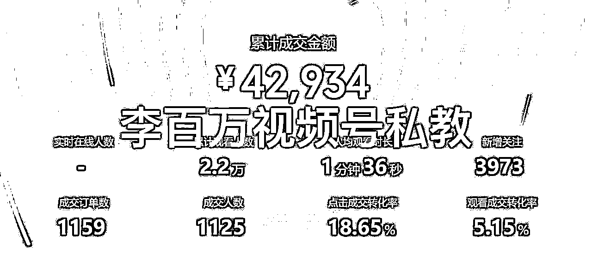

# 普通人单日利润过万！视频号滋补品类打法保姆教程

> 来源：[https://vxqm3o3stzd.feishu.cn/docx/ZHUrdfZuEoDvhOxNeGgc3UEDnOf](https://vxqm3o3stzd.feishu.cn/docx/ZHUrdfZuEoDvhOxNeGgc3UEDnOf)

# 写在前面

大家好，我是以前的小李同学，有幸在生财和很多圈友的见证下一路飞速成长为现在的李百万。

今天请允许我矫情的先给大家说一说这一路历程，然后是拉满的干货。


（没有白走的路，每一步都算数）

一路曲折，终于店铺利润也达到了百万。然而在10个多月前，也曾负债数十万。信用卡网贷朋友那里周转，不敢逾期怕银行给家里打电话，拆东墙补西墙越来越多。朋友问家人问创业做的咋样？答：最近还行，再扯扯其他。也不知道是因为能力不足遮羞还是为了自我安慰，只知道迷茫的那阵子吃饭如嚼蜡。

连续多日整天整夜的失眠自闭，信用卡还款日，答应朋友的还款日都在一天天逼近。心力越来越少，内耗越来越多

家人又打电话，问这次创业到底真实情况如何？我嘴上熟练的敷衍，心里难受的不行。暗骂自己做为一个成年人他妈的活成啥了成天摆烂，就这么混吃等死？这么下去废了绝对没有退路

越想越不服气也不想就这么眼睁睁啥都不干的被生活打败。整理好心情，勤能补拙先从做事开始。视频号疯狂直播，不出单就使劲儿学，就找人问，别人都行我不可能不行，除非动作不对积累不够。疯狂买盗版电商资料通宵达旦学习。负债在逼近，亲朋也会关心进度。虽然仍旧心慌，但告诉自己肯定会好起来

目标坚定先行动，干就完了。终于，视频号从一开始的0到9.9元又到许久后的1902元，收益慢慢变多。正反馈了，视频号稳定后，小红书也出单了。慢慢偿还了负债手上还有小2000。那一天给家人转了红包，海边喝了3瓶啤酒。酒真他娘的好喝，人也感觉真他娘的爽！！！

原来人生还可以这样过，那天告诉自己，想要的要坚定拼命的争取。之后的旅程更跌宕起伏些，但是凭着韧劲儿披荆斩棘，还有圈友们的帮助也取得了小小成绩。曾经在生财定下的目标https://t.zsxq.com/14GHOklv1也都提前超额达成了

未来很长，还需要持续发力。但，这一路成长，越发意识到人取得成绩除了靠外界环境，信息，资源，资金，人脉等。逆风翻盘，涅槃重生，哪怕只是小步进步更要凭自己想要改变并去努力甚至拼尽全力的努力！外部只能锦上添花，内部自己才是驱动力。

想象以前的失败，败给了放弃。直到这一次次，我发现，人生没有白走的路。每一步，别因为短期没结果质疑自己

而是去问自己有没有用尽全力！你我都是普通人，未来的命运牢牢掌握在我们自己手里。这一点也在很多圈友身上见证过。受益于生财，反馈于生财。未来愿与大家共同生财以及向上生长。

普通人就能实操的干货肝出来了，兄弟姐妹们，干就完了！

过往视频号经验贴文章：

https://t.zsxq.com/14e0f2XXd

https://t.zsxq.com/14do5ChH9

https://t.zsxq.com/14SG6hSOI

* * *

从2022年12月躬身入局到现在，团队先后尝试了混剪搬运玩法、剧情号带货打法、百货单品连怼连爆玩法等多种玩法，在做的过程中，我明显的感受到，随着平台规则的不断完善以及相应规则的调整，是没有办法实现“一招鲜吃遍天”的，玩法一直在更新、在迭代。

8月份至今，我们团队没有去打各类很爆的卡模板卡特效而是静下心来研究实拍，测出来一种新的打法。核心是围绕中老年人的健康需求来选品，滋补品为主（竹蔗茅根雪梨茶、秋梨膏，玉米须茶，各类花茶等等），在自己团队跑通拿到成绩后，也迅速赋能给过往的一些老学员，目前整体实操下来，玩法的收益还是很可观的，以下是部分学员的成绩截图：





最重要的是，这个玩法目前只要熟悉平台规则以及会抄，基本账号不会有太大的问题，视频违规是相对比较少的。所以账号的生命周期会比较长，一个账号多次爆量是可以做到的。

接下来就给大家简单介绍下这个玩法，主要会围绕以下几点去分享：

# 为什么要选择中老年人滋补这个赛道

## 第一：痛点足够痛，消费刚需

我们经常说，小孩要成长，老人要健康，女人要变美，这是几类主流人群的核心痛点，而健康类需求，属于马斯洛需求理论中的最底层需求“生存需求”，因此，这个痛点足够痛，越是消费能力高的人群，对健康就越重视。所以针对这个痛点，我们只要提供合理的解决方案，就能从中拿到收益

## 第二：用户群体广，消费能力高

在视频号上，中老年人的用户群体占比是非常高的，这个相信做过视频号带货的小伙伴们都比较清楚。同时，视频号的这部分人群，消费能力相对是比较高的，这意味着你可以做比较高的客单价；高客单价高毛利的同时，利润就会比较可观

## 第三：宽容接受度比较高

中老年人对于视频号、直播带货这些是天生充满好奇的，因为之前接触的不多，所以要求也不会太高。在视频号上发表视频，不需要你有非常精美的画面，接地气反而更能和用户拉近距离，在视频号直播也是，基本你照着话术读，就可以出单，用户的宽容度、接受度是比较高的

# 如何针对目标群体的健康需求去进行选品

实际上，健康是一个比较大的概念，视频号上那么多中老年人，大家都有健康需求，但细分的场景肯定是不一样的。

举个例子来说，有的用户的痛点可能是晚上睡不好觉，有的用户的痛点可能是经常咳嗽痰多、肺不舒服，而有的用户的痛点可能是身体抵抗力差，容易感冒。可以说老年人从头到脚都是问题，针对人群的不同细分需求，我们需要有不同的品去对应解决。那如何选品？如下。

## 选品方法（电商7分靠选品）

### 第一种：蝉妈妈选品

视频号虽然没有选品软件，但平台与平台之间的用户是重叠的。我们完全可以参考。

#### 关键词找品


搜索关键词：秋季滋补，滋补养生

根据弹窗可以看到近期热销品，然后在视频号通过搜索关键词&蝉妈妈搜索关键词给出的产品名，给类似的视频点赞、评论，让系统识别到你是一个对该类视频感兴趣的人，给你的账号打上标签，后续你就能不断的刷到类似的视频或者是类似的直播间。在刷的过程中，慢慢的你就能发现市面上的人都在卖什么货、他们是怎么卖的、 他们的细分人群是哪类，慢慢培养自己选品打品的感觉


以上两个品是我们9，10月份真实打过的品，在秋冬换季时的季节品，非常受中老年人欢迎～

### 第二种：视频号选品中心的爆款商品榜

我们也可以借鉴视频号自带的爆款商品榜，开通视频号橱窗之后，拥有带货权限后，点击去选品进入选品中心--点击爆款商品榜--食品生鲜饮料冲调类目，这里也有一些不错的适合老年人健康的品，可以进行参考，或者直接搜索老年滋补品、老年人养生也可以


```
因为专注于滋补类目，所以我的选品方法简单粗暴，实践下来也算是行之有效。
```

# 如何通过实拍来复刻爆款视频

选到品之后带货视频怎么做？关于带货视频，我们团队现在是走的实拍路线（混剪起号的概率低违规多但仍然可行），所有素材均为自己原创，实拍看起来前期成本高，实际上长期来看学会了拍摄能力也有了爆款脚本感知力，性价比要比搬运混剪高些。而且原创不卡封面不卡特效给到的流量也是非常可观的。


这个时候会有小伙伴问了，那我不具备实拍能力怎么办呢？

很简单，先抄再超，这是我一贯的原则。在我们自己完全没有经验、没有头绪也没有那么强的能力的时候，最好就是从模仿开始。如果你不会实拍，很简单，找到你的对标账号，看看他们是怎么拍视频的，然后1:1像素化模仿就可以，别人怎么拍，你就怎么拍，前期不要做创新，跟着市面上已经出的爆款模仿就可以，如果你能完整复刻出一个爆款视频，那么意味着你已经成功了一大半。上面的数据就是我的新手学员做到的。这些数据带来的流量都产生了最低1万的净收益。

那找到对标账号后，具体该如何拆解呢？这里给大家几个方向

## 1.拆解画面内容

看他拍了哪些画面内容，前三秒的画面要重点看，每个画面放了多长时间，是什么角度拍摄的？画面整体给人的感觉是怎样的，画面中有没有特殊的道具

## 2.拆解画面文字

视频每一帧的文字是怎样的？易违规词有没有做特殊处理？各个文字的大小颜色是怎样的？

## 3.拆解文案

看爆款视频的文案是写了什么？开头说了什么，中间说了什么，结尾又说了什么？文案的字幕有没有做特殊处理？

## 4.拆解语音

这个语音给人的感觉是怎样的？声音有没有经过特殊处理？

## 5.拆解发布相关

对标账号一条发几条视频？发布的时间一般是什么时候？两条之间间隔的时间是多久？

注意！！文案脚本我们一般是直接复制爆款视频的同款就可以，核心要做的事情是：把爆款视频的画面内容替换成自己实拍的画面

另外滋补类的产品在实拍的时候，有些品有煮沸的场景，这时候注意不要让水蒸气沾到我们手机镜头上，否则拍出来的视频会影响视频的效果呈现。

在拆解完爆款视频，并按照其对应画面拍摄完自己的素材后，就可以进行视频剪辑了

1.  将原视频的爆款音频分离

1.  将原视频的画面不同画面分割切成不同的小块，然后对应把我们自己的实拍素材替换上去

1.  将原视频的文字、字幕复刻补充上去

然后进行导出就可以，这样就完整替换了爆款的视频的画面，而又保留了原视频的脚本、音频等

# 视频爆量后如何进行直播带货

## 带货权限开通

目前的视频号如果需要开通带货权限，除了缴纳保证金之外，需要额外满足要求，以下两个要求满足任意一个即可开通直播带货的权限。有效关注人数1000人以上，即1000粉丝关注或者开通视频号小店

建议大家不要自己发视频去涨粉，那样效率太低了，找市面上的买粉服务，成本200多，如果不想买粉低成本有带货权限的话，可以开通视频号小店，开通视频号小店的话，相对千粉来说，成本会低一些，但是流程会复杂一点，以下是具体流程

个体工商户营业执照注册

直接去淘宝搜索即可，个体户营业执照用个人身份证就可以直接注册，且网上代办可以直接帮你办完，你不需要自己跑线下，淘宝的价格一般是50元左右（注意千万别买贵了，要几百块的都是割你的），有些店铺搞活动期间，十几块、二十几块都是能办到的。办证所需要的时间一般为1天左右，办证的时候范围直接选全范围即可（但是不要选需要特殊资质的）。同时，你不需要拿到纸质证明，让对方办好后，给你拍一张清晰的照片过来即可，我们注册用照片就好了

营业执照办好之后，接下来开始开通视频号小店

进入创作者中心-带货中心-视频号带货官网-商家入驻-提交商户营业执照信息


注意：第一步商户信息提交完成后，大概需要等10分钟左右就会看到审核结果（并非他说的7天，没有那么长时间）

然后进入下一步，签署开店协议

协议确认完成后，填写店铺信息，包含头像和名称（后续都可以改），店铺类型选择个体店，品牌和肖像信息不用管

提交审核信息后，耐心等待10分钟即可（也并非他说的要3-5个工作日）

一般没什么问题的话，视频号小店就开通完成了，缴纳保证金之后就会具备直播带货能力了

1.  直播前准备

第一，最核心的要保证自己的网络通畅，保证直播过程中不卡顿、不断播，断播对流量影响很大，要做到不断播

第二，保持手机电量充足，且保持充电线随时在身边，方便手机随时补充电量，因为有时候直播可能会长达十几个小时甚至全天24小时

第三，建议多准备一台手机，来检查自己的直播间是否OK，包括自己的直播封面、直播声音是否清晰、直播是否卡断等等

1.  开播标准

目前判定是否开直播进行带货的标准是：看视频跑量的流速。如果你在发布视频后很短的时间内（半个小时内）就达到了3000的播放量，那么就可以直接开播。视频虽然跑的慢一点，但是也跑到1万左右，就可以开播了，这样的视频一般能跑到30w左右的播放

1.  开播前预约

我们在发布视频后，如果暂时还没有马上开播的想法，那么就一定要做好直播的预约。会预约你直播的一定是已经被你之前的视频所种草，有意向购买你产品的人，那么在我们开播后，他就能立即收到开播提醒，这种情况下大概率会点进来，然后进你的直播间被你转化

1.  直播间样品准备

针对中老年人的滋补品，不需要豪华的直播间，但最好在你的直播间里面摆上样品，方便后续介绍产品的时候，让用户所见即所得，不想露脸的可以在直播间放一个转盘，保持直播画面一直处于非静止状态

1.  直播间氛围打造

在我们直播时，要学会打造直播间的“热卖”氛围，可以让你的朋友用小号帮你在直播间评论区发“已拍，加急”，营造出一种大家都在买的氛围，提高直播间的转化率；同时，开播的时候，直播的标题也可以写：“视频同款热卖中”，利用热卖氛围吸引用户进直播间

1.  逼单话术

在讲完产品的卖点之后，如果用户已经被你种草，这个时候就可以进行逼单，一般话术为：“想拍的哥哥姐姐们要抓紧时间了，咱们现在只有3单库存了，我们还有5分钟就要下播了，没有抢到的赶紧去抢，过了今天就没有福利活动了”，让用户感受到活动促销的紧迫感，提升直播间转化率

1.  直播话术

特别注意：

直播话术这块需要磨，因为滋补类的产品，一旦讲不好就比较容易违规。最好的方式还是去蹲守同行的直播间，看看同行的直播话术是怎样的，把他们的直播话术直接拿过来1:1用，千万不要自作聪明自己改，否则一不小心就容易违规，同行的话术都是经过验证的，相当于帮你找到了正确答案，没有必要自己冒着违规的风险去创新

常见的违规词如下：养生、疾病、吃药、对身体有xx的作用等等

滋补类的产品，千万不要直接去讲功效，不要直接去说对人的身体有什么好处，将问题也不要直接讲出，比如讲市面，不要直接讲视频，而要讲：晚上翻来覆去的睡不着，似睡非睡，一晚上只能睡2个小时，用另外的相对合规的话术讲出来，直播间才不容易违规

1.  直播带货实现睡后收入的技巧

有时候视频突然爆了，我们来不及直播，就会白白损失很多流量，针对这种情况如何进行补救呢？核心是个人简介+置顶视频+置顶评论

个人简介：举例如：感谢关注，感谢分享，视频同款商品在下方⬇️橱窗，点击可直接购买

置顶视频：制作一条视频，在视频中用一张图表明橱窗的位置，然后将视频进行置顶

置顶评论：在视频发布之后，自己在下方评论，如：

购买方法如下，有需要的家人们可以自行购买

点击左下角我头像进入主页

点击“商品橱窗”

找到xxx（产品名）下单即可

然后将评论置顶就可以

通过以上这三种方式，引导不会购买的用户到橱窗购买，可以实现一部分自助下单，不直播也能拿到收益

# 写在最后

1.  日拱一卒，终成大器

再好的项目，也不可能随便发一个视频就能爆，随便开一场直播就能收益过万，这不叫项目，这叫天上掉馅饼了。很多新手看到别人亮眼的成绩后，迫不及待的入场，抱着非常高的期望开始项目，结果发现过去了3天，一块钱都没能挣到，于是开始怀疑项目，怀疑自己，进而陷入无尽的内耗之中……

实际上，做任何项目，我们都会存在新手过渡期，都是不断的从菜鸟进阶成高手，吃瘪是少不了的，迭代优化也是少不了的。短视频带货，本质上就不是一个线性函数，并不是你第一天挣100块钱，第二天挣500块钱，第三天挣1000块钱，不是这个逻辑，他更像是：第一天不挣钱，第二天不挣钱，第三天还是不挣钱，第四天视频爆了，一下就能挣10000块钱。所以在这个爆单的奇点来临之前，请大家一定要沉住气，默默耕耘，岁月不负有心人的

1.  日日复盘

做项目，会复盘的人，成功的几率肯定要比别人高很多。不能说一块石头扔下去，没有一点水花溅起来，我们所有投入的精力、动作，都要根据他的实际反馈来进行优化。今天自己的收获是什么，今天自己踩了哪些坑，明天自己的计划是什么，我还能做些什么能让这个项目变得更好，都是你需要持续思考的问题。没有人可以帮你一步跨到终点，除了你自己一步一步走，学会复盘，能让我们始终走在路上

最后，感谢大家能看到这里，在做视频号的朋友也欢迎添加互相交流（vx：8453423）祝愿大家都能够生财有术～