# 数字人矩阵直播全流程，一个月躺赚10W+，一台电脑可以挂一千个直播间！

> 来源：[https://yalr0qngor9.feishu.cn/docx/XwSAd87RDoKkNex60Dxcx0fWnde](https://yalr0qngor9.feishu.cn/docx/XwSAd87RDoKkNex60Dxcx0fWnde)

大家好，我是糖豆豆，一个在网络行业摸爬滚打了近八年的老菜鸟。

### 我是如何发现百度数字人直播的？

今年十月份中旬，偶然的机会我刷百度APP，刷到很多数字人直播间，而且数字人直播间的出单量都很大，这激发了我研究的兴趣，经过多方的搜寻和查找，我终于了解到，这是百度的新项目，才上线了几个月的时间而已，目前是有流量扶持的，抱着试一试的心态我注册认证成功了一个百度小店，把数字人直播间挂上。

百度数字人直播有个好处就是不需要你挂直播伴侣，只要你在网页端设置预约好，定时上播下播，每天睁开眼睛直接查看订单量就可以了

直播间一开始挂上，有流量不出单，我就一直研究别人的直播间，同时也一直缠着小店客服进行咨询，客服说是我场景搭建的不好，我就去改场景，客服说我选品不好，我又去选爆品，

后来我上了一款爆品，一款切菜器，终于爆单了！

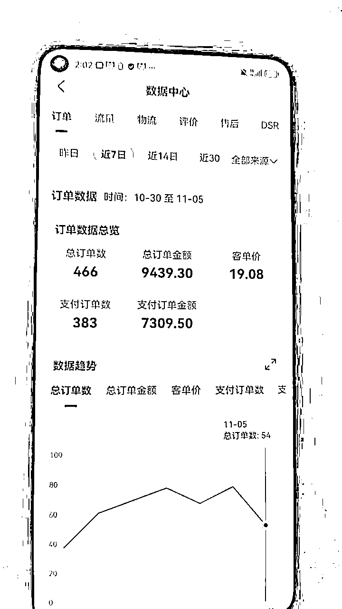

目前我运营了五十多个账号，账号的数据还是很不错的！

关键是数字人直播十分省心，目前玩的人不多，几乎是一片蓝海。

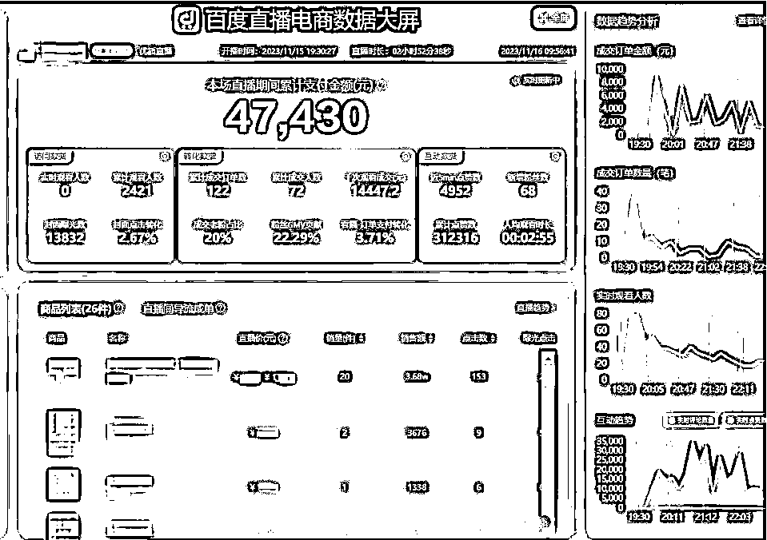

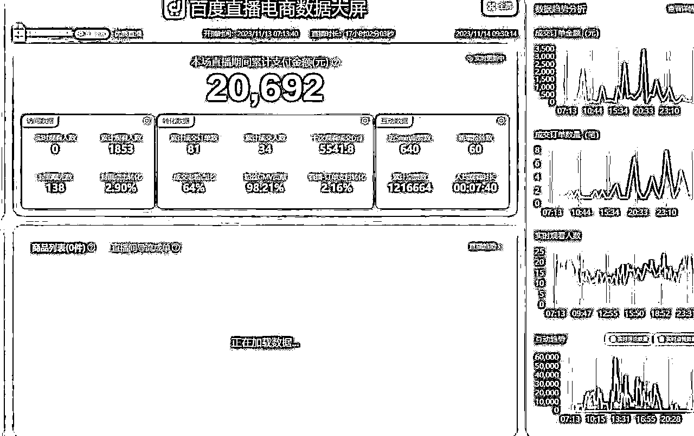

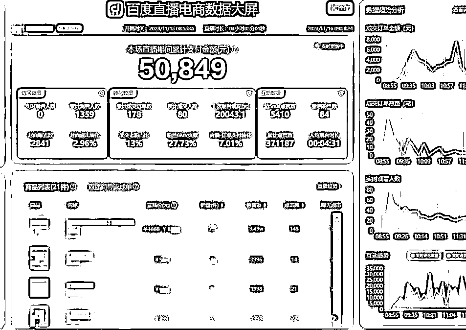

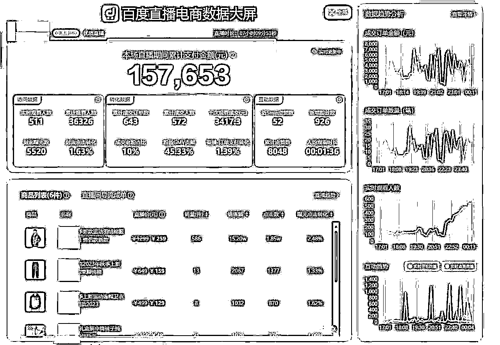

以下几个都是新起的账号自然流量的出单数据

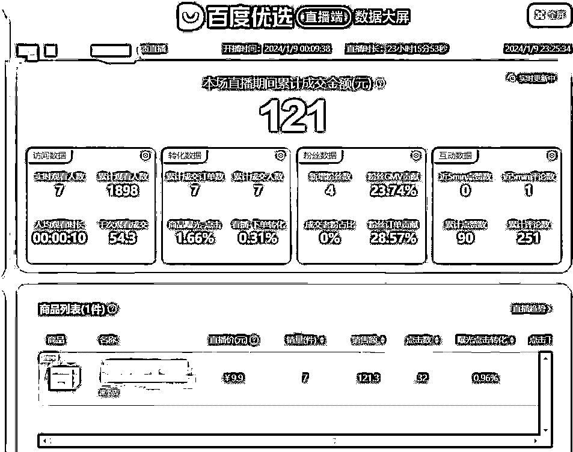

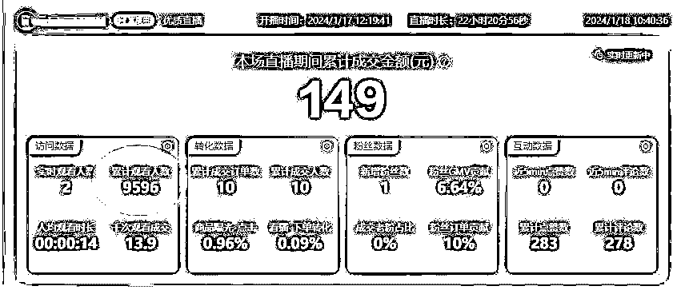

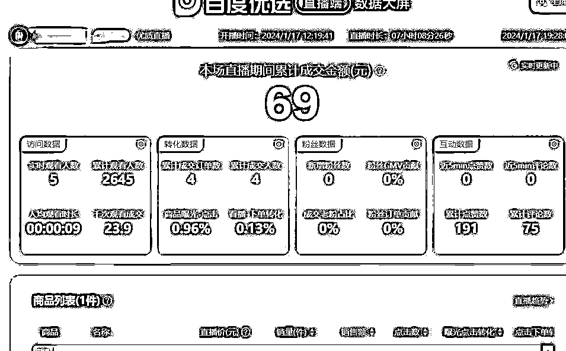

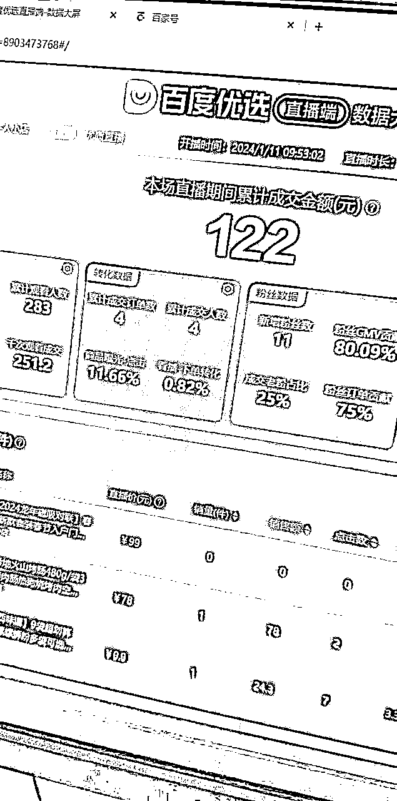

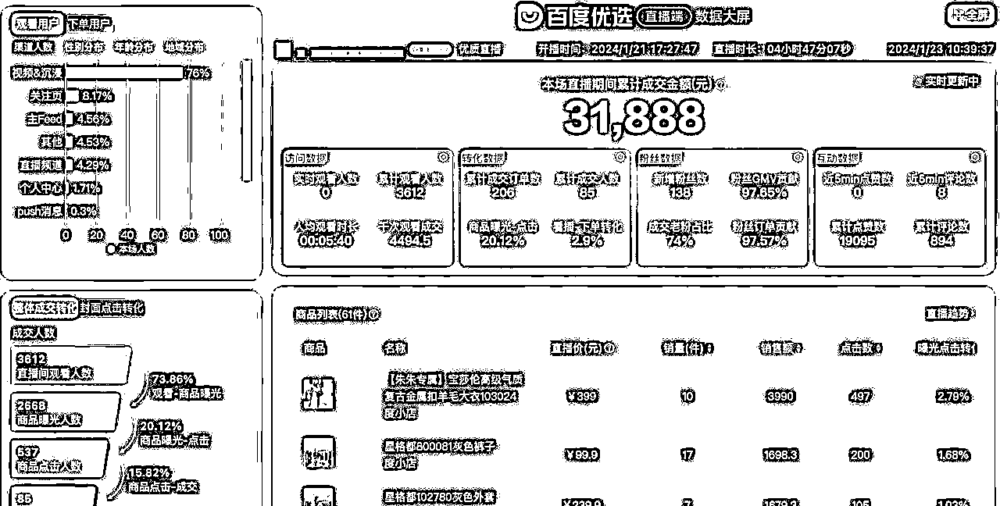

当然如果做流量投放，出单会更稳定

百度本来就是做信息流起家，流量投放的成本比其他平台更低，利润也更高！

目前已经有很多人在矩阵布局了

### 百度数字人的前世今生

这个数字人直播项目百度才推出不到半年的时间，他是第一个由官方平台推出的全网首个全栈式AI数字人。

百度从2010年就开始投资研究AI智能，可以说，百度在AI方面的研究和应用，全国范围来看，没有哪家公司敢说自己比百度更牛！

而且百度AI已经全方位应用到了汽车领域、金融领域、城市管理、医疗领域以及家居装修领域，市面上我们看到的大多年就数AI产品都有在使用百度智能云。

但是在直播领域很多人还不知道，百度已经有了自己专属的直播数字人。

你敢相信吗，这些全都是数字人在直播。

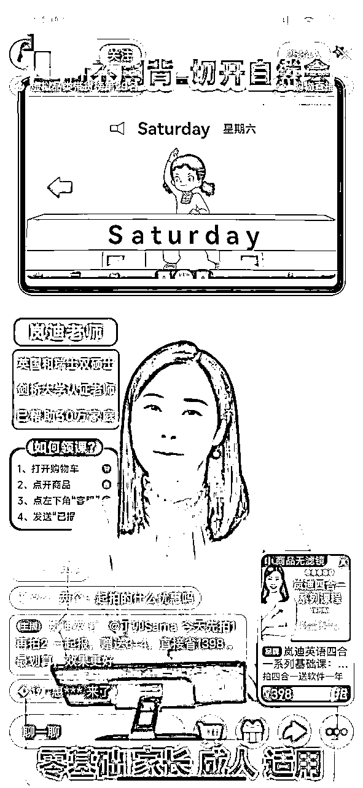

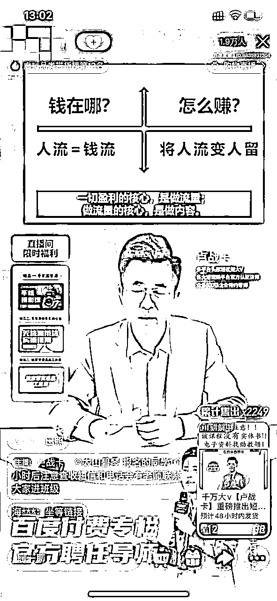

### 有人说百度现在已经没落了，现在没人玩百度！

事实上百度APP作为国民级应用，拥有庞大的用户规模和独特的用户心智，根据官方数据统计，百度APP累计注册用户已经超过10亿，月度活跃用户高达6.48亿,每天有60亿+的搜索响应量

同时百度旗下除了百度APP，还有微视、好看视频、同时还收购YY直播平台，所以百度流量仍然是十分巨大且不容小视的。

百度一直在做信息流广告和搜索流量，涉足电商时间比较晚，2019年百度才成立了度小店，2023年开始正式在电商领域发力，和抖音快手相比，在百度上开店的商家目前还比较少，因此目前还属于蓝海领域。

百度正式涉足电商不足四年时间，目前在电商领域每天就有一亿多人被种草

随着百度电商的发展，百度会更注重直播间的搜索流量，打个比方你去百度搜索某产品，百度会直接推送相应产品的直播间给你，让你对产品有一个更直观且全面的了解，所以对于百度seo的布局已经不仅仅局限在文字和视频，同时也要注重直播间的矩阵布局。

### 百度数字人都有哪些优点呐？

##### 百度数字人和目前市面上的其他数字人相比，有以下十二项优势！

第一：支持真人复刻，生成属于自己独一无二的数字人。例如你可以自己录一段出镜视频，上传到百度平台进行复刻，这样你就有了一个你自己的数字人分身。

第二：单账号支持多个数字人复刻，每个直播间可以自由换不同形象数字人进行直播

第三：支持真人录音、声音克隆，音色更接近真人。直播的声音你可以直接上传自己的录音。或者克隆自己的声音，生成属于自己的专属语音包，这样的好处是，只要你输入文字，就可以听到你自己的声音。

第四：直播间用户提问，数字人直接语音回复。就像真人在线一样，只要直播间有人提问，数字人就可以直接用语音来回复用户的提问。

第五：一键生成剧本，调取文心一言大模型一键生成直播文案。

第六：基于商品图片，一键生成直播间背景图，一键添加直播间前景贴片。

第七：超真实的数字人直播间，可大规模复制，矩阵布局

第八：也是最重要的一点：不占用电脑，网页云直播，一台电脑可以挂一千个直播间。

第九：只要一次设置好开播时间，一个月之内什么都不用管，定时上播和下播，全自动化开直播。

<h7>第十：一键生成口播视频，生成无数个视频，不限次数，不限时间。</h7>

第十一：支持在快手、淘宝等各大平台的直播间进行直播（内测中）

第十二：平台开发的数字人，不封号不限流，不用担心账号出问题！

### 同类数字人产品对比，百度数字人的优势！

这是我咨询的一家卖数字人卖的特别火的公司，

我们百度数字人的水平已经直达它15800这个最高金额的套餐

但是我们百度数字人的价格还不足他的十分之一！

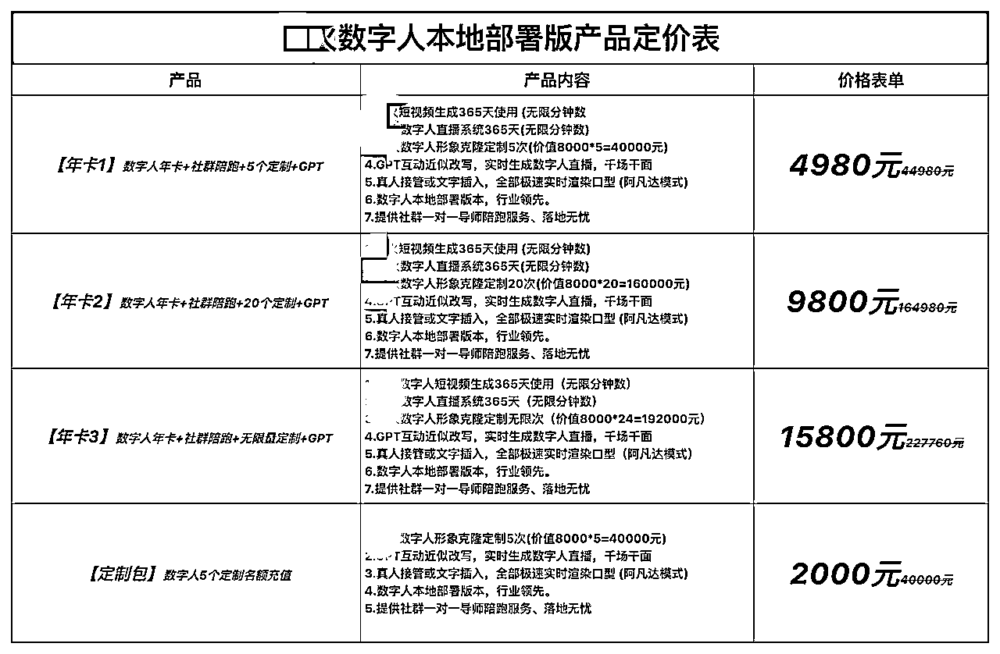

百度数字人的直播效果如何呐？

这个是官方给出的数据！

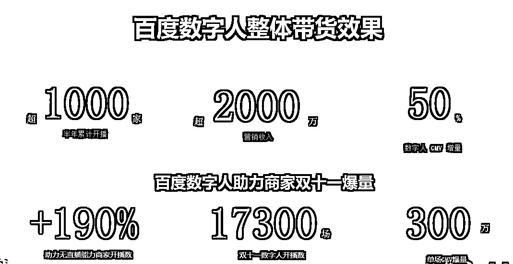

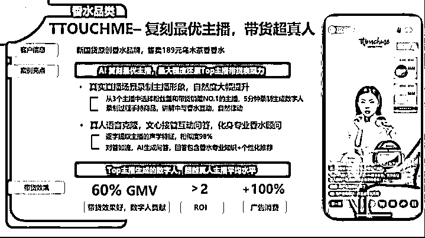

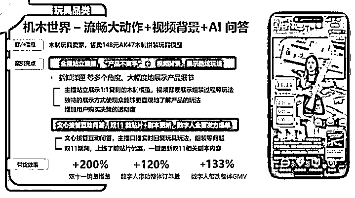

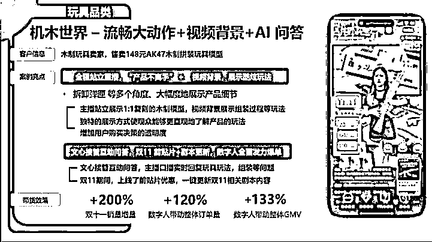

#### 如何打造一个高拟真度的直播间那？

真人录制五分钟的视频，录制过程中模仿直播间开播的一个状态，录制的时候一定要绿屏背景录制，

录制过程中做动作时，最重要的是不要遮挡脸部，因为数字人是驱动嘴唇来说话对口型的。还有很多注意事项，全是细节！我录制了一套详细的课程，想要学习的可以找我了解。

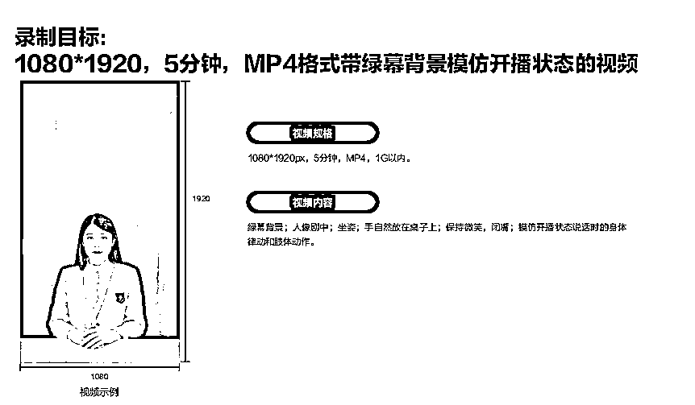

#### 直播间爆单的核心是什么？

无论是什么平台，直播爆单的核心都是一样的

那就是选品，选品还是选品，

选品在直播中所占的比重高达百分之70

我是如何选品的那？

我通过蝉妈妈，考古加、多多大师等多个电商数据分析平台，反复对比分析当下的爆品，

然后选出几十款产品，给自己建立了一个爆款品类库

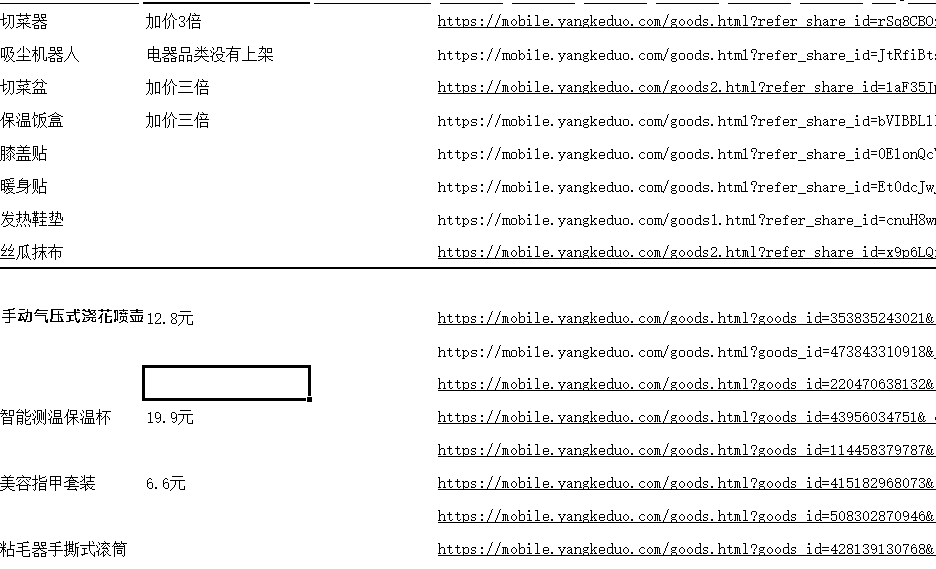

百度用户的人群画像以34-55岁的人群居多，大家也可以根据这类人群的痛点和需求进行选品。

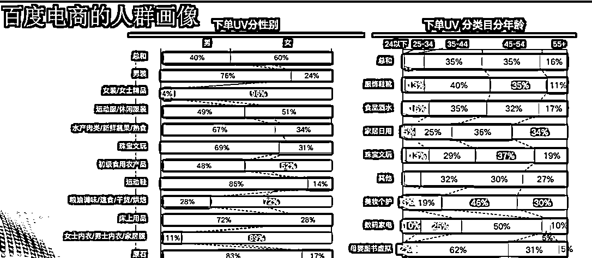

### 直播间流量其他影响因素！

影响直播间的流量的因素有以下几点，

第一：百度平台会给你的直播间进行评分，你打造的数字人直播间拟真度越高，越像真人直播间，用户进入你的直播间以后停留时长比较长，平台给的分数就会比较高，会给到你更多的流量。

第二：和其他平台的直播间一样，你的直播间出单率越高，能给平台带来变现和收益，平台就会给到你更多的流量。

第三：百度直播有14天的直播扶持期，直播的过程其实就是洗精准人群的过程，14天内能把直播间稳定运营起来，刷进直播间的人群相对来说就精准很多，所以这个期间不要轻易换品，换主播，一旦换品或者换主播，流量就会掉！

第四：数字人直播间拟真度的打造只是基础，选品选的好，效果事半功倍。

如果大家对百度数字人直播感兴趣可以加微信

