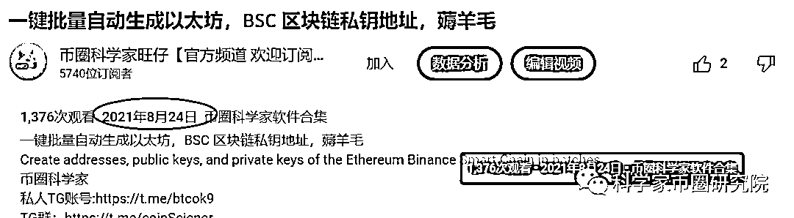
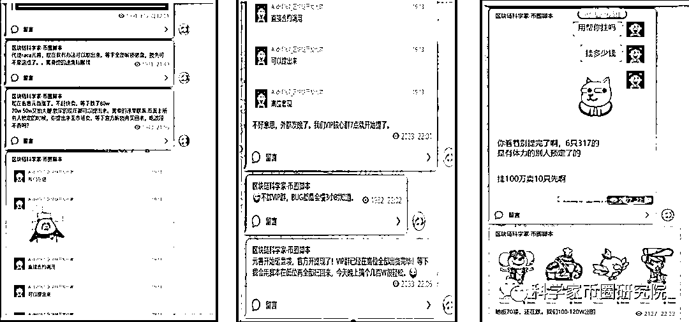
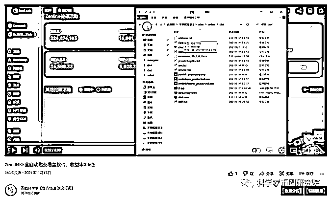
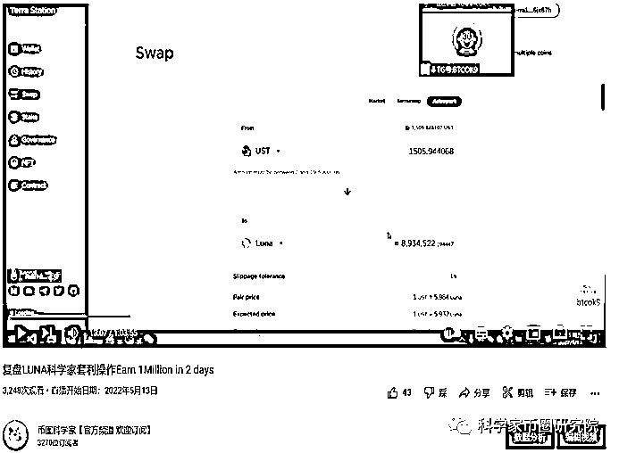
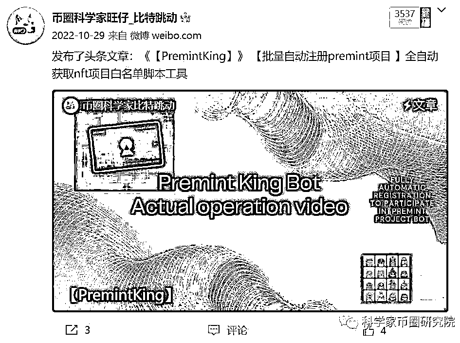
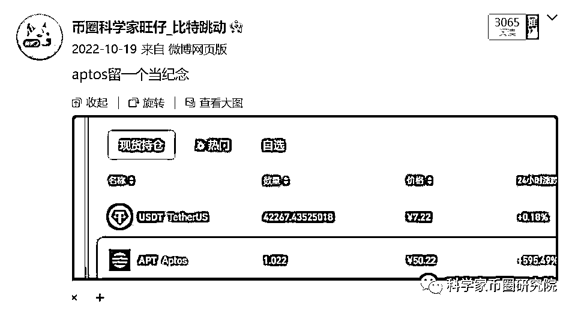
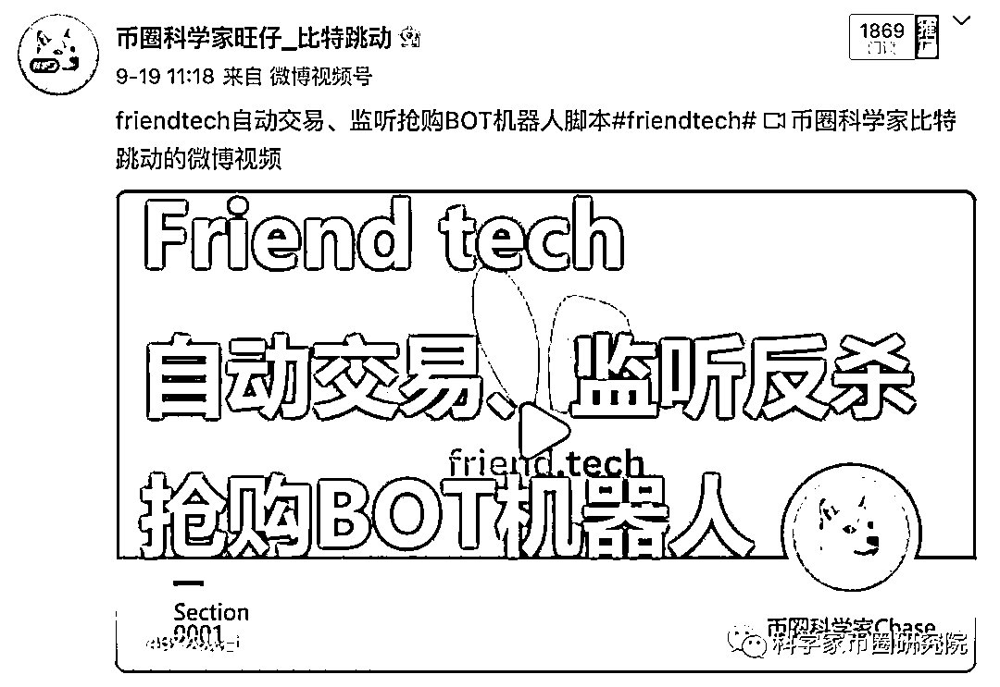
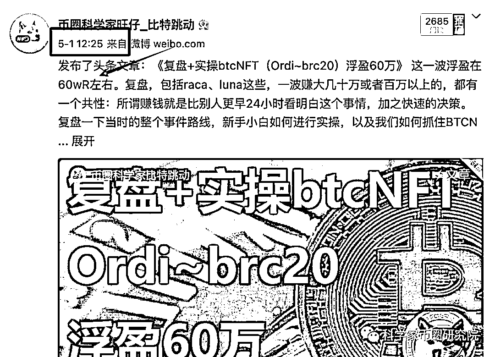
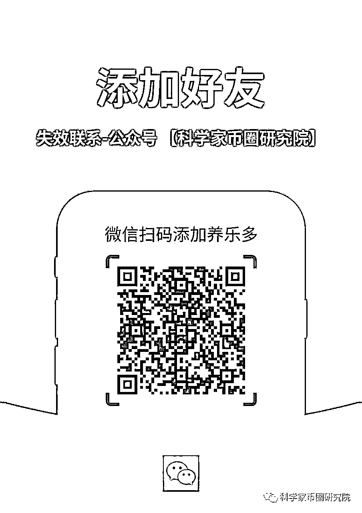

# Web3 牛市初期如何抓住机会（盈利1000万复盘）

> 来源：[https://jjoot221uo.feishu.cn/docx/YMz7dj80wokDZaxud7tcM04rnIm](https://jjoot221uo.feishu.cn/docx/YMz7dj80wokDZaxud7tcM04rnIm)

引语：

我是WD , 是一名程序员，18年研究生时就在读和区块链相关的专业，接触区块链行业6年左右。

就职于某互联网大厂，经历两次破产归零，目前正反馈盈利千万。

主攻方向：GAMEFI+空投+套利，捕捉链上ALPHA机会，通过代码提效。

raca脚本批量打怪，扫货开蛋，luna链上套利，arb空投等均单个项目百万以上收益

互联网造就了许多财富神话， Web3 是继互联网后的新领域，目前Web3牛市初期，未来更是具有巨大的增长空间。本次分享就关于我参与了哪些 Web3 项目并拿到了什么样的结果，以及新人在这个行业如何捕捉到机会。

## 简单聊聊我的故事

高认知+信息差+执行力=成功

我经常会在 Youtube 和微博记录我这一路的历程，因为我始终觉得，一次两次赚钱不难，难的是持续赚钱，凭运气赚到的钱，总会凭实力亏出去。

也有的人可能说在币圈赚 1000 万你靠的是运气，靠的是风口，一次两次你可以说是运气好，但几乎每次风口都能抓住也都是因为运气好吗？市场中永远有一拨人，他是总能赚到钱的，这一定是有内在逻辑的，而逻辑的养成靠的就是不断地学习+复盘。

我的首条视频始于2021年8月24日，那时我只是一个刚开始尝试在 Web3 薅羊毛的小子，只是分享一些基本的操作和知识。

## 执行力+信息差=印钞机

执行力指的是你看到一个消息后有没有真的去做。比如这几天就有一个真实的故事，有天上午新铭文铸造的消息热度很高，圈内大家都在手不停地 mint，然后你说：”我现在有点懒，等一会吃完饭再打。”于是吃完饭之后你再想打，一看已经打完了，二级市场也直接拉到了 50 倍，有时候真的需要思考自己为什么赚不到钱。币圈真的很有可能因为晚起一个小时就能错过好几倍的收益，执行力是一个非常重要的东西。

信息差指的是你能不能第一时间获得币圈信息的能力，这也非常重要。当时我就一直思考如何拉开与Web3普通人的差距，因为硕士时期也参与开发了很多区块链项目，当时拿到过以太坊开发社区的激励，于是我就想着用代码和科技脚本来寻找盈利机会，就做一个链上科学家吧！

在 2021 年年末RACA链游火爆全网，我们用软件去批量开 RACA 蛋，计算好模型的数学期望，直接用软件批量横扫市场，当钱足够多的时候，概率就会变成确定的事情，数学期望就是正的。

并且也第一时间发掘了 RACA 链游漏洞，当时官方市场维护，关闭了挂单功能，相当于是整个市场只能买不能卖的，导致元兽暴涨。当时我们利用 Bug 从已被官方锁定的市场中提前提取出元兽，并抢先在市场高点抛售，资产第一次达到百万u。

当时用这一思路玩法复制了很多其他链游案例，当时 MOBOX、Defina、Valk、Jojo、飞船、BNBHero 都有我们的身影。

在玩链游的同时，也参与了刷空投，瞄准了 DYDX、ZENLINK 等确定性机会，赚的钱无非是信息差，且在收到信息的第一刻配合执行力，写全自动刷交易量脚本和网格策略软件。基本上收益率在3-5倍左右

后来的2022年，luna事件可能大家都有所耳闻，当时因为提前研究过 UST和luna的经济模型，luna暴跌会有巨大的套利空间，但普通用户和外界只看到暴跌98%。此时的我们带着信息差用两天时间套利了100万+美金。当时外面没有一个人有发这个套利信息，后来套利结束才发出来的信息都是马后炮。

套利核心原理是在不同的链之间和交易所之间有差价，有套利空间。

2022年当时NFT也有一波小牛，涌现出很多freemint、白名单、打图等一些概念，于是做了一些自动化的打狗工具和批量脚本，用脚本抢先在散户之前买入，以及全自动跟单大V的操作，用很少的成本累积收益100多个ETH（当时折合100万人民币左右）

去年年底和今年的空投绝对是一个大的热度，伴随着apt和arb的空投也让不少人财富自由，Aptos空投盈利30W+rmb（四万多美金）

今年还在一些间歇性热点也抓住了一些机会，OK 打新 SUI 单号盈利 10W RMB，用借币质押抽签的方式也降低了okb的下跌风险，几乎也是低风险确定性机会。一年之中大资金能冲的高确定性收益项目就那么几个，基本没有亏的可能性，纯粹就是执行力的问题。

OKB 借币质押就可以单号收益 10 万人民币，堆多号上 10 个中签号就 100 万。互联网大厂高职级 P8、P9 辛苦加班干一年税后到手也就 100 来万，这也是 Web3 的魅力所在，以一个低门槛的形式大家都能进来得到早期红利，创造一个又一个暴富故事。

9月的 Friend.Tech 大火，也借鉴了一些高收益账号的操作去开发了自动交易、监听抢购脚本，通过分析推特和钱包地址的质量决定能不能买入，然后设置好买卖时机。有人砸盘我就跟一个，他再砸我就再跟，然后他清仓我也清仓，核心是监听FT的交易，加自己的策略处理。后来 bot 卷上天，我们用逆向思维又批量开盘收割 bot，一鱼双吃。

到这几天，11月铭文生态百花齐放，其实我们在5月就捕捉到Ordi和brc20的机会并盈利60万rmb左右，到这几天山寨链的铭文兴起，我们也用脚本批量mint，用极低的gasfee优先打到铭文，基本都有10倍以上的利润

## 总结

我们可以看到，每年都有几个改变命运的机会，但命运的齿轮一直在转动，下一个是哪个机会？又会轮到哪一批人呢？运气固然重要，但这三年来的机会把握与经验积累才是最珍贵的财富。

2024 年比特币要减半了，这一波比特币的疯狂大牛可能也要马上来了，就是我觉得只要把握好机会，普通小散户也能翻身。币圈确实是能改变命运的，我到现在还是真的是非常感谢这个区块链行业。

顶层用房地产和传统行业把我们牢牢地束缚住了，只有这种全新的赛道才能有机会。新事物的产生会有经历四个阶段：质疑、理解、成为、梦醒。

第一阶段：比如铭文刚出来时，我质疑这个东西到底有意义吗，这不是开历史倒车吗。

第二阶段，发现我靠这个东西这么多人赚钱，我要搞一点尝试慢慢开始理解。

第三阶段：成为，就是你已经成为打铭文的一份子。

第四个阶段：梦醒，铭文最终必将会泡沫消散，回归到原本的价值。

在这个圈子是不是这四个阶段一直在重复上演，不管是链游、NFT 也都是如此，那我们现在能做的就是提前看到新事物要勇于去理解。

币圈巨大的黑暗森林充斥着未知，但也蕴含着非常多的赚钱机会，我们只有走向未知，努力把质疑变成深度思考投研的动力，哪怕你这方面能力比较弱，也要寻找大佬去帮助理解，最后等其他人还在质疑的时候，你已经成为新事物发展的一份子了。

永远要快人一步才能挣钱，永远要做有门槛的事情才能挣钱。

总结给新人的忠告就是，这个市场真的不缺机会，缺的是什么呢？

缺的是认知+信息差+执行力。

老老实实复盘，在恰当的时机也要懂得拥抱泡沫。

Web3牛市已初现，让我们一起期待接下来的2024年，期待这BTC减半之年！

可以关注一下我，后面给大家具体拆解一下这些项目的原理，这篇文章目前可以当成一个索引贴。

这里贴了个视频版本的介绍

欢迎链接：

