# 这样利用生财知识库和内容输出，让你效率翻倍，给知识IP的25条超实用建议

> 来源：[https://x6n09emgmm.feishu.cn/docx/YW8Zdsgajo4Yj0xxv1DcWff5nQg](https://x6n09emgmm.feishu.cn/docx/YW8Zdsgajo4Yj0xxv1DcWff5nQg)

大家好，我是生财圈友Andrew，是一名知识管理教练，“知识管理五维模型”创始人。

大家都知道，生财是一座宝藏，但是很多圈友使用的时候会很焦虑，甚至摆烂，再也不愿意打开星球了。

具体可参考《成功转型自由职业，知识管理赛道单场群发售营收2.5w的颗粒度复盘》这篇帖子的1.3部分

很多的知识IP也知道，要想获取流量和变现，必须要靠持续输出。

就像芷蓝姐说的那样：“我不论多忙也会每天发圈，哪怕发的少也要发，就是为了让用户记住我。现状这个时代，爆款不重要，持续生产才重要。没人会记住一年一个爆款内容的你，只会记住365天不间断写字的你。”

但很多时候，即便学了再多，也还是蹦不出两行字，就像茶壶煮饺子只进不出，憋得满脸通红。

而以上这些问题，均是「知识管理」可以解决的。

为了帮到更多圈友，我沉淀出了这25条小技巧，每条就解决一个问题，可以把它当做工具箱，按需查找和解决。

另外，亦仁大大之前有让我给生财合集一些建议，我把仅代表我个人的一些想法放到了文末。

文章篇幅较长，约1.8w字，阅读时长约20min。可在侧边栏处点击以快速定位。

# 1.先要区分信息和知识

以前，我和很多人一样，觉得知识就是精华帖、分享、书本上的概念、原理、道理、案例、观点等等。我阅读它们，那就是在摄取知识。

但后来，我才知道，不论我们看了多少精华帖、读了多少书、学到多少概念方法论、内容上划了多少线等等。这些统统不能称之为知识。只能被称作是信息。

以前，我也用了很多工具搭建各种体系，但体系中填充的内容，全部是原封不动的文章搬运。

后来，我才发现，这个体系，并不能称之为知识体系或者知识库，最多只能称作是信息库或者资料库。

要想摆脱记不住、用不了、学再多都一场空的历史难题，前置一定是先区分好信息和知识。

知识管理学科有一套很经典的模型，叫DIKW模型。这个模型，是一个由数据、信息、知识和智慧逐级构成的金字塔结构。

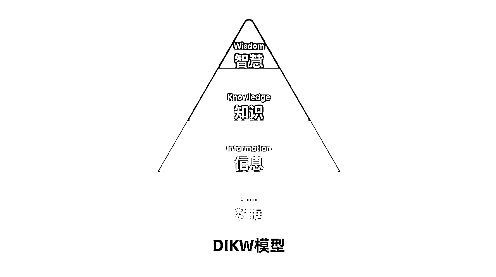

我们内化知识的过程，一定是按照这个金字塔结构，逐级向上转化的—— 手中数据 → 眼中信息 → 脑中知识 → 口中智慧

信息由数据转化而来，解决了不确定性。

比如「CES评分」，以前我能看懂是什么字，但我不知道意思，这时候就是数据。

但现在我通过拓展阅读，知道了「CES评分」的意思，是小红书对笔记的一套评分体系，公式是CES评分=点赞数*1+收藏数*1+评论数*4+转发数*4+关注数*8，通过最后的评分，来判定要不要继续推荐给更多用户。

这时候，就是由数据转化成了信息，我不光能看懂什么字，还能知道什么意思。

但知道这些，我依然不知道该怎么做，几分钟后我可能就会忘掉。

这是很多人没有迈过去的一道坎。我们以为学到了知识，但其实只停留在信息这一层级而已，不进行深度加工，就会成为过眼云烟，很快遗忘。

所以，就需要进一步转化。

比如，我知道了「CES评分」的意思后，我知道了：如果我的小红书笔记想要推到更大流量池，就要尽可能多得引导用户点赞、收藏、评论、转发和关注。

这时候，我不仅仅知道它什么意思，我还知道我该怎么去做、去行动。这个就属于知识。

所以，信息和知识，最重要的区别在于——能不能和自己搭上关系，能不能指导自己的行为。

很多时候，我们看精华帖、看书、听分享，之所以没发生改变，就是因为，我们仅仅是眼睛看了一遍，只是在被动得接受作者的观点、方法。而没有通过复述、思考等主动加工的方式来真正吃透。

那么，自然不知道该如何运用，难以改变现状。

# 2.如何将各平台内容统一采集到一个地方？

我以前曾经被这3个问题困扰过很长时间：

1.每次看到一个不错的文章，暂时没时间看，就临时发到微信传输助手，有空后再拿出来翻。

但之后，我再也没有看过第二遍，因为，这篇文章早就被更多的信息顶到了九霄云外...

很多学员也遇到过这个问题，记得之前有学员和我聊天，他一直在使用微信传输助手来收藏信息。

当时我和他打电话，我让他往上拉，看看自己收藏了多少信息，发现根本拉不到底…

微信成立了多少年，他就囤积了多少年的信息，很吓人。

2.我也曾经使用各个平台的收藏夹去收藏有用的内容，比如知乎、b站、简书等等，

但同样的，我再也没看过第二遍，因为这些信息被不同客户端给互相割裂，就算我想起来一篇不错的内容，也不知道被我扔到了哪个犄角旮旯；

3.后面，我学会用笔记软件来剪藏、搬运这些内容，看着很集中很整齐，

但日积月累，输出和搬运的信息全部混杂在一块，臃肿混乱，直到整个崩塌和弃用。

后来，我才发现，这些工具本身，并不擅长用来采集内容。所以，用它们来采集就好像在用剃须刀去切菜，压根是它们所擅长的，自然效果很差。

直到三年前，我终于找到了专为信息采集而生的本命工具——稍后阅读器。

稍后阅读不算是一个新概念，早在十年前就被提出，并由此诞生了很多经典产品，比如pocket、instapaper、readablity等等。

简单说，稍后阅读就是，当你在任何平台上看到好的内容，都可以集中把它们安排在一个地方，后面有时间再读。

我曾经深度使用了5款稍后阅读器：Pocket、Instapaper、Again、Twilar和Cubox。最终确定了Cubox作为我的主力工具。

它最大的优势在于，你在任何平台上看到好的内容，都可以集中把它们采集到Cubox中集中化存储和管理，后面有时间再读。

比如生财精华帖、公众号文章、简书文章、知乎专栏问答，b站视频、小红书笔记等等。

对我们有用的优质信息，可以在Cubox中all in one。

再也不用去传输助手、各平台自带的收藏夹里翻找，完美解决了难以取用、收藏吃灰的问题。

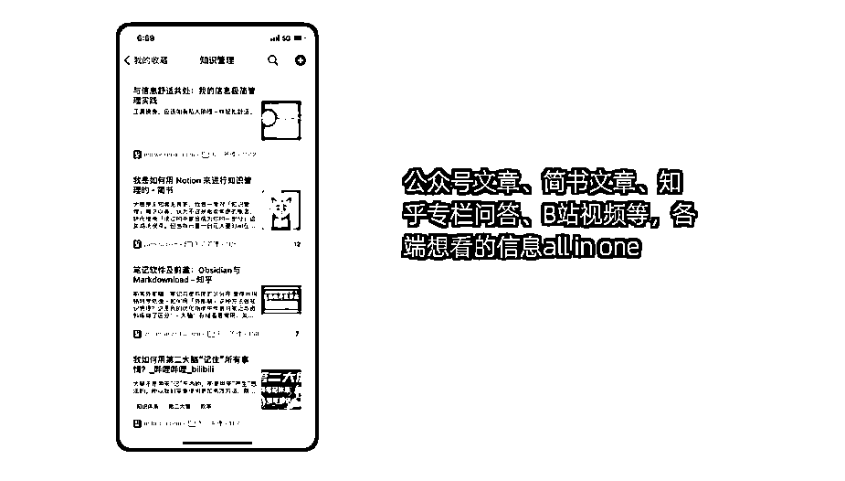

而且，这款工具支持文件夹分类、打标，层级也支持嵌套，方便多级管理。

在文章视图下，也支持高亮和笔记，体验很不错。

只是，如果文章所在的平台有登录门槛，采集就不会那么顺利，比如生财的精华帖，具体问题后面会聊到。

# 3.如何快速找到同一主题的精华帖？

方法有很多，我这里列举下我所知道的几个方法：

### 3.1索引站精准搜索

索引站，可能一些新圈友、甚至加入一段时间的老圈友都不了解。

比如之前看星辰老师的这篇《谈谈我对生财这个宝库的使用心得》，老师便举了一个案例：一位加入生财半年多的圈友，不知道生财有网页版、更不知道有搜索引擎。

索引站，即索引工具2.0。你可以理解成，生财团队自己开发的bbs论坛。

我觉得，它最大的一个好处，就是突破了星球本身的限制，根据平台自有的业务模块做了设计，提升圈友体验。

网址在这：精华帖索引工具2.0

⚠️这里提一嘴，因为这是内嵌的网友，不论是移动端还是pc端，都可以用这个链接打开。

（之前有圈友问我，他知道pc端链接，但不知道移动端的链接，其实都一样）

之所以强调索引站，是因为很多圈友在进行精准搜索来获取信息时，依然局限在星球。

但更科学、高效的获取方式，其实在索引站。原因很简单：

我来简单演示下：

假设，我想搜索「小红书引流」，然后我在生财的星球上直接搜「当前星球」。

大家可以看到，星球的搜索结果是包含全站的，有非精华帖、资源对接、风向标、生财朋友圈等等，但你没有办法快速筛选，只能去大海捞针。

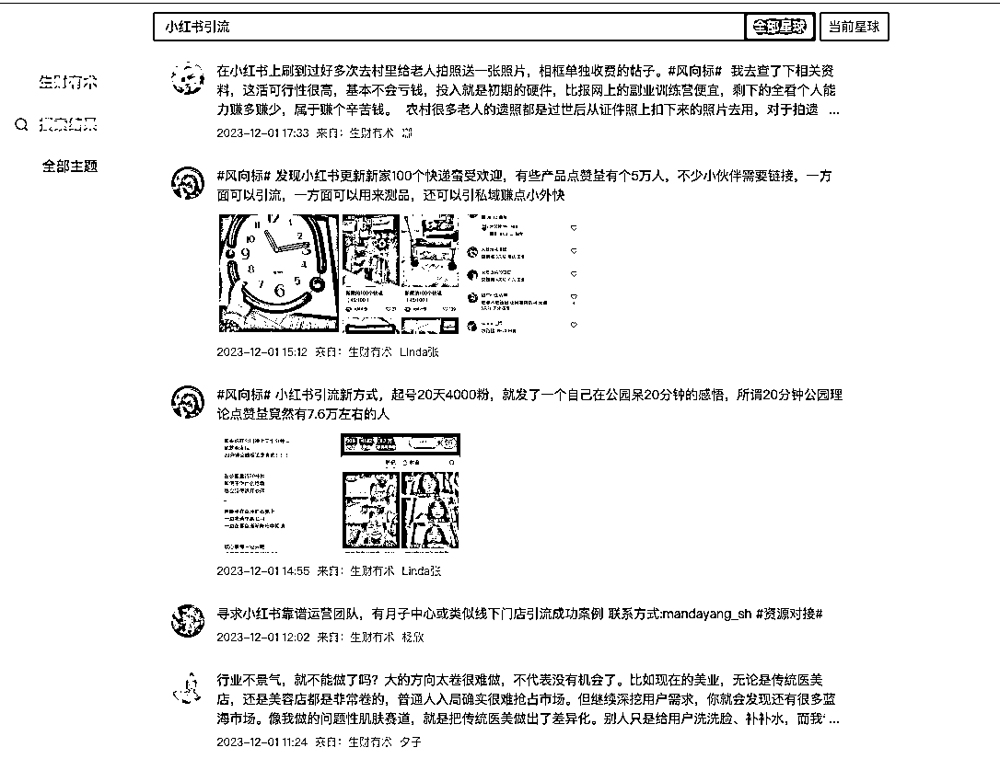

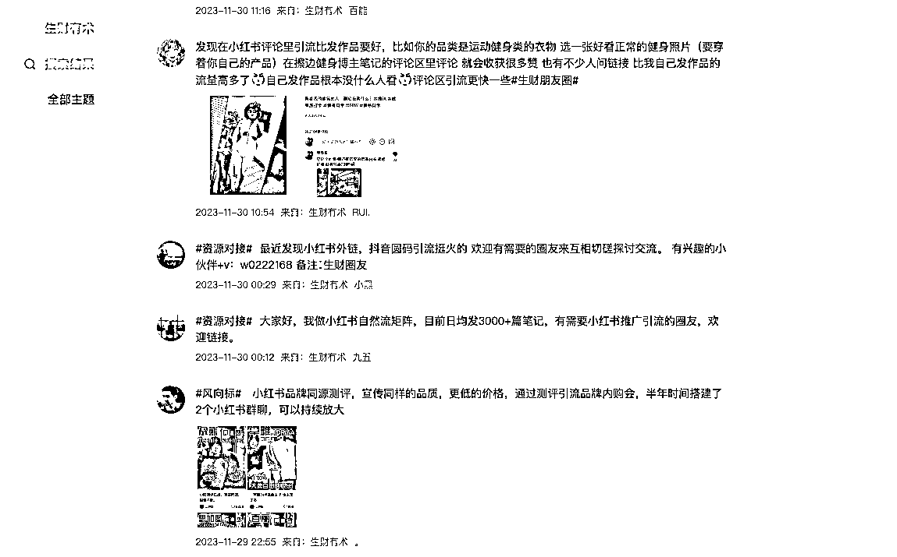

而在索引站，因为官方新增了筛选功能，所以只要确认关键词，就可以快速筛选出和「小红书引流」相关的所有精华帖，非常快捷和高效，压根不需要靠自己慢慢去找。

此外，它也支持更细分的二级筛选，比如时间区间、点赞区间等等。

所以，索引站是主题搜索的不二之选，因为不论是功能还是体验，都要远胜于星球。

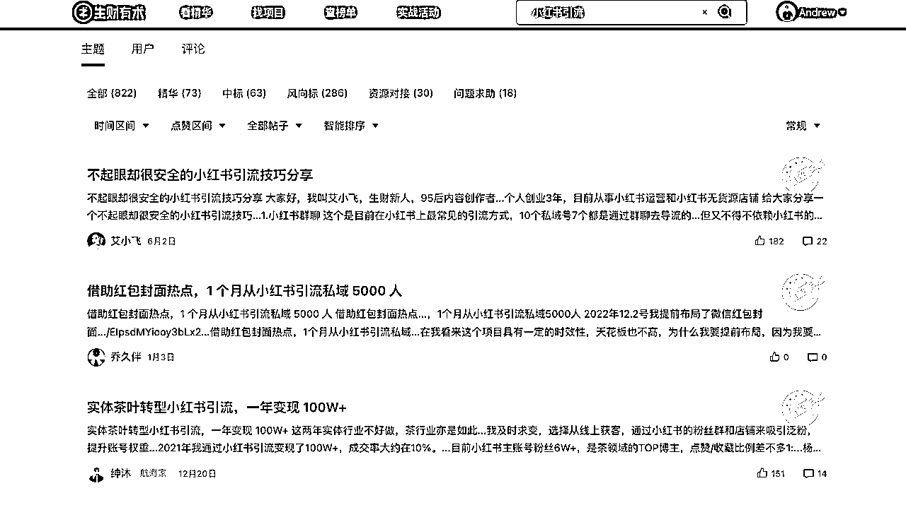

### 3.2索引站关键词&项目检索

这个很简单，平台内自带三类热门关键词：平台、话题和人群，这个在首页顶部可以看到入口。

每类热门关键词，都包含对应的子级，按需检索即可。

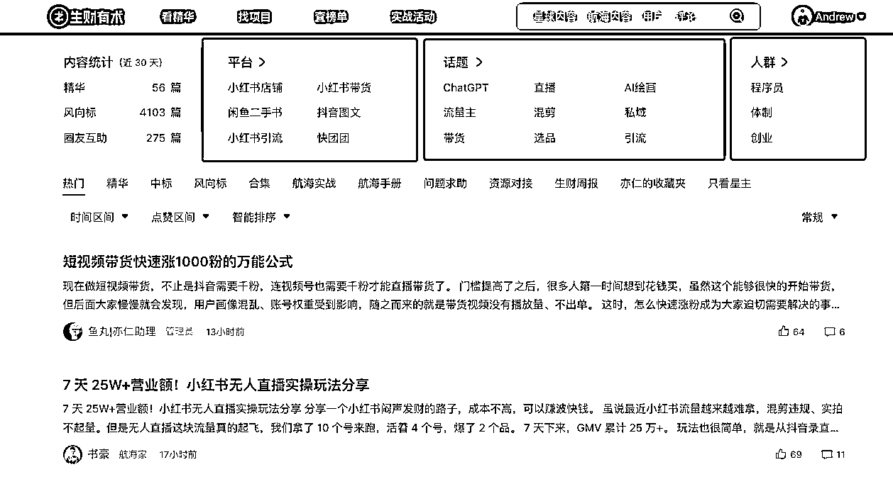

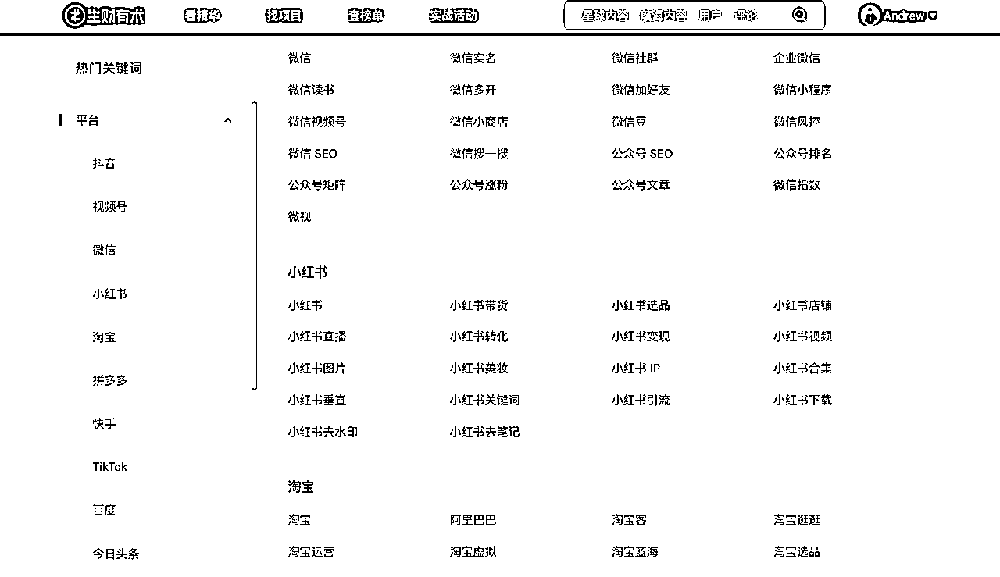

「找项目」版块下，可以根据不同类型的项目，快速检索对应的精华帖。

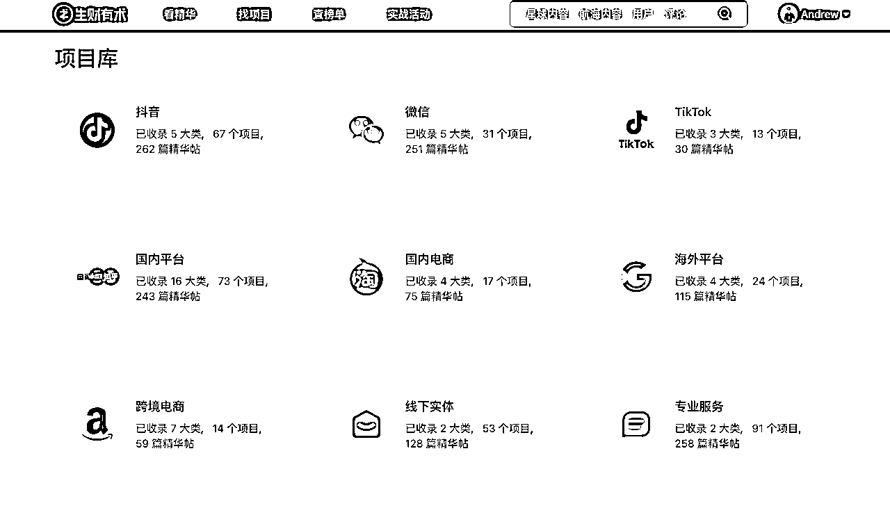

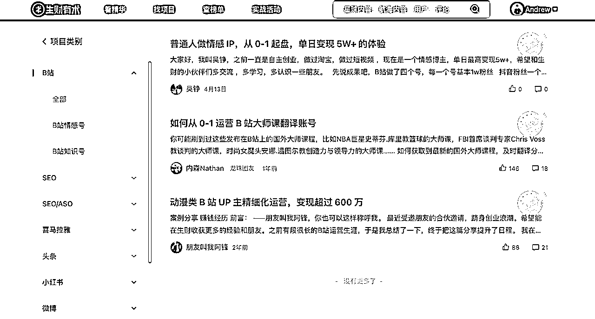

### 3.3生财合集检索

位置在tab标签的第五位，聚合了所有的生财合集，以及精华帖合集。

以前索引站其实是没有这个入口的，这次更新做得很赞。

关于生财合集，我自己有提出了一些想法，具体可参考文末。

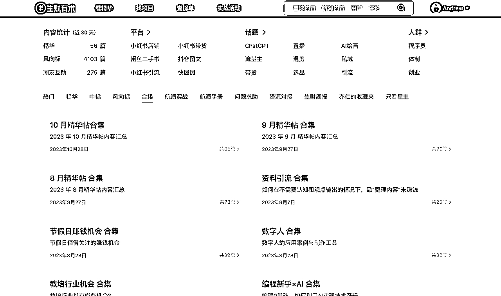

### 3.4航海实战手册检索

由生财团队将对应航海领域内的各个高手前辈输出的精华，集中编撰而成的一部手册，干货程度极高。

如何找到呢，拿「IP朋友圈运营」举例

1.  在实战活动版块下，戳往期活动，能看到往期所有的航海

1.  我们点击「IP朋友圈运营」

1.  在航海详情页页右侧，即可看到航海手册

注意：航海手册的查看是没有门槛的，即便很多航海之前没有精力报名，也可以有权限查看，这一点很人性化。

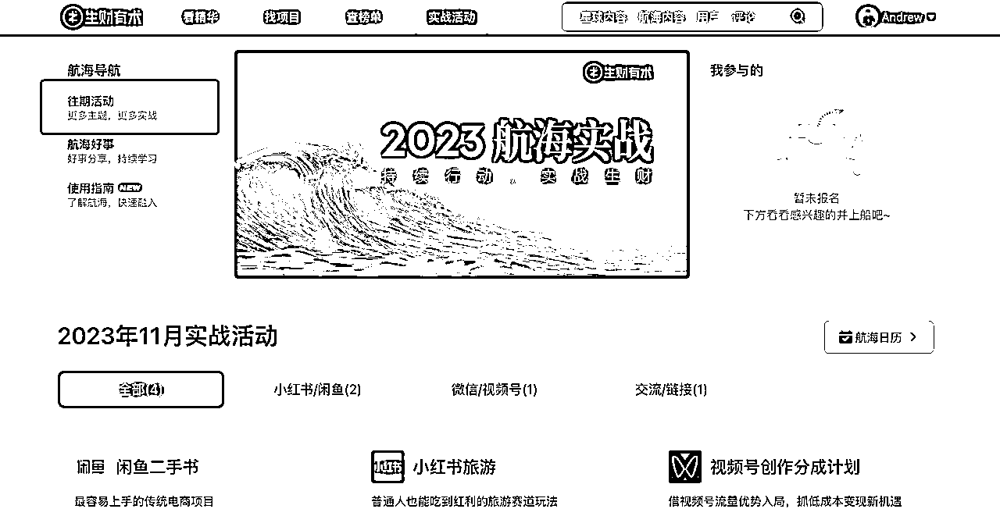

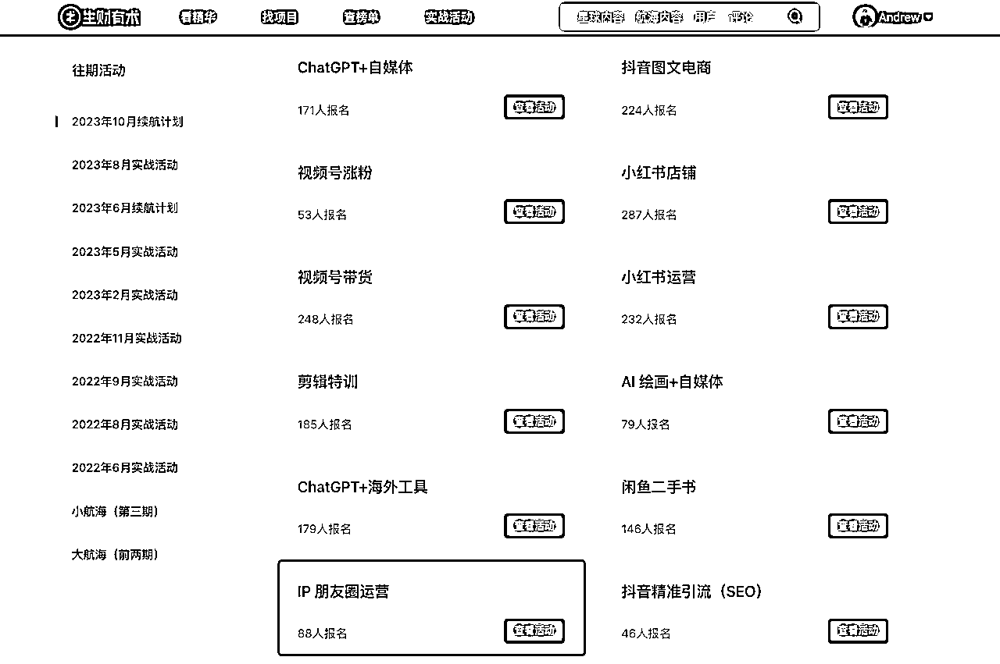

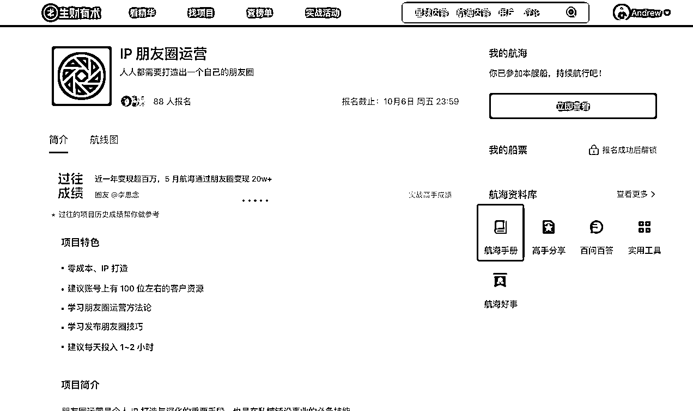

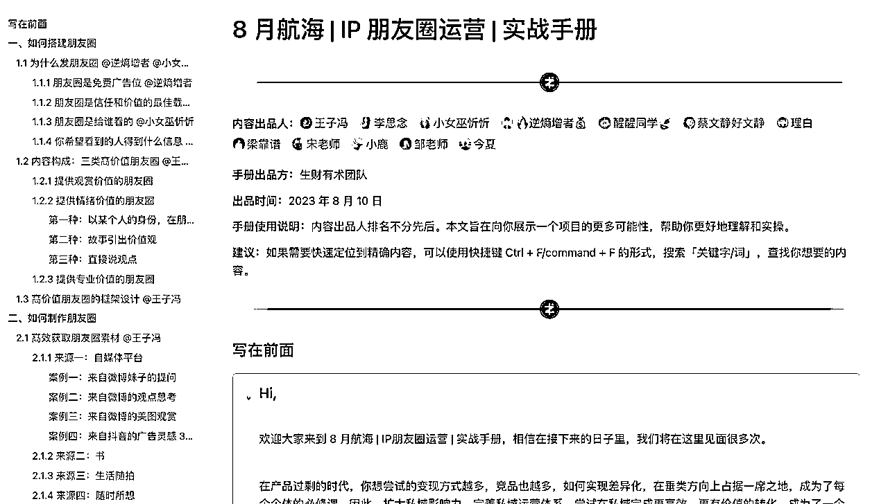

### 3.5生财订阅功能

如果你想要在服务号上获得某个主题的推送，可以试试这个个性化功能。

很多圈友可能不太知道位置，我直接做了截图指示，按照步骤来就可以。

PS：这里好像出现了一个bug——

当我收起【平台】选择器后，去尝试订阅【话题】选择器中的关键词，比如「ChatGPT」；或者订阅【人群】选择器中的关键词，比如「产品经理」，是不会出现「创建订阅」这个按钮的。

当然，如果生财目前的策略，就是针对于【平台】，感觉直接隐藏掉下面两个选择器，体验可能会更好一些。

另外，再来一个吹毛求疵的小建议：我的订阅页面，加上关于订阅推送的时间、频率会不会更好一些？不然可能很多圈友对这个功能的效果没有预期，决策上可能会有阻力。

# 4.如何将生财精华帖统一采集到一个地方？

信息采集，前面有简单讲过，目的就是建立属于自己的资料库，有序聚合所有对自己有价值的信息以便随时阅读。

尤其是精华帖这样的高价值信息，更需要去分门别类得归纳到一起、便于随时回顾复习。

不过，精华帖属于星球内信息，有登录门槛，Cubox可能会出现无法采集的情况。

为了明确采集效果，我认为需要先摸清生财贴的内容形式。

生财所有的精华帖，基本分为四类形式：

1.  星球文章

比如芷蓝姐的精华帖 全职自媒体5年，我沉淀下了一张个人 IP 经营图谱

这类形式是使用了星球自带的「写文章」功能所生成，样式丰富、支持文中内嵌图片。

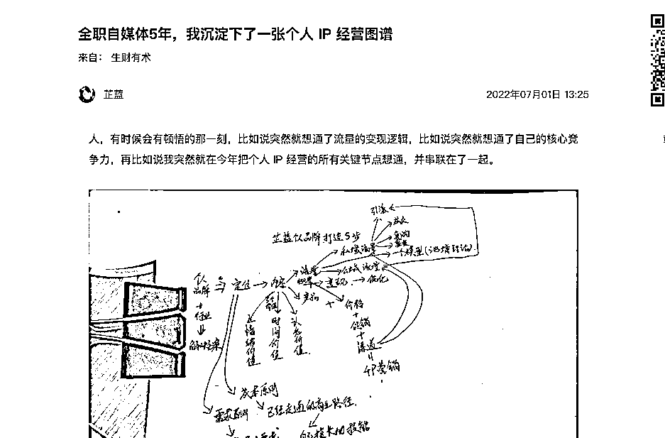

2.星球主题

比如明白老师的精华帖《信息整合：一个可复用、低门槛的成熟商业模式》

这类文章，是直接在星球自带的编辑器上编辑好内容，发表就可以。

（需要注意的是文章不能过长，主题有1w字的上限）

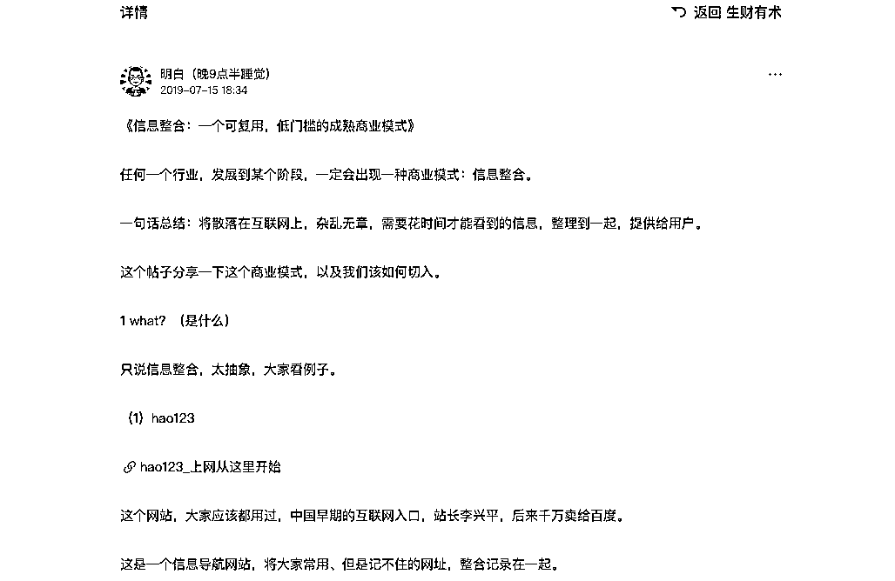

3.索引站内的文章

比如肖肖老师的《视频号单品直播打法拆解及60分主播养成》

这类形式的文章，从域名和水印上看，属于生财索引站站内文章，我猜是由生财团队约稿，确认定稿后再由官方人员上传到站内。

像「航海手册」、「高手分享」，都是这样的文章形式。

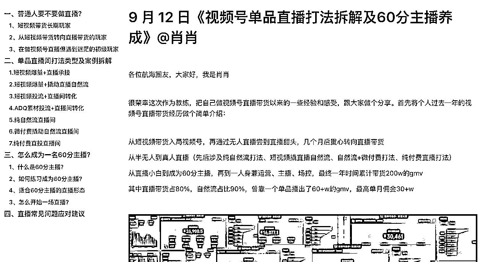

4.飞书文章（包括石墨、幕布等第三方文档）

比如靠谱的这篇精华帖《四年发了八千条朋友圈，销冠的成交心法》，就是在飞书上编辑好再发布的。（这类形式，可能是占比最多的一类）

以上四类，我通过电脑端Cubox分别进行了采集测试，测试结果如下：

*   星球文章、以及飞书文章，均可以正常采集、正常阅读；

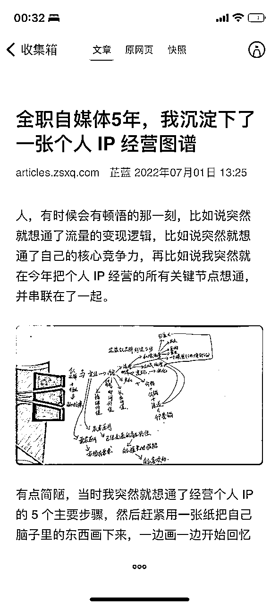

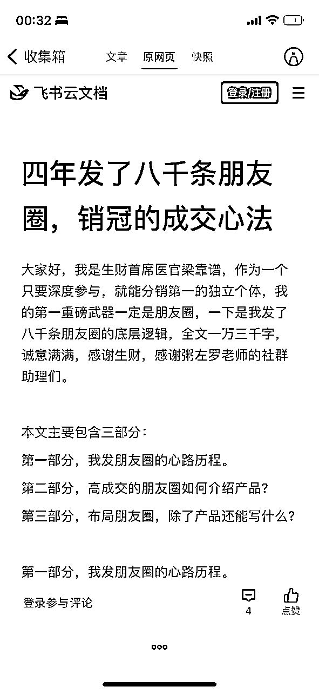

*   星球主题可以采集，但是文章视图下无法识别折行，所有信息会挤压成一大段，难以阅读。 而如果切换到原网页视图，有登录门槛（只能星球客户端打开）

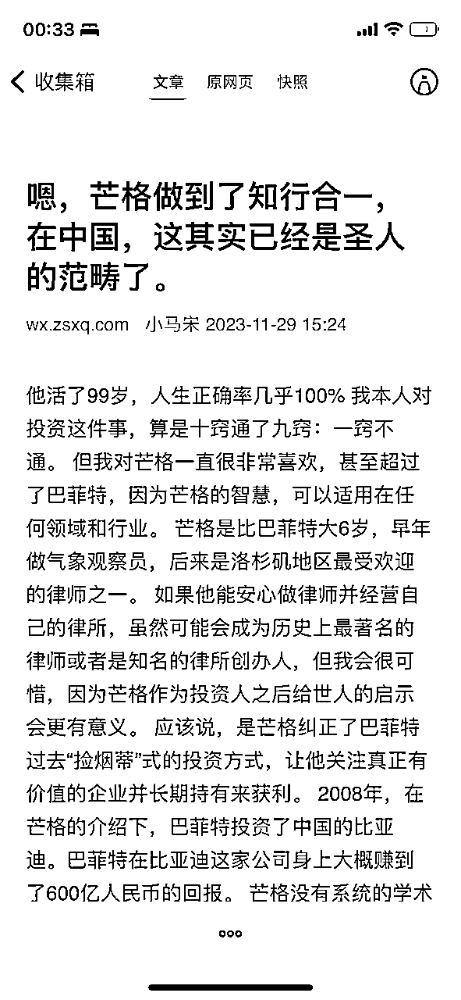

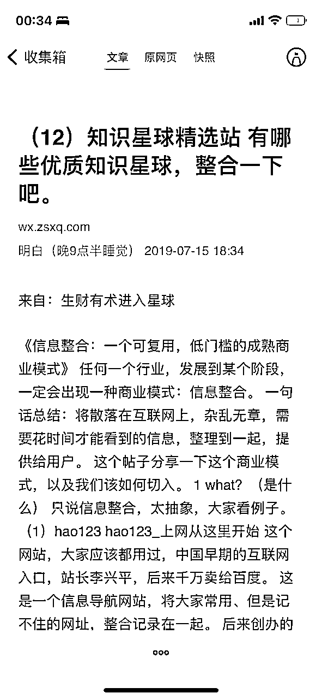

*   索引站内的文章无法正常采集（只能识别很少一部分信息），如果切换到原网页视图，同样有登录门槛，

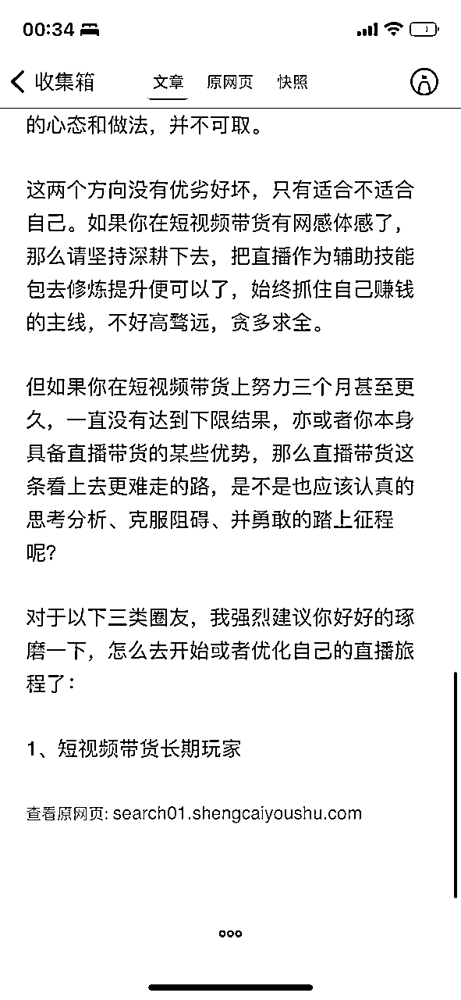

所以，如果确定使用Cubox采集的话，难以兼顾所有内容形式。

因为精华帖形式各异，一旦想采集文章的形式属于「星球主题」、「索引站内文章」就会吃瘪。

（当然，这两类形式的精华帖相对偏少，所以Cubox采集的方案也不是不行）

因此，一个比较理想、兼顾的采集方式，就是去采集精华帖的链接。

然后，将链接，结合当前精华帖的其他元数据，统一整合到一个文档。

比如，下面是我用notion建立的生财精华帖资料库，表格灵感来自轩辕老师的《生财精华帖阅读法》。

除了精华帖的链接外，我还加入了作者、进度、关键词、星级、行动清单等等。

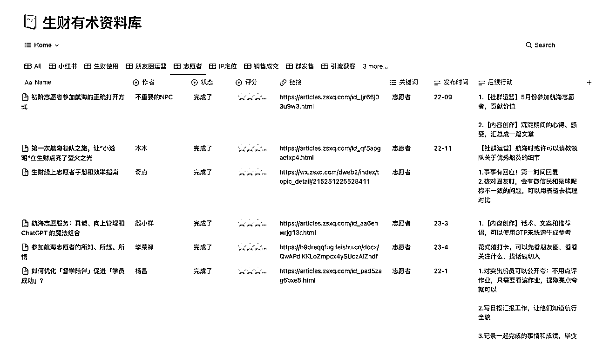

所以，这个数据库可以帮我实现3个场景：

1.有地方可存

之后不论什么时候、什么地方看精华帖（尤其是那种很长的、不能快速看完的），我不需要担心找不到，我只需要复制下链接，整合到我自己的资料库就行。

2.快速查找阅读

以前，可能很多圈友和我一样，喜欢把帖子直接收藏到星球、或者发到传输助手。然后，再也没看过第二眼，即便想看，也需要在囤成山的帖子里大海捞针。

而现在，我可以在搭建好的资料库中快速找到。

并且，精华帖按照关键词做了分门别类，因此也可以方便我更快得进行主题阅读。

比如，我想集中查看关于定位的帖子，只需要确认「定位」的关键词，就可以筛出来所有相关的精华帖，更重要的是，这些精华帖经历了我在生财的一轮筛选，所以对我有用。

3.让我快速知道我该怎么行动

听100节的杀猪课，并不能意味着你就会杀猪；

看100个搞笑段子，也不能意味着你就能成为段子手。

所以，看100篇、甚至1000篇的精华帖，你不去现实世界里实践，什么事也不会发生。

我很喜欢航海里的那句名言「把手弄脏」，哪怕你只看了1篇精华帖，实操了一件小事，都比看100篇后无动于衷要好得多。

比如，在参加5月航海志愿者时，我通过主题阅读志愿者相关的精华帖，知道了：

我可以花式催打卡；我可以提前做个问卷调研来通过对方需求定制化督促的方式；我可以在群内公开夸奖优秀船员；我可以写航海日报来汇报工作、让船员们知道航海全貌等等。

所以，我第一次做志愿者，就拿到了全员上岸的结果。我也有幸被我的领队肯定，拿到了组内最多的术值。

而如果我不去行动，什么都不会发生。

当然，如何知道自己「做什么」，可能需要用一些方法，后面我会讲到。

# 5.精华帖太多，不知道从何下手、感到焦虑怎么办？

这是来自很多圈友提出的共性问题：

*   信息量太大，看完帖之后很焦虑，干脆长期不打开星球

*   有信息焦虑的，毕竟信息太庞大了；

*   信息太多了，无法分辨好坏，看完后消化不了

*   生财的内容精华太多了，导致焦虑感，很多时候不知道从何下手

*   精华帖好多，该怎么看？

*   我刚进的时候天天漫无目的的去看帖子，就很容易信息过载，找不到方向

——以上信息，来自生财圈友的真实评论

很多圈友都会有这样的焦虑，焦虑的本质原因，在于海量信息面前的失控感（大脑耗能过多、超负荷了）

失控感的本质原因在于被动阅读。

关于被动阅读，七小老师在《我分析了40W评论数据！挖掘出了生财小白的7个痛点问题！》中、星辰老师在《谈谈我对生财这个宝库的使用心得》中也都有提到过。

什么是被动阅读，就是在信息获取阶段，你不带着任何动机获取、并阅读信息的行为。

比如各个应用推送，如果你不加以屏蔽，可能生活中70%以上的信息都将由它们主导，这个时候就是在被动阅读。

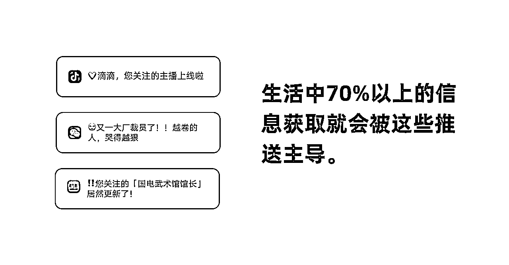

而打开生财，从首页的第一篇精华，漫无目标得硬着头皮往下看，这同样属于被动阅读。

如何解决呢？

以问题解决为导向，以主动搜索为策略。

生财的精华帖截止目前累计4000多篇，相信很快就会突破5000了。

但是，你不用抱着把所有精华帖看完的执念。

先搞清楚，你自己到底想要提升什么、想要解决什么问题，然后再打开生财，主动搜索相关内容去学习。不是生财推什么我就看什么。

比如，我在小红书引流方面存在卡点，那么，我只需要在索引站进行主题搜索（主题搜索的方法很多，前面有聊过）

而不是生财的4000多精华帖一定都得看，不是生财每更新一条精华帖你都得去读。

况且，那些你从来没接触过的赛道、项目，可能你大概率也看不懂。

如果还是新手，还没有想清楚自己目前需要看什么，强烈建议先看下鱼丸在第七期开学时发的这篇新圈友指引：新人指南🧭新圈友必看，根据自己所处的定位来探索（每个定位都有对应的精华帖合集）

但是问题又来了，当我们找到适合自己看的精华帖时，又会陷入到另一类问题，精华帖太长、看不完、看不动。

# 6.精华帖太长了，看不完、看不动怎么办？

*   文章太长了，根本看不完

*   我瞎了，生财的精华帖每篇都好长，不想看啦、太累

*   精华帖倒是看的比较少，可能是精华帖太长了，内容多，目前的自己消化不来

——以上信息，来自生财圈友的真实评论

很多圈友又会有个误区：觉得精华帖，我必须得「逐字逐句得读完」。

因为，觉得只有从头到尾得读完一遍，才能收获其中的全部价值，所以不想放过任何一处信息。

因此，遇到看不懂的地方就一直卡着、一篇万字长文看半天都看不下去。

但真相是，一篇精华帖真正对你有用的内容只有一部分，甚至不到30%。

你真正需要在意的，只是和你自己相关的部分。

所以，科学的阅读路径，肯定不是从第一个字，逐字逐句得往下精读，生怕漏掉一个字，

而是：

1.看精华帖上的简介，判定是否对自己有用

2.点进飞书链接，看目录，判定哪一章节对自己有用，其他章节可以直接跳过、或者快速扫读

拿我这篇文章来说：《成功转型自由职业，知识管理赛道单场群发售营收2.5w的颗粒度复盘》

如果你只关心群发售的过程，那么前面这些成长历程，你是可以全部忽略不看、或者快速扫过的（虽然我写的很精彩哈哈哈）

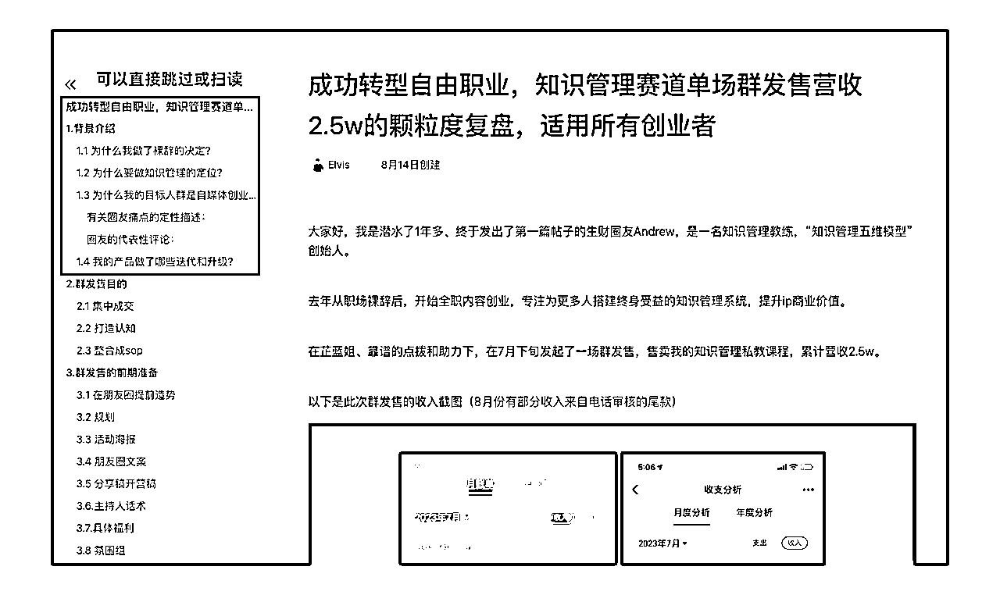

如果你只关心群发售的全部流程、以及经验分享，那么其他部分同理，直接跳过或者扫读（建议群发售目的多少带着扫下，便于自己了解项目背景）

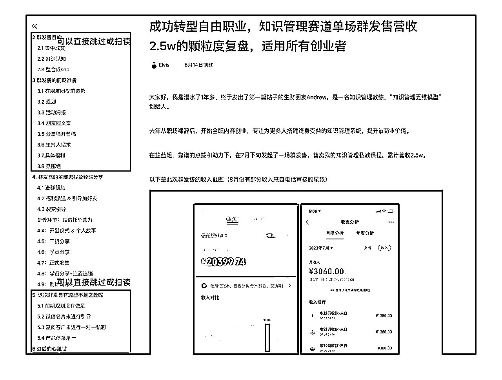

以上是阅读路径方面的建议。

另外，阅读动机方面，重点看「这个项目怎么走通的」，这个观点是亦仁在去年提出的，我这里直接搬运下：

“看某个圈友分享tiktok带货的帖子，不必去纠结他说的收入到底是交易额还是利润，不必纠结他到底是个人还是团队，不必纠结他说的转化率到底是不是真的有那么高。

你只需要确认：他通过大量在tiktok发视频，引流到独立站卖货，有真实成交，这条路是通的。

这个信息就非常有价值，赚钱和创业最大的风险是不知道前路通不通，不知道下面到底能不能挖出水，不知道自己的投入是不是全是无用功。

现在有人告诉你，前方有路，那剩下的怎么走，走多快，什么时候到，不就都是自己的事了？”

——搬运来源：

也就是说，根据自己的阶段、诉求去针对性得「抄作业」，比如你不知道怎么从0到1，不知道怎么从1到10，别自己瞎捉摸、内耗。亦仁早就帮你筛好了一批大佬们的精华帖等着你去抄呢。

太阳底下没有新鲜事，你遇到的问题、卡点，前人肯定也都遇到过，这个时候就不需要重复造轮了。

开卷考试，答案都有，不要人为得给自己增加难度。

# 7.看精华帖总是记不住、用不了，怎么办？

*   好像之前在哪个精华帖看过，但一到嘴边又说不出所以然了？

*   读了很多精华帖，都感觉很厉害，但为啥自己没变厉害？

*   我刚进的时候天天漫无目的的去看帖子，就很容易信息过载，找不到方向。我经常看完一篇精华帖都恍然大明白，自嗨一段时间，然后自己并没有发生什么改变。后来我感觉这样下去一年以后我和现在有什么区别？

——以上信息，来自生财圈友的真实评论

这些问题的共性，在于「记不住、用不了」。

根据前面讲的DIKW模型，真正有效的学习，需要将【信息】转化为【知识】。

所以，关键不是死记硬背，也不是摘抄划线，而是【自我关联】。简单说，就是联想到自己过去的知识、经历。

为什么要自我关联呢？

1.可以让我们记得更牢

海马体是判断信息能否进入长期记忆的一道关卡，而它有这么一条筛选机制：

只有外界的必要信息，才能通过“面试”被录用，转化为长期记忆。而那些非必要信息，就不予录用，直接走遗忘手续。

怎么让它觉得这个是必要信息呢？

答案很简单，一切和自己息息相关的事情，就是必要信息。因为基因的支配，每个人最在意、最敏感的只有自己。一旦和自身有关系，那么就可以提升信息权重，从而被海马体录用转为长期记忆，记得更牢固。

2.让你知道该怎么运用到工作生活

只有和自己关联，你才有办法，抽离出第三视角，让你觉察到自己存在的问题。

然后，你就可以用这个问题作为抓手，来指导后面更优质的行为，避免继续因以往的错误决策买单。

3.读写一体，阅读的同时进行写作

你通过自我关联，将思考的过程写下来，就成为了一篇文章的初稿。

可能很多人和我以前一样，觉得文章必须要有多少千字才算。但后来，我才发现，只要这篇文章对你的成长产生了作用，100字，甚至50字就可以了。

所以，你学会自我关联，你就可以读写一体，直接出一篇小文章。你完全不需要再对着白纸从头开始，绞尽脑汁得写，既缓慢又痛苦。

那么如何能够自我关联呢？

很简单，写思考卡片，「卡片」的灵感来自卢曼的「卡片笔记写作法」。具体方法是：

看完一条特别对你有感触的信息后，先把原文摘抄下来，然后，试着回答5个问题：

1.用自己的话，我该怎么去复述？（可选）

2.我可以联想到哪些知道的旧知识？

3.我可以联想到身边的哪些经历，能被它来解释？

4.我可以联想到自己的哪些问题？

5.我之后该如何行动？

第1步是【复述】、第2-4步是【思考】，最后一步对应了【行动】。

一张思考卡片，一方面打通了新旧知识、融会贯通，一方面读写一体、快速成文，更重要的是，它实现了深度加工，你知道如何把这个知识运用到工作生活中，它们可以落地、可以清晰得帮你解决问题。

比如下面两张卡片，分别来自奇点老师的《生财线上志愿者手册和效率指南》，以及杨昌老师的《我们社恐有力量》，我在看到后很有感触，于是立刻抽了一些时间写下卡片。

不光印象更深了，我也知道怎么做了，更重要的是，这些卡片本身可以作为生产内容被我对外分享，收获影响力。

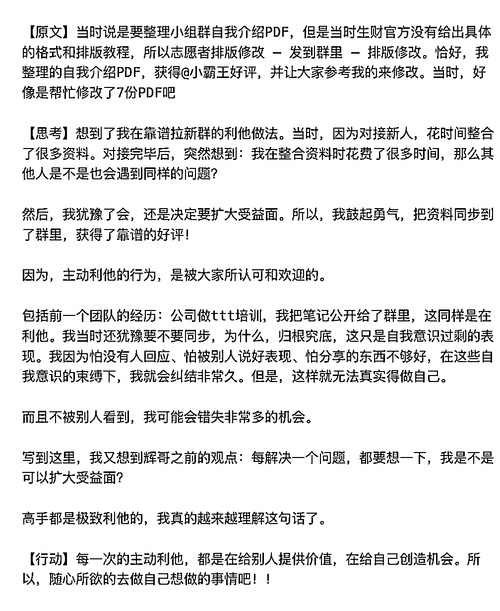

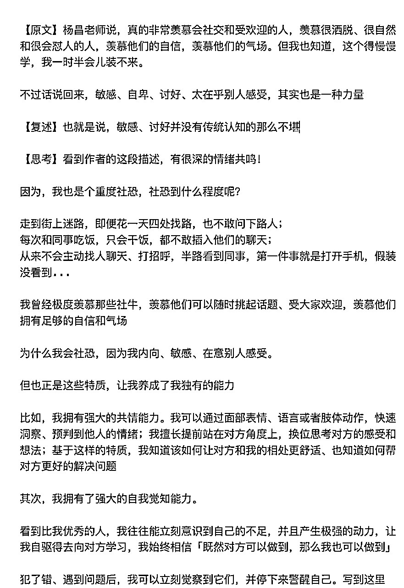

关于卡片的具体写法，可以参考我之前在生财做的高手分享《如何用思考卡片，将世间一切信息化为己用？》。

# 8.如何优化朋友圈的质量？

对于我而言，朋友圈是一块相当重要的信息源。因为，我可以通过朋友圈，看到优质的碎片化内容。不论是软广技巧、还是大佬的感悟。

不过，这块信息源，可能会随着好友的增多，慢慢变得鱼龙混杂、良莠不齐。

然后，便会出现这样的场景：

下班后，我习惯刷刷朋友圈，想看看有价值的信息，然后发现全部是这些：抱怨加班的、频繁秀恩爱的、一天十来条硬广的、负能量爆棚的...

于是，我慢慢得不刷朋友圈了，因为全部是对我无用的信息，与其刷朋友圈，我去看个电影、看本书不比这香？

后来，我才意识到，我对信息是有自主控制权的，也就是说，我可以选择看谁的朋友圈、也可以选择不看谁的朋友圈。

之后，我就给自己下了铁律：每次刷朋友圈，只要看到对我无价值的信息，点开头像看他最近的10条朋友圈，如果都没有价值，那么不要犹豫，果断屏蔽。

我靠这个方法，慢慢优化了朋友圈的质量。

现在，点开朋友圈后，呈现出来的都是筛选过后的信息。如果想追更某个人的朋友圈，可以专门做星标，比如芷蓝姐、靠谱、白大他们的朋友圈，就非常适合星标。

除此之外，有个更好的屏蔽方法，就是从源头上搞定：

有个人加好友后，第一时间先看朋友圈，近10条都没有价值的话，也可以果断屏蔽。

最后，分享个小技巧：很多人会专门跳转到个人资料页去屏蔽，其实不用这么麻烦，微信有个比较冷门的技巧——

长按某个人头像，就可以快速屏蔽了。

# 9.怎么才能随时想到各种名言？

我习惯在内容创作时加各种名言。

有学员问我，我到底是怎么做到能记住那么多名言的？

答案很简单，并不是我记了那么多，而是我搭建了自己的金句库。

有了这个容器后，不论读什么文章、看什么书、听什么分享，我都可以把我喜欢的金句给分类搜刮下来。

贼不有空，指的是贼不论走到哪儿，总得顺点东西走。

这个心态可以被用到阅读上，你要像贼一样，把你觉得不错的金句、案例、故事全部顺走。而且，你得专门建个“小金库”，分门别类得收纳它们。

因为，大脑是用来思考和决策，不是用来存东西的，所以就需要外部的数字化系统代替。

然后，你要做的就是去不断填充这个系统，让它越来越丰富。

之后不论是写文章、做分享、还是做视频，都可以随取随用。

# 10.看到好内容就想立刻囤起来，但总是吃灰怎么办？

从环节上来看，这个问题属于知识管理系统中「信息采集」方面的问题。

遇到问题，我们先不要找答案，先找到问题背后出现的原因。

收藏癖，从原因上包括四点：囤积欲、求知欲、安慰补偿、损失厌恶。

【囤积欲】这个依然可以用适者生存这个底层原理解释，我们为了保证足够的能量让自己生存，总是倾向于囤积食物。所以，囤积的这个欲望也被传承到了现代社会。满足了囤积欲，就可以让我们本能得获得快感。

【求知欲】人类这种高级生物，除了吃饭睡觉外，还会有一种内在的精神需要──认知的需要。

当面临问题，发现缺乏对应的知识时，就会本能产生这种求知欲。

而以上这两类欲望，生物学上的本质是，多巴胺。多巴胺主导的就是让你产生「我想要」的欲望。

【安慰补偿心理】 当我们没有能力即时获取到信息，我们就会采用收藏这个方式。

然后心里想着：虽然现在没有获取到信息，但是它已经被我占有，所以很大程度上已经或者即将被我掌控。

为什么我们总感觉收藏=学到，很大程度都是安慰补偿心理给的错觉

【损失厌恶】相比我们得到的，我们失去东西后所带来的负面情绪要强烈得多。

放到看精华帖上也是同理，我们找不到之前看到的一篇精华帖，让自己感觉到遗憾、失落的程度，要比看到一条好的精华帖所带来的愉悦要强烈得多。

收藏癖如何解决呢？

可以参考福格行为模型：——任何一个行为的发生，依赖于这三个条件：动机、能力和触发。

比如你今天没有去跑步，为什么？

1.因为缺乏动机：比如你可能觉得自己已经很瘦、很健康了，跑步不会给你带来好处，不需要去跑步。

2.因为缺乏触发：比如你今天沉浸在工作，忘了晚上要跑步这个事儿。

3.因为缺乏能力：比如你很想跑步，但是晚上赶项目要加班到12点，所以你完全抽不出时间，有心无力。

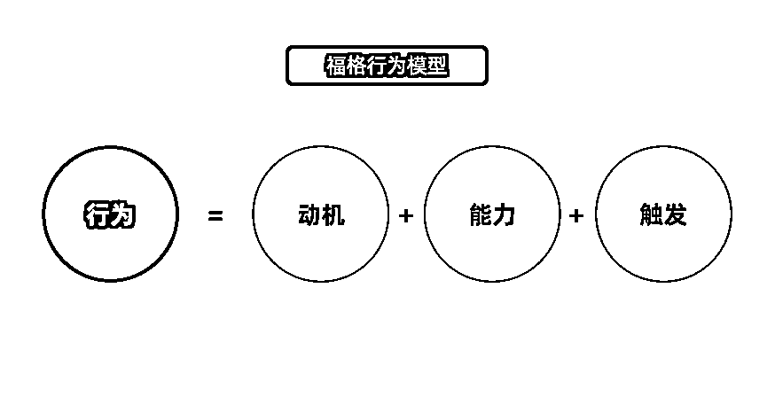

同样的思路，我们也可以来剖析「吃灰」这个行为发生的原因、并且推导出对应的策略。

解决吃灰，即提升「再次打开阅读」这个行为的概率。

1.我们之所以没有再次打开收藏的内容，很大一部分原因，就是忘了，也就是缺乏触发。所以就需要通过额外的手段，进行外部触发。

比如，每周五下班、或者每个周末，给自己设定闹钟，提醒自己回看之前收藏的内容。直到自己养成习惯，记住闹钟只是前期用来过渡的手段，最终是需要摆脱的。

2.但很多时候，即便我们想去阅读，但也缺乏能力。

比如，如果使用微信传输助手来采集会大海捞针、难以管理。

为了减少行动的阻力，就需要使用合适的工具，比如cubox采集、或者使用notion采集链接，便于自己随时检索和取用。

3.我们有触发、也有能力，但很多时候就是不想读，这就是缺乏动机。

可能在收藏的那一刻，我们觉得是有价值的，但现在因为种种原因就感知不到。

这时候，就跟随自己的内心，听从你自己的真实想法就够了。

文章本身不重要，你自己的意愿才更重要。

# 11.如何快速采集微信聊天记录？

我们经常在一些群里，看到大佬做高能分享。如果看到特别有启发、有触动的地方，会怎么采集呢？

之前我和学员做过一些小调研，绝大多数人的方式有两个

1.多选微信聊天记录，打包发到微信传输助手

2.chuachuachua截图保存

然后，这些聊天记录再也没有被看过第二眼...

我以前也是这样，发送和截图的一刹那，很有成就感，一种已经为我所有的错觉。

然而，我只是爽了一下而已，后面该怎样还是怎样，特别苦恼。

解决方案很简单，提供两个方法

1.微信转存

微信有个叫转存的功能（入口很隐蔽），可以将多节的聊天内容，转存为一整段内容。

我们假设看到一位大佬的分享，觉得很牛逼，想收藏：

1.  选中多个聊天记录

1.  在弹窗中选择收藏

1.  进入微信的收藏页面，点开刚刚收藏的聊天记录

1.  右上角-更多，点击「转存为笔记」

1.  聊天记录就可以自动转存为笔记

但是，这个方法有两个小问题

1.  操作步骤多、较为麻烦

1.  转存后，每一条聊天记录都附带分享者的名字

2.cubox采集

cubox不仅可以采集各个平台的文章，也可以将聊天记录采集下来：

1.多选大佬的聊天记录

2.转发到cubox服务号，搞定

以芷蓝姐的加餐为例，我们可以看下最终效果——

cubox会直接隐掉掉头像和昵称，只保留文字及发出时间，所以更加快捷和干净。

而且，发送的图片信息，都可以正常保留。

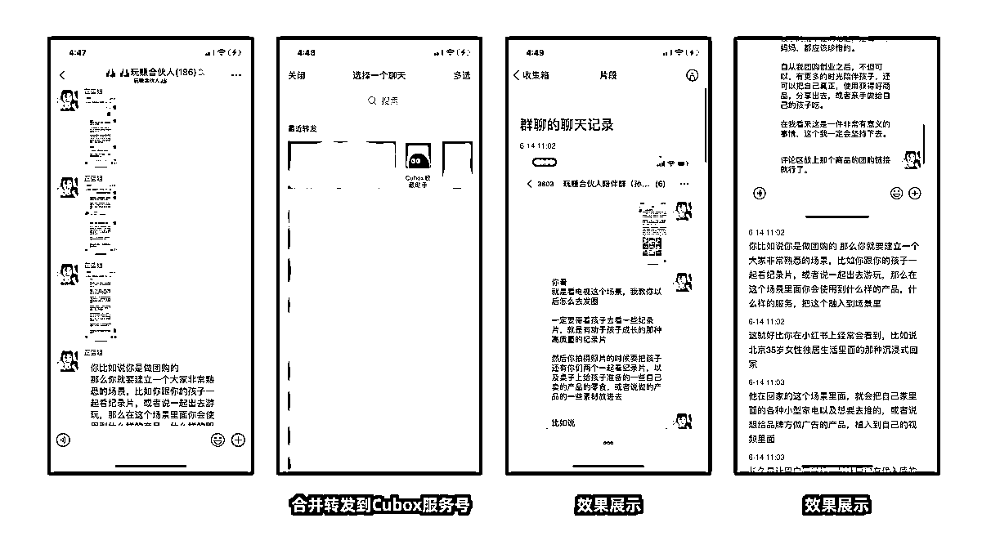

# 12.如何更高效得采集信息？

我以前在采集信息时有个坏毛病，每次采集完一篇文章、或者一张海报后，都习惯停下手头的工作，把文章做下归类。然后，注意力被频繁打断，就导致了2个问题：

1.注意力是易耗品，回归需要时间

2.我的注意力被各种中断瓜分得细碎，没办法沉浸工作

所以，我的工作效率会非常得低。

后来，接触了GTD方法后，我才发现之前的做法有很大问题。

GTD是Getting Things Done的缩写，这是戴维·艾伦提出的一套高效处理信息和任务的时间管理方法（本质上，其实是对注意力的管理）。它的核心理念是，是清空大脑，然后利用外部工具，管理一系列信息和任务。

这里和你介绍下它的前两步。

1.收集，这一步，就是把所有对你有用的东西，直接先放到脱离大脑的收集箱（中转站）中。不要每看到一个信息就停下手头工作，去分类、去打标签，因为这样的话，你注意力会被频繁打断，根本没办法专注

2.整理，分类打标签，把碎片化信息体系化整合

我以前的问题就在于，我在收集这一步就开始做整理了，导致注意力被频频打断。

所以，可以按GTD的思路，把收集、整理这两步完全分离。

首先，直接采集到中转站（中转站也经常被称作inbox、收件箱、收集箱等等，本质上是一个东西），没有的话手动建一个。

而整理的工作，可以在当前工作完成后，单独留一整块的时间统一整理。

这样，既可以维护工作时的注意力，也可以维护整理时的注意力，可以省下不少时间。

# 13.记得给命名来一套规范

很多时候，我们很难快速从一堆文件中找到想要的东西，这时候，可以试试给命名来一套规范：加个前缀序号。

大家可以看下这两张图，有没有发现，只要我在前面加个序号前缀，就好像加了个魔术一样，瞬间让他们变得整齐有序？

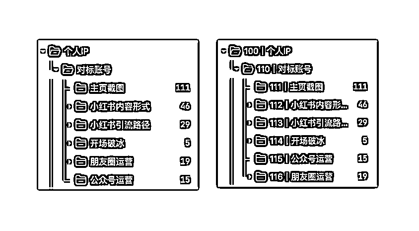

为什么？很简单，大脑是单线程运作，没有办法同时专注两个或者两个以上的东西。没有序号引导，我们就不知道先看哪个、后看哪个。

而加上序号，就可以给大脑做一个优先级的引导，加速先看什么的决策。

另外，我们人眼的眼动路径是从左往右，而前缀序号，可以成为一个「定位」的角色，帮我们快速定下视觉落点，让我们花最少的时间识别。

序号前缀我一般用两种，层级不存在嵌套时，直接加”序号丨”的前缀，比如 01丨小红书运营、02丨公众号运营...

如果存在多层嵌套，我会用到杜威十进制编码，简单说，就是通过不同位数的递进，来指代不同的层级。

比如100丨个人品牌，200丨自我管理，这就是一级组块。

【100丨个人品牌】之下的组块，就可以这样命名：110丨朋友圈运营、120丨社群运营、130丨公域运营等。

朋友圈运营下，可能又可以细分，比如 111丨成交圈、112丨生活圈等等。

通过这样的编码式命名，就可以快速建立各个组块的秩序，方便快速查找。再也不用在一堆混乱的文件中大海捞针。

# 14.每次写文章速度都特别慢，怎么办？

之前有学员也向我求助过这个问题，总喜欢修修改改。足足写了一个钟的时间

我听完后，立马问到，你是不是喜欢一边写一边回看，学员认同后，我立马惊呼，这不是以前的我嘛。

我以前的写作模式，也是和她一样的习惯。每写完几句话，就会下意识得停下，从头开始看写完的文字：

我有没有写错别字？

前面这块通顺吗？连贯吗？

哪个地方是不是用了专业术语、读者不容易看懂？

我写下来的这篇文章，对读者会有价值吗...

于是，随着我不断的往下写，这些动作开始不断得重复。有时候，因为发现前面写得烂，越写越没有信心，甚至想直接放弃。

背后原因很简单，就是因为我总想着，第一次就输出一个完美的文章。我无法接受，在我写完后，再回读时发现这篇文章写得那么烂。

但我没有意识到，正是因为一边写，一边不断往回看的习惯，让我的注意力不断被中断。而这就又引发了我前面所聊到的2个结果

1.注意力是易耗品，一旦被中断，它的回归需要时间

2.当频繁中断后，我宝贵的注意力会变得稀碎，我单位时间的产出效率自然急剧下降

怎么解决呢？

1.接纳初稿写得差的事实

初稿写得很差，这是再正常不过的事情，很多大牛、前辈，都写得很差。海明威还曾经说过：”一切文章的初稿都是狗屎“。

2.初稿写完，再花时间去打磨

粥佐罗老师说过：“没有人能够一步到位写出完美的文章。写完之前，完成最重要；写完之后，完美最重要。所以，在初稿的过程中，“推敲”是完全用不到的！

茅盾老师说：“假如你觉得文思汹涌,下笔如有神助了,那么,我主张你就放胆一气写出来罢。此时千万不用徘徊迟疑,要相信这刹那间奔赴你笔下的字句就是最好的最妥当的。直到发泄完了为止。字句的斟酌，此时也暂且不管。想到什么，写下来再说。

此时唯一目的在一口气把你脑中汹涌着的东西都移在纸上。可是完篇以后,你就得改变你的态度，现在你要十分苛刻地来审查你自己刚才所写的东西”。

所以，在初稿的产出中，我们随性而写。但一旦写完初稿，我们就需要转换为理性思维来好好打磨。

而这两个线程，你的注意力资源得到了最大程度的利用，不会被频繁的中断变得支离破碎。

所以，你的写作速度就能够明显提升。我自己有亲自体验过，这种创作和编辑互相分离的模式，效果非常明显。

# 15.写作时，总是担心外界的评价看法怎么办？

很多时候，我们在写初稿时会遭受各种念头的打压，一旦想写下自己的真实感受，潜意识总像个不友善的话痨一样在我旁边不停叨叨：你确定你这么写ok？你确定你不会掉粉？读者不会嫌弃？...

所以，我总是【为了他人】而写，而不是【为了自己】而写。

怎么解决呢？答案很简单，无视外界束缚，只需要跟随自己，记录自己的所思所感就可以。

真正的写作，应该是从心出发。

比如，在成稿阶段，跟随自己内心的想法、念头，把所有想法倾注下来。不用管是否合乎逻辑、合乎礼节、合乎主流价值观，这些都是外界的教条，而非你内在的真实想法。

比如，今天的你，在苦苦写不下开头时，倒不如直接在开头写上：现在，我正在遭受「不知道开头该怎么写」的痛苦...

今天的你，不知道该写什么时，倒不如直接写《今天，我不知道该写什么了》，你看，你的想法本身，就可以成为一篇文章、

今天，你在跟进学员作业时，闹情绪了，与其压抑着它们，逼自己理性得写干货，那倒不如直接把情绪记录下来，反问自己：我为什么会出现这样的情绪？之后该如何应对？而这些情绪记录，同样可以成为一篇文章。

这个过程的创作，会让你非常有力量、势不可挡，也更容易进入心流。

正像心流的英文flow那样，所有念头均朝着「创作」这一个方向奔涌。这时候便是契克森米哈赖所总结的，「这就是最优体验」。所以，不要停下来，以当下的自己为中心，一鼓作气得写完。

之前有接触过一句话，我很喜欢：

Real generosity towards the future lies in giving all to the present.

对未来最大的慷慨，就是把一切献给现在。

我想做一点改良：对未来最大的慷慨，就是把一切献给现在的自己。

# 16.为什么要将复盘糅到自己的知识体系？

我有做每日复盘的习惯，收获很多，但我的问题是：

每日复盘和我的知识体系，是互不搭嘎的。也就是说，我每天看书所记录的思考，和我每天复盘所沉淀的信息，被独立在了两个空间中。

一开始，我没有察觉，但时间越长，发现问题越大。

首先，我们以结果为导向，我看书是为了指导自己更好得决策、行动、做出改变。

我复盘，同样是为了指导我更好得决策、行动、做出改变。

他俩虽然角色不同，但最终所发挥的作用是一致的。所以，完全可以糅到一个知识体系里面。

但我把它们给分开了，加上做过的复盘很少再回去翻，导致我的每日复盘变成形式主义。

每天在做，但表现依然是碎片化的记录，而没有串到自己的体系里。

后来，我尝试做了下糅合，真恨不得扇自己嘴巴子，因为我发现，之前做过的每日复盘，全部是我自己特别宝贵的人生经验，吃了那么久灰真的非常可惜。

所以，如果你也在做复盘，一定要把它合并到自己的知识体系里。

比如，我每日复盘里存在3个【内容创作】方面的反思，那么在周复盘的时候，完全可以一并把这3个反思，给合并到知识体系里【内容创作】的主题下面，成为一体，来帮我更好得写作输出。

日常输入再叠加自己过往的人生经验，这样的知识体系受益无穷。

# 17.如何把所有图片统一整合到一个地方？

创业者会经常用到图片资源。

比如学员好评、成功案例、产品物料、对标竞品截图、文章配图等等，如果要发早安打卡、日签这类的朋友圈，还需要提前备上美图。

但这么多图片资源，不做好统一分类，调取时会非常麻烦。

我以前没怎么重视，看到有学员反馈了、有成交记录了、看到不错的对标主页了，都随手一截。

于是，每次去调用都得大海捞针。

虽然后面尝试做了相册分类，但是手机屏幕空间有限，找类目的时候也要耗费我很多时间...

后来，我索性把所有图片，整合到eagle这个电脑软件上，才发现还是eagle香啊。

我还在职场做设计的时候，就已经在用它管理所有的图片素材了。

不过当时主要用来整合海报和素材，后来才发现，个人品牌所用到的图片全部可以整到这里。

和你分享下我的工作流：

1.手机截图，直接隔空投送到电脑

2.投完后，手机的图片删除处理，避免积压

3.拖拽至eagle，文件夹分类（想细分类型的话可以再打标签）

比如，某个对标博主的小红书主页，我是分在了【个人ip/对标账号/小红书主页】这个文件夹中。

后面，想找对标账号的小红书主页，可以直接在这里快速查找。

另外，我在对标账号下面，也开辟了公众号关注回复、引流路径、对标产品等文件夹，后面一看到做的不错的，就可以快速整合到这里。

所以，对标账号这个文件夹，也可以成为我的营销灵感库，从灵感搜集到借鉴模仿，中间的阻力很小。

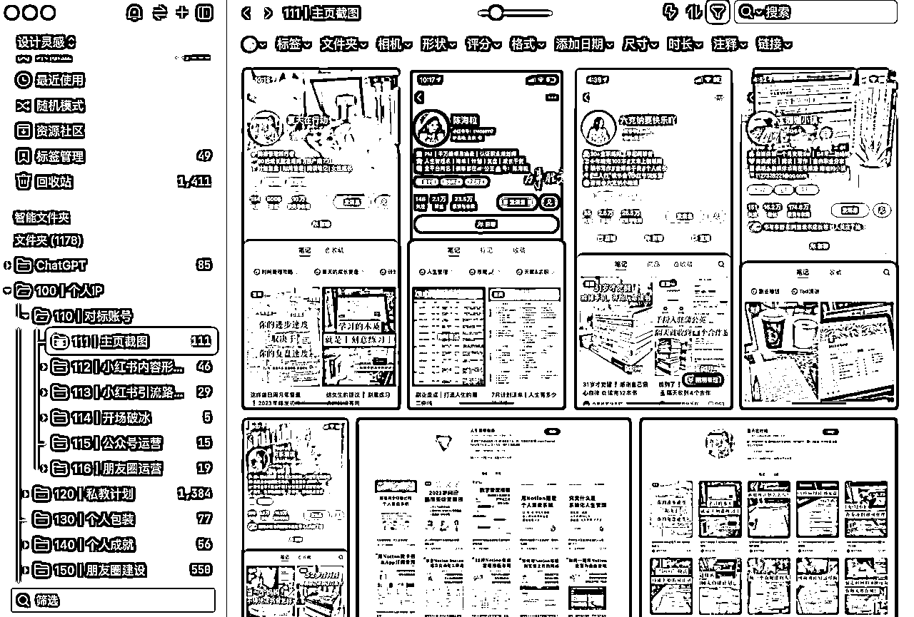

# 18.为什么知识体系需要用问题串联？

在搭建知识体系时，每串知识点我都会起个标题。

我以前都是习惯用陈述句来作为每个知识点的标题。比如「日更朋友圈的意义」、「持续创作的方法」、「快速输出文章的方法」等等。

但后面我发现，当我用问题来取代陈述句时，可以更好得为我所用。

比如上面三个标题，分别改为「为什么要日更朋友圈？」、「如何才能做到持续创作」、「写文章速度太慢，怎么办？」，这样的效果就会好很多。

因为：

1.相比被动投喂，大脑对要主动去解决的【实际问题】更敏感，这时候相关神经网络更活跃，可以提升我们信息加工效率，这也意味着，我们找起来更快了、更印象深刻了

2.问题往往对应着某些人群尚未解决的痛点。所以，当你把问题罗列下来后，相当于你有了帮大家解决这些痛点的答案。

那么，一串问题+回答，就可以成为「能解决一个痛点」的内容。

这些内容，往往更容易抓住读者眼球、引发情绪共鸣。

后面不论是发文章、发「观点类」朋友圈、还是做社群的小分享、或者是答疑，这些内容都是能一鱼多吃的好素材。

3.如果我在某个领域遗留一些痛点，同样可以作为问题，来记录到该领域的知识体系下，这样的话，我就可以基于这个问题，带着动机做主题阅读，阅读效率也会有加成。

所以，如果大家在搭建某个领域下的知识体系，都可以尽量用一系列的问题来串联。

# 19.如何管理所有咨询客户的来源信息？

以前我是每来一个咨询单，就约一次咨询，但是，这个客户从哪个渠道找到我，我从来没有重视。

这就导致了，我没有办法验证，当前某一条朋友圈/公众号文章的好坏。

后来，我尝试着在微信上给每个客户打上备注。

但是，如果这个客户是通过某条朋友圈来的，这个备注就需要我手动写上朋友圈的内容，很麻烦。

现在，我通过notion的数据库帮我解决了这个难题。

比如，我在notion中做了两个数据库，分别是咨询客户统计系统、朋友圈创作系统。

前者承载所有咨询客户的信息，后者承载所有朋友圈内容。

然后，通过relation关联功能，将这两个数据库做链接。那么，每个客户，我都可以添加它对应的朋友圈来源。

比如5个来咨询的客户，通过数据库链接，可以看到4个来自我发的某条朋友圈，那么我就可以验证这条朋友圈的效果非常好，我可以去提炼出文案的优势，以后再不断得复用。

notion的具体用法，大家有兴趣的话，后面有时间再和大家分享。

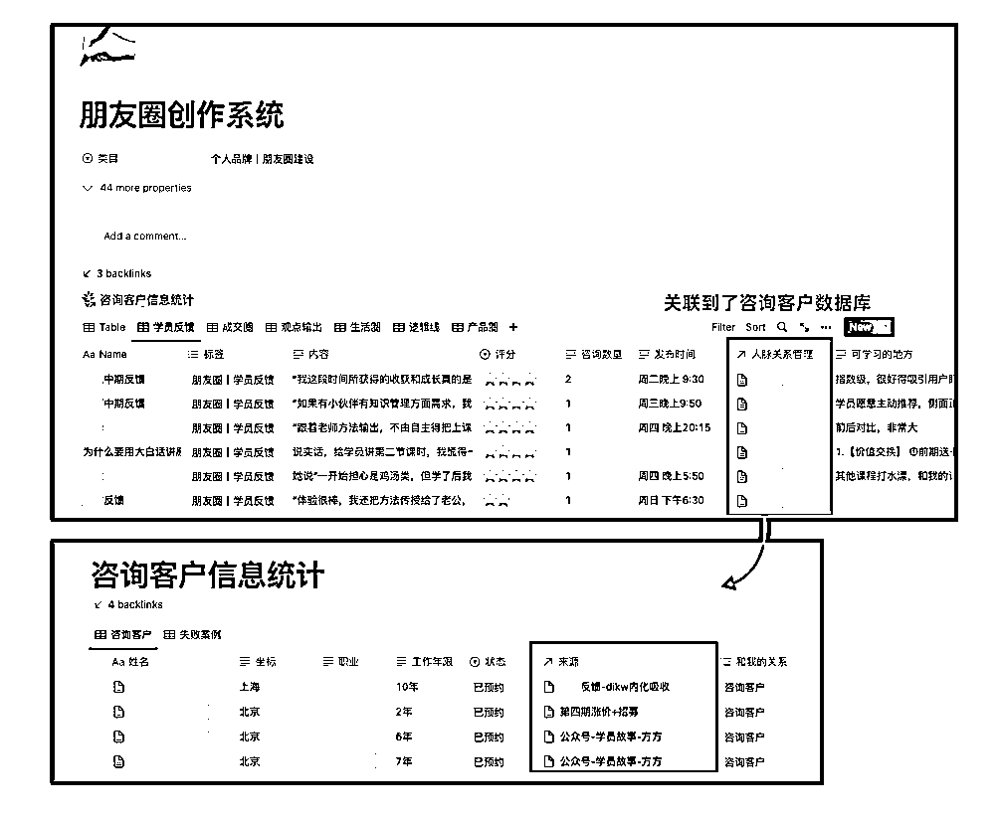

# 20.获取信息前，你得先意识到它是个信息

Louiscard有提过一个很有意思的观点：重要的信息就像是一个个靶子，有些近在咫尺，位置固定，不用瞄准，闭着眼睛都能命中。另外一些，离你很远，转瞬即逝，大多数人甚至根本意识不到它们的存在。

也就是说，我们很容易只留意到那些近在咫尺的信息，比如书本、文章、大佬的分享等等，但对于其他形式的信息却容易视而不见。比如社群聊天、朋友圈、电影台词等等。

我以前也是这样，错过很多非常有价值的宝藏。

事实上，知识星球、朋友圈、社群聊天、朋友闲谈、纪录片电影、甚至是自己的个人经历，这些都可以成为信息源。

那我自己举例，这篇文章中，原本每个小技巧的颗粒度很大、甚至包含完整的逻辑，但后面，我是刷到了芷蓝姐的朋友圈，看到了她的分享后，才知道，在写这类清单式的文章时，「每个知识点，要尽量穷尽独立，不要有包含关系」，所以我才有了启发、做了修改。

如果我对朋友圈信息不敏感，很可能就被我划走了。

所以，大家以后不妨对各类渠道的信息更敏感一些，世事洞明皆学问，只有当你意识到这是个信息时，才可能被你捕获、使用。

# 21.如何干掉共同点赞的小红点提醒？

讲个笑话，有一天，我花了很长时间打磨了一个朋友圈，自我感觉良好。

发完不到半小时，我瞥了一眼，小红点的数字瞬间飙到了30多，我喜出望外。

我喜滋滋得点开朋友圈后，才发现这些点赞的提醒，全部来自不久前给好友的点赞，因为共同点赞会同时提醒，所以点赞次数会全部聚合到小红点上。

虽说心态失衡了，毕竟点赞数无法决定你一个内容的价值。

但是，共同提醒这个机制属实有些烦人。

因为，这些数字存在着不确定性，你没有办法确定这些点赞的对象，是别人还是自己。

而且，小红点本身是一种严重干扰注意力的东西。

那么，如何解决这个问题呢？

方法简单到令人发指（但触发方式很隐蔽）

1.点击小红点提醒，来到通知列表页

2.找到你不想看到共同点赞提醒的朋友圈，左滑，选择「不再通知」，就可以完美搞定。

# 22.pdf该怎么统一管理、方便阅读？

很多资料都是pdf格式。

以往，我阅读pdf都是在电脑上阅读，但这样为我带来了几点麻烦事。

1.可能是文字渲染原因，pc端的字体字重会显得更重更粗，视觉体验会不好

2.pdf难以集中管理，尤其是手机上，我得专门建一个群，把所有想看的pdf发进去，一旦多起来就很难查找管理

3.很多时候，pdf和书籍属性类似，但因为格式而做了阅读方面的分离，断层感会很明显

而这些问题，一个简单的方法就可以解决——直接把pdf导入到微信阅读上。

如何导入？用微信阅读打开这个pdf就可以。

1.微信里打开pdf

2.右上角更多，用其他应用打开

3.选择微信读书就可以成功导入

这样，我就可以直接在微信阅读上，集中管理我所有的pdf，而且阅读体验明显好于pdf本身。

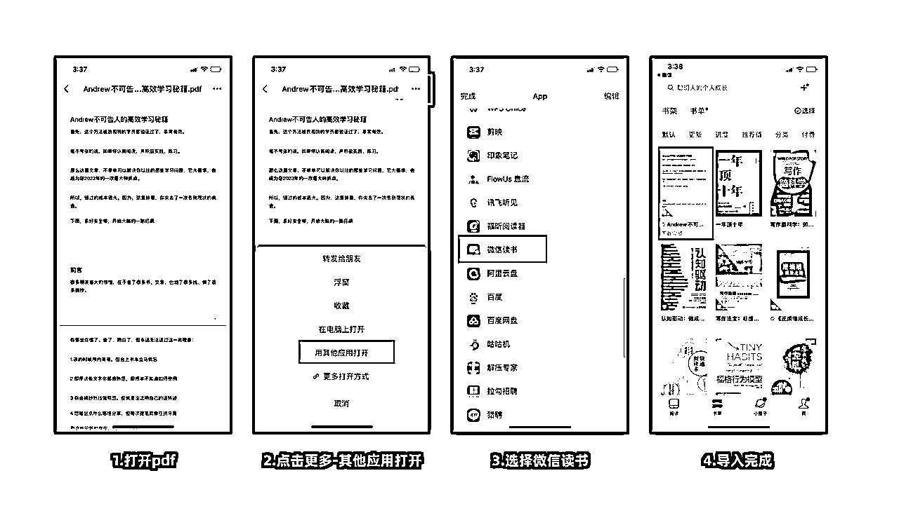

# 23.如何利用碎片化时间来快速清空、避免囤积？

收藏癖前面有讲过，其实还有一个有效策略，就是及时清空。

清空的时间，我一般安排在每周五晚上，但后来我发现，很多碎片化的时间，也非常适合做这类不费脑子的事，效果很好。

比如，乘地铁时、排队时、番茄钟的休息间隙时、等公交车时、等电梯时等等，利用好碎片化时间，来快速得做一个清空。

1.快速跳读完整篇文章，如果没有价值、没有触动点，直接毫不留情得删掉

2.有价值、有触动点，高亮、快速记录关键词（类似卢曼的闪念卡片）

3.将挑选出来的文章，做好文件夹分类

这样充分利用碎片化时间持续清空，囤积的问题可以得到明显改善。

# 24.阅读的时候，总是忍不住想要默读怎么办？

默读是阅读障碍之一，它的意思是，你在一边用眼睛扫视的同时，脑袋里一边跟着发出声音。

我以前读书也有这个问题，很困扰，因为，一方面拖慢阅读速度，另一方面，脑子里跟着发出的声音会非常干扰我的注意力。

出现问题，我们先找下原因背后的原因。

默读背后的原因，来自一个错误认知：觉得不默读就会走神，所以忍不住默读来让自己全神贯注。

但默读时，脑海发出的声音就会成为干扰信息，更容易走神。

如何避免默读呢？

一个很简单的方法，就是用手指、或者笔去引导视线。

因为，从接收信息的效率上，视觉处理效率要比听觉高出百倍不止。所以，视觉移动的速度远远快于说话的速度，声音会跟不上，自然避免了默读。

我默读的问题就是这个方法解决的，大家后面读书时也可以这么尝试。

# 25.输出什么内容更能打动读者、吸引成交？

输出关于自己的一切。因为，只有出现了“你”，读者才能感受到“你“的存在，为你投射他们的感受和情绪，慢慢因为你的故事、性格、价值观靠近你、喜欢你。

芷蓝姐说：“内容输出，一定要紧紧围绕自己进行，写自己的感受，自己的经历，自己的判断，自己的决策等等。

作为一个内容创作者，“真实”就是你的独家武器和别人无法跨越的壁垒。

工具可以复制，行为逻辑可以复制，甚至是文笔都能复制，但唯一不能复制的，就是每个人的真实生活”。

L先生说过：“好的文章，是高度人格化的。你可以感受到作者的性格、喜好、气质、厌恶，甚至觉得作者在和你对话。因为，只有人，才是我们可以投射感情的”。

明白老师也说过：“用户愿意购买我们产品，我们自己占了90%的

作用。而这90%怎么做，就是输出关于「自己」的一切。你的工作、生活、读书、思考、价值观、人生态度等等，以此让用户喜欢你、信任你”。

遗憾的是，我们很多时候并没有意识到这些，我们会成为一个故事的搬运工。什么意思呢？

别人的故事，我们可以信手拈来，然后随意在一篇文章中来讲，来论证观点、来开头引入，来升华主题，但却极少加入自己的个人经历。

这是很多创作者容易出现的问题，我自己也是这样。

我之前写了很多文章，但是，这些文章，基本从未讲过我自己的个人经历。

我只是在从第三方视角，给大家展现一个旁人的故事、第三方的现象或者技巧。

而当我在回看自己的文章时，也会觉得哪儿有些不对劲，有些乏味。后来，当我试图去加入自己的一些个人经历后，创作这件事儿完全就变了。

原本的第三方视角，变成了我自己的视角，就好像我对面坐着读者，我坐在木椅上一边喝着茶，一边将我自己的故事给他娓娓道来。

这种和别人讲自己故事的体验，很奇妙。

在写高考时，我会讲自己考第一门语文试，作文没写完的窘境；

在写职场时，我会讲之前在团队带新人的经历；

在写语言的力量时，我会讲之前在合租房被气到窒息的经历；

在写内向时，我会讲我从来都喜欢一个人默默干饭的经历；

在写被讨厌这个话题时，我会讲去年分享视频教程时，被很多人骂的经历...

即便在讲一个其他人的故事，我也会试图加入我内心的感受和想法，让读者看到“我”的存在。就好像我时刻拿着小喇叭在喊，“嗨！看这儿！我在这儿呢！”

而这些带有我个人经历、个人感受的文章，往往能获得更多的点赞、评论。

如果是软广，也能更容易吸引咨询单和成交。

后来，我才发现：以前，我费尽心思讲很多专业的东西、或别人的故事，但这些东西换谁其实都会讲。大家就算共鸣了、喜欢了，但是，大家喜欢的也只是你这个“内容”，但对于“你是谁”其实是没有认知的。

而且，网上写这些东西的有一大把，我凭什么要关注你？

所以，真正重要的，是输出关于自己的一切，因为只有这些内容，读者才能透过文字看到你的存在：哇，原来这篇内容，来自这样一个真实存在的你。

然后，读者会感受到你的感受、你的喜好、你的厌恶、你的价值观，从而愿意去靠近你、关注你和信任你。

所以，去输出关于自己的一切。每一篇内容中的「思考」部分，都是一块可以展示自己的小舞台。

我有什么样的故事？

我在做自媒体的道路上踩过哪些坑？

我在知识付费上走过哪些弯路？

我有那些特别痛苦的低估时期？

我有哪些不为人知的秘密？

我对这个故事是什么样的感受？

我迷恋什么？厌恶什么？...

而能输出自己的一切，又有个大前提：

你能意识到、捕捉到、并记录到过去每一天，在你身上所发生的每一件事，并将这些事变为你的写作素材。

* * *

# 番外：对生财合集、以及索引站的6条小建议

## 关于生财合集

其实，当时亦仁大佬在评论中让我提建议时，我还挺惶恐的。

很多东西，生财团队肯定早就发现了，他们肯定比我更懂、更了解圈友的问题。

所以，以下仅仅是代表我个人的一些不成熟的想法~

### 这个功能是什么

生财合集功能，早在5月29号就做了小范围的尝试，6月29号首发上线。

主要作用，是将各个优质内容（主要是精华帖和风向标）做深度整合，包括思维认知、项目实操经验、玩法等等，方便大家进行主题阅读。

在10月20号，生财在「抖音图文」合集上进行了一次新的尝试，以「赛道」视角，用3个问题做了拆解，并且通过思维导图来呈现，更宏观、更细分了，也收到了很多圈友的欢迎。

### 大家反馈怎么样

大家的反馈基本都是正向，有对这种体系化的肯定：

“这样呈现更聚焦“

”合集的合集，太酷炫了“

”这个好“

“花心思了，这非常有用！”

”如有神助，这几天正在看相关的“

“对于新人小白，可以更快速的深入学习感兴趣的内容”，可以让小白通过主题阅读的形式，快速了解

有对生财团队的认可、甚至催更

“生财团队太贴心了，这么用心的团队真没有了”

“内容组你牛逼”

”每天坐等鱼丸的合集“

### 一些吹毛求疵的想法

#### 1.部分圈友对合集的认知不够强

这个判断来自一部分圈友的评论。

“这种合集类的文章在哪个栏目能看到其他的呢?”

“这些合集，从哪儿入口进去查看呢？”

”才知道居然有合集“

这些评论意味着一件事：这些圈友可能在精华帖有突然刷到，觉得这种组织形式很棒，但不知道「合集」来自什么位置。

为什么不知道位置，我简单分析了下，可能是三方面

1.刚进生财、或者进了有一段时间但逛得很少（根据提问圈友们的编号可推测，新圈友/老圈友都遇到这个问题），对业务板块不够了解，没有意识到「合集」的存在；

2.这个圈友一直用的是小屏，我尝试用小屏手机进星球，发现顶部的「合集」tab被隔断了，只能露出「合」这个字；（这个问题涉及到业务版块的优先级，如果我提把「合集」提到「风向标」前面，我可能会被打，暂时弃了）

3.这个圈友用的是pc端索引站。但pc索引站没有给合集的入口，所以没看到。

所以，我想到了一些策略

1.pc端索引站增加「合集」的入口（前几天发现生财索引站已经更新了，这条作废~）

2.增加触达的渠道

①置顶迭代

在置顶的「新手指南」「使用导航」中新增「合集」的介绍，让新圈友第一时间了解。

②更新日志

或者，单独开辟一个「更新日志」的入口，关于生财任何方面的调整、升级都可以在这里展示出来，一目了然。

③双向链接

每一篇被收录到合集的精华帖，都可以加上合集所在的链接，并且加上行动指令。

比如“感谢xx圈友的贡献，该精华帖已被收录至「xxx」合集中，如果有对此方向感兴趣的圈友，可以在这里查看更多”

一方面，增加了「合集」的曝光触达；

另一方面，变相得融入了「推荐更多」的功能，圈友觉得有兴趣，不需要再去索引站手动搜索，直接点开合集，所有类似的项目即可一览无余。

④加上尾巴

每一个合集，都简单加一句尾巴，引导大家去「合集」中查看更多。

比如“以上便是今日的合集分享，大家可以点击顶部的「合集」标签查看更多哦”

⑤公众号入口

生财的公众号其实有增加了合集的曝光渠道——在文章的结尾衔接了相关的合集。

比如说《年轻人抢着上的夜校，原来这么赚钱》这篇文章，就在文末衔接了「小红书本地生活」合集。

不过，后台的「会员权益」中还没有看到，我在想，是不是可以用一篇文章简单介绍。这种合集内容，对于还未加入生财的人来说，会非常具备吸引力。

⑥航海入口

在每一期的航海中，也可以放出对应的合集链接，让更多人了解到它的存在和位置。

#### 2.部分圈友对合集汇总有诉求

比如

*   查找往期合集中的某个项目不方便，需要把鱼丸之前的合集帖子都查一遍才能找到，如果有个合集汇总放在电脑端，使用体验个人感觉会更好

*   建议索引站增加合集选项卡，把合集按时间排列

这个问题，用心的生财团队，也在我写这篇文章的时候做了更新，很贴心。

不过我再鸡蛋里挑骨头下：

1.如果一行的入口能增加到3个或者4个，体验会不会更好呢，现在屏效稍微有些低，我需要划很久来浏览

2.目前是每月精华帖和合集混在了一起，如果能分为两类，会不会更好一些

3.现在是将所有合集全部简单得铺开来，查找效率会比较低，如果再做一个父级分类去合并同类项，会不会更易于查找？

比如「赛道合集」，就可以包含「家庭教育」「情感赛道」「母婴赛道」，这样，我想了解某个赛道的玩法，就能快速从「赛道合集」中检索。

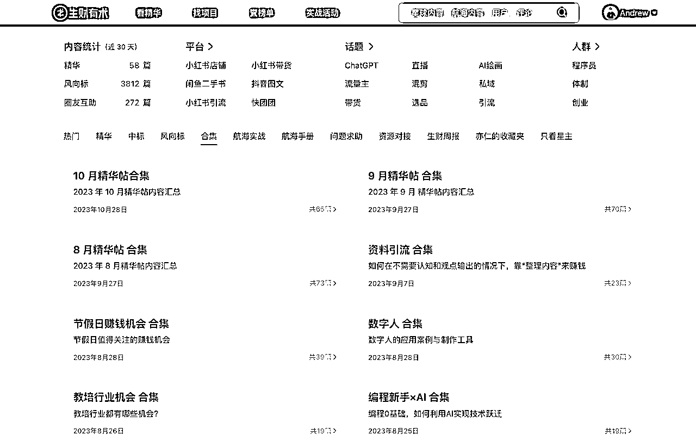

## 关于索引站

1.屏蔽功能

比如，tiktok、跨境电商这些项目，我可能就不会去看，如果可以通过屏蔽的方式先一步排除，圈友们的信息过载问题会不会有些许改善？

2.关于生财订阅功能的一些疑惑（来自本文的3.5章节）

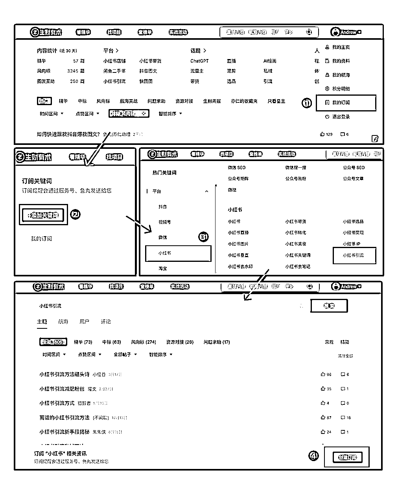

PS：这里好像出现了一个bug——

当我收起【平台】选择器后，去尝试订阅【话题】选择器中的关键词，比如「ChatGPT」；

或者订阅【人群】选择器中的关键词，比如「产品经理」，是不会出现「创建订阅」这个按钮的。

当然，如果生财目前的策略，就是针对于【平台】，感觉直接隐藏掉下面两个选择器，体验可能会更好一些。

另外，再来一个吹毛求疵的小建议：我的订阅页面，加上关于订阅推送的时间、频率会不会更好一些？不然可能很多圈友对这个功能的效果没有预期，决策上会有阻力。

# 最后

以上，辛苦看到这里，希望这篇知识管理方面的帖子能对你产生帮助。

感谢芷蓝姐、靠谱的指点、托举，感谢各位玩赚合伙人们的支持、反馈。

我是Andrew，若文中任何细节没有看懂、欢迎找我一起交流探讨。

如果有什么能帮到忙的地方，我也很乐意给你提供帮助。

祝我们一起生财有术。