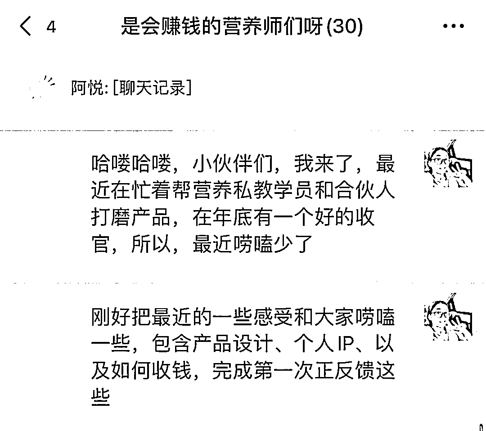

# 做营养师副业的一些认知

> 原文：[`www.yuque.com/for_lazy/thfiu8/ffg99lp1pv2as9vi`](https://www.yuque.com/for_lazy/thfiu8/ffg99lp1pv2as9vi)

## (18 赞)做营养师副业的一些认知

作者： 阿悦

日期：2023-12-01

大家好，我是营养师阿悦，昨天给小伙伴们唠嗑了一下关于营养师 IP、如何变现、正反馈的一些话题，有小伙伴说很有用，借由生财这个平台，也分享给想做营养师副业、或者已经是营养师但是还没有找到商业路径的圈友，希望可以给一些启发和碰撞，也欢迎大家一起交流啊，营养师这个行业，大家一起共创，才会更加精彩

一个分享的小背景，结尾有图。以下，开始正文内容

第一个：不要步子跨太大

我的营养私教学员，有美国本硕连读的科班出身，也有自己是工作多年考了一个营养师证，有一份工作，想跨行的，包括有的是从事这个行业，只不过是运营、产品角色，而不是营养师角色

我的合伙人，目前是某些平台的小 V，但是没有流量，对，是有粉丝量，没有流量。也有的是实体店、培训机构，纯纯信任，然后找我的

大家都是抱着期待和信心来的，但是，信心和期待可以有，不要跨太大，这里，其实就是一个目标制定的问题

刚好最近在陪他们打磨第一个微产品，所以，想聊一聊不要把步子跨太大这个事情

我自己，和我的副业团队，我们也做了 2024 的一些规划，比如 2024 年 3 月和 10 月，我们会搞两个事件营销

但是，12 月，也很重要啊，如果没有一个月一个月把地基打牢，3 月和 10 月的事件营销，其实就是空中楼阁

所以，最近陪我的学员和合伙人打磨产品，第一个感受就是，大家一定要立足实际，再跨步子

这个点分享出来、刚好也是因为今天是 12 月的开始啦，大家要是想 2024 年过得还不错，不要光盯着明年计划，12 月计划也很重要

第二，要粉丝量还是要钱

这个是根据第一个步子不要跨太大，延展的一个话题

我们群里，有不少小伙伴是想做个人 IP 的，甚至大家也有一些成果。刚好我们也可以聊一下大家的一些实战感受

粉丝量，对于秀肌肉、展现实力很重要；但是，我们如果是以商业为目标，那我们，要的是粉丝量吗

其实不完全是，我们要的是变现。两手都要，当然很好，但是我们目前精力、实力，允许吗

如果不允许，把钱握在手上，落袋为安，很重要。

因为，粉丝量和变现不冲突、不矛盾，本质上是，结合我们自身实际，能抓住哪个就先抓哪个。百鸟在林，不如一鸟在手

那百鸟不重要吗？重要的，至少我们知道林子里有鸟，那我们抓到鸟的概率就会有，而不是去池塘抓鸟

所以，粉丝量和变现的关系，大家也可以自己琢磨琢磨，千万不要，又没有粉丝量，又还没有抓到鸟，不就亏了嘛

还不如老老实实心安理得的躺平

第三，产品承接

一定一定一定要有产品承接

我们的内容，真的要考虑围绕产品去设计

以我的一个营养私教学员为例，她目前做上班族人群的减肥

那产品就是帮助上班族人减肥

可以用课程、用训练营各种形式

内容，就很泛了

上班族感兴趣的话题，都可以说

比如最近很火的大厂裁员、滴 di 崩了，年终奖、年底加薪

所以，大家可以看，内容，跟我们产品，其实不太相关的，但是这些是流量密码，是精准人群

这个，就是我们在做内容时，需要注意的点，内容可以泛，人群必须直

因为我们最后，都是在私域，在微信成交，那么，这时，他们被吸引，你被添加，才是最重要的

被成交，是时间的事，是讲究天时地利人和的事

你只管做你自己，有的进度条，你可以推动一下，有的进度条，不以你意志为转移

这是我刚刚去朋友圈截图的，这个就是时间进度条（图附在文末）

所以，大家可以看看，我们说着做个人 IP，要变现，我们真的有设计具体可以承接的产品吗？我们真的有为产品成交，围绕产品设计内容吗

这个，或许是我们可以再延伸唠嗑的点

因为成交就是玄学，但本质上，还是你要先做

我也有小伙伴来问解决方案，我一开始讲，她就叫我不要推销产品的。可事实是，如果我们真的三言两语讲清楚，那有的问题，其实就不是问题

有的问题，可以三言两语讲清楚；有的问题，三言两语讲不清楚

有的问题，别人，凭什么三言两语，给你讲清楚

所以，这个也是不去白嫖或者不被白嫖的一些度，大家也可以把握一下。或许有时候我们都没有感觉，后知后觉才发现，那也没有关系，敏感度也是我们慢慢练习起来的

第四，先去做，做成，才波澜壮阔

我的合伙人，最近有一个学员，做增重的，收了 499，来报喜

所以，大家有时候在看减重好，还是减肥好、或者减脂好，还在选一些细分赛道，结果发现，增重，其实也好

但好与不好，其实与你无关

你自己好，身边人也在慢慢变好，这个才是真的好

那说回到我们本身，有不少想做个人 IP，想做营养的小伙伴，这时，我们可以思考一下，在 12 月，我可以做什么？来迎接更好的自己，迎接更好的 2024。

毕竟，做成，才波澜壮阔嘛。哪怕就是收了 99、或者副业增加 1000，那也是你的实力展现嘛，是你真正去做了后，获得的奖励。

第五，正反馈，一定要有

正反馈，可以是我们通过专业解决问题，获得了报酬，也可以是别人感受到了我们的变化，对我们的夸奖，但是，所有的正反馈，都体现在我们先去做的前提下

如果正反馈有，甚至有很多，那说明我们做对了。如果正反馈少，有可能是路径不对，有可能是圈子不对，也有可能，还需要多一点时间，等别人反馈

没有人不喜欢夸奖和肯定的，我们自己需要正反馈，也需要别人的正反馈或者反馈

不然，自己做着不得劲，不得劲后，就会少做或者不做，甚至做得不开心，这时，容易陷入 si 循环

我们需要做的是，自己给自己建立正反馈机制，同时，主动出击收集一些正反馈

有一说一，反正别人夸我的时候，我就很开心。

不贪多、不把步子跨太大，每一步有每一步的成就，循环起来，或许，2023 的最后一个月，你也会先感受世界的精彩。

以上，比心

* * *

评论区：

帅彬 : 优秀呀！加油！！！

* * *