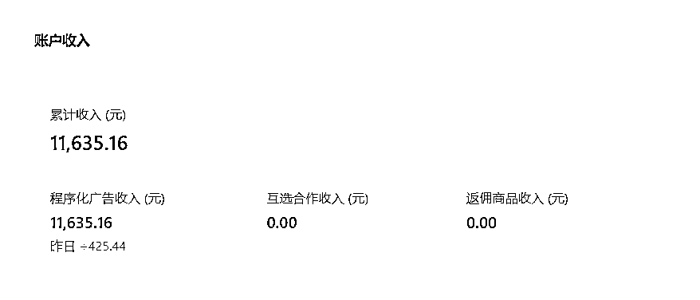

# 公众号流量主项目，小白操作 30 天，写出 8 篇 10w+，单号一个月变现 1w+

> 原文：[`www.yuque.com/for_lazy/thfiu8/quuvzarw0h14v8qs`](https://www.yuque.com/for_lazy/thfiu8/quuvzarw0h14v8qs)

## (54 赞)公众号流量主项目，小白操作 30 天，写出 8 篇 10w+，单号一个月变现 1w+

作者： 杨梅

日期：2023-11-29

《公众号流量主项目，小白操作 30 天，写出 8 篇 10w+，单号一个月变现 1w+》

大家好，我是杨梅，今年 4 月加入的生财，一直在潜水围观，看到了公众号流量主这个项目，觉得可以躬身下场试试，7 月底注册了 2 个公众号，开了流量主，9 月初才开始项目，10 月下旬才开始稳定日更，终于在 11 月拿到结果！

期间经手了 4 个号，放弃了 2 个号，做起来 2 个，其中 1 个号 30 天写出了 8 篇 10w+，单号一个月变现 1w+，新号是一周前入池的，也收益 1000+了。

收入比不上很多大神，做事也比较拖拉，执行力也不如众多圈友，但我的经历，对很多副业小白来说，可能更具有普适性和参考价值。

咱们普通人不求一鸣惊人、一夜暴富，只需日有所进、月有所变、终有所成。

接下来说说我做公众号流量主项目的经历，希望对大家有所启发和帮助：
[`oqug8xrurr.feishu.cn/docx/HAFkdRnvaoGGi9xlL06cRnQ1nsg?from=from_copylink`](https://oqug8xrurr.feishu.cn/docx/HAFkdRnvaoGGi9xlL06cRnQ1nsg?from=from_copylink)

* * *

评论区：

闯天下 : 666
一卒 : 666
Pemberry : 我日阅读跨进 10 万的时候，流量停了两天，10 万跨进 20 万的时候，又停了两天，现在 20 万跑了 7 天，又停了，[晕]，大佬们有遇到过这种情况吗？
Dubhe : tip：
过程：返璞归真，对标，仿，日更；
坑：坚持日更很重要；AI 和洗稿会被检测；继续更文能二次入池。

* * *