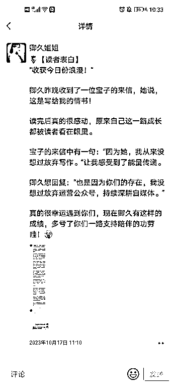

# 运营朋友圈大半年的误区及避坑

> 原文：[`www.yuque.com/for_lazy/thfiu8/fa3pfseltvvg3t8c`](https://www.yuque.com/for_lazy/thfiu8/fa3pfseltvvg3t8c)

## (20 赞)运营朋友圈大半年的误区及避坑

作者： 赵卿久

日期：2023-12-01

哈喽，生财有术的友友们好，我先自我介绍哈，我是卿久，97 年中文系，运营两个公众号，慕卿久与未来可期的小赵，全职自媒体 3 年，粉丝 18w+。

擅长公众号运营和打造个人 IP、搭建自己的付费产品和私域运营，如今通过自媒体成功变现 60w+，目前月入 4w+。

学会做朋友圈内容规划并坚持发朋友圈一段时间后，需要以 10-15 天为一个周期，定期进行复盘，看看有哪些地方是不足的。

今天总结运营朋友圈大半年以来，卿久曾经陷进去的一些误区，给大家避坑噢～

**第一点：过于自我。**

这是错误的。

我们发圈不仅只是展示自己，有时候还得去夸夸别人，感谢他人，惦记他人。

人际关系中的高情商很重要。

蔡康永老师说过：“你越会说话，别人就越快乐，别人越快乐，就会越喜欢你；别人越喜欢你，你得到的帮助就越多，你就会越快乐。”

**发圈也是同样道理，当我们发圈欣赏别人，你的读者会感受到你是一个懂感恩的人，会觉得你是一个懂得尊重别人价值的人，自然也会尊重和欣赏你的价值，并同步链接你。**

所以我们每周发圈，可以发 3-4 条有关欣赏赞美学员、惦念朋友，或感谢老师的文案。

有小伙伴会问，之前没怎么写过，不会写，或者我们怎么可以穿插这些内容呢？

卿久在这里举反例和正面的例子，让大家都体会一下哈。

这条文案是关于感谢读者来信，我们可以明确是哪一位宝子，征求同意后，不打码，点名道姓去进行感谢。

卿久意识到这点注意事项后，之后发圈都留了个心眼。

卿久最近安排制作合伙人专属海报过程中，有让朋友帮忙设计海报及制作和帮忙收集大家资料，在前几天的文案中于是特意提到这两位宝子，谢谢她们的帮忙，肯定她们的付出！

然后刷到了合伙人的朋友圈，引用她们的文案时，也会写出来她们每个小伙伴的笔名，给予肯定/赋能。

刻意留意之后，就会发现，生活和工作都会有比较多的素材可以进行发圈赞美别人。

感谢和赞美别人有助于我们向上链接和多多破圈一种方式哈，我们多去赞美自己的讲师，赞美自己的学员，感谢圈子里帮助过我们的朋友。

谢谢讲师的耐心指导，讲师看到了说不定也会在 ta 自己朋友圈 cue 你，讲师的流量池是很大哇，无形之中帮你提升知名度，给你导流！

用心去夸自己的学员，ta 们是会感受到你的真诚和付出，更用心地去学习，有所成绩后，还会给你推荐新学员！

**第二点：只谈现在。**

这是错误的。

有很多宝子的朋友圈，分享日常生活，分享学习和成长，主要以当前发生的事为主，没怎么提以前的事，没有前后对比意识。

卿久建议大家可以多去回忆一下之前的经历，大多数宝子的副业以自媒体为主，可以写写接触自媒体前后的变化，比如技能、收入、圈子，这些都可以进行对比。

前后的经历和变化都摊开呈现在朋友圈，会让读者对你的经历更加了解，印象也会更加深刻，突出现在成长了蜕变了，让人心生向往，愿意追随。

一个人的成长过程普遍是从弱小到强大，从依赖到独立，用文字表达出来，会让有着相似经历的小伙伴自动代入，引起共鸣。

以卿久为例，大家都知道我以前是打工人一枚，负责电商文案，每天都被老板 PUA，一次工作转正时工资和面试时有出入，一次工作强制加班却不给额外的加班费，这些都是职场常见的不公现象。

现在，工作时间自由，接到广告恰饭，几分钟粘贴后，近 4 位数的收入马上到账，美滋滋！

这种对比，就可以通过发圈去体现出来。

像这条就是反面例子，有点单一，向读者展示，能表达出来的内容，他们能获取的内容，都很有限。

像这样的文案我们应该怎样去修改？

大家可以看下卿久这条准备晚上发的朋友圈，前后就有对比，有反差。

进步即使比较微小，也要及时展示出来，久而久之，可以形成养成系 IP 印象噢。

另外，大家不要有心理负担，不要觉得晒成绩晒变化会引来不好的声音，总会有人懂得欣赏你，并且认可你，放宽心点。总是畏手畏脚很难成大事。

**第三点：拖延发圈。**

这是错误的。

以前运营朋友圈，卿久经常这样：有想发圈的想法，素材都准备好了，但因为忙着其他活，发圈这事就给忘记。

等都忙完了，要么就是忘记发圈，浪费了素材。要么已经没有太大兴致去发，因为算是过时文案了？或者感觉写得不好？案例不咋样，各种，不想发了

如果你也是这样的，那就要注意，一定要及时表达，及时发圈，不要憋着，不要拖延。

就好比写文章一样，一旦被打断，停笔休息或者第二天继续写，是不是发现没有什么灵感了？甚至发现写文激情大大下降，不能坚持下去，类比发圈，一样的道理哈。

现在，卿久慢慢改掉这个坏毛病！错过发圈机会，不仅会降低写文案的热情，还会错过曝光机会，丢失链接可能性哦！

所以，有学员报喜，立刻写文案晒！有感悟收获，立刻写文案发！不要等第二天！哪怕熬一会夜。

以上就是发圈的一些注意事项，希望有这些问题的宝子注意并优化！祝大家多多变现！！

* * *

评论区：

暂无评论

* * *