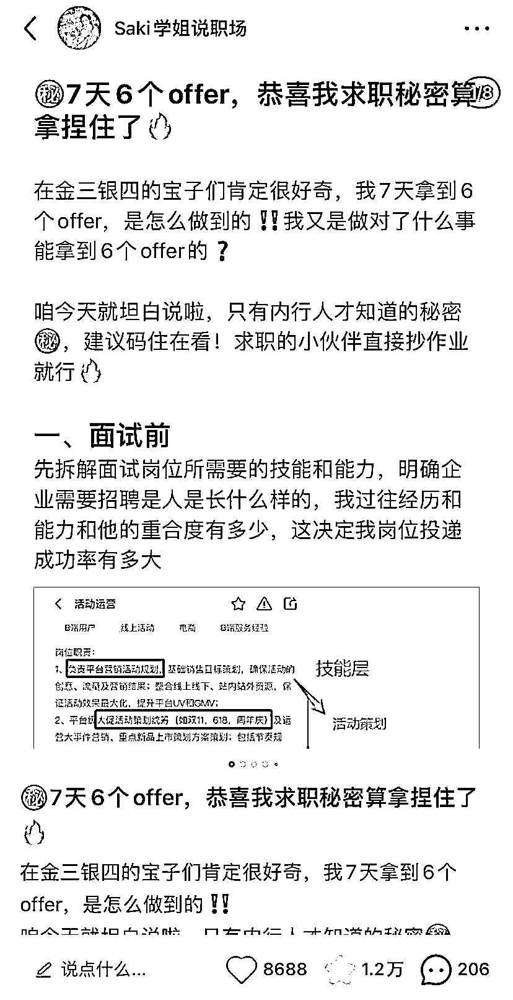
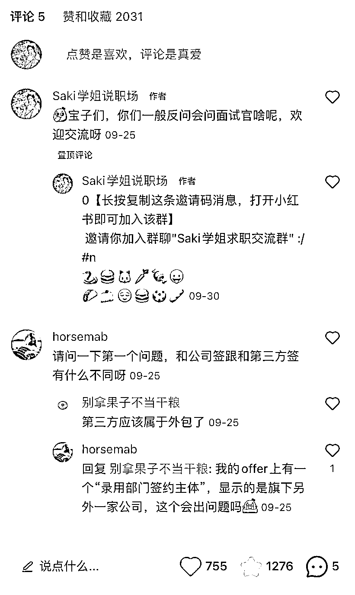
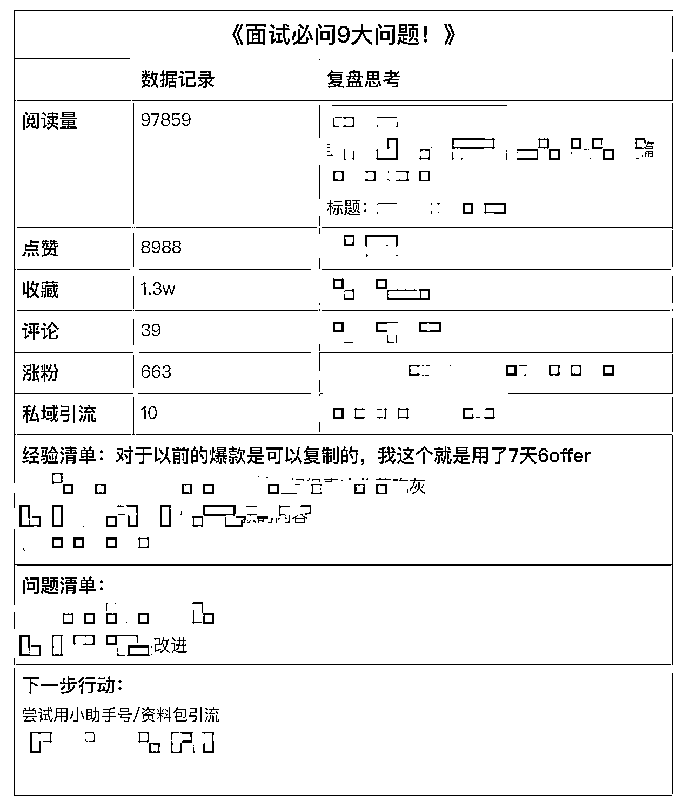
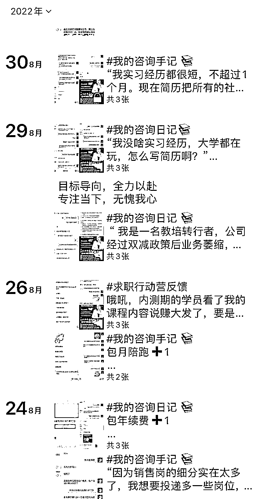
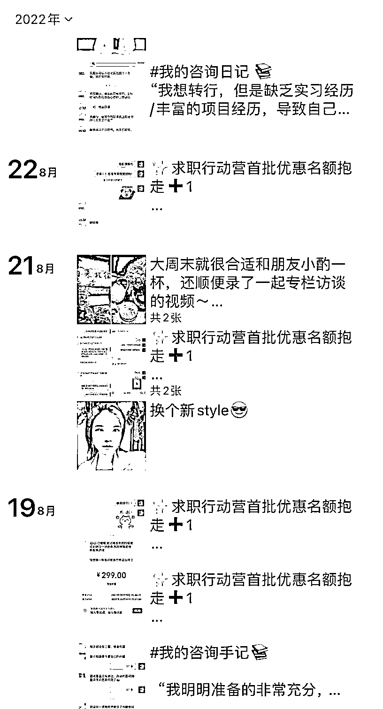
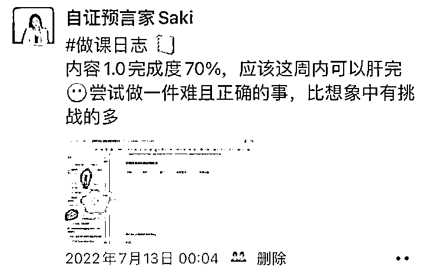
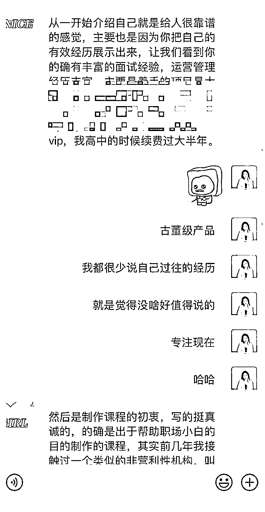

# 996 职场打工人，通过在小红书做职场教练 1 年变现 6 位数，我做对了什么

> 原文：[`www.yuque.com/for_lazy/thfiu8/kln6w7by4mxr0k72`](https://www.yuque.com/for_lazy/thfiu8/kln6w7by4mxr0k72)

## (21 赞)996 职场打工人，通过在小红书做职场教练 1 年变现 6 位数，我做对了什么

作者： 自证预言家 Saki

日期：2023-11-27

大家好呀，我是自证预言家 Saki，现独立咨询师、知识 IP 孵化教练。

这篇文章是我 2022 年在职场上写的项目复盘。

在大环境求职环境寒冬环境下，今年我却副业超过主业 2 倍然后裸辞出来单干，也希望这篇文章能在生财有术做独立教练的小伙伴一点启发~

## **为什么做职场教练契机**

不知道大家对工作有没有这样的职场倦怠：

作为一个 996 的打工人，在工作上遇到操蛋的事情可真是不少

有时候还得给同组做不好事情的同事兜底，做救火队员

每天心里都有 1w 个草泥马在奔腾，心累又无力……

在 2021 年初的时候我就开始去寻找各种副业的可能性，为的有朝一日可以开除老板，自己单干。在这个过程中，我做了非常多的副业探索，淘宝客，闲鱼卖货，运营个案咨询，社群代运营，微商，兼职讲师…

因为我一直在不断的尝试，不够专注，但别人在笃定深耕的领域已经遥遥领先并且有结果。面对这种落差和挫败感让我难以接受，导致心态失衡。

那时候我本来想好好搞自己的主业就算了的，当时把自己的复盘文发到一个小圈子社群里，刚好被中小企业老板看到了，于是有了 2B 代运营的合作。

正因为我在 8 月接入了代运营这个副业，然后被熟悉的朋友知道了，他觉得我的成长速度在同龄人里算是比较快的（当时主业副业双曲线）想拜我为师看看我的思维模式，带他度过职场新人适应期。

当时我觉得何德何能，就当一个教练小型 MVP 任务，也没想过扩张和持续性，一开始就当朋友帮忙做着玩的，收的钱也不多，咨询费就 99/h，那时候连续带了他三个月，每周一次课，平时做答疑，我还挺喜欢这种给人做职场教练赋能的过程。

当时我在微信里简单宣传了一下朋友案例，当时有几个需要求职小伙伴看到我有这个陪跑服务，一开始转化的很顺利。

在我思考如何把这事规模化做起来的时候，但遇到了招生瓶颈，没有额外的流量，单靠现有的朋友圈比较难再有增长。

在 22 年的时候，正愁流量这事，看小红书营销报告，觉得小红书是一个精准的流量渠道，就赶紧报名小红书训练营去进行系统的学习了。

### 01、训练营学习+不断实操摸索，感受到了小红书引流的快感

我在 1 个月内系统学习了相关的小红书运营知识。

又因为“完美主义”的关系，在行动营后我又摆烂了一段时间…

当看到同行引流赚钱，我内心是无比焦虑的，这样下去可不行啊

买了个千瓜账号，每天扒拉**拆解爆款 3 条以上**，好在努力有了点反馈

在去年 4 月的时候，我因为金三银四的一条 8k 大爆款“7 天拿了 6 个 offer，恭喜我求职密码拿捏了”那条爆款干货分享，我在 1.5 月时候就达成了 5000 粉丝，引流了 35 个人，也变现一些人做我的私教学员。

先给大家分享一下，我这条爆款灵感来源：

【参考来源】

11 天 100w💰恭喜你财富密码㊙️算是拿捏住了❗️

链接 : [`wx.zsxq.com/mweb/views/topicdetail/topicdetail.html?topic_id=585221544285284&inviter_id=215841558252251&share_from=ShareToWechat&keyword=04VR3jujM`](https://wx.zsxq.com/mweb/views/topicdetail/topicdetail.html?topic_id=585221544285284&inviter_id=215841558252251&share_from=ShareToWechat&keyword=04VR3jujM)

【我的笔记】

㊙️7 天 6 个 offer，恭喜我求职秘密算拿捏住了🔥

链接：91 Saki 学姐说职场发布了一篇小红书笔记，快来看吧！ 😆 MkeDMU391mmzvcb 😆 [`xhslink.com/A5c35k`](http://xhslink.com/A5c35k)，复制本条信息，打开【小红书】App 查看精彩内容！

看到以后我的思路路径：

1、这篇内容的选题，内容结构，钩子设计，互动模式；

2、作为职场博主，我可以从中借鉴什么：

1.  ①选题：

2.  X 天 Xoffer

3.  X 天帮多少人拿到 offer

4.  X 天帮人改了 X 简历，总结了 X 要点

5.  ②内容结构: 1 个选题➕面试流程 3 个论点

6.  一开始我想着模仿这个博主的内容结构，但是感觉不太好写，灵机一动，为什么不写自己的面试成功案例呢，把这个面试流程写出来就好了

7.  ③钩子设计：后面复盘一下，这块没做好，但是内容优质给我被动引流了不少人，每天都有人来咨询求职面试内容~如果让我再做一次的话，应该会加上小号互动引流一波

8.  ④互动模式: 还没找到好工作可以在评论区许愿， 一起接好运接 offer‼️

**但是从 7-8 月这段时间，我的问题就来了！**

1.  ①我的涨粉，笔记数据都是忽高忽低，从 5 月后的粉丝，赞藏，引流数据都变得不太稳定

②不太清楚怎么合理设计引流钩子，感觉瞎模仿，但是效果不好

1.  ③爆款没有像之前那样持续，稳定的输出了

总结下遇到的卡点是：

1.  日常数据低迷，没有选题方向，不知道自己的选题和内容是否出了问题？

2.  不知道如何在笔记中丝滑的进行课程引流，过往笔记中引流钩子都设置的不好

8 月初的时候，我开发完毕自己的求职课，但是不太清楚如何在公域上进行引流，做课程的冷启动。当时数据又烂，正愁怎么引流搞流量呢？

当时我的账号数据低迷的时候，请教了一个做小红书教练的朋友；

他灵魂拷问了一个问题：你每个月的涨粉，赞藏，变现，引流的人数目标是多少？

瞬间受到了冲击，我在小红书这块确实没有立下目标。

## 02、公域：搭建爆款选题库，并且尝试不同类型引流方式

于是我意识到，自己并没有以终为始去针对账号去做一系列的目标和动作，因为我对自己没有预期，没有要求，所以每个月做的烂的时候，也就空焦虑，但是没有基于事实去做努力；

以终为始，确定了每个月的目标后，我针对涨粉慢，引流人数少这两个卡点，迅速理清了思路:

### **1、内容更新频率没跟上，爆款概率不够**

在 7-8 月份的时候，我更新频率只有保持 1 周/更，而且更新的没有像之前的笔记那样认真做选题，想到什么就蹭什么热点乱发，没有形成系统，做到遵循平台规律的发文，爆款是需要概率的，输出的样本太少，比如一周更一篇，4 篇里面不一定会都是爆款，写的越多，拆的越多，网感越写越有

### **2、搭建爆款选题库，提高生产效率**

不知道大家在选题这块有木有过和我类似的困扰

比如我之前很长一段时间，就会出现：

1.  不知道每天要发什么

2.  选题总是没啥思路

3.  不知道自己内容为什么没人看，但是别人就频出爆款

4.  自己的选题库听话照做了但是数据结果不好

**原先我的选题库 1.0**

我开始意识到一个事，学会抓大放小，选题库为我所用的目的到底是什么？

便于我快速找到合适的对标账号和信息，这就够了呀，为什么要搞一二级这么复杂？

想清楚这个点后，我砍掉了七七八八的内容，只需要聚焦两个维度：对标账号和关键词细分领域

**选题库迭代 2.0**

### **3、基于数据反馈，去进行笔记复盘迭代**

做内容最重要的一点就是，基于以往的经验写出自己的分析系统，不是基于主观的判断。

比如我以前是没有做数据复盘的习惯的，有时候就会导致一些问题出现，比如爆款爆的不明所以，就觉得面试话术容易爆，要怎么复用，完全没啥想法，也不会去进行总结；

以上，就是我在小红书这一趴从爆款-瓶颈-听话照做出结果的心路历程

总结这个阶段

1、找对方法，搭建好爆款选题库，不断的拆解和复制对标账号的笔记爆款因素（封面，选题，结构，钩子，互动方式）

2、更新频率也要跟上来，以前我都是 1 周 1 更，后面调整成 1 周 2-3 更

3、基于笔记数据去迭代自己的动作，不是基于感觉，当然，前提是你得积累足够多的样本。

鼓励各位小伙伴，一定要多输入，多总结，毕竟**脑子是用来思考的，不是用来装饰的。**

## 03、私域：如何打造系统化吸睛的朋友圈体系

就拿朋友圈这个场景来说吧，我曾经一度非常苦恼，在招生期间，我没有那么多围绕这些痛点的新鲜素材去说。目前手上的都是成熟的陪跑学员，有一定职场提升诉求的，怎么去找到合适的痛点切入点去发朋友圈呢？

比如我之前发圈风格都是这样的：

是不是看不出来我是个职场教练😅发圈发的杂乱无章

后面，我把朋友圈类型分成:

1.  学员反馈

2.  学员报喜

3.  课程售卖

* * *

每天保持 1-2 条更新频率，多次针对不同的人群痛点和解决方案去输出，加深用户对你专业人设的印象。

自然而然，种草久了，就有人面对求职，面试，个人成长类的卡点问题就会找你。

举个我的私教案例，我的一个学员是在半年前的一个付费训练营里加了我，她原先不知道我有职场陪跑这个业务，后面通过朋友圈知道了我在做什么，就报名了我的职场私教课程，系统学习求职面试，职场能力提升，运营技能等一系列东西，最后从制造业转行成功，拿到互联网行业 20w+年薪 offer。

从不敢发朋友圈-不知道发朋友圈-朋友圈营业可以保持日更的情况，我有三点心路历程和你分享:

1、学会大方展示自己，相信自己是美好，具有能量的，坚持更新，尝试用多元化的方式露出自己，让用户从更加立体的角度了解你，建立信任。

2、成交的本质基于信任。对方信任你的人品，你的专业 or 你的有趣。卖东西的氛围永远是人越开心越想消费。花钱买开心，不是让人花钱买焦虑的，要学会跟人无压力聊天。

3、建立自己的朋友圈素材库。把文案分类型，分结构建立好，以后用起来的时候就方便啦～

## 04、打造个人 IP 的心法：专注目标，享受过程，收获结果

有小伙伴也会问我：

1.  saki 怎么做副业的呀，怎么做职场教练这个赛道

2.  怎么结缘自媒体这个契机的？

3.  为什么你在本职工作的时候还可以兼顾自媒体？

4.  你工作是不是很闲？你怎么安排那么多事的？

不，我也只是个普通人，也非常贪玩，也有惰性。如果你有开启做自媒体副业的想法，请一定要试试坚持半年以上，在这个过程聚焦，专注你想要达成的目标。

在这里，我分享一下我 7 月做课的经历，经历了无数次的自我怀疑，摆烂，情绪低落，觉得自己为什么要做课，为什么要做训练营，搞的这么累。

那时候下班 8 点多后就预定家附近的自习室，肝到凌晨 1 点多，6 月底，7 月初时候是压力最大的一个月，公司也有新项目，副业这边从 0 到 1 要打磨课程产品，从课程设计，内容制作，PPT，讲课录制，剪辑，招生，都是我一个人完成，没有团队，基本上被 ddl 推着走;

比如说要准备考试的情况下，还要写课程内容和肝工作项目，压力大，当时给朋友抱怨说压力大

做课期间，在自习室迭代 1.0 和 2.0，我的内心活动如下，做内容做课是一个考验逻辑的大工程！不断反复去审视用户角度能不能看得懂~

做完课程后，预售，着急上线

预售价 299，被朋友圈种草的朋友有需求就直接买了，后正式发售 499，后涨价到 799

开营后获得学员的好评，一切辛苦都值得啦

在做职场 IP 有几点比较深刻的感悟想和大家分享一下：

1、一个人上进，勤奋是表面，推动这一切进行的绝对不是自律，而是欲望，想拿到结果的心比什么都滚烫。**想都是问题，做才是答案。**

**2、旧地图是找不到新大陆的，**重复过往旧的方式，只会拿到旧的结果。当遇到问题的时候，请多复盘和带着问题向上请教，一定会有不一样的惊喜。

如果你面临跳槽转行、互联网求职面试、职场优势挖掘、职场晋升、知识 IP 打造这块的问题，欢迎找我聊聊~

* * *

评论区：

杜小盼 : 旧地图是找不到新大陆的，这句话写的特别棒[强]

* * *