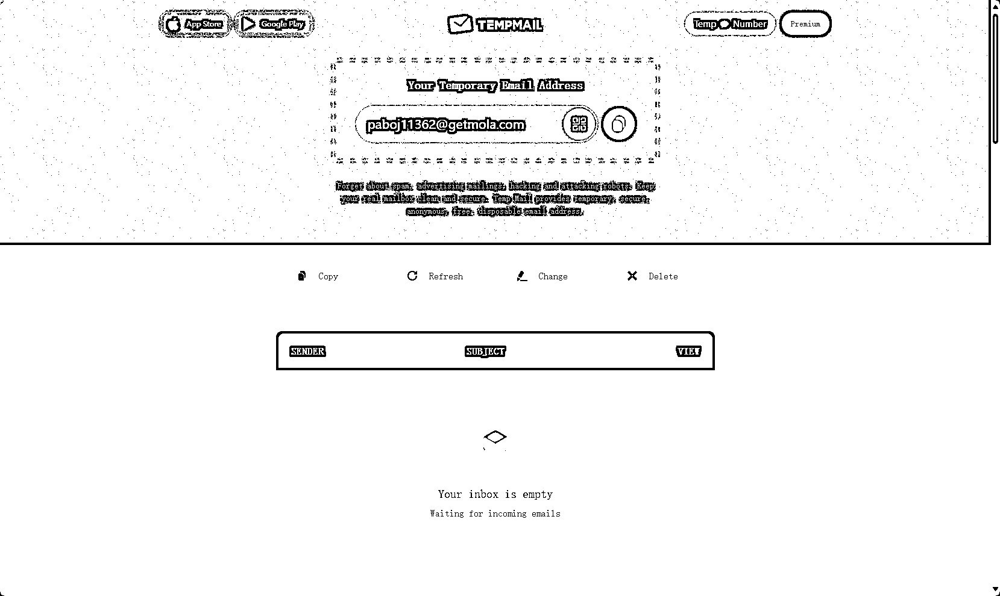

# 什么产品好做？三个一

> 原文：[`www.yuque.com/for_lazy/thfiu8/sz0dey7vy5z347ye`](https://www.yuque.com/for_lazy/thfiu8/sz0dey7vy5z347ye)

## (精华帖)(227 赞)什么产品好做？三个一

作者： 刘小排

日期：2023-12-07

大家好啊，我是刘小排。今天向大家分享另一个我做产品的心法。

最近有生财有术的圈友问我：小排老师，什么品类的产品比较好推呢？

其实，这个问题问错了。产品好不好推、好不好做，跟品类没有太大关系。任何一个品类，都有少量好做好推的产品，和大量不好做不好推的产品。

好做的、好推的产品，有一些共同特征——它一定具备“三个一”特性中的至少一个： **要么 First One，要么 Only One，要么 Number One**。

1.  First One， 是指这个产品在时间上是第一个推出的。在十倍速变化的领域，这样的产品有先发优势，往往会获得井喷一样的启动流量。

2.  Only One，是指这个产品在一个时间窗口内是某个特定问题唯一的解决方案。

3.  Number One，是指这个产品在某个品类是绝对的龙头老大。

在一个产品立项之前，我们需要先思考下如何为它赋予“三个一”的特性。至少占一个，最好全占。

如果一个都不占，我们的产品未来的路将会比较坎坷。除非你是想练练手、跑通流程、或是做个赚点小钱的副业，否则不要轻易涉及不占任何一个“一”的产品。

接下来我举一些我身边草根创业者的实际案例（其中大部分是生财有术圈友），来分别说明这几种方法的要点，给大家增加一些代入感。

# **一、First One**

## **操作要点**

1.  动作快

2.  越来越

既然要 First One，那一定要速度快，这很好理解。

还有一项更为重要的事：你的产品有没有“越来越”效应？ 也许是“用的人越多、产品越强”，也许是“用的人越多、分享的人越多、产品的地位越稳固”。  如果没有“越来越”效应，那对不起，即便你是 First One，你也可能是炮灰。

## **案例 1：生财有术圈友 damo-TD 老板的网站 sdxlturbo.ai**

#### **动作快：**

2023 年 11 月 28 日，著名 AI 机构 Stability 开源了新的模型 SDXL Turbo。  在这条新闻诞生的 12 小时内，damo-TD 老板就使用这个模型，做了[sdxlturbo.ai](https://sdxlturbo.ai%20) 网站，成为了世界上第一个能让用户免费试用 SDXL Turbo 的产品。

上线当天，就有超过 1000 个用户。

#### **越来越：**

作为第一个提供免费 SDXL Turbo 在线试用的产品，它在一个很短暂的世界窗口内，有独特的价值，因此得到了全世界用户的自发推荐、分享。

用的人越多，分享的人越多；分享的人越多，外链就越多；外链越多，网站权重越高；网站权重越高，从 Google 得到自然搜索的流量就越多，用的人就越多……

就这样，通过一个简单的“越来越”，它的数据飞轮就转动起来了。现在每天稳定有数千个自然用户。

## 案例 2：Airyland 的 GPTs 商店[www.gptshunter.com](http://www.gptshunter.com)

这个案例，和上面的案例很类似，而且数据更好。

2023 年 11 月的某一天，OpenAI 发布 GPTs，震撼全球。

这个时候，大家发现，官方还没有发布 GPTs 商店。大家去哪里寻找好玩的 GPTs 呢？ 一个第三方 GPTs 商店的需求就浮现出来了。

#### 动作快：

这位兄弟叫 Airyland，他在 GPTs 发布的第二天，就推出了全球第一个第三方 GPTs 商店[www.gptshunter.com](http://www.gptshunter.com)。

#### 越来越：

因为它是第一个，因此，获得的媒体曝光多、用户多、提交收录的 GPTs 应用就多。

收录的 GPTs 应用越多，它就越有价值，用户就越满意，越容易被用户分享和曝光。

数据飞轮再次滚动了起来。

经过短短一个月，它的每日自然用户数超过 1 万，还在持续增长中。

这是一个典型的从 First One 做到了 Number One 的例子。

# **二、Only One**

## 操作要点

1.  利用你的不公平优势，做别人难以做到、而你轻而易举做到的事情

世界是不公平的。

别人有别人的不公平优势，那很正常，咱们不用抱怨。因为，你也有自己的不公平优势。

拿我来说，我的不公平优势就是爱读书。 很多人读书很痛苦，我却享受读书的过程。

有人问我“排总，怎样才能像你一样读那么多书啊？” “我怎么读书读得这么慢呢” “我怎么读书读不进去呢？”“我读完书怎么记不住呢” “我一读书就犯困怎么办”

坦率的说，我甚至不知道该怎么回答，因为我没有遇到过这样的问题，它们对我来说不是问题。 这就是我的不公平优势。

你也一定有自己独特的不公平优势。 用好自己的不公用优势去创业，才能把创业过程变成像庖丁解牛一样游刃有余。

## 案例：梁靠谱的“梁靠谱陪你长命百岁”知识星球

咱们生财有术的著名牛人梁靠谱，她的不公平优势是什么呢？很简单，她是一名三甲医院医生，并且混迹生财有术、真心对待朋友。

三甲医院医生很多，但是三甲医院医生熟知生财有术的搞钱玩法、愿意开一个知识星球免费解答朋友们的健康问题的人可不多，这就让梁靠谱成为了 Only One。 她是唯一一个这么玩的三甲医院医生。

“梁靠谱陪你长命百岁”知识星球已经有超过 12000 名免费用户，全都成为了梁靠谱同学的粉丝和私域流量。

再加上“越来越”效应，她想不成功都难。

# **三、Number One**

## 操作要点

1.  在一个针尖大的领域，做到天下第一

是的，想做 Number One 非常难。对于草根创业者来说，这条路径相对容易的操作方法是：针尖上跳舞。

和普罗大众的思路正好相反，要成为 Number One，我们要的不是多，而是少。舍九取一。

只在针尖上跳舞，在针尖大的领域内，做到天下第一。

## 案例一：Temp mail [`temp-mail.org/`](https://temp-mail.org)

这是我最喜欢的工具网站之一。

我们在注册某些互联网服务时，需要填写邮件地址，并且点击邮件内的验证链接，才能注册通过。有一部分人不想暴露自己的邮件地址，惧怕垃圾邮件。

就这么一个痛点，你觉得痛吗？可能大多人数觉得并不痛吧？

这就是一个针尖大小的领域。

Temp mail [`temp-mail.org/`](https://temp-mail.org) 只在这个针尖大的领域上跳舞，做到的天下第一。

它的功能非常简单：你每次访问它，都可以得到一个不同的、临时的邮箱地址，方便你收一次性邮件。

毫无技术含量。

而它每个月的自然访问量，达到了惊人的 1500 万！

什么概念？仅仅放上个 Google Adsense 广告，它也能每个月躺赚 20 万美元以上！

## 案例二：findyi 的 AI 知识星球“AI 破局俱乐部”。

在举一个离我们更近的例子。

findyi 是咱们的生财有术的圈友，他在半年前入局 AI 星球。当时这个赛道已经是一片红海。

findyi 的 AI 知识星球“AI 破局俱乐部”，从 0 开始，一个月内付费用户过万名，半年付费用户超过 3 万名，已经成为了这个小品类绝对的 Number One。

关于他这半年的旅程，在生财有术的航海家俱乐部已经讨论过很多，此处不再赘述。

值得大家关注的是：他在开始之前，就已经决心要做 Number One 了，还规划出了具体打法和路径。这并不是一场随随便便的偶然成功。

# **总结**

你正在做的产品，拥有哪个 One 呢、打算进军哪个 One 呢？欢迎在评论区讨论 ^_^

* * *

评论区：

do 小鱼 : 努力在 only one 的领域做到 number one～
梁靠谱 : 小排老师牛逼！小排 TV 是 yyds！
晴天哥哥 : 为小排老师打 call
东哥 : 感谢分享，精华贴[玫瑰][玫瑰]
老黄牛 : 清晰简洁[强]
云珞 YunL : 感谢分享，总结一下，动作快，自己的不公平优势，针尖上跳舞
Dinosaur : First One: 先发优势，Only One: 护城河，Number One: 硬实力
木桶伯 : best one

* * *