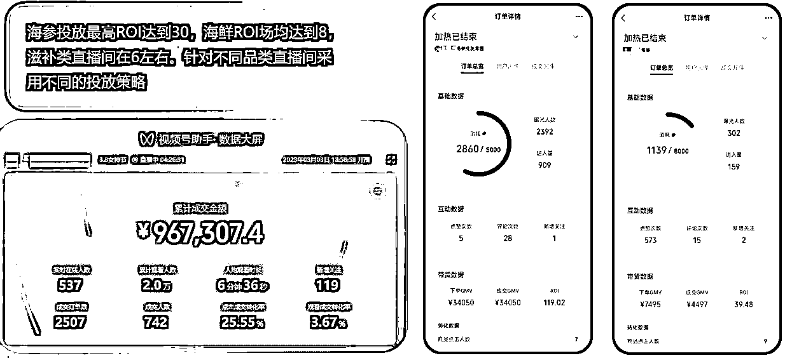
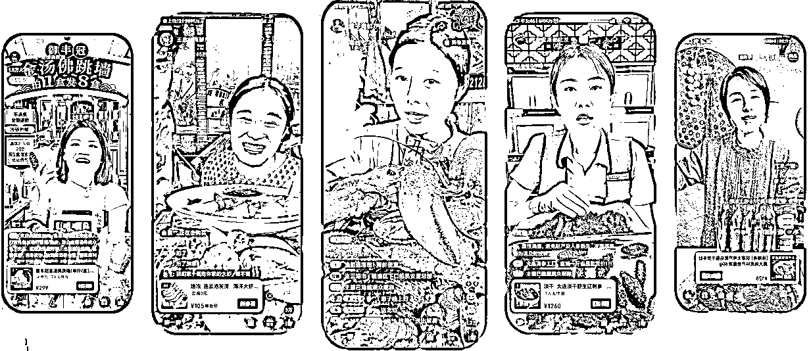
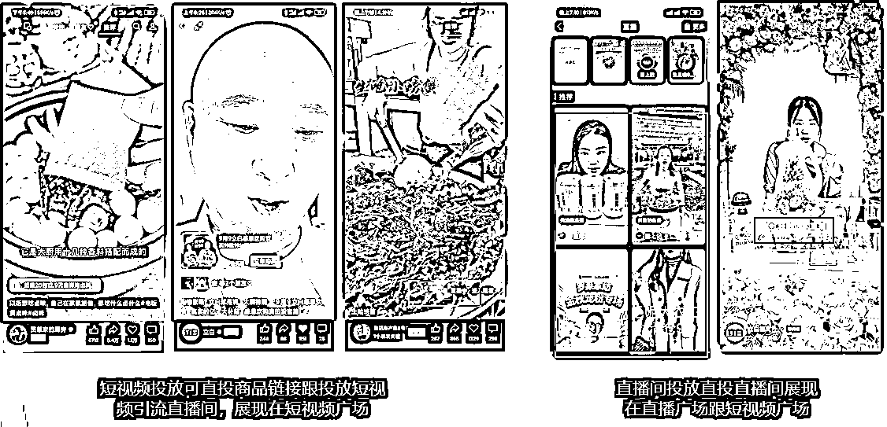
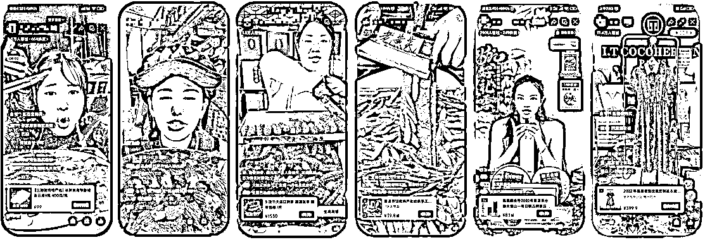
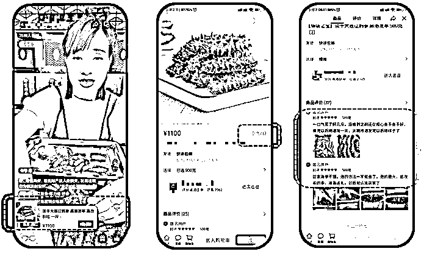
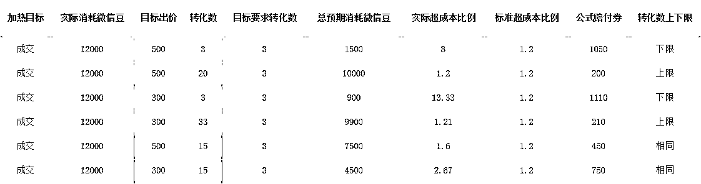
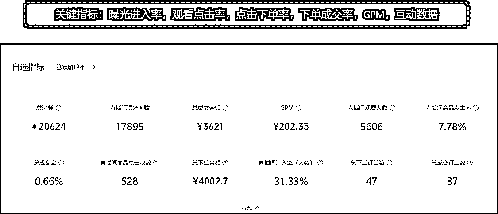
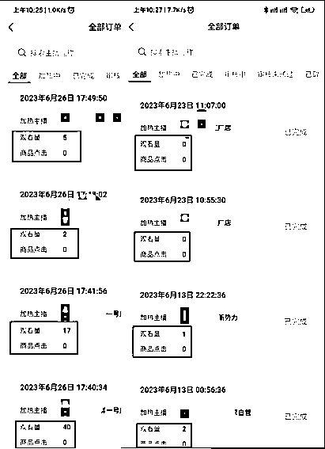

# 第二波红利，视频号直播带货如何通过投放放大

> 原文：[`www.yuque.com/for_lazy/thfiu8/hwik11slf73karg3`](https://www.yuque.com/for_lazy/thfiu8/hwik11slf73karg3)

## (精华帖)(126 赞)第二波红利，视频号直播带货如何通过投放放大

作者： 宏

日期：2023-12-07

500 块如何给直播间带来几万人？

很多新手做视频号直播带货都有一个误区：觉得投放能解决所有问题。在人货场没有走通的情况下就冒然想进行投放，结果可能就是疯狂烧钱，直播间也没进一个人。

事实上投放只是一个放大器，只有在人货场跑通的情况下，再通过投放来放量，才能有效的增加流量和收益。

那什么情况下适合付费投放，如何选择不同的投放方式，投放前期、中期和后期需要做什么，有什么关键点要注意？

这过程中又会遇到的哪些常见问题以及解决方法，这篇文章将会一一分享，希望对你有不少启发和帮助。

# 前言

自视频号的微信豆加热工具内测开始，就一直在使用，由于日常工作需要，每天都有大量的投放需求，代投过很多商家账号跟品牌账号，因此在这个工具上也消耗了不少真金白银。

目前，累计从手上消耗出去的金额至少是千万级以上，在这一过程中，躺过不少坑，缴了不少学费。

曾经经历过平台 Bug 问题，多次空烧，十分钟能烧掉一二十万而直播间却没有进一个人的情况，也经历过 2 个微信豆的出价，500 块大洋能投出好几万人的红利时期。有时一条计划能投出 ROI100 多，但也有很多 ROI 为零点几的情况。

最深刻的感受就是一个优秀的投手一定是靠钱烧出来，用钱烧出来的各种经验与技巧。

在持久的投放实战过程中，会碰到各种问题，包括平台算法的调整，流量周期轮换，平台算法 Bug 等等，一旦平台流量有调整，投手是最先能感受到变化的，需要不断测试更新投放策略来适应新的平台算法。

下面先分享一下过往的一些投放案例。

**这篇内容主要涵盖了五个部分：**

首先是在何种情况下适合进行付费投放，接着介绍了不同的投放方式，然后分别讨论了投放前期、中期和后期需要做的准备工作，以及在投放过程中可能遇到的一些常见问题以及解决方法。

最后，分享了一些个人的投放感受。

对于投放新手，建议可以先按部就班地执行，踏出第一步，尝试投放 500 或 1000 元，找到一些感觉，然后再逐步延展。

首先要弄清楚当前的直播间是否达到进行付费投放的条件，然后选择合适的投放方式，比如微信豆还是 ADQ。

接下来需要做好投放前的调研工作，例如了解直播间产品的受众人群画像。然后制定投放策略和具体的投放计划，关注投放过程中的关键数据指标，并学会如何卡赔付。

最后，进行复盘并调整优化下一轮的投放计划。对于投放老手，相信更多的关注点是内容背后所蕴含的心得体会。

接下来，就让我们开始这次的分享吧！

### 一、什么样的情况下适合付费投放

那什么样的情况下才适合做投放呢？

首先就是你的**直播间人货场跑通了**。例如说你直播间在自然流情况下能正常出单，转化率在 1%左右，这就意味着你的产品适合平台的用户群体，直播场景能够吸引观众，留住观众，主播承接力没有问题能进行转化。

其次是你的**产品要有足够的利润空间**，最好在 70%左右或以上，这样的利润空间才能够支持你去做付费投放。如果利润空间不够，很容易导致投放后亏损，这里受到 roi 高低和退货率的影响。

最后，付费投放的目的是为了在**现有的基础上进行扩大销售规模，增加交易量**，从而获得更丰厚利润。

当然，这里还有另外一种情况，就是**做私域**，付费投放的目的就是为了能快速从公域吸引新用户引流至私域，在私域里完成交易或促成复购。

这种情况通常需要有很强的私域团队和高客单产品支持才能做，比如一些高客单和高复购率的产品，滋补，海参，护肤，珠宝文玩等等。

### 二、直播投放两种方式

视频号直播投放主要有**微信豆加热投放和 ADQ 投放**两种方式。

这两个投放工具由不同团队开发，**ADQ 是**腾讯广告部门开发的**商业化投放工具**，合并了以前的腾讯广告与微信广告的体系，属于腾讯的**全域广告投放**。

它的方向类似于抖音的千川，投放纬度更加细化，**人群量级更加丰富**。

另一方面，**微信豆加热**是视频号团队内部开发的加热工具，其**投放的人群主要是视频号内的用户**，因此**人群相对较窄，但更为精准**。微信豆加热的投放维度较为简单，类似于抖音的随心推。

因此，这两种投放工具各有优劣势。微信豆加热工具的优势在于投放人群虽然不大，但相对更加精准，操作也更为简单，更倾向于取得投放效果。

而 ADQ 的人群比较丰富，属于腾讯全域人群，因此相对更为泛一些。

然而，由于直播场域是在视频号内，效果可能不如微信豆加热工具，但由于 ADQ 的人群比较大，因此更能够放量。

一般情况下，我们会结合使用这两种投放方式，**微信豆加热主要用于投放 ROI 效果，而 ADQ 则起到补量作用**，用于圈人群后进行培养心智和转化。这种结合方式能够更好地发挥各自的优势，达到更全面的投放效果。

这一次所分享的内容主要是以微信豆加热投放工具为主。

目前用微信豆投放直播间有两种方式，一种是通过加热短视频引流到直播间，这种方式先是在短视频这里做了一层筛选，所以进入到直播间的用户会更精准一些，转化率会高很多，但也是由于这种方式导致了量级不会很大，偏小一些。

同时这种方式最大的难点是在投放短视频素材的过审。目前对素材内容审核很严格，不能有任何营销性质的内容。过审难跟起量难是目前这种投放方式最大的考验。

另外一种就是直投直播间，这种方式目前是商家使用最多的方式，相对比较简单直接，对直播内容审核也不严格，而且这种投放方式的人群量级会比上一种投短引方式大很多。

因此也就造就了没有上一种投短引方式投放人群的精准度。

### 三、投放前、中、后需要做什么

如何进行投放呢？在投放前需要做什么？投放中又要注意什么？最后投放完之后需要如何复盘？

#### （1）投放前

在开始**投放之前**，首先需要**对产品及其受众人群进行调研**。

比如，要了解产品在市场上的价格和销售情况，可以通过天猫，京东和抖音等平台进行比价和销量观察。

同时，需要分析产品的适用人群画像是否与平台主要用户人群有交集或重叠，确保产品符合平台主要用户人群。还有就是产品的利润空间是否能覆盖得上投流费用，因为产品的利润空间决定了投放出价的上限。

例如一个产品的价格是 100，利润有 70，假设它的投流 roi 是 2，那他出价出到 50，还会有 20 块的利润（这里不考虑退货的因素）。

其次，调研完之后就需要进行**制定投放策略**。

目前有两种主要策略，一种是一次性在开播之前批量创建所有投放计划，大额少包。投放过程中，逐步关闭跑得不好的计划。

这种方式比较适合于比较稳定的直播间，直播时长不太长，大约 6 小时左右，且有多个主播水平相对一致，能够稳定承接。

另一种策略是有节奏地叠加计划，小额多包。比如，在开播后每隔一小时或两小时就叠加一两个投放计划，以保证直播间持续有稳定的流量。

这种方式就更适合于长时间直播，通过叠加计划的方式来稳定直播间的平均流速。让主播持续保持状态进行转化。

再者就是**制定投放具体计划**。

一般来说，做投放都是以一组投放计划组成，也就是说一组计划里需要有投放效果的计划，例如投成交。也需要有来带场观和带动其他投放计划的计划，例如商品点击或观众，是能快速给直播间带来流量，从而激活其它目标的计划，相当于辅助计划。

上面主要讲的是投放目标，那同时也要考虑到投放金额跟出价，同一组计划里面不可以有相同出价的计划，否则容易导致冲突，多条相同出价的计划大概率只会跑其中单条计划。

而投放金额的大小则决定了是否能竞争抢到更多的流量。假设你是平台决定流量流向的操盘手，现在有两个相同出价的计划，一个计划金额是 500 块，另一个是 5000 块，你会优先把流量推荐给哪条计划呢？这就是尽可能要放大计划金额的原因。

我们现在大部分的投放计划组是由 5 条投成交和 2 条投商品点击组成，投成交主要是为了能有更好的 roi 产出，投商品点击只是为了能辅助成交计划起量并保持住直播间流速的作用。

出价刚根据品类定价出价，并保证每条计划都不会同价。

产品客单价和利润空间决定了出价的范围，例如 1000+客单价，利润空间有 60～70%，它的出价则可以提高到 200 多块，而只有 100 块客单价，利润空间只有 30%，那他的出价就很受限，只能出价到 30-40，这种情况投成交都投不起。

下面分享一个高客单直播间投放计划。

直播间是 1000+的高客单价单爆品，基本是 15+小时的直播。

开播前预约 10 条左右的计划，投放时长都是 24 小时，出价是高出价 200+，高客单的利润决定了能出高价，每个计划的金额都是 1.5w+，甚至是 3w 顶格金额，这是为了能抢到量，这也就对投放资金有要求，需要比较大的资金预算。

但这里要避免一个新手误区，投放计划的金额并不等于消耗金额，每个计划最终只消耗 60%左右，甚至更低，并不会是计划金额越大就消耗越大跟越快。

这种高出价高金额高时长的投放“三高”策略很适合高客单的直播间，能够抢到量又容易卡到赔付（投成交只需有 3 单就满足赔付规则）。

**这里分享一个如何测算出你对标直播间的 roi 小技巧。**

当你对标直播间在直播的时候，你给他投放两条计划，目前可以投成交计划，一条可以通投，另一条可以简单卡一下兴趣爱好年龄之类，最后投放完成后看一下 roi，基本上就是他的直播间水平。

也就是你花个大几百 1000 块钱，去测算对标直播间的水平如何，他的品是否卖得了，是否可以付费投流等调研了。

#### （2）投放中

前期的调研跟投放计划搭建好之后，那在投放过程中需要注意些什么呢？

首先我们要**监控开播后每条计划能否正常投放**。

有时候会因为你直播间没挂产品，或直播内容有违规的嫌疑，或主页有不合规的视频，或信用分，或 DSR 评分过低，这些都会导致你预约的投放计划被强制中止，无法正常投放。

投放 1～2 小时之后，要**看一下具体每一条计划的消耗跟 roi 情况**。

消耗过快，但 roi 很低，例如消耗了 30%或消耗了 200～300 块，还没有产生任何成交，这个时候就要考虑是不是要中止这条计划。

如果有些计划投放超过 4 个小时，但基本上没什么消耗或者消耗很少，就可以视为跑不动的计划，这就可以考虑中止这个计划。

但是如果是整体所有计划都跑不动的情况下，直播间人数又很少，长时间几个人在线，那这个时候可以追加一两条商品点击计划来补充直播间流量，同时也能起到带动其他投放计划的作用。

其次就需要**监控投放计划的数据情况**，根据各项数据指标反馈给主播或运营，进行适当的节奏调整。

例如直播间快速进人，就要加快节奏推产品，如果互动率低，就要主播改变节奏，先调动观众情绪进行互动。

这里介绍**几个主要数据指标及相应的调整方向**，让你能够更好地应对不同情况。

**1、曝光进入率**。

这个**体现出直播间的吸引力**，反映出平台把直播间推荐给目标观众，以及**观众是否对直播间感兴趣**。进入率高，就反映出目标观众对直播间比较感兴趣。这个是直播间高场观的一个最基础条件。

这里改进的方向可以从两方面入手，一个是**直播间的封面图**。它是否足够吸引人，是否能够简洁清晰表达出直播间是卖什么产品以及有什么福利。

另一方面则是**直播间内的场景**。也就是我们所说的打造直播间场景，能够需要吸引人。

视频号的场景更倾向于真实原始，有烟火气等，需要避免花花绿绿，七彩缤纷的效果。

**2、商品点击率**。

这个体现出直播间**产品的受众和吸引力**如何。商品有曝光和点击才有可能有成交。

这个改进方向可以从几个方面入手。

首先是**优化产品的首图、标题和价格**。首图需要突出**产品卖点**，标题需要突出**最优惠信息点**。

其次，需要让主播讲解的**产品一直处于讲解状态**，并将弹出商品贴片显示在直播间底部。

最后，主播的话术里要包含引导观众去点击商品等。这些措施能够**提高商品点击率**，从而提升直播间的销售效果。

**3、点击成交率**。

这个指标则体现出**产品的转化能力**，改进的方向则是提升**主播的逼单能力**。逼单话术需要能触及用户的痛点或需求，从而促使用户迅速下单。

此外，优化产品信息也很关键，比如产品基本信息，详情图片，销量及评论等，因为有些用户下单前会去浏览查看这些信息，它们是用户决定是否购买产品的一个重要判断依据，这种习惯可以说是传统电商平台带来的。

**4、互动数据。**

这个则**体现出直播间的互动性及活跃度**。改进的方向，可以让主播调整节奏，积极调动观众的情绪来增加互动。

另外，助播可以配合营造评论，让整个直播间的气氛更加热闹。这样能够吸引更多的观众参与互动，让直播更加有趣和生动。

下面这张图是一个直播间投放过程中的一个数据截图，大家可以看看相应的几个数据指标情况。

最后，就是要实时**监控着每条计划是否能卡到赔付**。

现在投放卡赔付是一个很重要直播利润来源。有些直播间的利润就是通过卡赔付获得的。

举例来说，某个品类直播间投放平均 roi 最高只有 3，这个 roi 值只能保证不亏，甚至微亏。但通过卡赔付之后，他可以把 roi 提高到 5，这样就能实现盈利。

如何知道计划是否能达到卡赔付的基本线呢？最主要的是根据不同的投放目标，需要达到不同的转化数。

例如，如果投放目标是成交，那么转化数（订单数）在 3 单以上，基本上就可以卡到赔付。如果投涨粉，转化数是 2 个关注粉丝以上即可。

对于投成交 roi 的计划，那么转化数（订单数）在 10 单以上也可以卡到赔付，而投放商品点击则只需要有 10 个用户点击商品，也就可以卡到赔付。

卡赔付的最低上限就是上面所说的，同时，也有最高的下限，根据你不同的出价而决定。具体的规则，可以看下下面这张规则图跟上下限测试表格。

赔付规则细则

赔付上下限测试表格

#### （3）投放后

在完成直播投放后，需要进行一次**复盘**，以便发现问题并通过调整来解决问题。同时，复盘也可以帮助我们更清晰地了解我们的受众画像。

可以从**两方面来分析数据，一个是投放数据，另一个则是直播间数据**。

对于投放数据，我们需要关注一些重要的数据指标（上面有所提到过），例如曝光进入率是否达到 30%以上，如果低于这个标准值，就需要在直播间场景和封面上进行优化。此外，我们还需要关注商品的点击率是否达到了 10%以上。

如果没有，可以通过产品和主播引导话术进行优化。另外，还需要关注转化率跟停留时长等指标。

对于直播间数据，我们需要分析成交人群的年龄、性别和地域属性是否与我们的投放维度一致。这些指标可以作为下一次投放计划的调整依据。

同时，我们还需要关注直播间的流速和在线人数范围，以判断我们的投放计划密度是否需要进行调整。在每场直播的所有投放计划中，我们通常会尝试一两个新的投放方法，这些计划是用于测试的，以验证新想法并寻找更有效率的投放计划。

因此，在复盘中，我们还需要关注测试计划的投放目标是否完成，以保持最新的投放方法。

### 四、投放常见问题

**（1）投放不了，显示原因为不支持投放**

投放不了，一般有几种情况。

首先，可能是直播内容存在违规嫌疑，比如话术内容、助手评论语或留言置顶中包含宣传性质或夸大宣传的用语，甚至包含广告极限词等。

这种情况下，需要重新规范话术，规范助手发评论内容，并避免违规词语的留言置顶。

其次，如果信用分低于 95 分或店铺 DSR 分低于 4.2 分，也会导致无法投放。

因此，需要着重做好售后服务，特别是店铺客服的三分钟回复率、品退率以及退货退款的处理时长。

客服三分钟回复率可以通过企微后台配置客服分流和人工服务时段来优化解决。

品退率则可以通过客服回访客户，安抚并协商将退款原因改为与产品质量无关的选项，比如“其他”或“七天无理由退货”。这样可以有效降低品退率，减少扣分。

另外，直播间开播后没有挂上商品链接也会导致投放失败，这时只需要挂上商品链接后重新投放即可。

此外，直播画质太差、卡顿或黑屏也会影响到投放计划。

最后，如果短时间内取消了太多投放计划或审核未通过太多计划，可能会触发平台风控而被限制继续投放，这种情况只能等到隔天才会解封。

**（2）投放计划消耗不出去**

投放计划消耗不了，有几个因素。

**首先，投放时长太短会导致计划无法正常消耗。**

一般投 6 小时、12 小时或 24 小时的计划，需要 3-4 小时后才能正常起量消耗，而 4 小时的计划则是在 1-2 小时后再开始起量消耗。

**其次，同品类竞争激烈，出价太低也会影响投放效果。**

投放出价是需要根据品类投放情况来定出价，例如海参或滋补品类，现在大部分商家都在大量投放了，此时需要提高出价才有可能抢到流量。

贴着投放目标建议最低价出价，基本上是不太可能能消耗出去抢到量。

而鲜花品类的投放相对较少，大部分商家还在做自然流起号玩法，也没什么品类大号，所以投放会相对少很多，投放只需出价很低就能消耗出去抢到量了。

另外，人群画像兴趣爱好限制太多也会导致投放计划消耗不出去。视频号的人群相对集中在年长者，兴趣爱好不多，如果人群范围过窄，就会导致投放计划无法消耗。

比如，你只选 20 岁左右的年轻人群，兴趣爱好偏年轻化的类目，那平台是比较难圈到符合的人群，自然就会导致投放计划消耗不出去。

最后，直播效果太差，成交率低也会影响计划执行，进而影响平台的推荐投放曝光，曝光进入率低，商品点击率低，成交密度小，停留时长短，这些都会影响计划的执行。

这种问题都是需要对直播间的人货场进行调整优化，针对几个关键数据指标去做一些动作优化，例如产品点击率可以通过挂低价福利品来引导增加点击率，抽福袋来提升互动率及停留时长等。

**（3）投放出价是先出低价还是先出高价**

先出低价再逐步抬升出价，找到合适的出价位，既能抢到量又能保住理想的 ROI，这个是大部分新投手的投放策略，但这种方式只适合在一些投放竞争不大的品类里玩。

针对于投放竞争比较大的品类，目前的投放策略都是先出高价，保证能拿到量后，再逐步压价，一步步压，直到抢不到量的出价为止，通过这种方式，能够测试出适合该品类的出价位，从而实现最佳的投放效果。

### 五、投放的意义

很多新手在人货场没有走通的情况下就冒然想进行投放，以为投放了能就能解决他所有的问题。

但投放其实是直播间人货场的放大器，只有在人货场走通的情况下，想通过投放来放量以增加你的收益，这时才适合进行付费投放。

付费投放的流量相对于自然流比较可持续与稳定，这个是保证可持续直播，减少团队风险的根本原因（直播团队是一个重资产，人员成本，直播场地及设备投入都是一笔不小的开支）。

个人觉得投放最大的本质就是在稳流速跟稳投产，目前阶段想要有更好的投产比，更多的还是在直播间的人货场优化上，投放只是负责把流量引进直播间，至于转化如何就需要看主播的承接能力，主播的承接力决定了直播间的 GMV 上限。

同时，通过投放，我们可以更清楚的了解到我们产品的受众人群画像，也能矫正我们对产品的目标人群认知。

投放是需要一个胆大心细的心态的活儿，平台算法是会一直不断在作调整与更新，特别是现在视频号平台是一个新的平台背景下，迭代更新是它目前的主旋律，只有在大量实践中不断测试不断更新，才有可能在平台持续拿到好的结果。

* * *

评论区：

Erik : 宏哥分享的都是干货[强][强]
鑫莹 : 超级好干货
鑫莹 : [强][强][强][强][强][强][强][强][强]
潇 : 宏哥🐮[强]
海棠 : 学习了[强][强]
阿晨 : wulh84 加不上呢
宏 : 改了，加 10
肖肖 : 宏哥投放干货真多，感谢分享

* * *