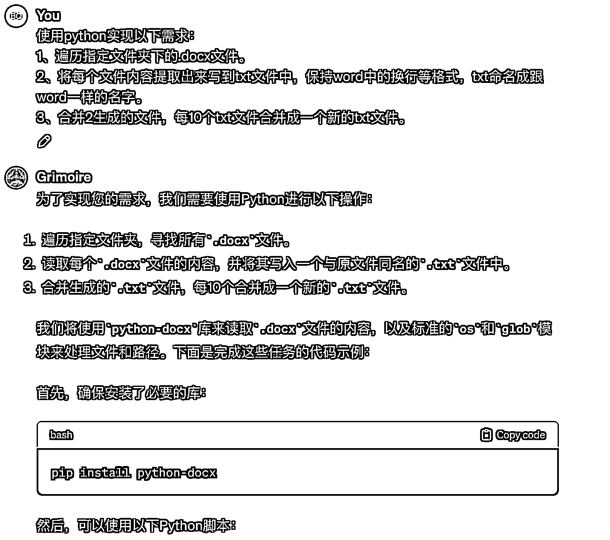
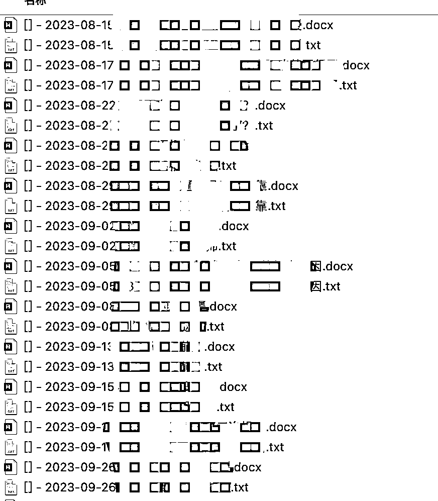
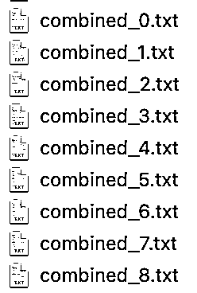

# 如何将几百篇公众号文章作为 Gpts 的知识库？

> 原文：[`www.yuque.com/for_lazy/thfiu8/zi8rotq3f7tenh2p`](https://www.yuque.com/for_lazy/thfiu8/zi8rotq3f7tenh2p)

## (46 赞)如何将几百篇公众号文章作为 Gpts 的知识库？

作者： 邱比特

日期：2023-12-04

最近在玩 OpenAi 的 Gpts，我用公众号里几百篇文章作为知识库，让 Gpts 学习知识库里的文章，仿写公众号文章。

但是 Gpts 上传知识库的文件有如下限制：

1.每个 GPT 限制：10 个文件

2\. 每个文件限制：512MB（图像文件为 20MB），2M 令牌

3\. 每个用户限制：10 GB。每个组织限制：100 GB。

我在实践的时候也产生了好多疑问

1、为了确保 GPT 从源头获取所需的所有信息，哪种格式最好？Word、PDF、JSON 等

2、获得最大性能的最佳方法是什么？上传到知识库？上传到网络服务器并使用 API？

3、为了实现最佳的彻底搜索，最好将所有内容按文件（例如章节）分开，还是可以将所有 PDF 分组为 1 个大 PDF，从而失去收集所需信息的能力？

4、为了充分利用源文件，内容管理最佳实践建议是什么？

原来想把所有文件打成压缩包，提示我文件太大，并且不能检索。

调研了一圈，*发现将所有文件转换为文本文件，将内容分成较小的文件以提高搜索效率。*

***最后******通过把 word 文件转为 txt，然后每 10-20 个 txt 文件合并成一个文件。再把合并后的文件上传到知识库。***

文件的转换和合并都通过 chatgpt 编程实现。以下是提示词和效果。

复制 ChatGpt 生成的代码

importimportfromimport
defextract_text_from_docxdocx_path""" 从.docx 文件中提取文本。 """tryreturn"\n"forinexceptasprintf"Error reading {docx_path}: {e}"return""
defwrite_text_to_filetext, file_path""" 将文本写入文件。 """withopen'w''utf-8'as
defmainfolder_path# 遍历文件夹中的所有.docx 文件"*.docx"
forinf"{os.path.splitext(docx_file)[0]}.txt"
# 每 10 个 txt 文件合并成一个新的 txt 文件 forinrange0len10f"combined_{i//10}.txt"withopen'w''utf-8'asforin10withopen'r''utf-8'as"\n"
if"__main__""path_to_your_folder"# 替换为你的文件夹路径

执行上面代码后，完美上传了所有文件。

* * *

评论区：

希声 : 厉害
墨鱼 : 正好遇到这个问题，感谢~
黎锦辉 : 效果如何，写出来的文章
邱比特 : 取决于提示词怎么写
米斯特 LIu : 万变不离其宗！
Cobb : 牛逼

* * *