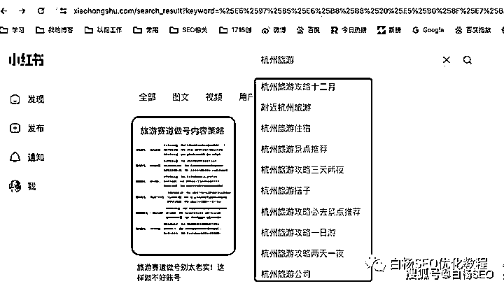
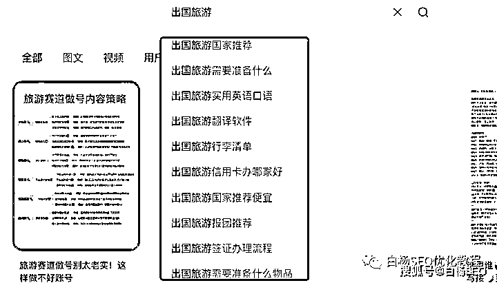
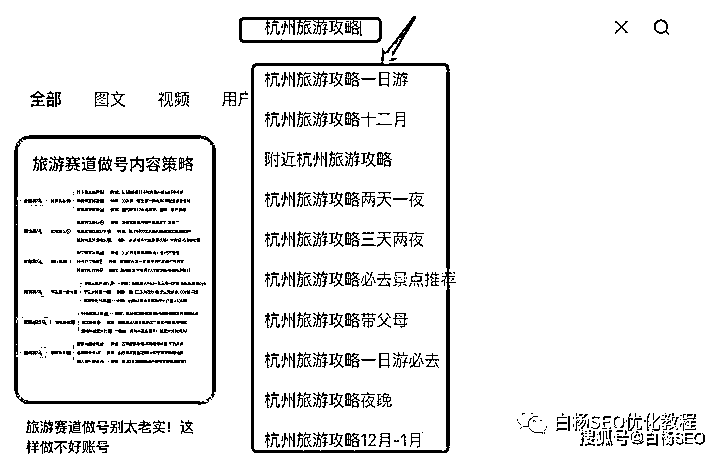
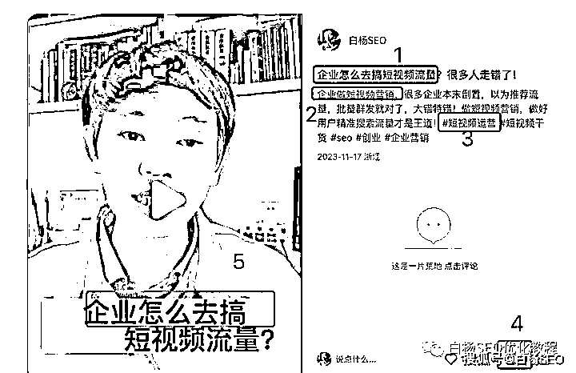
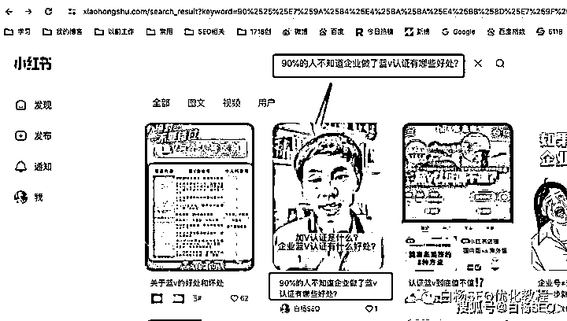
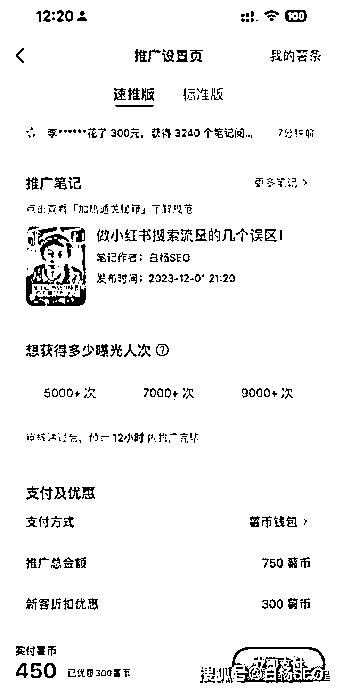

# 旅游行业小红书引流怎么做？免费 SEO+付费投放相结合

> 原文：[`www.yuque.com/for_lazy/thfiu8/xc62edb0gi45tiip`](https://www.yuque.com/for_lazy/thfiu8/xc62edb0gi45tiip)

## (28 赞)旅游行业小红书引流怎么做？免费 SEO+付费投放相结合

作者： 白杨 SEO

日期：2023-12-05

上面这张配图，是白杨 SEO 本人在 2018 年拍摄华山悬空栈道。我本身非常喜欢旅游，结婚前全中国一个人基本快穷游走完了。

回到本文主题，旅游行业小红书引流怎么做？

这个话题分两个阶段看：第一个阶段是旅游行业在小红书上怎么搞到精准流量，第二个阶段才是旅游行业在小红书上怎么引流到私域去。

本文主要分享第一个阶段，如果你想看第二个阶段，可以看我之前写的这篇：《[小红书新规，粗暴导流或将被封号，私域玩家引流该怎么办？](http://mp.weixin.qq.com/s?__biz=MzU2NTQzMzA4Nw==&mid=2247498051&idx=1&sn=b95bc2ab277d0540b870d4fc2a839a76&chksm=fcb97ed3cbcef7c59c68276573096f87028aa2c28045ae96a9abaafa31c5e37c14a701c4b8cb&scene=21#wechat_redirect)》

**旅游行业小红书 SEO 具体操作方法**

**1、挖掘整理用户需求搜索关键词**

我们知道，搞流量的本质是要吸引用户的注意力。如果你想要用你的内容吸引用户点击，那么，你就得了解用户需求，站在用户角度去生产内容。而潜在用户他们所有需求基本都是以搜索关键词的形式体现的。

怎么找到旅游行业这些用户搜索需求关键词？

第一步，确定你的业务核心关键词。

比如“杭州旅游”、“出国旅游”“跟团旅游”等等。注意：这个要根据你自己的资源来，比如你擅长做某个城市或者某个类别的旅游，但千万不要把“旅游”当你的核心关键词！除非你是携程，你是去哪儿这种旅游平台。

第二步，将这些核心关键词放到小红书搜索框，将核心关键词对应的下拉关键词整理出来。

（最好是小红书 APP 哈，我以 PC 端截图举例，下图）

这个方法也叫以词找词，搜索框下拉这些词代表着用户经常搜索的词。

对了，小技巧，离核心关键词下拉越近的词代表用户搜索越多，简单理解流量越大，嘿嘿。

当然，你要是嫌弃这么搜索麻烦，你也可以用第三方工具。比如：小红书关键词搜索量查询、下拉词分析 5118SEO 工具。如果你觉得 5118 工具搜索量不准，也可以去投小红书聚光平台付费后台有找词工具哈。

当然，白杨 SEO 建议你手动。为什么呢？因为你可以看看这些词排名靠前的内容长啥样，后面在小红书内容规划会用到。

2、旅游行业小红书关键词 SEO 布局

我们将第一步整理好的关键词进行归纳分类，筛选出你需要布局的哪些关键词，这些词决定了你后期的笔记选题以及怎么把这些词布局上去。如果你做的是本地流量的话，一些同城的关键词一定要用。

比如杭州，甚至杭州西湖区等等。旅游行业小红书关键词 SEO 布局在哪些地方呢？我直接截图举例，可以布局在五个地方，最重要是标题、内容、以及话题标签上。

对了，这里还有两个小核心：一是如果你不是视频笔记，那个图文笔记文案最好至少写 300 字以上，二是标题里不能堆积关键词，内容里的关键词密度一定要适中！

3、旅游行业小红书笔记内容规划

通过上面挖出用户需求搜索关键词，你已经对用户的内容偏好有了大致了解。这个时候，你可以分析潜在对标用户账号，你也可以将每个关键词下对应的爆款笔记搜集整理出来。

举例，以前白杨 SEO 小红书训练营学员作业截图：

可以从封面亮点、标题吸引点、内容结构 SEO 布局，以及笔记数据进行列表。

比如去看封面，看的是拍摄构图、拍摄场景、图片上内容布局等；看标题就看关键词布局和吸引用户点击的关键词是什么；看文案内容看的是关键词布局在内容里位置和整个笔记写作框架结构。

以上，通过我们多看几个同行的笔记，我相信你肯定能看出来这个笔记是旅游者写的还是你的同行写的引流贴。如果连这个你都看不出来，你肯定不是旅游行业从业者！同行是你最好的老师！

4、围绕用户需求关键词进行笔记 SEO 优化，提升笔记关键词排名

小红书笔记 SEO 优化主要分发布前和发布后两个阶段。

发布前的优化，主要见上在第二点说到的小红书 SEO 关键词布局，最少要布局在标题、内容和标签上都有要有。

你如果要做同城的流量，一定要在笔记中打上同城标签，在封面图发布上传时打上同城标签，在点击发布前带上标记同城位置就可以了。

笔记发布后的小红书 SEO 优化，主要就是看用户需求搜索关键词下的笔记排名。比如搜“杭州旅游一日游”看你的笔记是否在前 10 位。你的笔记越靠前，被用户点的概率越大，给你带来的搜索流量越大。

如果你的笔记根本没有，说明你第一个工作没做到位，就是让笔记被小红书收录！怎么代表收录，用你小红书标题全标题搜，如果有就算收录。如图：

如果你的笔记排名很靠后，说明笔记还没上来，记住一个小红书 SEO 核心点，在小红书发布六小时内给小红书做一些真实数据。小红书笔记里除了标题内容标签之外最重要的有阅读、点赞、收藏、转发、评论等。以前是转发占比大，现在是评论，懂得人懂。

另外，这里再补充一下，除了用你自己的帐号做多个笔记排名占位之外，你还可以针对性地通过小红书达人种草来铺设你的笔记。当然这是要付费的方法之一，下面要再讲一讲。

**旅游行业小红书付费投放结合方法**

这里先说明，白杨 SEO 并不是很擅长付费投放，也不是氪金玩家，我相信你也不是。但是，付费投放可以帮我们测小红书内容，可以测是不是适合推广。

小红书付费投放具体分三种玩法：

第一种：素人小红书账号发贴布局关键词，

上面有讲。你可以去小红书官方平台蒲公英上找达人，你也可以直接联系小红书上的素人。

第二种：小红书薯条投放笔记，

这个适合个人小玩家，企业也可以试试。白杨 SEO 觉得这是结合小红书 SEO 可能是最好的方法。你可以用小红书薯条投放，给小红书笔记发布前 6 小时增加真实数据，而且你还可以测试你的笔记是不是营销，带有营销是投放不了，举例截图。

当然，白杨 SEO 目前还没有投过薯条，后续可能会投，哈哈哈。

啥，你还要问我薯条这个投放在哪里？看来你可能真没有玩过小红书投放，笔记上有【…】点更多就出来了。

第三种：开小红书聚光平台投放，

这种一般是企业才行，个人开不了户。

这种一般是 5000 开户，也有些人说最少 2000 可开，一般都是代理商哈。你可以开完户，白杨 SEO 建议你要投，一定要投关键词搜索流量，不要投信息流推荐流量，因为前者好转化。

对了，最后再补充一下，小红书企业号能认证一定要做蓝 V 认证，不要一年 600 元都舍不得！任何平台对于认证企业账号不管权重还是营销都稍宽一点点。

好了，今天就分享到这了。希望对你有帮助，如有相关问题也可以留言。

**相关推荐：**

[白杨 SEO：小红书 SEO 也许是个伪命题](http://mp.weixin.qq.com/s?__biz=MzU2NTQzMzA4Nw==&mid=2247484447&idx=1&sn=a665a09f1bda87c11ed37e2902022690&chksm=fcba838fcbcd0a99d888ea539b1dc1e6cf628476cd673e958189975cb839b8048eea139d27e2&scene=21#wechat_redirect)

[白杨 SEO：再谈小红书 SEO，小红书笔记排名因素解析及实战举例【收藏】](http://mp.weixin.qq.com/s?__biz=MzU2NTQzMzA4Nw==&mid=2247489467&idx=1&sn=0d99d3a493ff94435a412c195bd2fe54&chksm=fcba902bcbcd193db04d071523fdaf0ec106c35af6a3886259c2a09f367e7e421dba0764b84f&scene=21#wechat_redirect)

**作者介绍：**

白杨 SEO，专注 SEO 十年，全网 SEO 流量实战派，对互联网精准引流有深入研究。个人微信：baiyang2047，如需加好友，请注明来源生财有术。

* * *

评论区：

Rio : 谢谢分享小红书搜索流玩法，根据文章可开发三个工具：下拉词采集器，爆款笔记采集器，下拉词生成标题

* * *