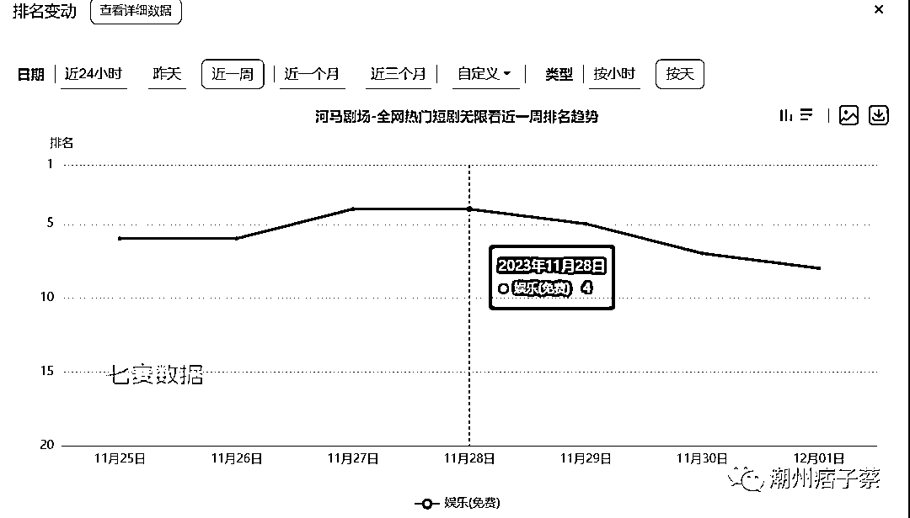
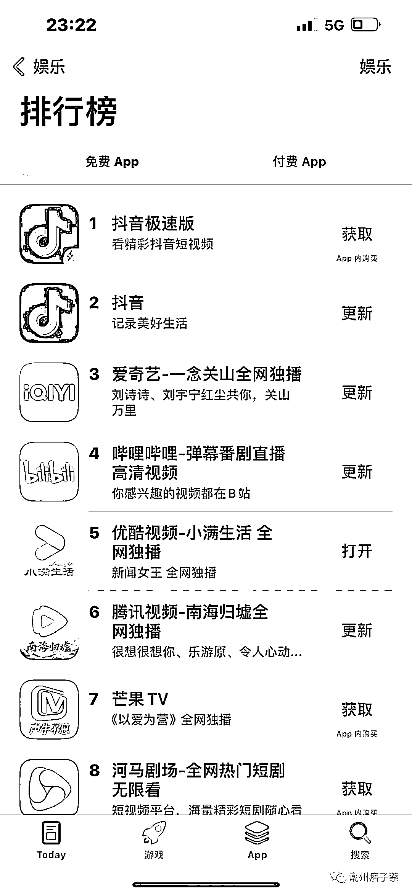

# 透过苹果应用商店，看短剧 app 市场的竞争

> 原文：[`www.yuque.com/for_lazy/thfiu8/lm8ixbgkr4we51l0`](https://www.yuque.com/for_lazy/thfiu8/lm8ixbgkr4we51l0)

## (16 赞)透过苹果应用商店，看短剧 app 市场的竞争

作者： 潮州痞子蔡

日期：2023-12-06

你好，我是潮州痞子蔡！

这是我 12 月 1 日的文章，所以数据上和现在对比会有些出入，原文在我的同名公号里。

短剧行业其实已经有不少公司开始进入到 app 版块，并进行推广获客，而不再是简单通过小程序这一载体去营销了。

目的也比较明显，因为小程序不好留存、活跃用户，所以希望通过 app 来实现这个目的，并且一旦用户能留存起来，在变现上也会存在多样化的可能，甚至在产品的最终布局和发展上也会存在更多的可能性。

快手这两天还发布了一个消息，将截断从快手跳转到小程序的短剧推广，这说明如快手一类的平台开始希望实现短剧产品的内循环变现了。

今天，我主要通过苹果应用商店的一些数据情况来聊聊短剧类 app 产品的竞争和营销情况。

**01**

搜索“短剧”这个关键词，目前排名 top4 的产品分别是：

a、河马剧场；

b、红果剧场；

c、全网短剧大全；

d、星芽短剧。

abd 都是在短剧行业里面目前知名公司旗下的产品，c 用的是个人开发者的名字，而且采用的是付费类别。

**02**

那为何河马剧场能在这个关键词下排名第一呢？

这个与河马剧场之前通过各种营销手段，包括 aso、可能还有冲榜等营销手段去获得免费榜 top1 获取了大量用户有关。

虽然后续排名掉下来了，但是里面积累的不少活跃用户，以及持续的通过 ASA、非商店渠道推广和可能的 aso 营销，才保持了在短剧关键词下的高排名。

河马剧场当前的关键词排名和覆盖情况：

这里还要关注另外一个数据：

河马剧场目前排名在“娱乐榜单”的第 8 位，在 11 月 28 日的时候河马剧场是排在第 4 位的，可以看看下图的数据：

在娱乐榜单的高排名也依然能给河马剧场带来一些自然用户，并且娱乐榜的高排名，还有产品本身不错的体验和一定的用户量级，也能让河马剧场在一些特定关键词上获得好的名次。

在苹果应用商店，我尝试了使用“短剧”的关联词语，基本也都是排名靠前，正是说明了以上这一点。

03

那为何河马剧场在娱乐榜单的排名掉下去了呢？

这个我观察了排名重新冲上来的几个产品，有如下共性：

a、在商店外部和苹果商店内依然有在买量投放和 aso 的行为；

b、产品在近期 48 小时内提交了新的版本。

而河马剧场只要保持当下的投放买量力度，随着它新版本的提交，在娱乐榜的排名上自然能提升上去。

当前只是刚好其它产品做了版本更新，不过他们的更新频率也不是非常高，基本也是保持在两周左右的频次。

这里也是我之前有篇文章提到，在优化商店页面和提交版本的测试这块需要保持一定的频率，就是这个道理。

04

而红果剧场目前在短剧关键词下排名第 2，也是和它在应用商店外大量买量、用户留存不错、以及可能的 aso 行为有关。

不过，红果剧场目前并没有在苹果应用商店进行 ASA 投放，应用商店外的营销量级可能没有河马剧场那么大，目前暂时屈居第 2。

可以看看它当前关键词排名和覆盖的一些变化情况：

其中，在 7000 多热度的排名 top10 关键词里面，它还是牢牢占到了它想要的一些关联词：

如果有更多番茄相关的关键词进入 top 排名，并且排名越高，那对产品的获客方面会有更大的帮助。

**05**

从上面两个产品的简单分析，我们可以看到，在苹果应用商店的营销获客当中，做好以下几个手段，基本就能在榜单、关键词等方面获得好的名词，从而获得更多的自然流量，实现更佳的 ROI：

a、苹果应用商店内的榜单营销、asa 和 aso，尤其后者两部分是需要长期性去做的，前者在某个时间点冲到一定位置后，考虑整体的 roi 情况，就无需频繁多次营销操作；

b、苹果应用商店外的针对性营销，尤其是要配合好在店内优化营销动作的时候；

c、不断优化好产品体验，以及适时优化改版，提升转化率和活跃度；

d、运营团队需要做好对商店内外营销的预算分配、下载量统计等，通过精细化的数据分析和运营，让预算能够更加合理的花费到合适的地方，尽可能拉升 ROI。

* * *

评论区：

暂无评论

* * *