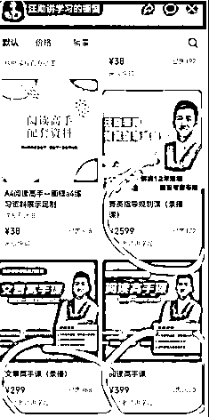
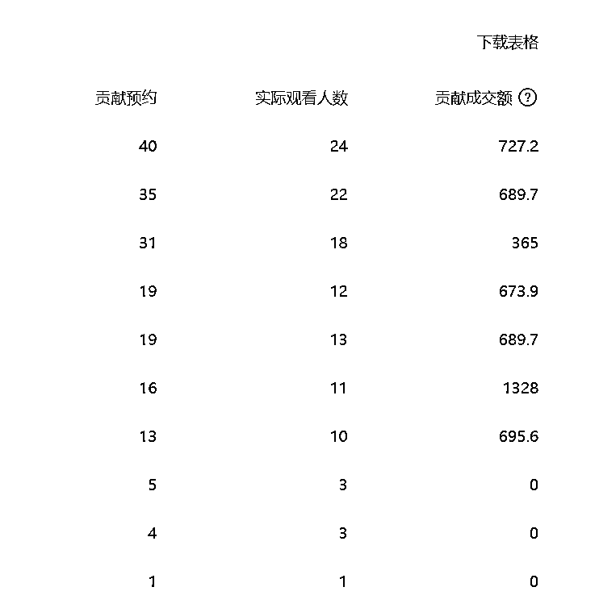

# 一场内部发售家庭教育赛道营收近 60 万，收益翻番的秘诀是私域

> 原文：[`www.yuque.com/for_lazy/thfiu8/gl89t1irgwp37nvp`](https://www.yuque.com/for_lazy/thfiu8/gl89t1irgwp37nvp)

## (精华帖)(221 赞)一场内部发售家庭教育赛道营收近 60 万，收益翻番的秘诀是私域

作者： 一来

日期：2023-12-12

现在做家庭教育，其实只要 3-4 人小团队，就能支棱起来。

不需要跑到线下去宣讲，通过直播短视频就能实现招生，而且只要好好录一门课，后续交付成本可以忽略不计。

尤其现在视频号对教培领域有流量扶持，很多家庭教育主播在视频号上拿到的结果甚至比抖音还要大。最经典莫过于视频号的头部账号宗南语文研究院，靠两门课，光一个平台，纯利收入就有 200w+。

因为阅读课、写作课、学业规划课，这类课程属于刚需中的刚需，吸引来的人群也精准，消费意愿也高。像我们自己 299 的引流产品，一场直播下来能做到 1-3 万，然后再通过私域卖高客单产品，一场内部发售下来营收 40-60 万左右。

今天就和大家分享，我们从 0-1 跑通家庭教育项目的全流程，希望能对你有帮助。

之前在线下做了 9 年的家庭教育，也看了很多行业的案例，除了一些大型的团队能够做起来，规模做得大，利润大之外，其实对于小规模的公司以及工作室来说，想挣大钱还是比较难的。

家庭教育传统的线下方式，更多的是通过发布朋友圈，或者是去学校做免费讲座来获客，来组织线下活动进行转化成交。

这种方式往往受到资源的影响，以及整个变现流程复杂比较慢，因此发展的空间并不大。

但如今到了直播短视频时代，完全只需要 3～4 个人的小团队，就可以将家庭教育这个赛道支楞起来。

家庭教育赛道，实际上分为两个版块，一个是家庭教育理论的一些方向，另一个是和学科有些相关联的方向。其中第 2 个方向，受众人群更精准，变现空间更大，需求也更旺盛。

1.**视频号显著代表：宗南语文研究院。**

这个老师最近在视频号上卖的很红火，大家可以看一下。

（1）产品：阅读课+作文课。

（2）产品价格：359 元

（3）收益：359*（1958+6287）=296 万。

除去退费，以及其他的成本，至少能够有 70%的利润：296 万*70%=207.2 万。

所以可以看一下，光一个平台，收入就能够达到如此地步。

**2.汪勋讲学习。**

这是他一个视频号的平台，他的抖音会更猛。由此可以看出来，这个赛道是真的能做。

今天这篇文章分享出来，我也在想这样的模式更适合什么样的人：

**1\. 已经在做家庭教育赛道了，最好有稳定的主播（主播可以是以前的学科老师或者是家庭教育讲师。)**

**2\. 最好有个小团队，三人及以上。**

单纯的依靠个人，也可以做，前期更多的是尝试，因为要做工作还是比较多的。

下面就来说下，如何实现整个的流程，以及盈利的方向。

# 一、**找对标，帮助自己快速地开始**

如果是冲着变现去的话，那么在开始之前，主播要考虑两个点：

1.  从专业方面：自己擅长讲什么领域，能够讲得很出彩。

2.  从售卖方面：和孩子学习相关的课程，是更受欢迎的。

所以也就要求主播根据自己的特质，能够找到合适的对标账号。可以利用蝉妈妈这些工具，来分析一些主播的销售情况，来找到自己的对标。选择一到两个，进行分析，看看自己模仿是否能够长期坚持。

**关于对标账号的选择**

1.**数据方面：**直播间数据不错或者短视频数据不错+持续更新的老师；

2.**运营方面：**找出 10 个你觉得不错的老师，然后按照他们卖课的环节，把自己当作一个客户，看看他的课程内容，价格，以及怎么服务客户，私域怎么运营的；

3.**选择自己可以模仿的以及可以复制的账号。**

关于对标账号的选择，一定要花点时间，找出一个适合自己的。

4.**新的账号，多刷刷，就会出现很多的直播间：比如说“汪勋讲学习，北大花花，桂先学姐，清华子贤，张嘉添，波波校长，文老师，小郑老师......”，这些都属于老主播，卖的也不错的账号了。**

当要实现变现的时候，那么就会开始面临着一系列的问题了。比如说流量如何来？

**短视频+直播+投流**

这是目前各个主播都在做的日常工作，拍摄短视频，每天直播，加上适当的投流。

# 二、**关于短视频的拍摄**

**1.短视频的定位：人设+泛话题+专业知识**

短视频的拍摄，主要是围绕着打造主播老师的人设来进行，匹配一些泛流量的家庭教育话题来带动这个流量，再加上自己的专业领域知识，来获得精准客户。

举例来说：可以看下抖音这个账号“张嘉添的内驱力教育”：

1.  人设：清华老爸；四个娃：一个人大，一个清华，一个石门高中

2.  专业：内驱力教育

那么所有的短视频都在打造人设，讲内驱力方面，以及匹配一些家庭教育常见话题。

**2\. 短视频的文案：黄金 2 秒和 5 秒+钩子**

短视频层面，初级的时候，可以来搜索一些同行对标账号的高赞文案，用“轻抖”将文案提取出来以后，进行修改。

特别注意，开头的重要性，一定要吸引人。

一般来说，这个行业的短视频格式模板为：**钩子开头（吸引人）+人设（我是谁）+专业知识**

举例短视频的格式来说：语文不好的孩子，这条视频一定要开完，因为它能直接帮你语文提升 10 到 15 分。我是***，从事教育***多长时间了，培养了***个**名校学生+干货部分

多关注一些同行，每天看看他们的短视频，慢慢就有感觉了。可以将同行的短视频爆款文案，用轻抖提取文字之后，修改一下。

短视频的内容一般有 2 块：一个是泛话题，还有一个就是精准话题和直播间内容一致。

比如说你直播间讲的是孩子的作文话题，那么你短视频可以拍和作文相关的，这样的短视频就很精准，她刷到你的短视频讲作文，进入到你的直播间，也在讲作文，这叫人货匹配，对于成交有促进作用。

所以拍摄的内容，一定要有精准短视频，一旦爆了，直播间成交会很高。

**3.短视频的一些细节：**

① 质量重于数量，不要凑数。可以一天 1 条，尤其是后期，质量更重要。

② 重视钩子开头，平台考核 2 秒和 5 秒完播。

③ 固定视频发布时间，尤其晚上的发布时间，需要根据粉丝活跃时间来定。

④ 增加节点性内容、热点内容。

⑤ 拍摄形式需要多些动态，形式多样性一些，可以看看对标的。

⑥ 视频多发：将剪辑好的视频同步发布到抖音，快手，视频号，小红书，百家号。

（后期有了粉丝基础之后，可以引流私域，接广告变现之类的）

# 三、**关于产品**

涉及到变现环节，产品是必须的了。那么产品层面也是有一些注意事项的。

涉及到孩子学习方面的产品，在售卖的时候，比较好卖一些。比如说阅读课，作文课，学习规划课之类的，这些都是刚需品，比较好卖。

如果讲的是家庭教育类的，可以出一些孩子的内驱力产品，学习力产品，情绪力产品。

产品设计这个环节一定要花点时间，一门好的课程，是能够持续很久的。换句话说，你只要录制好了这个产品，就可以一直来卖。

所以，一定要卖刚需品。单纯的父母课程不好卖，大部分主播也没有优势。

**产品设置：分为阶段性的。**

1.  引流产品的价格：299,365

2.  正价产品的价格：1599；2599

3.  私域高客单产品：3000 以上，5000 以上

刚开始的时候，先设置一门产品就可以了，将这个产品卖爆。后面客户多了，根据客户的需求，在增加产品。

**产品上传：**抖音一般上传到学浪，视频号要开自己的小店。如果一些资质不满足的话，可以使用小鹅通。这个是比较推荐的。或者其他的小程序。

当然了学浪，抖店，视频号小店这些更好。

# 四、**关于直播**

直播这方面门路比较多，直播的内容还是很重要的，没办法具体展开。能够给一些思路和技巧。

1、**直播内容稿子从哪里来：**

如果直播不知道自己要讲什么，最好的方式就是去模仿。

找到对标的直播账号，然后将她的直播完整录屏下来，放到飞书里面，有个飞书妙记，可以转换视频文字。

根据她的直播内容，将文字复制下来，结合自己的产品，来修改成自己的直播稿。

2、**看直播稿的一些注意事项：**

要注意看这个主播的情绪点，以及她卖货的环节是怎么开始的。对标复刻。

每次下播后，根据数据大屏，看看自己同上一场直播有何进步，不足，每次调整。

3、**特别强调：**

当自己迷茫的时候，不知道怎么做的时候，一定要多看对标账号的直播，她讲什么内容，能够吸引人，能够留人。她卖货环节为什么能够做得这么好。

4、**直播间人数很少怎么办？**

一场直播下来，要复盘，看看这一场直播的直播推荐占比是多少，粉丝关注占比是多少，加粉和加团率是多少。如果一条直播稿子，播了一周都没人，那么要尝试着优化直播内容稿。

内容稿子如果能够拉新留存，这样的直播间能爆发。

直播还是需要多播，多感受。

# 五、**视频号直播**

之所以把视频号直播单独拉出来，是因为现在视频号直播对于普通团队要求更好一些。

很多家庭教育的主播在视频号上拿到的结果甚至比抖音还要大一些。而且现在视频号正处于发展时期，类似于一两年前的抖音，对于我们来说，机会也更大。

来说下，视频号直播的几个重要动作，对于已经在开播的团队来说，按照步骤来做，是可以直接增加收入的。

**（1）直播预告的设置：**

1、设置好开播的时间，预告的主题，可以写出数字，比如说写上：多少位预约。

这样别人在刷到短视频的时候，这样很多人都有从众心理，都会带上预约。做过视频号的都知道，预约是有开播提醒的，预约的人越多，开播的成交金额也就越大。

**2、私域预约：**

对于私域有用户的人，可以设置好预约后，在后台导出预约码，让每个销售人员去推广预约码，有成交就进行分成。

步骤：视频号助手后台---左侧直播---直播预告---点击邀请他人推广---将二维码发给各个销售人员---自己扫码推广----直播结束看到各个人邀约码的成交额。

只要给到销售人员相应的激励，大家都会拼命的预约。这一点很多团队都忽略了。

**3、直播中预约：**

直播间人数较多的时候，让主播引导大家针对弹出的卡片进行预约，第二天的直播。

光是直播预约这一个小小的动作，坚持下去，就能够放大很多收入。

**（2）直播中分享：**

主播开播后，分享直播间一次；快要卖货前 15 分钟，在分享一次直播间，小小的动作，都能带来成交。

**（3）视频号投流：**

现在视频号的投流，都是正向的。自然流也比较少，所以对于家庭教育的直播间，投流是一个非常赚钱的生意。厉害的投手，能够投到 1:20 这样概念。

在这里，也分享下适合新手投流的一些技巧。可以利用诸葛智投，魔力智投或者视频号助手加热版块。

① 目前来说，效果最好的是投：直播间成交；

② 选择控制成本加热，一般起投是 500 元一条计划，根据自己的直播时长，选择投流的方式；

③ 一般会选择 5-6 个相似达人或者是和自己同年龄段的群体；

④ 兴趣范围可选可不选，自己多测；

⑤ 叠加投：因为现在直播间消耗很慢，所以就不停的建立计划，一直建计划；

⑥ 如果消耗超过 100 元，没产出的话，这条计划就暂停。

⑦ 投直播间互动，商品点击，也会有成交。消耗比较快些。

⑧ 成交最差的就是直播间观众，基本上没啥用。

**视频号投流，现在能投出去，就是赚钱的，尤其是家庭教育赛道。在视频号直播，一定要投流，一定要投流，越早重视，学习地越多，越收益。可以花钱买流量，是非常舒服的。**

# 六、**私域运营（重头戏）**

公域赚钱有时候要看点运气，私域运营就是捡钱了。直播间成交不了的，私域都是可以进行成交的。

**（1）引流版块**

1、所有拍过课程的，直接添加微信，建立答疑服务群，为转化做准备；（有意识的，最好是能够想办法，让客户能够加上我们两个老师的微信。)

比如说：团队的老师加一遍；添加以后，再把主播老师的名片（可以是小号，以主播命名，后端团队运营）推给客户，让客户加下。

这样的话，防止一个客户删了销售人员后，就彻底失去了这个客户。有 2 个微信，能够有个保障，客户资源很重要。

2、未成交的客户，抖音，快手通过粉丝群，送资料的形式添加微信；

3、视频号的关注用户，也可以发一条私信给他们，编辑好话术让加微信（很多人不知道这一条）：

“我是**老师，感谢你关注了我。我也给你准备了***哪些资料，你可以加下我微信，备注：视频号。我来发给你下”

4、小红书可以通过粉丝群，或者花 5000 块钱开通聚光平台，每天投点广告费，随便引流。

所有有客户联系方式的渠道，有客户微信的渠道，能够引流客户到微信的渠道，全部想办法加客户微信，这是非常重要的一步。你的客户基数越多，那么你的机会就越大。

**（2）运营版块：**

因为客户对于主播老师有信任度，所以这个主播老师在私域的出现，将决定着私域客户的买单情况。那么私域该如何去运营呢？

**1.老师个人 ip 公众号的运营。**

如果主播老师有时间的话，那么可以开一个个人的公众号，每天写一篇文章，可以是自己对于教育的思考，自己的生活，一些家庭教育案例的分享。

因为很多家长刚开始加入到私域里来，对于主播了解其实并不深。但是通过公众号文章的不断洗礼，会逐渐加深对于这个 iP 的印象，那么 ip 后期在卖课，就很轻松了。

**2.老师个人朋友圈的运营。**

如果说没有时间写公众号，那么一定要把朋友圈写起来，一天 5-6 条朋友圈，讲专业，讲项目，讲思考，围绕着“高人设（家庭教育专业人士），高认知（一些有深度的思考话语），高产品（多少人买了自己的什么课，有什么正反馈），高互动（自己的日常生活）”四个步骤去打。

这一点做到之后，每个月的销售额卡卡晚上涨。不知道写什么的，不知道发什么的，就专门花时间学习或者报一门课，来学习朋友圈。这是一个最好的成交方式。

**3.私域直播转高客单价产品。**

可以根据自己的新客户进入量，每个月开一场或者每两个月开一场内容直播。

提前确定好直播的主题，时间一般在 3-4 个晚上，比如说 8 点到 10 点这样。然后通知到每一个客户或者私域的所有人员。

对于预约报名的人员，进行建群，并赠送资料，让客户裂变，邀约人进群。然后开启内部直播，进行高客单价的产品转化。、

这个环节有个专业名词，叫浪潮式发售。

具体流程，可以搜索一些发售的准备工作和细节工作。

# 七、**增加营收工作：无需做课**

合作是一种很好的方式，目前异业合作已经有了很大的进步。比如说抖音的北大花花和豆神大语文合作，场场卖爆。

我们是做家庭教育的，我们平时主要讲的是一些家庭教育课程。

在 9 月 20 日的时候，我们和一个抖音知名的数学老师合作，他讲课也非常不错。

一晚上的时间，我们光视频号一个平台，在没有投流的情况下，通过前期发动私域预约直播的方式，一晚上卖了 20w 的课程。还不算抖音和其他平台的。

双方五五分成，不需要我们录课和售后服务，我们就能够拿到 10w 的分成，也挺好的。

如果你有私域客户，那么一定要找一些异业的刚需品课程老师合作。比如你是做家庭教育的，你可以和数学类合作，英语类合作，发送所有私域，在私域或者公域来卖，也非常舒服。

# 八、**其他感受**

家庭教育赛道，只要有生源了，有客户了，变现很简单。

你可以在直播间卖书，书籍的利润也有 40%-50%。你可以卖编程课程，10.8 的编程课程，和机构结算，也能够算到一单 100 元。

哪怕那就是拍视频，小红书过了千粉，也可以接商单变现。

公域直播能力差的，就通过运营私域，来挣钱。

但你的客户多了后，变现的方式也就多了。

* * *

评论区：

汤鱼儿 : 写的相当中肯
一来 : 谢谢老师支持
星星 : [强][强][强][强]
一来 : 谢谢星星老师支持
辰风 : 一来老师[强][强][强]
一来 : 谢谢辰风
芷蓝 : 太厉害了
Sy : 小红书转化也很 ok，只是很多人不考虑小红书的直播，市场前景还是很大的，我这边目前已经跑通了，有需求可以链接一下～

* * *