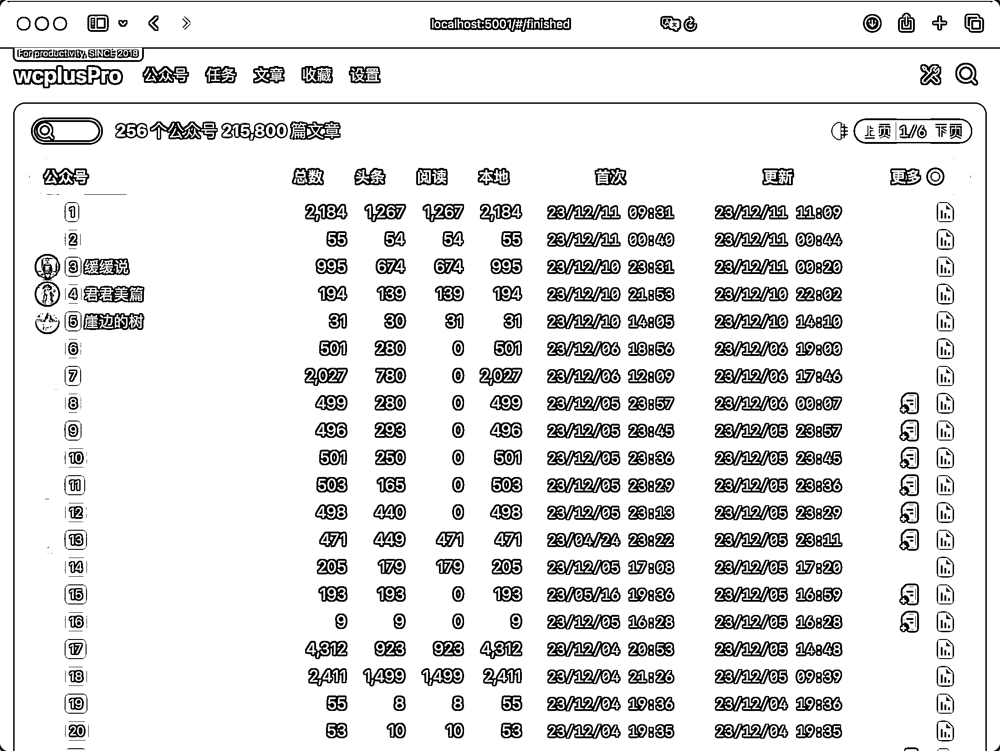
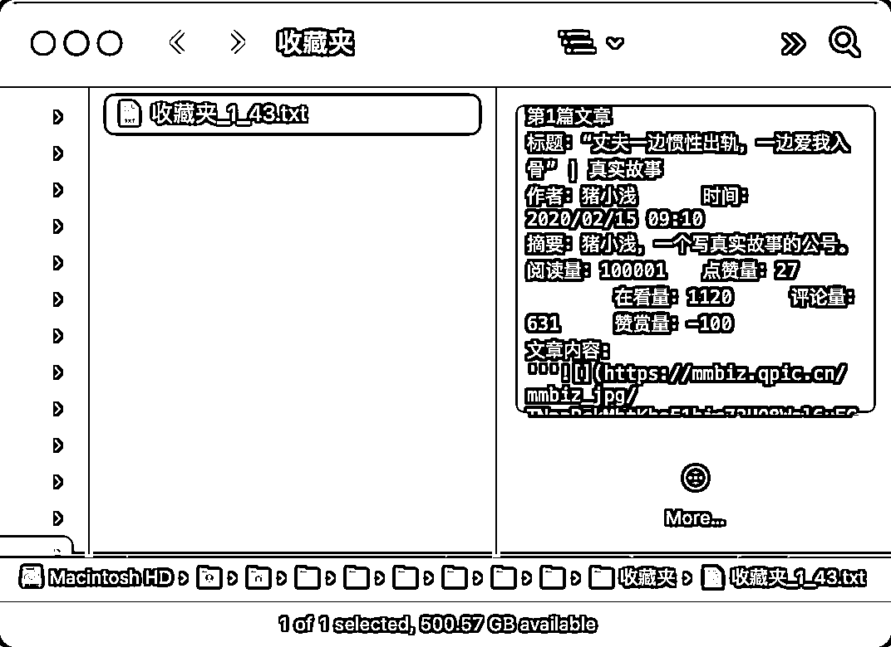
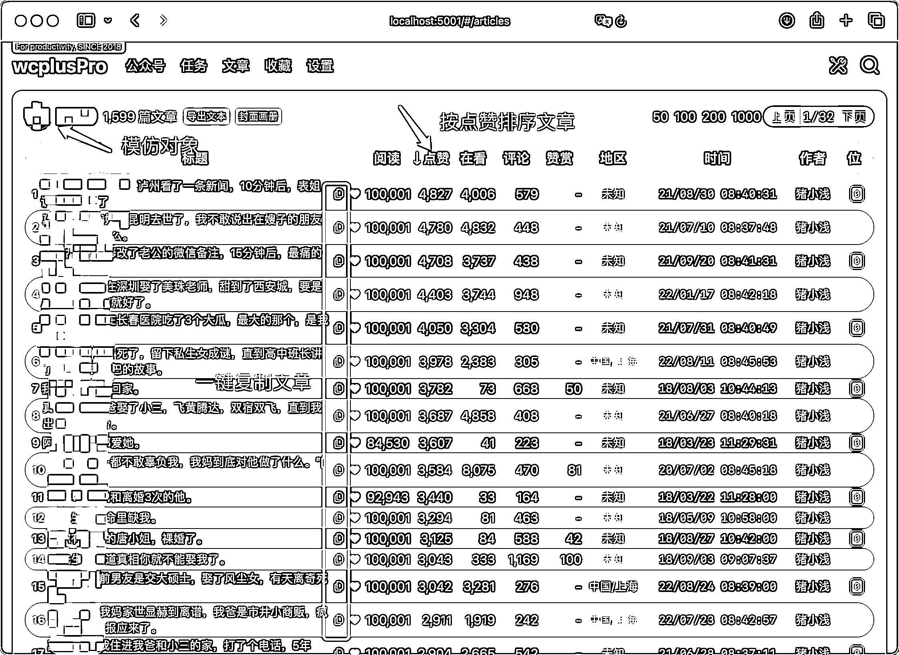
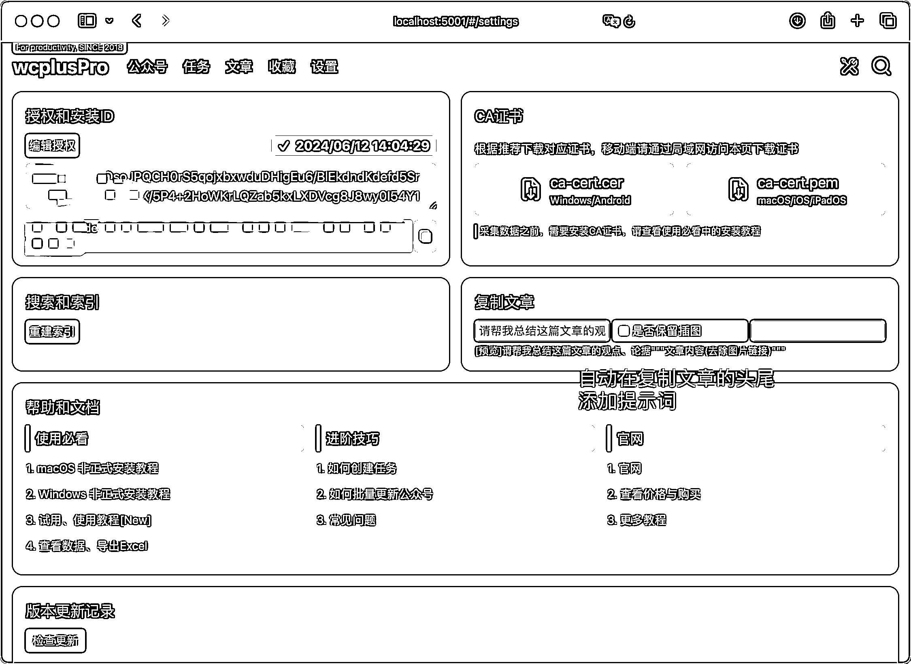
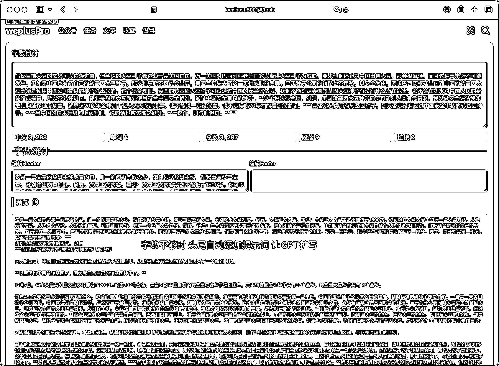

# 公众号爆文写作种新的方法分享

> 原文：[`www.yuque.com/for_lazy/thfiu8/tcacn9t6txbarc2i`](https://www.yuque.com/for_lazy/thfiu8/tcacn9t6txbarc2i)

## (101 赞)公众号爆文写作种新的方法分享

作者： Dai

日期：2023-12-12

AI will not replace humans, but humans with AI will replace humans without AI AI 不会取代你，擅长使用 AI 的人会取代你

公众号爆文写作目前挺卷，我给你介绍一种新的方法，一起卷上新高度！

GPTs 让 GPT 结合私有数据变得非常简单，普通用户通过简单的文字描述，就可以在几分钟内创建一个拥有私有数据的 GPT4。这样的 GPT 理解用户问题更加精准，回答问题更加专业，在垂直领域会有非常好的效果。

这篇文章正是通过这个方法创作的，包括标题、摘要、故事情节、文章内容、插图封面。我仅仅是找了一篇文章让 GPT 参考，你看看效果怎么样。

[牺牲与选择：一位母亲的苦涩彩礼故事 https://zhuanlan.zhihu.com/p/671810201](https://zhuanlan.zhihu.com/p/671810201)

评论：怎么是女方出彩礼？有点意思！

接下来我会详细拆解利用 GPTs 进行公众号写作，包含：

1.  原理拆解

2.  实操流程

3.  效果展示

绝对有效，动手能力强的朋友，可以马上开始模仿、超越，欢迎在评论区交流。

## **原理拆解**

1.  找出几个对标公众号，筛选出它们点赞最高的 50～100 篇文章

2.  将这些文章的标题、阅读、文章内容等数据放在一个 txt 文件中

3.  创建一个 GPTs，上传 txt 文件到知识库

4.  在 GPTs 的指令中，要求学习知识库中文章的写作风格，根据用户的要求创作新的文章

5.  使用时 GPTs 提供参考主题、故事主线、对标文章，让 GPTs 创新文章

6.  可进一步要求 GPTs 结合文章主题绘制封面、插图

7.  将文章发布到内容平台

## **实操流程**

### **1 找对标账号**

公众号写作有很多大方向，比如时政、股市财经、科技、养生、美食...... 既然是 GPT 写作，你不用纠结该选择哪个领域。你只需要将该领域能拿到流量的文章告诉 GPT ，让它去学习、模仿就好了。我这里使用情感类为例，其他类似。

我介绍几个方法，你理解消化后，完全可以探索出新的方法

1.  微信搜索情感类文章经常出现的词，比如 “婆婆竟然”、“情感类”、“家庭关系”、“职场政治”，对结果按热度排序。以一带十，肯定能淘到不少好货。

2.  注册一个新的微信账号，不要关注任何公众号，去看一看找热点文章。背后的公众号，很多都是低粉高阅读量，它们是最好的模仿对象，一定不要错过。

如果你还有其他方式寻找对标公众号，欢迎私信、评论。

### **2 获取目标公众号的高赞文章**

手动刷一刷，也能找出几十篇符合需求的文章，无非就是多花点时间。如果你用过 RPA 软件，写个脚本，也能顺利完成这个动作。

需要提醒的是，别忘了 GPT，你可问问他怎么才能导出对标公众号的文章。

如果你实在没有趁手的方法，可以试试看[wcplusPro](https://www.wcplus.cn/?s=gzh)，它就是一个专业的公众号数据导出软件，完美解决这个需求。wcplusPro 提供了试用版，足够导出 1～ 2 个公众号的全部历史文章，手速快的，导出 5 个也没问题。实在导不完的，可以按小时购买，足够人性化了。

除了导出公众号数据，wcplusPro 针对 GPT 写作做了很多细节支持，比如：

1.  热门文章筛选、搜索，可以用于快速寻找模仿对象

2.  一键导出对标文章为 GPTs 知识库

3.  一键复制目标文章用于 GPT 学习模仿

4.  文章头尾自动添加提示词

5.  字数、段落统计

接下来涉及到公众号数据导出和知识库文章整理的任务，我以 wcplusPro 为例。记住，其他方法能实现类似结果的，完全可以不用 wcplusPro。

第 1：将对标公众号的全部历史文章和阅读数据全部采集下来

第 2：依次进入对标公众号的文章列表，按照点赞由高到低排序文章，将前 10 ～ 20 篇文章加入收藏夹

第 3：导出收藏夹的所有文章到 txt

单个 txt 文件中的文章数量可自定义，文章格式是这样的：

### **3 创建一个 GPTs，上传 txt 文件到知识库**

给 GPTs 取名字、写描述、上传准备好的知识库都很简单，指令这部分的灵活性非常大，没有标准答案，也没有最佳实践。这里有一个我们花了很多时间研究的模板供你参考，这肯定不是最好的，你要反复修改、测试、迭代自己的指令。如果你愿意将自己的指令分享予我，倍感荣幸！

创建好的 GPTs 大概就是这个样子：

发布 GPTs 一定选择仅自己可见，防止自己的指令和知识库被别人逆向，只要最终的效果呈现在文章质量上就足够了，没必要让别人用你的 GPTs。

### **4 要求 GPTs 写文章**

你是否注意到我在指令中有这么一条要求：

用户会给你一篇参考文章，并要求模仿这篇文章的故事情节创作新的文章，用户指令以类似“请参考文章创作开始”，以“以上是全文 请马上开始创作”结束，中间部分就是参考文章

这里有个问题，参考文章的选择标准是什么？

我偏向于从结果出发，既然目的是获得流量，有流量的文章最值得参考，尤其是低粉高赞文章。阅读量不稳定的公众号，某段时间的推文阅读量从几十到几万都有的，流量要靠平台推送，大概率就是低粉账号。

比如这个号，阅读量最高的有十万加，最少的有几十。阅读量不稳定，基本靠平台推送，订阅用户一定不会多。

wcplusPro 自然无法直接告诉你全网有哪些低粉高赞文章，利用好搜索和智能推荐，多发现几个对标公众号并不难，通过 wcplusPro 找到它们的高赞文章。

将复制后的提示词和参考文章发送给 GPTs，它就会按照指令要求，一行行直接输出文章标题、摘要、故事主线、文章内容。最后你还可以要求它提供封面、插图照片。

提示词中使用 """ 的目的是为了完全包裹文章内容，防止 GPT 将文章内容中的某些语句理解为指令。

我们在实践的过程中，发现了很多惊喜，也有个别问题。

比如惊喜：

1.  由于有知识库作为写作参考，又有对标文章作为故事情节模板，GPTs 生成的文章几乎都可直接用，实在不满意，让它重写就好。

2.  GPTs 创建完成后会一直存在，每次写作打开即用，省去了微调的时间，完全可以在几分钟内输出一篇可用的文章。

3.  对 GPTs 的某些表现不满意，随时修改指令，马上就能生效，这种更新迭代是可以积累的。如果把创建一个满意的 GPTs 比喻为做产品，这种模式非常符合依次造滑板车、自行车、摩托车、小汽车的创业模式。不要纠结于最好的是什么样，先拿出 MVP。

在我们的实践中，最大的挑战，可能是字数经常不达标。虽然我们在指令和提示词中明确要求字数不能低于 1300，GPT 也有能力一次输出这么多字，GPT 也知道自己的输出没有达到字数要求，很多时候它还是坚持只给 600～ 800 字。

字数不够，这可是流量主爆文写作的大忌。我有如下几个建议：

1.  不要一直尝试在指令和提示词中要求 GPT 输出更多的文字，它不一定会照做，还会浪费大量 GPT4 的对话次数。GPTs 本质上是有知识库+有预设指令的 GPT4

2.  GPTs 给出文章，继续交给无对话限制的 GPT3.5 去完成扩展细节，可以让它分多次输出，确保字数达标。我这儿有个提示词供参考：

将 GPTs 输出的内容粘贴到 wcplusPro 提供的字数统计工具，汉字数量、单词、段落数量一目了然。

如果字数满足要求，直接发布。如果字数不满足要求，wcplusPro 可以根据用户的设置，自动在头尾添加提示词，用户一键复制发送给 GPT3.5、4 扩写。

欢迎评论、分享。

* * *

评论区：

Cobb : wcplusPro 好像要买会员
Dai : 有试用，淘宝也有一大把方案
寒星 : gpts 是必须 gpt4 才可以用吗
Janey hu : 不懂就问，GPTs 是啥
Dai : 是的
Dai : 这是个好问题，B 站视频可能解释的比我好
寒星 : 能给个淘宝方案关键词吗，刚搜半天搜不到
Dai : 公众号导出 公众号采集

* * *