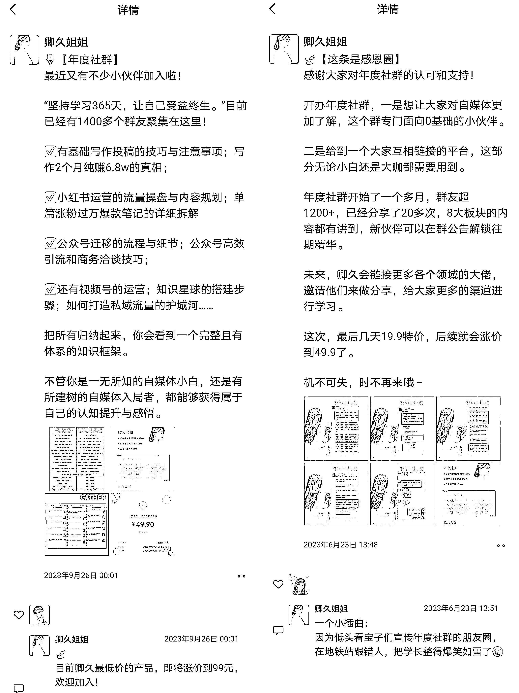
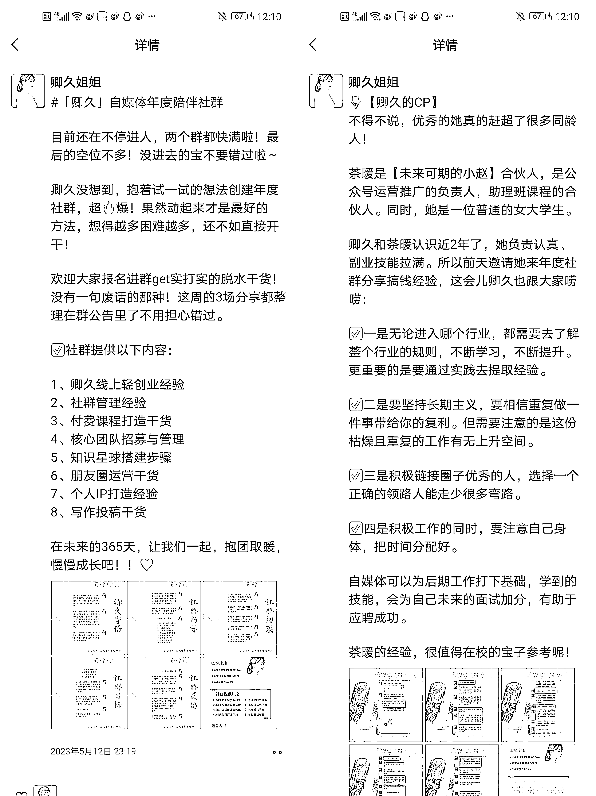

# 联名开设群需要注意的事项

> 原文：[`www.yuque.com/for_lazy/thfiu8/ae0aoisy8svcz9z4`](https://www.yuque.com/for_lazy/thfiu8/ae0aoisy8svcz9z4)

## (20 赞)联名开设群需要注意的事项

作者： 赵卿久

日期：2023-12-13

哈喽，生财有术的友友们好，我先自我介绍哈，我是卿久，97 年中文系，运营两个公众号，慕卿久与未来可期的小赵，全职自媒体 3 年，粉丝 18w+。

擅长公众号运营和打造个人 IP、搭建自己的付费产品和私域运营，如今通过自媒体成功变现 60w+，目前月入 4w+。

最近关注到部分小伙伴开始联名开社群啦，这是一种不错的方案，最大化招募，将流量聚拢起来，而且可以分担分享干货的压力。

但是在联名开设群，有一些事项需要注意，现在卿久就来跟大家唠唠~

**✅第 1 点：定价。**

卿久知道有不少的小伙伴，在起步阶段，肯定纠结我们搭建社群时最开始的定价，或者是对于什么时候可以开始涨价，很纠结。

我们无论做什么产品，多多少少都会遇到类似问题哈，这是很正常。

这时，只需谨记一点：尽可能把影响决策的阻碍，减到最小！不要因为这些把自己卡在第一步了，行动起来再说。

如果怕自己的社群开始时招不到人，或者报名的人少，可以直接定最低档 9.9。

卿久最开始就是定的这个价。

因为我想尽可能聚拢自己能够接触到的全部流量。

落子无悔。但有的小伙伴，又担心这样是不是太便宜了？自己是不是显得太廉价了？钱会不会赚太少了？

卿久想说：不要有很多心理负担哈！

9.9 当然有它的优点。这可以迅速招到非常多的人，打开自己的知名度，增强自己的势能。

你的社群人数越多，说明影响力也会越大，是不？

而且用户会降低期待，当我们提供分享，学员会觉得物超所值。

而且，陪伴群只是我们变现的【第一步】，所以不用太纠结第一笔钱是赚多还是赚少，都不会很多的，差别不大。

9.9 和 19.9、29.9 的差别大么？能拉开我们这个月和上个月的收入差距么？基本不会！

**明确一点：我们搭社群不是为了一时的赚钱，而是为了转化，赚高客单价产品的利润。**

搭建社群是为了有自己的流量池子，社群很重要的一些作用：

随着消息的更新，让我们的名字，多次进入到用户视野，起到触达作用；

通过分享干货，增强群主与用户的粘性、信任度，信任越强，ta 们会更愿意跟随你学习、买你推荐的产品。

**所以还在犹豫定价的宝，可以放宽心一点哈！价格不是问题，只要你持续宣传，就一定会有人买单，大胆踏出第一步。**

**✅第 2 点：宣传发售**

这点很重要！不论是两方决定联名推出产品，还是说 3-4 个人共创人，决定合伙搞事情，如果几个共创人流量和势能都差不多，一旦发售朋友圈进行宣传时，要注意重点宣传共创产品！

也就是说，我们约定好这阵子联名产品是核心产品，要重点发圈，共创人每天必须至少 2-3 条朋友圈，一起行动。

如果你自己还有其他的产品要发，你只能偶尔发圈，避免过多宣传，造成分流。

最好的话可以集中宣传共创产品，其他的产品都不要提，尤其忌讳东一个西一个，朋友圈无重点、无规划，对合伙人不负责！

为什么要这样呢？

**一是避免造成用户头晕，看不懂你手头产品的情况，增大报名的阻力。**

**二是保护共创人利益，对彼此都公平公正。**

打个比方，你有好几个产品，而你的合伙人只有这 1 个产品。

你呢，一时宣传这个产品，一时宣传那个产品，同一时间段，流量是不是就分配不恰当了呀？

万一你的用户都为你其他产品买单，而忽略了共创产品，这对你的合伙人可不太公平哦！

可能有些宝子想跟好几个人联名，这个博主我喜欢，另一个博主我也喜欢，那怎么办呢？卿久在这里也给出一个建议意见：可以分阶段宣传。

一个产品的周期是 15-30 天左右，每天坚持发 2-3 条，相信你的朋友圈绝大部分好友已经触达到了

比如说卿久有两个联名合伙人，我 10 月到 12 月这一个阶段，重点宣传其中一位合伙人，等到另外一个朋友考完研后，再转移重心，宣传另外一个联名合伙人~

或者分阵地宣传，私域阵地，宣传一个，公众号，宣传另外一个。

流量池比较小的情况下，切忌在同一阶段宣传不同产品

**✅第 3 点：共同商量。**

合伙人最常遇到一个问题：容易引起分歧。

在商量或者讨论一件事时候，每个人都有自己的想法和态度。

合作期间双方需要敲定很多细节，比如说海报制作，比如说分享频次、分享的内容，等等。

很容易引起矛盾，甚至还会闹掰了，卿久也经历过，以前和玩得好的博主，想一起做课程，刚写到第一章，就闹掰了。

当然这件事发生在我们还没开始做宣传时，怕就怕，我们已经宣传了以后，因为分歧，无法继续推进产品，这对于报了名的小伙伴来说，是非常不责任！

所以联名做产品，必须要注意一点：讨论时候，有商有量，各退一步，不要急眼，不要各自为政。

共创合伙人，其实也相当于一个小团队，也是需要有主心骨，有领头羊，有副手。

所以卿久建议，可以选择 1 个小伙伴做拍板人，ta 的身份就是做出最后的决定。

或者可以这样：这次我退一步，下次 ta 退一步，轮着来定主意，按照这样子的相处方法，也是可以持续合作下去的。

就拿卿久来说，卿久是自己团队的领导者，但有时候也会倾听团队成员的意见，觉得不错时候还会直接采纳。

所以，有时候我们可以多方面去接受不同的意见，一起坐下来，对比哪种方案更好。

或两个人商量不定的，可以咨询过来人，ta 们经验比较丰富，可以给大家提供一些建议。

**✅第 4 点：持续宣传。**

宣传很重要，卿久发现很多小伙伴却容易忽略很重要一点：必须多次发圈宣传

今天卿久在朋友圈课程也发了自己宣传自媒体年度社群朋友圈的文案。

从 5 月份搭建起至今，卿久都会时不时进行宣传。

特别在刚招募时，用了整整 1 个月时间来宣传年度社群，我记得我当时是发了几十条朋友圈。

**不知道宝子们有没有留意哈，七夕活动，国庆活动，双十一活动，卿久都会做一波关于年度社群活动，比如 cp 拉新活动、满多少人抽奖，节假日抽奖，等等。**

年度社群，我已经搭建到现在已经有好几个月了，在这个过程中，又链接了不少的好友，每个月链接几百个好友，几个月下来都上千了~

老朋友们，估计都已经买了我的年度社群，新加好友并不知道我的产品都有哪些，不了解我擅长的是什么，所以后续我还是会持续发圈哦！

**只有搭建招募时候发几天的朋友圈，用处不太大，需要持续给大家介绍哈，让大家对你的产品有记忆，有印象。**

**后续有新人进群，能活跃群气氛，还能发朋友圈报喜晒单，何乐而不为呢？**

最后，卿久跟大家唠几个发圈小妙招。

①联名搭建中，还没发售阶段：

文案：“准备跟 XX 一起搞事情，XX（日期）会公布！”

多多铺垫自己花了多少精力去探讨、去准备、写了几千字的分享，这种文案可以吸引人注意力，联名搞事情，大家都会好奇，就会对你们有一定的关注。

②海报出来，正式发售阶段：

这种文案一般可以开门见山了，把产品相关的主要内容、权益、价格、时间说清就好。

这是让用户对你的产品有初步印象。

③发售后，处于出单阶段：

我们一定要趁热打铁集中发圈宣传。

文案类型基本有以下 3 种：

a.直接引用咨询时的对话，通常报名咨询时的问题都是大家的疑惑点，以问答形式发圈可以打消一部分用户的顾虑，推动成交意向。

b.引用对方的夸夸。如果大家有出单经历，会发现有些宝子是围观我们朋友圈一段时间了，看见我们推出产品，立刻报名，有时还会附上几句夸夸。

这时候我们可以直接引用，来体现我们的势能，扩大我们影响力。

c.名额-N/即将涨价。当我们成交一定的数量时，可以放在一起作图发圈。这样不仅可以表现产品的价值，而且在一定程度上也能给人营造一种紧迫感。

④发售后，没出单阶段：

没出单，我们不需要太担心，也不用太焦虑。

很多宝子觉得没出单没有素材可发，其实不是哈！

我们照常发圈就好，平常心对待，拉近跟用户关系。

我们发圈本来的目的就是打造自己的人设，没有出单那就继续发圈强化，可以讲讲自己对自媒体的感悟，对自己副业的看法等，让用户对我们有一定的了解，粘性更强，自然而然找你付费。

以上就是卿久分享内容！还有没解答的提问，欢迎提出！

* * *

评论区：

暂无评论

* * *