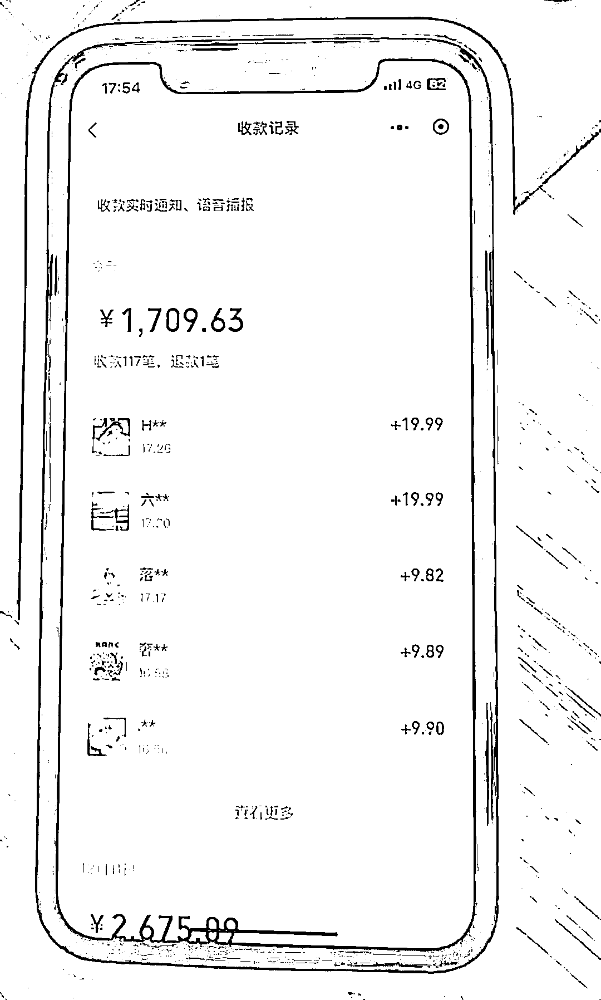

# 同城搭子群，一单 9.9-29.9，搭子经济，主打陪伴

> 原文：[`www.yuque.com/for_lazy/thfiu8/tgls21gwxtuv4gos`](https://www.yuque.com/for_lazy/thfiu8/tgls21gwxtuv4gos)

## (38 赞)同城搭子群，一单 9.9-29.9，搭子经济，主打陪伴

作者： 笑笑

日期：2023-12-12

同城搭子群，一单 9.9-29.9，搭子经济，主打陪伴

前几天在生财社群内分享的风向标，被列为了中标，今天完整拆解这套玩法

在一线城市的人感触会很明显，尤其是背井离乡没什么朋友在身边，或者刚来到这座城市没有熟人

偌大的城市，想出去玩找了一圈列表里，发现没有什么能够叫的出来的人，或者想找个对象，却线下社恐看见喜欢的姑娘不敢要 wx 等等

由此产生了搭子这种词汇，例如干饭搭子，旅游搭子，学习搭子等等

大家差不多的年纪，在同一所城市，上班摸鱼能聊聊天，周末可以相约一起去海边吹吹风爬爬山唱唱歌🎤等等也是一个不错的选择

类似于这种的笔记，虽然点赞没多少，但是评论却高的吓人，小红薯，抖音，快手同理

基本受众人群 16-30 左右（目前测试基本都在这个区间）

建立一个同城交友群，女性免费，男的收 9.9-29.9 一个人，美名其曰防止广告或者防止一些下头男进入等等

全国各地都可以做同样的搭子社群，基本几个作品就能像图二一样差不多百来个人的群

详细内容麻烦移步:

[`vw816p5cncx.feishu.cn/docx/ZBhmdcHXXo3yyOxL9SEccNQrnS7?from=from_copylink`](https://vw816p5cncx.feishu.cn/docx/ZBhmdcHXXo3yyOxL9SEccNQrnS7?from=from_copylink)

* * *

评论区：

Seazen : 留个 V 呗
笑笑 : xiaoxiao794205
注定的王 : 这种如果是男生，但微信性别写的女咋办[捂脸]
笑笑 : 哈哈，才 9.9-29.9 一个人，可以但是没必要，因为是进去交友的，到时候如果同城群里面整的自己，进去是女生，然后变成了男生，显得不太真诚
， : 付费进群系统搭建：cikk170118
晚风 : 我这也可以搭建付费系统[呲牙] wanfeng2162

* * *