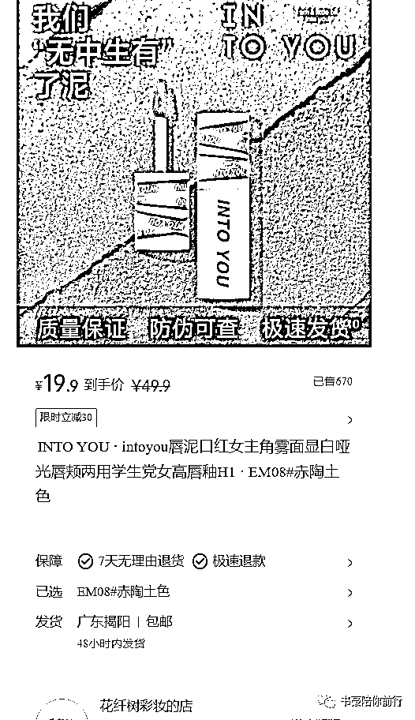
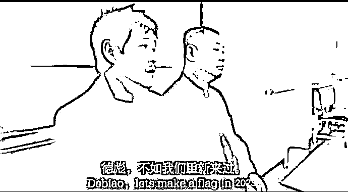

# 在小红书卖 INTOYOU 假货的法律风险

> 原文：[`www.yuque.com/for_lazy/thfiu8/gwfal1hqd5bmbnga`](https://www.yuque.com/for_lazy/thfiu8/gwfal1hqd5bmbnga)

## (82 赞)在小红书卖 INTOYOU 假货的法律风险

作者： 书豪

日期：2023-12-22

大家好，我是在杭州的龙珠圈友书豪，小红书店铺和直播航海教练，航海报名开始了，欢迎大家报名小红书直播和小红书店铺航海呀！我会在航海期间为大家保驾护航！

给大家分享一点电商的法律常识

前段时间有朋友在小红书上卖假货，INTOYOU 的某款唇泥。

这位朋友被小红书的客户举报是假货，问我该怎么办。

我说你卖了多少钱啦，和你的上家确认过了吗？是假货吗？

这位朋友告诉我，已经卖了五位数啦。并且和厂家说确实是假货，没有防伪码。

进货价格 10 块钱，在小红书卖 19.9 元钱。就像下面这个账号一样。

这把我吓了一跳！我说你赶紧先把库存设置为 0，立马下架先，我给你找律师咨询一下法律风险。继续卖爆小心出事！

我赶紧去咨询了一下家里的大律师。

因为是家人，我就把细节问题都说给家人听了一下。

俺家的这位大律师告诉我，继续卖有刑事法律风险。

我继续问俺家的这位大律师，我说问题这么严重吗？

**俺家的大律师告诉我，在淘宝旗舰店卖 39.9 元的品牌唇泥，你这位朋友卖 19.9 元，这属于知假卖假了。**

俺家的大律师建议我这位朋友放弃继续卖该品。

因为有刑事法律风险。

一方面本身品牌方在当地公安系统关系深厚，第二卖假货金额过大被盯上早晚的事情。

大律师告诉我一个事情，曾经他有一个客户也是卖日本的优衣库的假货，被抓了，在看守所天天以泪洗面，当时卖的人也很多，但总有被抓的。

不要抱有侥幸心理！

我把这个事情说出来，是想给各位圈友做一个法律风险提示

不要觉得卖假货有暴利，就不顾一切！

合法合规赚钱，这太重要了!

留得青山在，不怕没柴烧！

即使再暴利的生意，如果有刑事法律风险，就要果断放弃！

我的这位朋友因为比较信任我，他在我问完律师之后，并且给他说了法律风险之后，他就收手下架了商品！

兄弟们，时势造英雄，这个时代，机会多的是，咱们要赚钱的基础必须是以法律为准绳！

你在小红书卖假货，价格比小红书旗舰店还便宜一半，搜索流量 90%以上，是很香，但是你会失去人身自由！

长路漫漫，我们赚钱的机会多的是！

2023 年快过去了，希望咱们在面对暴利的时候，能够冷静一点，不要因为暴利失去了判断力！

这个伟大的时代总是有各种各样的我们意想不到的机会。

只要咱们还在路上！

最后，小红书店铺和小红书直播欢迎大家报名上船，我会在航海期间为大家保驾护航！

也希望所报名航海的船员都能够在航海期间勇于克服各种困难各种问题，不要害怕执行过程中的未知问题！

(我目前主要在做小红书、快手这两个平台，也欢迎跟大家多多交流，探讨，定当知无不言，我的微信：wsh137552775)

* * *

评论区：

老胡 : 这款经常供不应求
星辰 : 假货一时爽，踩缝纫机可就不划算了[捂脸]
hh : 但是你会失去人身自由😂
书豪 : 厂家成本四块钱 哈哈哈
书豪 : 大部分卖的都是抱着侥幸心理，但总有个万一
朱朱侠 : 巧了[在小红书上刷到一个访谈录的节目]其中一期就是一个 刑 满 释 放人员的真人出镜~告诉大家 犯 罪的成本到底有多大
徐萌 : 优衣库还卖假的，消费降级到啥程度了……[流泪]
再见，旧时光 : 赞同，还是要稳住，心存敬畏之心

* * *