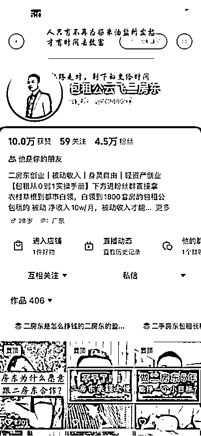
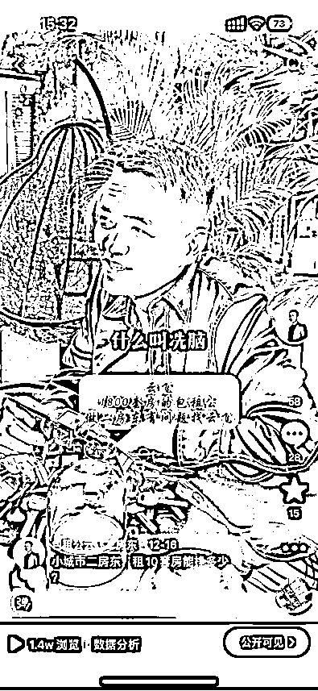
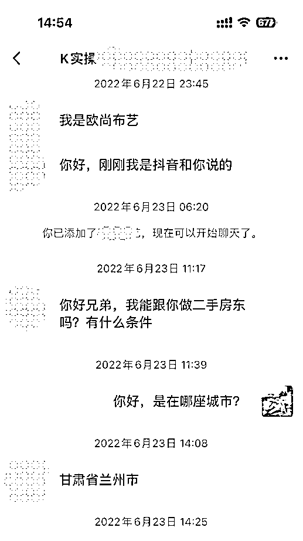
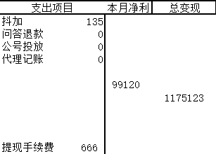
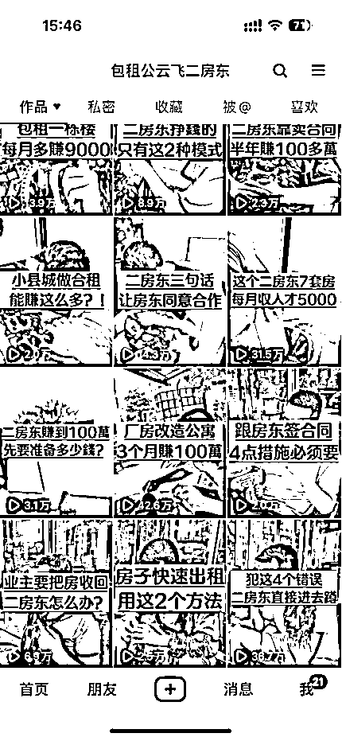
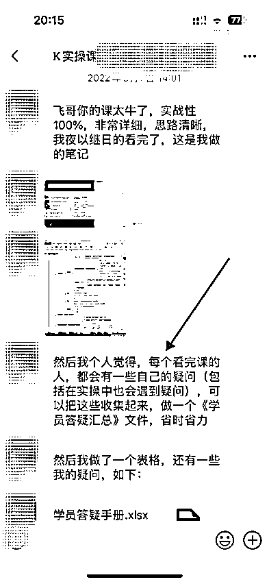
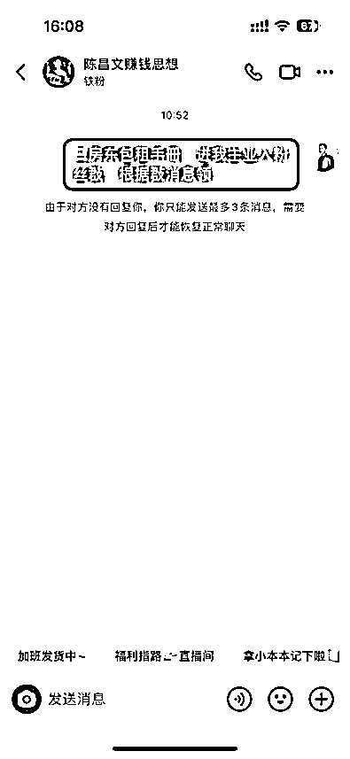
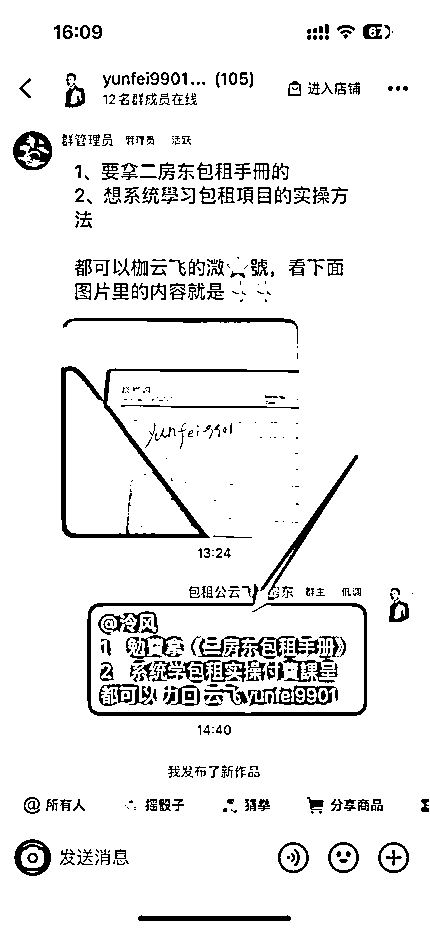
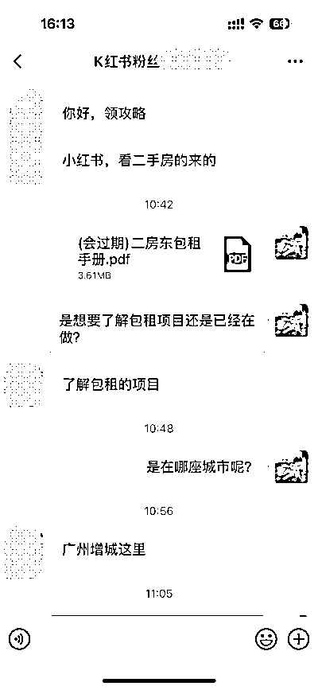
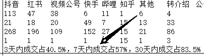

# 做个人 IP 第一年，赚到 100 万利润，我的经验与心得

> 原文：[`www.yuque.com/for_lazy/thfiu8/ukd14gvsgg2m665q`](https://www.yuque.com/for_lazy/thfiu8/ukd14gvsgg2m665q)

## (154 赞)做个人 IP 第一年，赚到 100 万利润，我的经验与心得

作者： 云飞

日期：2023-12-22

去年 6 月 21 日开始发第一条视频，截止今年 6 月底，刚好一年时间 100 万利润，平均一条视频带来 2740 元的收益，全网 15 万粉丝，2 万私域。

大家好，我是云飞，1800 套房的包租公，去年发了一篇帖子《[把包租公包租婆这门生意讲透](https://t.zsxq.com/15ltmUjaC)》取得精华得到一颗龙珠，因此进入了航海家俱乐部，在生财和航海家群学到了很多东西，这一年时间都在深耕我的包租 IP，算是学有小成，所以再来分享看能否给到生财哪怕一点点的知识回馈。先放一张我的收益截图，证明这个标题不是假的哈哈

我是去年 6 月 21 日开始发的第一条视频，截至今年 6 月底，当时我算了下大概就是 100 万利润，上面是小鹅通平台的收入，还有微信转账和抖音店铺也有一部分。

看了下我的抖音，一年时间大概拍了 292 条视频，加上小号的 140 条，总共就是 432 条，因为小号是有一小段时间请了个助理帮我拍的，所以粗算是一天一条，我给自己定的任务也是一天一条，也就是说，换算下来，我拍一条视频，平均能给我带来 2740 元的收益。

一年一百万，这个成绩确实不算好，也确实不算太差，主要是，这是第一年做出的成绩，而且就我自己一个人，所以值得分享我的一些心得与经验，希望能给到想要起步做 IP 的伙伴们一些帮助。

现在各行各业的 IP 百花齐放，IP 打造的知识也遍地开花，生财里就有非常多的精华帖，我这篇没有很硬核的干货，也没有特别多的技巧，有的只是一个过往毫无自媒体经验的小白从 0 到 1 做起来的过程自述和心得分享。

文章目录

#### **1、从 0 到 1 的过程**

（1）传统行业转型互联网的起因

（2）首次尝试做 IP 失败

（3）找准定位火力全开

（4）我的 IP 起号方式

#### **2、我跌宕起伏的变现经历**

（1）第三个月净利润 10 万

（2）变现直接腰斩！

#### **3、我的视频拍摄历程**

（1）拍摄形式的变换

（2）心理障碍如何突破？

**4、我的变现体系拆解**

**5、我的变现全流程**

**6、我的经验与心得**

若只是对经验进行概括性罗列总结，让人难以代入理解，所以我想结合做 IP 的历程来阐述：

**（1）传统行业转型互联网的起因**

我在 2021 年年中的时候，跟朋友一起去杭州参加了个互联网青年创业论坛，见了不少互联网创业者，而后又去一家短视频培训公司付费上班了半个月，

也跟一些短视频和直播电商的老板们进行了学习交流，因为我俩都喜欢主动找事，期间就遇到了很多好玩有趣、突破认知的事，

“我爱这个魔幻的世界”。

这句话是我和朋友在杭州的这次经历，产生的感叹。

互联网的世界，或者说短视频的商业世界，对当时的我们，这种传统的实体小老板来讲，真的是太新鲜太刺激太魔幻了~

回去后我就下定决心，要到互联网上面去淘金！寻找我事业的第二增长曲线。

**（2）首次尝试做 IP 失败**

同年 11 月我就搬到了深圳，开始了我的互联网淘金之路。

在做出成绩之前，我也走了一段弯路，一开始我想要做的是商业 IP，跟那些大佬一样，衣着光鲜亮丽坐在办公室里，侃侃而谈商业之道，尽显风采。

找对标、抄选题、洗文案，这是当时做短视频商业赛道的三板斧，放到现在依然如此，在当时我也贯彻执行，现在回顾去看，事实证明：

**方向不对，方法和路径再正确，也无济于事。**

这个【方向】包含两层，一层是[趋势]，一层是[适合]，对于新人来讲，

**[适合]应在[趋势]前面。**

意思是即使你看到了趋势所在，选择的方向跟趋势一致，但不适合自己，依旧做不起来，这是我对方向的理解。

当时的我就是个例子，创业没多少年又是互联网的初生牛犊，商业底蕴匮乏，哪来的资格在商业世界里夸夸其谈？

即使有胆量但缺乏底气，即使敢抄能模仿，但自身散发出的能量根本不足以支撑 IP 做起来。

**（3）找准定位火力全开**

方向（赛道）有大小之分，在商业这个大赛道没做起来之后，我又尝试了其它的互联网项目，也在不断学习、摸索自己能做的方向，到了 22 年年初，有那么几天，

我突然性的悟了！

1、我还是要做个人 IP，

2、我一定要把它做起来，

3、我就应该先做自己最擅长、最专业的方向——包租。

就是有一种信念？思维？还是指引？突然灌在脑子里的感觉。

商业的大赛道做不起来，我可以做适合自己的小赛道，之前为什么没做？因为追求光鲜亮丽追求高大上。

我内心认为二房东在人们心里是一个有点 low 的形象，包租公这个角色也是如此，所以心理上有个坎。

后面证明，**定位的形象 low 不 low 不重要，做一个能赚钱的 IP 才是根本。**

顿悟之后，我就全身心开始发力了，符合自己的定位想清楚了，我就开始设计变现方式，个人 IP 无非是卖货、卖课、卖服务三种，卖课是最直接的，也最适合当下的自己，

我脑子里有包租这个行业的知识体系框架，做出一份高质量的课程如同囊中取物。

4 月份我便开始沉浸式开发自己的包租实操课，从课程的基础框架设计、框架完善、内容逐字稿，到后面的 PPT 制作、视频录制、调整、剪辑、海报和详情页的内容设计、课程平台的选择和上传、用户流程的测试体验等等，

全都是自己一个人完成，每天从早干到晚甚至通宵达旦，除了吃饭哪也不去。

期间遇到的问题和挫折就不在这表述，就说一个我自己的感悟：

> **（4）我的 IP 起号方式**
> 
> 课程上架之后，就要开始获取流量（客户）了，当然是拍视频，当然是首选抖音，大方向的趋势要跟着走。
> 
> 前期我不断的找对标同行学习，还做了十几个表格进行记录、分析、总结：
> 
> 
> 
> 每条视频都会做数据跟踪、记录然后进行分析，不断尝试各种学来的东西，模仿同行的拍摄方式、拍摄背景甚至姿势动作，
> 
> 
> 
> 去年做二房东包租 IP 这个赛道的人还不多，只能找出几个，我觉得不够，也找其他赛道的 IP 学习，还有经常刷专门教短视频的博主和生财的精华帖，什么文字钉视觉锤都在尝试，
> 
> 这里说一下视觉锤确实很重要，我买了几把包租公的钥匙道具天天拿着怼来拍，这个钥匙道具给我带来了非常多的评论数据，几乎每条视频都有人在说“你这钥匙是假的、钥匙都没开封啊“等等，我都没去回应，钥匙都在我管理员那里况且真钥匙很重没必要拿来做道具，
> 
> 
> 
> 当然我不是一开始就知道会产生这么多的互动数据而有意为之，只是想要给自己的 IP 附上一个视觉锤，
> 
> 夸张、新奇的道具在视频里呈现，确实能够拉长用户的停留时间。
> 
> 视觉锤不一定要是实体道具，就像金枪大叔的白头发和胡子，鹤老师的服装和帽子，甚至暴叔讲留学的给自己泼水的行为也叫视觉锤。
> 
> 当然不是一定要有视觉锤，如果有条件且使用成本低可以搞一个，但若是这个视觉锤的使用成本过高，我就不建议去做，**前期一切动作以低成本操作为主旨。**
> 
> 不能人云亦云别人说什么好就去做什么，这样容易本末倒置，每个人的现实情况都不一样。
> 
> ### **2、我的变现经历**
> 
> **（1）第三个月净利润 10 万**
> 
> 我清楚的记得，发完课程宣发朋友圈的第二天就出了第一单（大课），但因为这单是原来的微信好友，不算跑通变现闭环，印象更深刻的是发了第三条视频，抖音 47 个粉丝的时候就出了第二单，这就完全是公域吸引来的粉丝成交的，所以给了我莫大的信心。
> 
> 
> 
> **方向适合自己，做起来如鱼得水。**
> 
> 第三个月（8 月份）的时候就做到了 10 万利润，后面每个月都在 6-10 万这样，除了过年的 1 月份有半个月没拍视频只有 4 万多，基本比较稳定。
> 
> 
> 
> 直到今年 5 月份我的心态发生了变化，不想再局限于包租这个小 IP，想做大！
> 
> 所以 6 月份就开始尝试其他 IP 方向，这想法其实没什么问题，总是要向上生长的，要有突破就得多探索多尝试，
> 
> 问题就出在我以为只要保持日更，复制之前的每一条视频从第一条开始（到此我已经发了 200 多条）也能发一年，我包租 IP 的收入就能跟过去的一年一样，有个 100 万的利润，
> 
> 这样我就不需要每天花心思去想文案琢磨视频拍摄了，照搬就完事了每天就不用在包租这个 IP 上花太多时间，我就能有更多时间尝试新的方向。
> 
> **（2）变现直接腰斩**
> 
> 结果 6 月份的数据直接就给了我一巴掌，从之前平均月利润 8 万掉到了 4 万，直接腰斩！
> 
> 这让我想起一句话——你的注意力在哪里，钱就在哪里。
> 
> **减少时间的投入不一定会错，但减少心思的投入业绩一定会下降。**
> 
> 这条创业法则是我通过这件事再次深刻体悟到的，很多道理确实都听过，但真的只有亲身经历才能体会到其内核含义，这无关年龄无关性格，只与经历相关。
> 
> 利润大幅下滑之后，我就在思考，做其他 IP 什么时候才能做到年利润百万？而且能不能做起来还不一定，把心思都花在探索新方向上是不是得不偿失了？我问自己，这个机会成本是不是过高了？
> 
> 想通之后，我就把大部分的心思重新放回到包租 IP，认真思考文案琢磨视频的细节，通过两个月的努力，终于在 9 月份的时候利润回到了近 7 万，10 月份重回高峰近 10 万。
> 
> 这就让我对【你的注意力在哪里钱就在哪里】这句话有了更深刻的理解，
> 
> 原来把心思抽回来我还是能把业绩拉起来的。
> 
> 当然这期间的收入减少并不全是因为注意力转移，也有同行越来越多、整个大的商业赛道越来越内卷的原因，在这种情况下我不仅没有更努力的去做优化迭代，反而还减少了投入，
> 
> **很多问题的出现都是多因素交织的，所以才需要时刻保持危机感，保持对市场的警惕性，才能存活的更久。**
> 
> 当然我也不是把所有时间精力都放在包租 IP 上，一样在学习和尝试新的方向，上面我说的【心思】想表达是【专注度】，
> 
> **专注度的不同，投入同一单位时间的产出成果就会天差地别。**
> 
> 6 月份那时候我是真的就照搬复制之前的视频，基本没什么心思放在优化上，遇挫之后的改变我也只是每天花两三个小时在包租 IP 上，但这两三个小时我都有很认真在对待。
> 
> 到这里就讲完了我的 IP 变现历程，简单分享下我短视频形式的变换经历：
> 
> ### **3、我的视频拍摄历程**
> 
> **（1）拍摄形式的变换**
> 
> 一开始我发的几条视频也是以办公室为背景来拍摄，正怼着摄像头，后面看到别人有侧对着拍我也跟着尝试，再到边走边拍，再到你问我答，拍摄形式不断变换，用户都是有视觉疲劳的，同一种形式久了老粉丝刷到你可能就直接划走了，
> 
> 
> 
> 然而抖音现在是铁粉机制，老粉丝的数据反馈就很重要，所以要经常变换整个视频的观感，包括拍摄场景、开头动作、甚至表情、神态、手上拿着的东西等等，
> 
> 观感质量其实不需要特别高，不用跟那些大 V 一样买专业的设备为了呈现很高的质感，这样投入的不仅是更多的金钱成本，最主要的是拍摄过程的成本也会拉高，我都是戴个领夹麦拿起手机直接就拍，少了很多的时间和心理成本，**很多时候，够用就行。**
> 
> **（2）心理障碍如何突破**
> 
> 一开始拍视频确实会很尬，特别是你在尝试新东西、模仿别人的时候心里会更尬，到现在有些视频我自己看了都觉得尬，但这是一个必经的过程，**对自己，不突破就无法进步，不蹂躏就无法重塑。**
> 
> 突破心理障碍是把 IP 做起来的第一步，心理障碍有两种，一种是怕出丑（出镜恐惧和追求美丽），一种是道德感太高。
> 
> 怕出丑这个障碍，只能说完全靠跟自己硬刚，别人讲再多都没用。
> 
> 只要赚到钱有反馈了就能体会到脸面是不值钱的，但正向反馈是做了才有的，这个事，【没办法先看见再相信，只有先相信才能看见】
> 
> 我的不少视频都是穿着拖鞋短裤胡子都不刮直接开拍，像下面这条视频，我脸部脱皮嘴唇干裂头发杂乱胡子拉碴，坐在床上直接怼着镜头拍，脸太大都快怼出来了，但数据很好单单转发就有 5000 多。
> 
> 
> 
> 当然我不是说邋遢好......我是性格就这样随意，加上也符合包租公这种 IP 形象。只是想表达我们可以有心理负担可以有脸面包袱，但还是要去做，边害怕边突破不失一种另类的美。
> 
> 另一种心理障碍——道德感太高。
> 
> 我在前期的时候，文案措辞也非常谨慎，总怕别人误会我，不怕别人误会我更垃圾，就怕别人误会我更牛逼.....不怕粉丝质疑，就怕粉丝期望太高。
> 
> 比如我想说做二房东一万块钱就能起步，实际上也确实可以，只是可选择性不多，有个几万块起步会好点，当时写文案的时候就会担心一些粉丝会不会以为一万块钱就能很轻松的做起来；
> 
> 再比如我想写一个用一年时间做二房东能赚到多少钱的选题，其中的几句文案【如果一套房每个月的差价只有 500，你用一年时间包租个 100 套房，每个月就有 5 万的被动收入】，
> 
> 我当时在写的时候也担心粉丝会不会以为，一年时间包租 100 套房很轻松？不是说特别难，很多二房东都做到了，在当时就是会有这种道德感的顾虑。
> 
> 根据多次视频数据的反馈，像我这种卖项目的赛道，**粗暴的赚钱数据、激发人性欲望强有力的文案，**就是要比一本正经讲干货的数据更好，变现转化也更高。
> 
> 拿到直接的数据反馈之后，
> 
> 自此我就放下了那该死的自以为高尚的道德感。
> 
> 只要后端做好交付，前端可以适当夸张、放大，我们不需要为每一位粉丝负责，为你付费的才是对你认可的，认可你的才是你应该花心思负责的，如果想着对每一个人负责，那就太苛刻了，这种苛刻的道德感在商业的世界里寸步难行。
> 
> 当然我们不能随意捏造、歪曲事实、成倍放大数据、过度夸张演绎，基本的商业道德还是要守的。
> 
> 自媒体做了一年多，可以说我完全守住了自己心里的道德底线，也完全放下了高尚的道德感，目前为止，我的包租实操课有几百名学员，0 差评，起码给到我这的是 0 差评，且有不少学员主动给到我好评的反馈，
> 
> 我听说市面上像这种卖项目的如果有 10%的学员出成绩就算是不错的，我大概统计了下主动给我反馈做出来的学员就有几十个，没有主动给我反馈的肯定也有，超过 10%是有的，但 10%这个数据我只是听说的没有去考证。
> 
> 
> 
> 当然没做起来的肯定要比做起来的多，任何项目都一样，所以总结一句话：重视交付质量，前端大胆引流，不要怕出丑，不要把道德感架太高。
> 
> ### **4、我的变现体系拆解**
> 
> 再来说下我的变现体系：我的交付很轻，卖包租这个项目我不做陪跑不做训练营，只卖课程+资料包+问答手册+一对一答疑。
> 
> 课程分为一个小课一个大课，客单价是大课 2997 元，小课 97 元，但小课对于有意向深入了解包租这个行业的客户我都会直接送，目的是先让他们深入了解后再决定要不要入行，以及要不要学习我的实操大课，在小课的最后我有对大课进行全面的介绍；
> 
> 资料包是大课附赠的直接送，问答手册前期定的是 297 元买了大课也是直接送，做这个手册是受涛哥[@杨涛](https://wx.zsxq.com/dweb2/index/footprint/225814854821)的启发，涛哥在群里说做每个行业要有一份百问百答手册，一球奠定江湖地位，一开始我只想做一份小课一份大课，小课用来转化大课，大课用来变现，但没有几百块钱的课程势必会失去一部分不愿意花几千块客户，
> 
> 听涛哥这么一说，加上也有学员提议很多问题是重复的可以做一个答疑汇总，
> 
> 
> 
> 我就开始做一份问答手册，**不仅能节省回答学员重复问题的时间，还能填补几百块客单价的产品空白。**
> 
> 所以做 IP 制作一份自己领域的百问百答手册是很有必要的。
> 
> 做这份问答手册我是只用来直播卖的，因为前面已经设定好变现流程，流程里没有手册的位置，后面也印证了同在私域里卖几百块钱的手册会影响大课的转化，所以我就只在直播的时候卖，一场直播一个多小时能卖 1500-2500 元，但因为直播实在太累太烧脑，这个业绩也不足以支撑我的心力，所以播了一两个月我就停止了，
> 
> 不过我想说直播是很有必要的，即使不卖课每场直播也能多至少十几个咨询，**相当于多拍了条视频**，所以有能力且有心力直播的 IP 我都建议上直播。
> 
> ### **5、我的变现全流程**
> 
> 上面就是我的变现体系，再来简单分享下我的变现流程：
> 
> 1.视频结尾/评论区留资料钩子
> 
> 
> 
> 让用户回复关键词，除了下钩子还能增加评论数据，
> 
> 2.用户回复关键词之后，就私信让他们加入粉丝群（直接发微信容易被封，粉丝群引流目前还没大问题）
> 
> 
> 
> 私信用户后要回到评论区回复他们已发，目的是让别的用户看到确实是会给资料的。
> 
> 3.然后在粉丝群发微信，
> 
> 
> 
> 抖音的粉丝群有个好处是在群管理那里自定义‘欢迎语’，直接放微信号，这样一进群系统就自动发带有微信的欢迎语给用户（仅此用户可见），引流到私域就比较丝滑了，早中下晚再手动发一次，基本进群的用户就都能多次看到我们的微信，
> 
> 
> 
> 4.公域引流到私域之后，就是对话了，对话一定要有来有回，我不建议为了省事直接发一大段话或者扔个资料给客户看就完事了，即使你在资料里留下了你的产品介绍，但那只是冷冰冰的东西，绝大部分的客户看完资料是不会说直接下单或者主动找你咨询的，一问一答才有温度，有温度才能增加信任感，
> 
> 
> 
> 根据我的数据统计，将近 60%的客户是 7 天内成交的，40%是 3 天内成交的，这还是大课的数据，小课估计有 90%是 7 天内，所以如果客户加上微信 7 天内没有进一步转化，大部分后续是很难再转化了。
> 
> 
> 
> 5.但也不需要跟用户聊太多，我一般只回答用户两三个问题，判断他们是否真的有意向了解，真的有就抛出送小课给他们看，但不是直接送，**而是让他们自己花钱先下单，看完把完课截图发给我再全额退款。**目的是为了筛选只想白嫖的客户，如果连几十块钱都不愿意先垫付，大概率是没有付费学习意愿的，
> 
> 第二个目的是为了让客户真的能把课程全部看完，如果不看完送课就没有意义，不要一分钱的直接送很多客户是不会去看的，放着一两天就忘了这回事，如果金额太低也会这样，所以这就是我定价 97 元、让客户先看后退的逻辑。
> 
> 6.客户看完小课之后，有的会直接下单大课，大部分还是会把完课截图发我，我会立马给他退款，然后直接了当的问一句：是否要报实操课系统性学习？我在前两三个月是不敢直接这么问的，只是问客户看完有没有收获，客户回复之后我也就只是说一句：有收获就好。就没在继续聊了......因此我觉得当时错过了一些想买单的客户。
> 
> 我的变现流程基本就分为以上 6 步，再简单概括下——1.视频结尾和评论区留钩子--2.私信用户进粉丝群拿资料--3.粉丝群发微信号--4.进私域后跟用户有来有回的对话--5.送小课先买后退--6.看完小课报大课。
> 
> 以上就是我做个人 IP 第一年从 0 到 1 做到 100 万利润的经历分享，希望对大家有帮助，截止上月底，我的私域商业粉接近 2 万，全网粉丝 15 万，其中抖音 4.5 万（小号 5000+），小红书 8000+（做废的 3 个号也有 8000+），快手 1.6 万，视频和公众号 7 万，哔哩 3000+，知乎 500+，微视 1400，这些就是我的全部数据分享给大家仅供参考。
> 
> **最后再讲讲我的几点经验和看法：**
> 
> 1、一定要全网矩阵，矩阵有两种，一种是多号矩阵，一种是多平台矩阵，能做到多号+多平台矩阵当然是最好，做不到起码也要多平台发布，一鱼多吃，不需要每个平台都去运营，我是只重点研究抖音，其他平台只是发布视频回复消息引流到私域。
> 
> 多平台发布是有很大好处的，最明显的就是加强 IP 的抗风险能力，如果一个平台的账号被封禁一段时间，还有其它平台可以发力，若是只做一个平台如果被封了意味着 IP 的收入就会直接断掉，这是很痛苦的，
> 
> 更显而易见的第二个好处是可以增加流量增加私域从而增加收入，我的 IP 收入来源从一开始的抖音占比 60%，到现在只有 40%，不是抖音下滑的厉害，而是我其它平台数据的上升，特别是视频号，一旦有爆款公众号粉丝和私域就噌噌噌的往上涨，比任何平台转进私域的转化率都要高，变现占比从一开始的 7%左右，到现在的 20%；
> 
> 小红书在我这的占比一直在 20%左右比较稳定，快手和哔哩也有 4.5%，所以一定把一条视频发到所有平台上，每次发布只是多花两分钟，就算 365 天都拿来算，一年也就多花 12 个小时，即使这个平台一年只给我们带来 1 万多的收入，每小时的产出也有 1000 块钱，
> 
> 就像知乎和微视这两个平台，流量一直很差，但也给我转化了几单大课，所以从 ROI 角度来看，不要放弃任何一个主流平台，都是我们的流量入口，也需要坚持发布，我的视频号和快手是坚持了几个月才有的明显反馈。
> 
> 2、我前面说拍一条视频换算下来平均能给我带来 2740 元的收入，但请清楚这个收入绝对不是固定的，而是存在较大波动的，有时候一天能收入一万多，有时候十几天都不出单，甚至被封号、被限流都时有发生，这个时候是极其焦虑的、迷茫的、甚至恐惧的，做过销售的朋友都能体会，
> 
> 做 IP 跟做销售其实没有本质区别，心态的平衡和自我疗愈是作为 IP 的必备能力，某一瞬间扛不住就真的倒下了，就连我这种小小 IP 都能有所体会，更何况那些大 IP 经历的难就更多了，所以如果决定要做就要有大起大落的准备。
> 
> 就像我 10 月份重回了 10 万利润的高峰，但这个月的流量很差可能 5 万都没有，即使前面经历过一次腰斩但心态依旧会有影响，不过因为我具备了实操经验有了自己的操盘体系也拿到了结果，即使现在让我重新做，我依然能做起来，毕竟现在也是很多包租 IP 的抄袭对象，在抖音上搜二房东可以看到，在很多账号的视频和资料里多少有我的文案、金句和理念，甚至有一个在前期靠抄袭我现在加起来的粉丝量可能比我的还多。
> 
> 3、虽然个人 IP 这个概念已经烂大街了，但我认为它依然是目前最好的生意模式之一，做 IP 只要我们的声量足够大、次数足够多、时间足够持久，就会一直有人愿意买单，**没有卖不出去的产品，只有卖不出去产品的方式，**而个人 IP（卖自己）是卖产品的最好方式。
> 
> 所以如果你有一技之长或者在某一领域拿到过结果想要做 IP 我是非常建议的，不是所有人都能做成 IP，但在某一个领域有结果的人，只要下定决心愿意花时间精力去干，我认为都能做起来，无非是做大做小的区别，找出自己这个行业/项目/职业的核心优势，不断展现、放大、重复，就能打造属于自己的生态位，就能分一杯羹。
> 
> 这里我举个例子，我知道包租这个项目的核心优势是相对的被动收入、相对的长期稳定，那么我就会不断的在视频里讲这两个亮点，摆事实、讲数据、给算账，我有 1800 套房我也重复的讲，那么经常刷我视频的用户就会被我“洗脑”，从看见到怀疑到了解到信任到成交。
> 
> 4、刚做 IP 我不建议做太重的交付，给到价格对应的价值超出一点就够了，不要把自己搞的累死累活的，钱没挣到几个学员的成效也不见得有明显增长，其实很多项目成不成主要靠自己个人，不管是课程还是训练营还是陪跑，有些人即使你手把手的带都做不起来，有些人你甚至点一下他就起飞了。
> 
> 我的一些学员只根据课程给的方法去执行、甚至买了课都没跟我说过一句话也能做起来，印象比较深的一个是前两个月还在问我第一套房该不该拿，后面他主动来找我才知道已经包租 60 多套房全部租出去了，也有一些学员是在不断问我问题我也认真的一一回答了，但他就是不去做或者做不起来的。
> 
> 所以在刚做 IP 的时候我不建议做太重的交付，用心打磨好课程质量、认真回答学员提的每一个问题就足够了，当然这只是我个人的看法。到了一定程度再想着做重交付的产品，但重交付一定要有高客单价，**收足够的钱才有足够的心量做交付。**
> 
> 我现在就在做几万高客单价、私人订制的 IP，也就是对想要做 IP 的人进行筛选，根据我自身经验总结出的操作体系，来给他们进行针对性的 IP 打造，说白了就是帮别的“我”按照我的方式复刻“我”——手把手带某一领域有所成绩、一年只想多赚 100 万利润的人打造个人 IP。
> 
> 5、但真的不要动一点点实质意义上的割韭菜的念头，互联网是有记忆的，信息是无限流通的，给自己沾上污迹就很难洗得掉，要保持真诚，不能为了成交而跟客户说一些言不由衷的话。
> 
> 6、到了成交环节一定要直接干脆，害怕收钱一定做不好 IP 也做不好销售，要知道很多客户是等着我们去找他要钱的。
> 
> 7、纯干货视频少讲，数据一般不会很好，要讲赚钱、讲故事、讲案例，还有我发现讲人际关系（不同角色之间的合作方式、合作利益）的流量也比较大，但也不能不讲，干货视频是给自己树立专业人设树立权威的，要有比例的去发。
> 
> 8、夸张的道具，开阔的背景，强有力的文案，起伏波动的情绪，有问有答的对话。这是我自己总结的大爆款视频的特征，不是说具备了就一定会爆，但起码要有其中一条才有爆的可能。
> 
> 9、网感是可以练出来的，我现在经常能出破 10 万播放的视频，磨练网感就四个字——刻意练习。刻意的去模仿优质的视频、刻意的去调整细节、刻意的去分析异常值，长时间的刻意练习，就能得到很多前后调整的数据比对，就能提升网感。
> 
> 10、爆款重复拍，一定要重复拍。调整下文案结构、换个场景、换一种拍摄方式重复拍，很多爆款视频都能再爆一次，我有几个选题重复拍了不下 5 次，即使没有大爆每次的数据都很不错。
> 
> 11、朋友圈一定要多发，应该没有不发朋友圈的 IP 吧，我前面说做 IP 声量要足够大、次数要足够多、时间要足够持久，包括多账号多平台矩阵的策略，本质上就是为了让更多人、更多次的看见我们，唯有看见，才有成交。发朋友圈就是成交环节中最重要的一环之一。
> 
> 我是属于那种几乎不刷朋友圈的人，只有在偶尔无聊的时候点开微信的好友列表随机看看个别人的朋友圈，在发圈这件事情上，做自媒体之前我是几个月才发一条，做自媒体之后也只能强迫自己每天发。
> 
> 生活日常、学员提问、行业思考、好评反馈（案例展示），是我认为每天最好的朋友圈搭配，当然如果你能像靠谱美女[@梁靠谱](https://wx.zsxq.com/dweb2/index/footprint/582222485184144)一样，发营销性质的朋友圈也能让人看得津津有味、而且有保量又保质的能力，我甚至建议你一天发几条营销朋友圈，不会让用户反感还能有所收获（情绪价值也是一种），
> 
> 如果我有靠谱这种能力也乐于发朋友圈的话，我觉得我的业绩至少能再翻一倍，因为用户加上我之后，除了给看小课以及每天发一条营销朋友圈之外，再无其它的转化方式，没搞公开课不拉营销群不搞活动。
> 
> 以上就是我要分享的全部，希望对你有所帮助，我是云飞，1800 套房的包租公，经过一年的努力，又能给自己添上一个标签了——15 万粉丝的包租 IP。感谢你花时间来看我的帖子，一起进步，一起生财。
> 
> * * *
> 
> 评论区：
> 
> 静水 : 优秀[强]
> 谢佳 : 受益匪浅👏🏻学习到的方法和底层逻辑都特别受用！！
> 卞继刚 : 看完了，受益匪浅，感谢大佬。
> 挖哈的阿抓 : 记得以前看那个去年帖子，
> 今年看这个帖子
> 大佬又变强了
> Rio : 没想到云飞也在这里
> 青青青菜 : 好多都是金句呀，最喜欢的两句是，方向不对，方法和路径再正确也无济于事。对自己，不突破就无法进步，不蹂躏就无法重塑。
> 
> 有学习到，感谢～[嘿哈][嘿哈]
> 太阳 : 精华目测
> 空鸣 : 很有启发，感谢分享
> 
> 
> 
> * * *