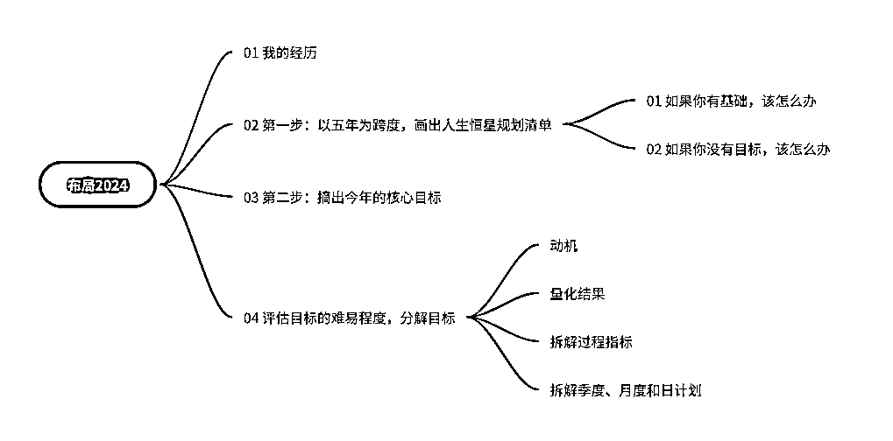

# 普通打工人，靠自我管理觉醒，副业收入 8W+

> 原文：[`www.yuque.com/for_lazy/thfiu8/zknesqh6891sart2`](https://www.yuque.com/for_lazy/thfiu8/zknesqh6891sart2)

## (42 赞)普通打工人，靠自我管理觉醒，副业收入 8W+

作者： 王多维

日期：2023-12-21

普通打工人，靠自我管理觉醒，副业收入 8W+，分享我实操 1 年的年度规划方法，布局 2024 年吧！

大家好，我是王多维，一个边打工边做副业的工程师！

从真正做副业开始已经一年半啦，目前是小红书博主，运营大学有术成长社群，副业收入已经 8W+了，虽然不多，但对于 996 的工程师来说，已经知足了，今年的年度任务也都已经完成了！

从一个小白到稍有成绩，我觉得最重要的是要有规划和清楚的行为目标。马上 2024 了，很多小伙伴都开始规划下一年的年度目标了。

之前在小红书上看到有人从 10 月份就开始布局 2024，而大部分的规划就只是把想做的事情写下来而已，其实并没有什么用。

我一直探索更加系统科学的年度规划方法，现在慢慢有了结果，试用了一年，发现的确更合理，更适合副业小白。

全文 4600 多字，请多一点耐心，如果对你有帮助或者有启发，还请点个赞，交个朋友！

下图是思维导图！[`m7y7vqso3n.feishu.cn/docx/S8HhdVXRco3qiFxgXddcBsoHn9b?from=from_copylink`](https://m7y7vqso3n.feishu.cn/docx/S8HhdVXRco3qiFxgXddcBsoHn9b?from=from_copylink)

* * *

评论区：

cui : 学习了，24 年年底总结的时候我再回来看看👀
王多维 : 是的，以终为始！
安俊 : 多维学长逻辑真的很强很清晰
王多维 : 谢谢安俊！
望天吼 : 我之前就是按 5 年一个阶段规划的，目前第二个五年计划已达成，第三个五年计划迟迟找不到方向，看了您的文章，我知道怎么做了[抱拳][抱拳][抱拳]
拱卒 : 加油

* * *