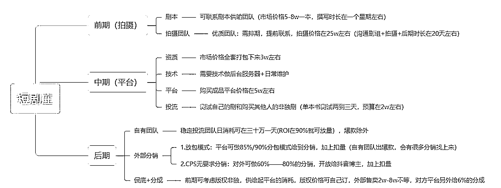
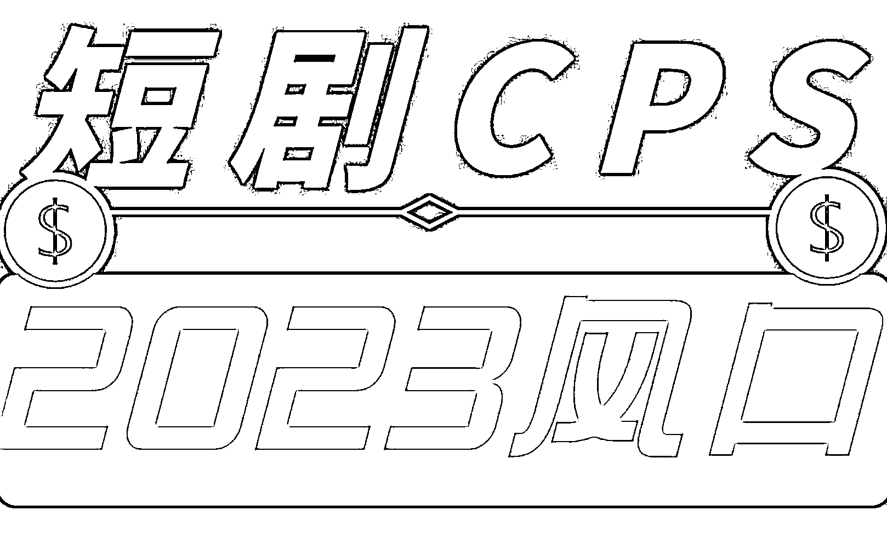
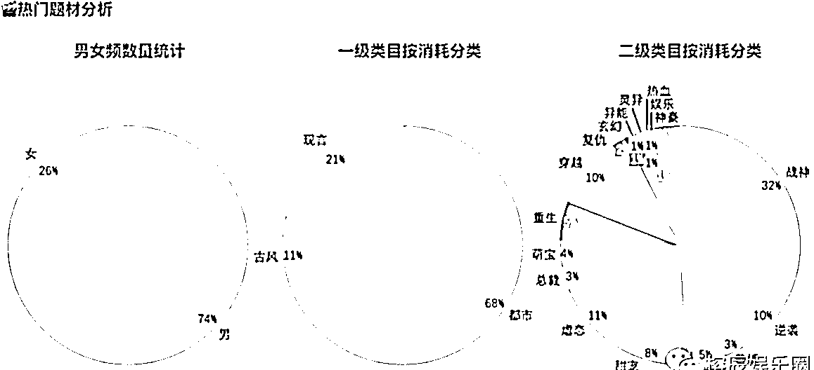
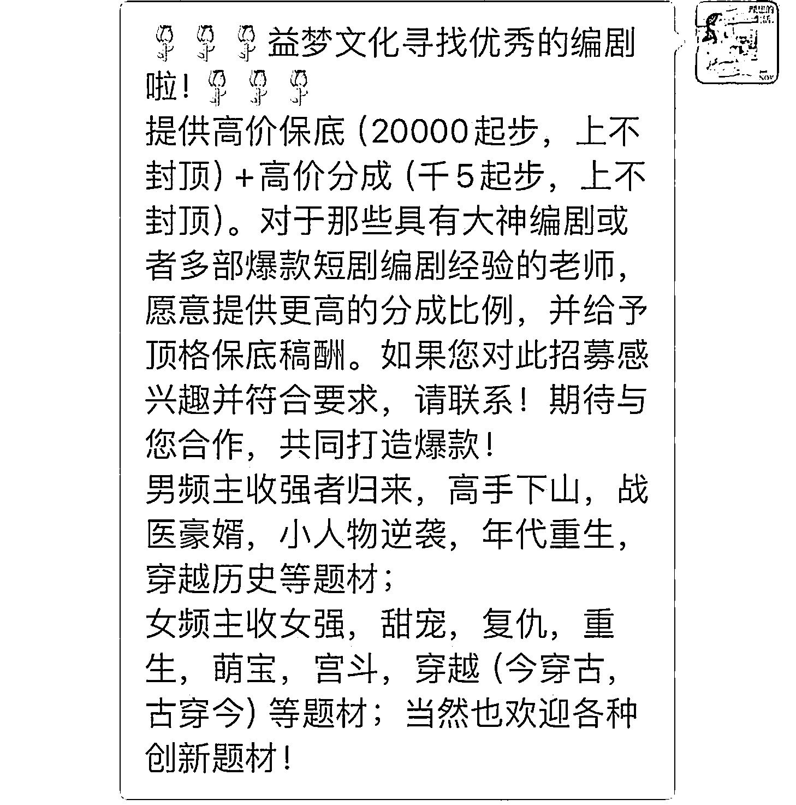
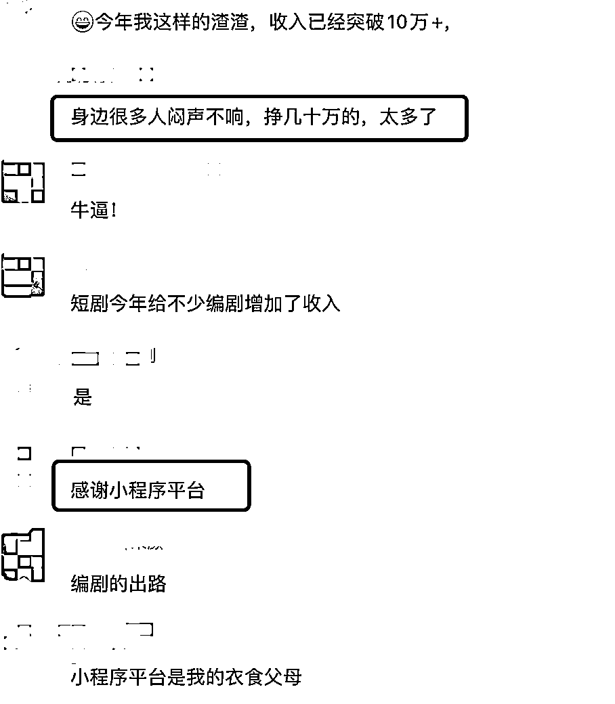
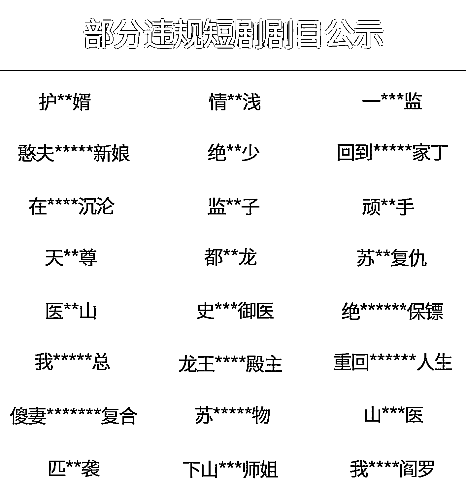
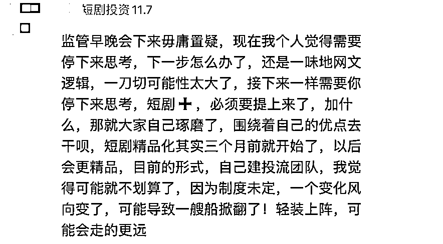
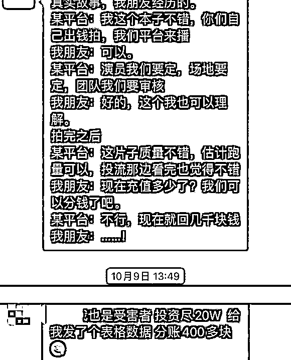

# 什么人才能吃到短剧的红利？

> 原文：[`www.yuque.com/for_lazy/thfiu8/xw01kmsb02xbng12`](https://www.yuque.com/for_lazy/thfiu8/xw01kmsb02xbng12)

## (43 赞)什么人才能吃到短剧的红利？

作者： 榕辰

日期：2023-12-22

听说一部短剧上线 8 天就能赚 1 亿，是不是真的？

短剧这个东西，看起来确实很赚钱。我身边有很多宝妈、上班族都在上面花了不少钱，有的人退休金一万二，每个月花三四千在看短剧上。

但实际上，这东西水也挺深的，明面上看着有 1 亿，背后分账要涉及投资方、平台方、制作方、编剧方各个环节，每人都咬一口，最后还能剩多少给做分销的普通人？

今天我将从一个短剧编剧的视角，以大家最常见的模式：补贴+播放量分账，来跟大家分析分析，普通人在短剧赛道有啥机会，团队又有什么出路，各方又是如何参与分账的？

哈罗，大家好，很荣幸受到生财内容团队的邀请来给大家做这一次的分享。

身边熟悉的朋友都知道我是做短剧的，而最近刚好短剧出圈爆火，所以我们这个行业渐渐被熟知了起来，先是有一则新闻显示，中国土味短剧火到了国外，外国人也爱看霸总，制作成本也才十几万美元。

而在此之前，国产小程序短剧经历 2 年左右的发展，制作成本从几万元到十万到二十万到如今的四五十万，基本也与短剧出海的制作经费齐平。

既然它的成本是有天花板的，那再看看它的收入，之前有一部火出圈的短剧《无双》，就是号称 48 小时充值 5500 万，8 天揽收票房一个亿。

据悉从 9 月份上线至今不过也才短短两三个月的时间，它如今的票房已经超过三个亿了。

从它之后，越来越多的土味短剧为人所熟知，女频剧《哎呀！皇后娘娘来打工》24 小时用户充值破 1200 万，《闪婚后，傅先生的马甲藏不住了》24 小时充值流水破 2000 万……这几部剧，我身边不是同行的闺蜜、宝妈们都为它付过费。

不止是宝妈、上班族等群体，更夸张的是之前也遇到群友分享自己妈妈付费看短剧的事，还晒出了动不动几十元上百元的短剧付费记录，说妈妈退休金一万二，每个月三四千都花到了看短剧上面。

而随着短剧的爆款数据为人所熟知，大家的关注点渐渐到了其利润之上，渐渐的行业有人透露出几十万成本就能赚上亿，没错，这听起来就像是骗人的，而他的收益构成我们可以仔细分析一波——

我先简单做一下自我介绍，在入行短剧编剧之前，我也只是名普通编剧，有多普通就看我能接的单有多杂，上到几千上万的广告、宣传片文案、网络大电影剧本我能写，下到几块几十块的新媒体的内容我也能接。

靠文字赚钱，还真让我有了些许突破，可能是真的喜欢，才能接受行业的差异化如此大，之前我就有一段自我介绍：三年时间，我从千字十元到千字万元的突破……

这可能就是时间的馈赠，让我们每个平凡的普通人，只要能坚定信念一条路走到黑，总会看见些许曙光.

在两年多前，由于家中计划迁居，我便不能再做自由职业，回归职场我第一个想到的还是要做编剧，当时短剧将将兴起，我也有幸进入了一些头部团队参与短剧的编剧和制作。

## **一、短剧行业的发展前史**

我们先来说一说短剧的行业发展吧～

起初还是一波热爱古风的发烧友自己穿古装拍一些段子，后面可能渐渐地为了压缩制作成本，才会有了连续的剧情和越来越好的内容，短剧的付费也渐渐在快手平台上展露头角。

基本上为一部十几集到三十集左右的短剧，单集两分钟左右，前 3-5 集免费观看，看得过瘾了就开始逐集解锁，一集大概 1 元的费用

由此开始，短剧的创作者们尝到了甜头，越来越多的“短剧网红”就此出圈。

大概就在 2020-2021 年左右，抖音平台似乎嗅到了这阵风，也准备开始模仿快手短剧的形式，测试抖音内部的付费风向。

可能就是因为起步晚了，内测的数据也很一般，致使两年前抖音一直想做的短视频（短剧）付费没做起来，但他后面还一直在尝试，推出了一系列的“短剧新番计划”，这个番字就很有深意了。

众所周知，头条、抖音、番茄、西瓜等等一系列 app 都是一家名为“字节跳动”的公司所有的。

所以在“番”的上面，番茄开放版权，可供抖音创作者们去开发 ip 改编项目，优质团队可能还会获得平台补贴，后续发展至今就有了播放量分成等计划。

这个收入有上线（不像小程序那样无上限），大概为一部 30 万左右成本的 16 集连续短剧，播放量如果超过了 5 千万到 8 千万，每多出千万左右的播放量，就会增加 10 万+的收益，上线为 150 万到 300 万。

就是在抖音自己生态内的短视频（短剧）付费没跑动，他通过补贴和播放量分账的模式，让“短剧”这个领域在平台内活了下来。

渐渐的，短剧的变现开始多元化了起来，小程序短剧隶属于其中的一种，从前两年的野蛮生长，到如今的广电审核限制，他已经逐渐具备了一些可复制的赚钱模式和经验。

只是相关的赚钱误区，还是值得详细一讲的。

## **二、短剧行业 8 天赚 1 亿的赚钱的误区**

举个大家比较耳熟能详的例子吧，在互联网电商行业里有个术语叫 Roi，也就是投资回报率。

咱们生财圈里面有做小红书旅游领域的一个大佬，他是能把这个 Roi 做到极致，做到 1:10-15，也就是投流花一块钱，能赚回来 10 块到 15 块，这是行业和定位决定的，而短剧的 Roi 通常为多少呢？

通常如果短剧 Roi 能做到 1：1.2 的话，投手会往死里投，这样我们可以算到短剧天花板的一个收入情况，就拿《无双》举例，假设他的 Roi 是 1:1.2（可能会超过），相当于投一块赚 2 毛，净利润 20%左右，3 亿总票房的净利润为 6000 万左右，这时候开始产生分账收益啦。

短剧里面一般分为投资方、平台方、制作方、编剧方等等可以有分账的权益，一般投资方（投流向的）是平台那边通过大量数据测出来 Roi 比较高的剧可以加大力度投放。

然后遇到平台投流资金不够的情况下，向其他机构融资，继续加大力度投放，以求更高的回报率。

**（1）通常分账的模式也有三种：**

**1、第一种是平台方提供剧本**

制作方全资拍摄成品制作成精剪成片给平台，版权归平台所有，平台给独家或者非独家的保底+一个 6%左右的票房分账（也就是净利润的五五分账左右，具体我们自己可以核算一下《无双》这个案例）。

比如 1.6 亿的票房投放都花出去一个亿，收益几千万是有的，是还会有分销方 投流方、平台方、制作方等等几方分润。

**2、第二种是平台方定制**

提供剧本+拍摄资金，制作方拍摄成品制作成精剪成片给平台，版权归平台所有，无分账。

**3、第三种是平台方对投**

平台方提供剧本+部分拍摄资金，制作方提供部分拍摄资金+拍摄成品制作成精剪成片给平台，这里分润方式不等，一般也是制作方在票房的 8%以内。

这里会有比较坑的点，是上周见一个朋友，也是投了部剧，然后给平台，合同签的 8%分润，可能他没看清楚，写了净利润的 8%。

于是他们看到后台数据为总票房 400 万，平台方号称投流成本为 300 万元，净利润 100 万，所以 8%为 8 万，只给那个朋友 8 万块，从成本 300 万（投流）+20 万（制作）=320 万左右的整体来看，净利润还是有 80 万的，只是因为新人投资可能就会被坑到。

这里朋友如果仔细看合同，可能局面完全就不一样，比如签了票房的 8%分润，那他至少能分 32 万，也就是对于他制作来说的净利润 12 万左右（周期时长大概为一个月），还是有搞头的。

而且这还是一次性版权交易，版权提供给平台了，只享受了这一次分账利润，而后续的收益可能制作方在平台的操作下几乎不知道——

根据以往的经验，我们也可以想象一部剧的后续收益也很猛

假设 300 万投流成本回收 400 万，那么这部剧的 Roi 数据为 1：1.3333，这已经高于短剧赚钱的数据了，后续可能平台会加大融资继续投放，而分账的 8%，到底是只分一轮的帐，分一个月的帐，还是分一年、十年的帐呢？

此后续收益，长期下来，也有不少，这还不算其他平台收二轮剧、收老剧版权授权的情况。

所以，不论怎么说，要是自己来操作这件事，版权在自己手里还是好的。

如何能让版权在自己手里呢，这里又不得不提到剧本了，一般来说谁提供剧本，版权这方面是最有发言权的了，所以就不得不提到从受制于平台的方式到第四种模式。

**4、就是剧本归制作方的情况**

制作方自己采买或者定制的剧本，已经花钱买了编剧版权，不论是制作方找到平台对投还是平台全资还是制作方全资，都可能将版权谈到自己手里。

这种情况的变现还是比较良好，保险方式为：

比如我投资 30 万元拍摄，5 万元买剧本，一共花费 35 万元，制作出来的成品，平台愿意给我 3 万元保底 +3%的非独家票房分成。

那我再找相同情况下的平台，找 12 家签版权授权+非独家保底，35 万元成本回本，还会每一家给一定百分比的分成，也就是有了基础投资资金的保底+上如果票房数据好，可能会多赚很多钱，具体数据大家可以自己去算哦。

而这个行业的爆款概率也可以跟大家透露一下，大概为 10%。

这个市场值得做的点是基本 70%保本、10%会小赚、10%会大赚、10%会亏本。

也就是说如果咱们是作为制作方来切入这个行业，那么我可能赚钱的机会为，投资几十万元，保本或者小赚十来万或者大赚几百万，继续滚动投从而撬动上千万等。

那么我可能亏钱的几率为，做 10 部亏 9 部，大概几百万元，可是赚了 1 部—2 部，总体算下来保本或者开始赚钱。

如果你觉得这个资金量比较大，那么这里也普通人的机会——选择从事这个产业链的其中一环，刚刚提到的投资方、平台方、制作方、编剧……我做的这个编剧也只是其中一环，短剧既然有了肯定也会一直有的，所以这一块个人从业者来探索我还是比较推荐。

并且从上述内容分析可见，不论是作为平台方还是制作方，都会去抢占版权以得到长期收益，而版权的归属是作为编剧剧本的归属。

这一点，咱们来做编剧是会被争抢的环节，就是咱们不论给平台方供稿还是给制作方供稿，咱们的单量都是有保证的。

其实还忘了说一下分销方，这里再简单多说一下，也算是短剧其产业链的一环吧，任何行业没有绝对的赚钱。

所以分销方的存在是必然的，因为除了我上述说的赚钱的剧，还有很多是不赚钱的剧，比如 Roi 只有 1:0.7 左右的，这个投流肯定投不出去，是亏钱的，那么这些剧就可以交给分销方来卖（也就是之前在咱们航海火过的项目短剧 cps）

只要版权在自己手里，只要找到足够强大的分销方，比如旗下几十万达人一起推同一部剧，这种情况，你想不回本都难吧？

## **三、项目概况**

行业概况相信大家都有了一定的了解，接下来我就给大家介绍下我现在在做的短剧其中一环，编剧这个职业吧。

前面也给大家介绍了我为什么进入了短剧编剧这个行业，接下来会跟大家分享一下我对【短剧编剧】这个职业的理解。

为什么我会重点题一下【短剧编剧】这个概念呢？事实上只要你是文字工作的，你天不怕地不怕你说你什么都可以写也不为过。

但是【短剧编剧】跟其他长剧编剧、电影、电视剧、话剧、微电影、宣传片编剧等等都是不一样的存在，这里我可能就会说一个互联网+的概念了。

在我看来，短剧它其实并非影视，是互联网+影视，这样说大家可能更容易理解，就是用互联网思维去做的一个影视行业（或产品），它的创作肯定就会区别于传统影视的，这里的创作不止是剧本创作，还有拍摄的部分。

所以创作短剧在早期，拍很多爆款的团队都是一些 mcn 机构转型过来的，他们更下沉或更懂拍好短视频，而且能够做到成本更低。

而这类团队的优势在于此，但劣势也很明显，就是短剧它作为一个剧，它要有主线、有逻辑和有主控思想、人物动机等等。

目前大家很习惯于叫【短剧】为【爽剧】，就在于此，能拍好它的就是因为它够下沉、够无脑、够情绪化，什么扇巴掌、下跪、捅刀子是常见的梗了，但这如果作为一个剧，就可能不太成立了。

这就导致很多影视团队下场来做短剧做不好的原因了，包括影视编剧，他来写剧本他也要构建完整的故事线、主题思维等等，铺垫、逻辑、抓细节，很多拍出来美则美矣没爽感，不懂节奏，往往钱花很多却最后赚不到想赚的钱，沦为试水韭菜，最后赚不到钱还倒打一耙说行业不行等等。

这是目前行业存在的现状，只能说各有优劣，而如果能结合一起做好，把重心放在内容、剧本、制作上，共同探讨出一条精品化的道路，应该才是这个行业能长盛下去的根本。

所以作为短剧编剧，我自己的观感就很直接了，我认为短剧编剧可能比长剧编剧、影视编剧更难做，因为写作者可能都知道的一件事，越短的内容越难写，更少的字表达更多的内容（剧情），例如写诗，大家应该可以感受到。

而短剧基于其互联网属性和短视频逻辑，什么开头悬念 3 秒、5 秒、30 秒吸睛套路，结尾钩子等等，你想一分多钟一集 500 字左右的内容，要安排那么多信息点和至少一两个反转点，可不是写一部电影、电视剧的故事那样，要层层铺垫、抽丝剥茧呢……

而对比这个难度，可能看到编剧费你会更绝望，去年可能 5k\7k 等等的价格，今年年初还看到有人卖洗稿剧本（罪过），3k 都有，到如今基本最低价格稳定在 1～1.5w+百 1 左右的票房分账的，已经算是慢慢好起来了。

对比影视剧，如 30～40 集的电视剧编剧费用大概为三百万元：

1.  如一部需要过审核的电影备案剧本费用大概为七～几十万元不等

2.  如一部网络剧单集 30～40 分钟的费用约为三～五万元不等……

你再来看看这个小程序编剧的费用 100-150 分钟的费用……

是不是没有对比就没有伤害，当然你没有一定水平和资源也不太可能遇到上述拿到高编剧费的机会，毕竟这个行业枪手也很多。

如果你是新人小白，趁着现在行业空缺或者火爆，也有机会作为新人能拿到起步 1w 的稿费，也算是对萌新友好的行业了。

这个利润主要看自己的接单价格，比如市场价男频战神类的一万多两万还能收，目前女频精品化也会有两三万起的价格。

而有爆款案例的编剧，可以直接 5-10 万一本的收费，利润=单价*效率，有效率高的 7～20 天一个本，也有效率低的三个月还在修改，这个剧本修改起来也是无上限的。

身边有位朋友就是从网文转行过来，去年写平台的签约小说千字 10 元，今年开始大量写小程序短剧，有了一个爆款案例后，5～7 万字的一个剧本，收费可以高达 10 万元单本。

更有去年快饿死的网文编辑，今年转行做短剧编剧，月收入至少底薪拿了 3～5 万，还有去年穷得吃不起饭的网文作者，今年接最便宜的本儿，一个月写一部，年收入也突破 10 万。

用她的话说，还是很感谢这个行业，让他可以一个月只工作 7 天写剧本，剩下二十多天都在水群聊天等等。

就这还不说编剧方的票房分账，就是单单转型做小程序短剧编剧，也养活了一大波作者，而其分账比例，大概为千分之 2 到千分之 5，百分之 1 到百分之 2（也要看编剧本身、内容本身）

我们社群里有个小伙伴就做到了写了个剧分账拿了七十多万，倒推回去票房应该为千万级别的爆款。

而且做小程序短剧编剧对于做其他环节的明显优势在于入行门槛低，每天都有几百部小程序剧上线，可想而知每个月需求剧本的数量了。

而毕竟成熟的编剧还是稀缺，而一名编剧一个月最多能产出的剧本为 1-2 个，这还不说很多定制剧本、或者加钱的创作周期短的剧本，需要 3-5 人一起完成一部的。

所以今年很多网文作者转行来做编剧，某大平台透露自己公司编剧的月收入，超过 10 万的有三十多人，超过 50 万的还有十来人，整体看来还是不错，很多网文作者转型成功后也觉得这也行业挺香。

## **四、从短剧 CPS 角度出发**

短剧 cps 也是短剧整个产业链其中的一环，这个项目应该是从去年这时候就开始稀缺。

如果你在去年这时候加入，那可能就是闭着眼睛都能赚钱的机会，从我观察的几个分销短剧的账号就可以看出，他们普遍涨粉爆发期就是在今年上半年。

从去年年底布局或者重新注册新的账号，涨粉少的都是最少几十万，涨粉多的那就不可估量了，半年涨粉几百万的也不在话下。

涨粉只是其中一个属性，涨粉快代表爆款多，可能代表爆款视频多，那么这个属性随之而来的就是分销赚的比例也很多。

就拿我前一阵子看到的一个二创博主作为案例来说，他同一个视频（剧）赚了至少一百多万，具体可以看下图，他大概也是从一百万粉丝的影视二创博主，转型早而吃到短剧分销的这波红利。

现在你如果想再来以个人切入短剧 cps 领域在我看来也是有难度的：

第一原因是已经晚了很多，网上教短剧 cps 的人都赚到好几波了，你现在切入的压力可想而知；

第二原因是目前唯一咱们觉得还可以的机会是矩阵运营来做，现在据说也不太行了，加上分销的头部平台基本已经胜出，干不下去或者干黄了的公司也很多，如果没有拿到版权就开始进行分销风险也是超级高，某里某外平台好像就是这么没了的

现如今资源（新剧版权）基本被头部拿到的，会存在到普通人手里，素材已经不新鲜了的情况，所以个人的话，现在来做，要么直接加入头部，成为其中一员，拿着授权过的剧去分销、试错有保障也是不错的。

## **五、投资角度看出发**

在上述赚钱误区那里我已经详细讲述了风险、赚钱的逻辑、投资回报比等等，如果站在投资的角度来看短剧行业，你如果是纯投资人有资金却不太了解这行就一定要擦亮眼睛了。

投资也分为你从哪个板块来切入：

**（1）如果你是投流方**

可多跟平台联系，平台一般会测好数据的剧再进行融资，这里一般涉及的是超过千万的大资金，基本平台融资有保障，回报率也有保障，毕竟投不出去的剧平台也不会再加大投流力度。

所以你的钱很可能投的都是爆款，收益也有所保障。

**（2）如果你是平台方**

可能启动资金需要 1000 万左右，以某爆款平台为例，去年 12 月他们准备筹建平台，预备启动资金 500 万元，自筹 250 万，向外界融资 250 万，以 500 万为基础向西安某团队签约了一年 25 部短剧的拍摄制作。

当然那时候成本比较，低所以 500 万能签 25 部戏（普遍为 20 万元左右的制作成本，今年已经卷到了 50 万左右的成本了，也有几部投资上百万的戏），所以到现在搭建平台粗略估计成本会需要 1000 万左右。

当然签了几十部戏过后不是钱全部搭出去，有一定账期，比如这个月我只先给制作团队 50-100 万制作费，让他制作两部戏。

同时搭建平台，申请注册小程序+运营付费平台所需要的三证，大概成本为 6 万元左右，一切手续合法，可以作为平台方像其他平台一样几万块保底的新剧、几千块保底的老剧，一次性收个一二十部剧，然后自己搭建投流团队。

投流团队是这样——一般一个投手配备 3 个剪素材人员，厉害的投手就是一个人配 10 个剪辑，一个剪辑一天能剪几十条素材。

其实也是 cps 模式，只是多了一个投手岗位的存在，会专门负责花钱，先从几十一百元的去花钱出去测哪个素材 Roi 比较高。

比如刚开始一个投手每天花几万元测，测到好的素材和好的剧，就开始加大力度的钱去投，一天消耗百万、千万就这么来了，平台可以活下来了、准备开始盈利了

去年 12 月某平台就是这个模式，大概到两三个月左右时间，自己签的制作团队在第 5 部战神戏后爆火了，平台因为有了更多的经验，爆款也越来越多，不仅如此其团队爆火后也是有了接不完的承制订单。

比如我知道的郑州一个团队，他们就是 40 万成本拍 140 万卖，一个月至少拍 2 部，这就是爆款效应，因为爆款有保障以后平台的买断政策很香啊，哪怕不分账也很有搞头的。

**（3）如果你是制作方**

就得考察团队（拍摄团队、导演、演员等等），然后跟平台谈好分账模式、投流等等，这个篇章详见前面【8 天赚 1 亿的误区】那里，详细讲述了作为承制方可能遇到的坑。

## **六、其他存在的一些机会**

**（1）都是团队作案**

整个产业链还是比较久，个人的话目前我还没看到比较好发展的点。

要说个人的切入还是编剧或者短剧 cps 的切入，目前比较看好的是做【短剧社群】、【投融圈】、【知识付费】……做一个赚钱的模式，然后开始盈利。

**（2）行业的崛起，短剧+模式兴起**

这个算是低成本可以撬动更好效益的，短剧+模式其实目前比较看好，抖音上很多短剧+品牌模式已经跑通，这里就是作为品牌方每年营销经费都有几百万上千万。

然后来做自己的官方账号+短剧内容，就是所谓的短剧+品牌模式，珀莱雅、韩束等在各大剧情博主那里也定制了很多品牌短剧，观众评价都是【明知故看】，明明知道是打广告还要看，这就是短剧+品牌的魅力了。

除此之外还有短剧+游戏，上个月一部名为《完蛋！我被美女包围了》的游戏互动短剧火了，以 300-500 万成本撬动了几千万收益，我们公司上两个月也是基于此又多了不少游戏短剧的订单。

对于游戏甲方来说，一个游戏的开发经费就可以拍一二十部短剧了，所以他们也很看好这个行业，况且投资短剧+游戏，不仅短剧能赚钱，游戏还能二次转化，深度绑定持续消费，是个顶不错的选择。

还有短剧+电商、短剧+文旅……等等新兴概念也被提出，也将逐渐探索出关于短剧的更多变现模式

**（3）个人以编剧切入、或者就是小的投资方      **

**如果你是个人编剧或者对此感兴趣，**何行业都是有生命周期的.

短剧作为一个行业来说也是有生命周期的，我们以五年十年为节点来看的话，小程序短剧才发展 1-2 年，如今才正式开始正规化、精品化起来，刚好正值一个蓬勃发展的时期，未来还很可能有三五年的红利期，未来几年的红利，还是值得你现在的努力。

**如果你是个人小投资者，**保险一点的项目试水方式为，可以花个几万块钱来试错，或者入行因为目前短剧成本还在几十万，现在行业也有很多项目接受 10%起的投资额，也就是作为项目投资的话，有几万可起步的机会。

这类项目我们可能选择上也会比较局限，因为一般爆款团队不会缺少资金，而新人团队也很难拿到平台对投（投资资金有保障）的项目，而个人小投资者去找平台对投的项目比较难找到，感兴趣我们这边有相关资源可做对接。

但这种也会很容易扑，沦为平台韭菜，因为还有一点风险就是平台一直鼓励制作方自己全资，就是看中了大家想入行，平台商务一般会以“我们不对投没合作过的制作团队”为由拒绝对投，而我们哪怕搭建了一个爆款团队也有点难让平台出资制作。

所以这就是平台坑的点了，他不出钱制作，然后你全资后制作的版权还归他，到了该分账的时候很可能他还是一句我们尽力投流了可是没有票房来忽悠你。

我们社群里有几位小伙伴都由此遭遇，投资几十万，回本几百几千块的，所以作为几万块和几十万的小投资人就一定要好好选项目和团队了，最好是剧本版权在自己手里的团队。

**（4）作为投资项目来看的话**

如果作为投资项目来看，可以切入【编剧方】和【分销方】的点，这里也可以从搭建团队和投资培训板块来看，是可以快速放大的。

好啦，以上就是全部分享内容，总体来说咱们这个行业还是一个比较新且比较有希望的朝阳产业，这其中不乏有些不懂行的投资方、制作方想来参与一波却没拿到比较好的结果而唱衰行业的，归根结底我的感觉还是因为不懂被坑。

行业混子虽然有，但是自己作为做项目的人，没有了解行业的赚钱模式就一头扎进来势必会沦为行业的韭菜，并且这是成长的必经之路。

好好在做这个行业的人，没有一个人在唱衰，反而还很感谢这个行业的机遇，一个曾经做影视的老大哥也曾感叹，反正他做网大（网络大电影）的时候动不动就亏几千万，反而是做这种投资几十万的小短剧，他是赚到钱了的。

所以哪怕最近政策逐渐开始收紧，大部分违规剧下架、违规演员不能投放发布，这对于我们好好来做内容的人来讲，还是很友好的，糟粕去掉了，精华就留下了。

并且，从现在开始切入，才是最好的时机，比如在别人的剧都违规、下架、上线不了的情况下，平台内容空缺，你做了一样保持短剧的爽感且有不违规能上线的剧，这不就妥了么。

种一棵树最好的时间是十年前，其次是现在，如果看好这个行业就不要再观摩了，下手就要快、准、狠！

感谢大家花时间的陪伴，还有对此行业有疑问的可以联系我哟～

* * *

评论区：

冬日暖阳 : 这个要怎么做呢
榕辰 : 要看你适合什么，从哪个环节切入，可联系 rcsg20172019
肖深刻 : 讲解产业链的非常详尽[玫瑰][玫瑰]
流芳 : 写得太好了，其他不懂的我就不发表意见了。cps 这块真是非常认可，现在做解说都是入行的硬性要求了，简单的混剪根本行不通，可能这也是本次航海短剧 cps 消失的原因。然后是内容的同质化的问题，一部剧可以说的角度其实并不多，特别是短剧的梗都比较通俗浅显，能深挖的点也不多，而且即使找到了好的解说角度，后续的原剧部分也会跟别人产生很大的重复，这就导致流量始终会流向粉丝基础量大的账号。怎么解决呢？现在很多大号也开始玩拼接，就是跟其他剧（不仅仅短剧）的精彩部分做拼接，后面再接短剧解说，这种其实是剧方明说违规的，肯定不长久，小号爆了也可能拿不到结算。二是花费更大的精力做深度原创，类似毒舌那种，但是对创作者能力要求更高。总结：cps 真不建议来了 😂😂😂
榕辰 : 👍👍👍你这也是现身说法，深度参与后明确了方向
榕辰 : 😀有收获就好

* * *