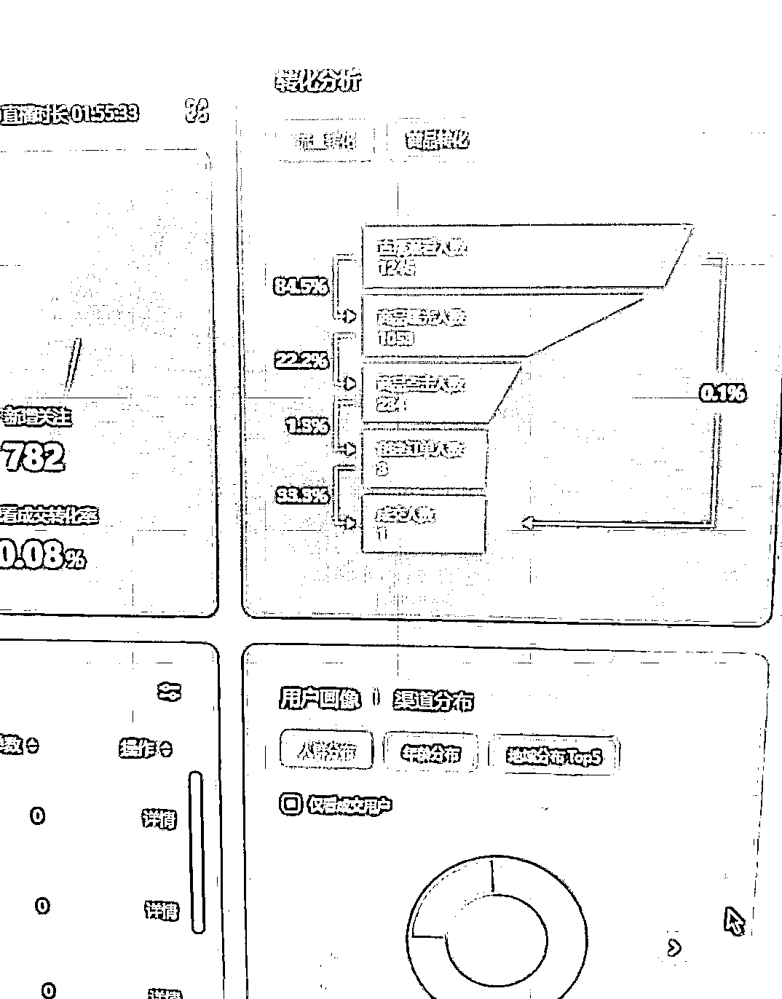
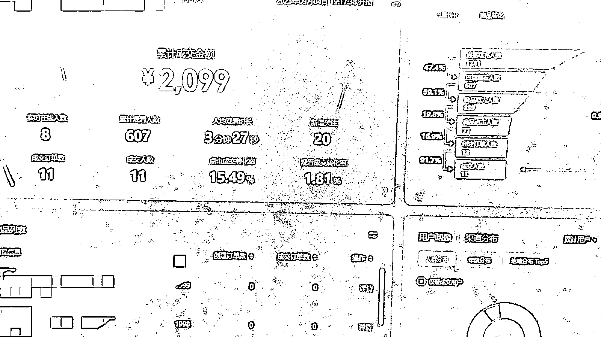

# 做了 30 多个直播间后总结的带货直播话术-转化率增长 9 倍

> 原文：[`www.yuque.com/for_lazy/thfiu8/feydhm1frhrrwvei`](https://www.yuque.com/for_lazy/thfiu8/feydhm1frhrrwvei)

## (27 赞)做了 30 多个直播间后总结的带货直播话术-转化率增长 9 倍

作者： 旋子

日期：2023-12-18

这个是我们 3 月份播的一场，1053 精准流量，新增关注 782 个，就卖出 1 单，199 元

同一个账号，同一款产品，这个是我们现在正在播的一场，607 个场观，卖了 12 单，2099 元，转化率整整提升了 9 倍！

在数据分析中，漏斗可以直观地显示哪个层级的流失最高，从而快速定位整体链路中的问题。各个环节话术的优化是能大大提升转化率的。大家都知道现在流量越来越贵了，不像早期野蛮发展时期了。如果系统给你的流量，不能好好把握，那么破天富贵就在你指尖白白溜走了。我这有十几套打磨过的话术模板，圈友需要的话，直接戳我拿吧。

# 一、**直播中的话术分类**

#### **不同客单价产品的话术结构**

根据客单价区分：

1.低客单价：培养习惯，需要性价比和优惠活动

a.塑品

b.建立信任

c.促销

d.逼单

2.中客单：在于满足需求，解决痛点

a.需求引导，痛点、放大欲望

b.塑品

c.建立信任：

d.逼单

e.互动

3.高客单：重点在于塑品，不用刻意制造需求

a.需求引导 30s

b.产品介绍 1min

c.产品价值塑造 1min

d.建立信任 1min

e.逼单

f.互动

# 二、**拆解话术结构的每一部分**

1、.需求引导：

●你是不是买了很多丝巾，但是总感觉没有一条拿得出手的；

●要去参加婚礼了，你带一条路边几十块的围巾，也不好啊；

●过年了，老朋友聚会，别人都打扮的光鲜亮丽，你不得也把自己收拾收拾，买条这个纯桑蚕丝的围巾，花小钱办大事。

2、价值塑造：

●价值塑造话术：一条的蚕丝量等于别人 4 条；和白娘子赵雅芝同款的；工人手工一针针钩织的...核心逻辑就是锚定一个大家都知道的高价值物品。

3、产品介绍

●至少三个痛点需求+3 个对应的卖点，这个不多展开了

●塑品的时候，提示是几号链接（如，主播在介绍的是我们的福利款，下方三号链接，已经弹出来了）

4、抓人来听你讲

试想直播间的观众，他们可能在吃饭、聊天，干家务，如果话术平平无奇很容易人家就走神了，划走了，这里可以加一些抓人话术：这部分就是要提醒直播间的观众，集中注意力，看主播，就跟老师敲黑板一个意思。

●来，姐姐们看我哈！；

●来，接下来我讲的姐姐们要听好了，我只说一遍；

●来，主播给姐姐们再佩戴一下/演示一下，姐姐们眼睛都不要眨一下哦

●我给大家展示下 XX，姐姐们，别眨眼，听好了哈！

●很多姐姐之前没买到，后面主播下播了再也没有了哈

5.互动

互动数据是平台考量直播间质量的一个重要指标，有停留，才有推流，有互动才有推流；另外愿意互动的观众，更容易代入场景，认真听讲，有下一步转化的可能性，所以我们经常听到主播在直播间说：

●刘姐姐又来了，欢迎哈，你有没有晚上翻来覆去，就是睡不着的情况呀，跟主播讲一下，主播看看，给你推荐合适的产品。

●直播间有没有第一次来的姐姐，第一次来的姐姐公屏上扣个 1 字，让主播看看；

●觉得主播讲的好的，公屏上扣个 666

●觉得认同的扣个 1，不认同的扣个 2

●已拍的姐姐公屏上，打个已拍，给主播看一下

●想要的姐姐，公屏上扣个想字，有多少人打想我们就上多少单

尤其是在直播间人少的时候，一定要拉互动，甚至要定点互动，但是人多，购买 热情比较高的时候，不建议太多互动，浪费时间，尽快做转化成交。

6.建立信任：

从视频号带货的角度，由于是中老年群体购物，在网上付费习惯正在慢慢建立，但是由于早先一些小的电商平台胡作非为，很多老人买了东西不发货，或者货不对板，很多老人购物会有所顾虑，我们需要打消他们的顾虑，建立信任关系。

本质上，**人货场的建立，就是在建立信任**，除了人货场的打造以外，主播的话术上，可以参考以下内容：

●我们公司是丝苑集团，前身是中国丝绸集团，是国企单位，做丝绸 100 年了；

●我们是做 XX 这个已经 25 年了，全国 95%的 XX 都是从我们这里出的；

●我们在全国有 300 多家门店，是一家百年老店，今天第一次在网上卖；

●我们是丝绸协会的创始单位（拿出证书、专利、食品类拿出经营许可证）；

●我们是微信大平台，大家放心拍，资金不会立马到我们账上，不满意可以 7 天无理由退货的，钱原封不动退给大家的。

7.憋单+放单

憋单主要是营造一种供不应求的感觉，很多人是觉得产品稀缺才会去买，一般是讲完产品，一定要做一个憋单，憋的时间长短，看观众的氛围，如果氛围已经到位了，你还一直憋，很可能就有人划走了，这个时候加一个 30 秒左右的微憋单，增加紧迫感，放单时倒数五个数，如果一个人直播的时候，就在下方点【讲解】弹出商品，同时用手机展示如何购买，因为客户群年龄稍长，可能光顾着看画面，听主播去讲产品了，没有看到下方弹出的商品，那么，这个步骤能大大提高商品点击率，这个是我经过几百次的试验得出的结论哦。

8.逼单：

●很快就要过年了现在买，年前就能收到！

●天冷了，你看今天买，明天一早我就给你安排打包发货，我们直播间的姐姐们，都会优先发货的！

●而且今天拍下，我们会送价值 88 的大礼包，已拍的公屏打已拍，打完之后送价值 XX 的礼包，（吸引犹豫的姐姐付款，增加互动），支持 7 天无理由退货，（打消疑虑），更支持运费补贴，你可以免费试戴一下哈

●（进一步逼单）。好，姐姐们手速很快啊！库存只有 2 单/还有 3 分钟主播下播，（营造紧迫感）下次来就不是这个价了！很多姐姐在我直播的时候不买，事后又后悔哈！事后联系客服，但是客服也没办法了！

逼单时，要看购买的情况，如果说很多人在购买中，那可以反复逼单，中间穿插着讲产品的卖点，加快逼单的节奏。如果发现购买热情不高，或者直播间新人居多，可以重复之前的环节，拉互动，拉停留，讲产品，塑品，憋单，逼单。播间的人是流动的，是耐性很差的，我们的内容闭环一定要小，重点内容一定要突出。千万别像日常讲话或者写文章一样，顺着往下说。**每一次讲完一个案例都要扣回主题**

用户下单购买一个产品需要同时解决三个问题：

第一，必要性。为什么要买这个产品而不是不买。

第二，稀缺性。为什么要买你的产品而不是别人的。

第三，紧迫性。为什么要在此时此地购买这个产品而不是等以后或者其它场合。

9.常见违规

会有很多骚气走位的玩法，刷直播广场偶尔也能看到，但还是建议顺应平台规则

●敏感词：避免说最（最爱，最赚，最好），第一，级（全球级，国家级，顶级），首（首个，首发）绝对（100%）等

●画面：贴图超过画面 1/3，被判贴图过大

●无样品出镜，由于很多直播早期，来不及样品，我们的方式是贴图+手持替代品，所以替代品一定要出镜

●绿幕+视频

10.随机应变：坏事说成好事

我们尽量在直播间展示样品，如果实在没有样品，又被人问起，很多主播当场就慌了，整个节奏都被带偏了，有时候被影响的一小时不出一单，但实际，没样品不是什么丢人的事，大可不必紧张，主播时刻要自信，你如果对自己都不自信，别人为什么要信任你？在直播间购物，就是一个信任建立的过程。为什么不在其他地方买？因为你在直播，你产品看起来靠谱。你的人货场匹配，都是促进客户建立信任的过程。

任何情况下，我们都应该对我们的产品、我们的直播保持自信，你这种自信才能传达到客户心里。

针对这种案例，如果客户说给我展示下 2 号链接，如果没样品，我们可以这样说：

●姐姐们，这个品真的数量没几件，我们样品也很少，都被抢完了；

●我们这个都是卖 1000 多的产品，太珍贵了，直播间样品没有申请太多，这个品的材质就和 1 号链接时一样的；

●喜欢的话，姐姐们，你们可以点开链接，看看产品细节，这些都是我们实拍的图片；我建议你们直接拿下，我们支持 7 天无理由退货，而且退货的邮费我们也包了！相当于你能免费试戴哈！

我这有十几套打磨过的话术模板，圈友需要的话，戳我拿吧。

* * *

评论区：

破而后立 : 姐姐，求话术
旋子 : xuan626
茉尔 : 大佬，求话术[害羞]
旋子 : xuan626
🤗阿花花 : 求话术
快印老司机唐应群 : 求话术
易芬 : 大佬，求话术
旋子 : 大家求话术的时候，能不能讲一下理由哈哈哈哈，不然你们指定拿回去不看了

* * *